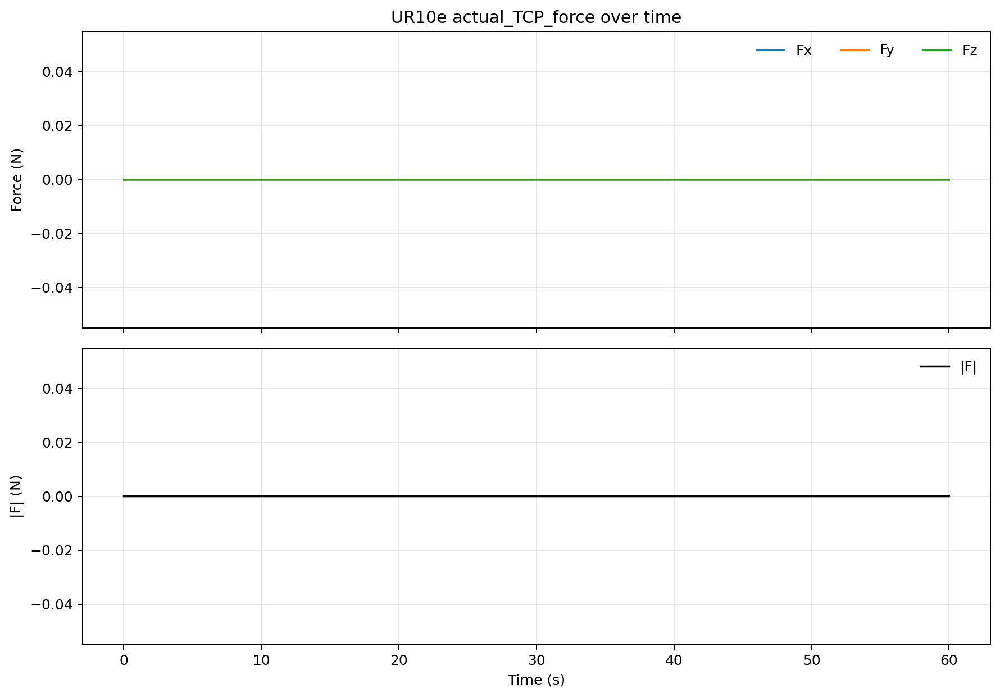

# UR10e 自带 RTDE `actual_TCP_force` 60 秒最大频率测试

## 目的

在不运动、不运行程序、不写 TCP/payload、不执行 `zero_ftsensor()` 的条件下，
测试 UR10e 控制器通过 RTDE 读取 `actual_TCP_force` 的实际可达采样频率。

## 网络与状态

- 电脑端以太网：`enp3s0 = 192.168.1.10/24`
- UR10e 目标 IP：`192.168.1.18`
- 初始误接状态：电脑看到 `COMPUTEBOX.local = 192.168.1.1`，这是 OnRobot
  Compute Box，不是 UR10e 控制器；因此 `192.168.1.18:29999/30004` 当时不通。
- 切换线路后：UR10e `29999` Dashboard 和 `30004` RTDE 均连通。
- Dashboard 快照：
  - `Remote Control = true`
  - `Safetymode: NORMAL`
  - `Program running: false`
  - `Robotmode: POWER_OFF`

## 采集命令

```bash
python3 /home/andy/codex-private-skills/skills/ur10e-realsetup/scripts/sample_tcp_force.py \
  --seconds 60 \
  --hz 500 \
  --plot all \
  --prefix ur10e_builtin_actual_tcp_force_500hz_60s \
  --output-dir /home/andy/ur10e_ros2_ws/experiments/20260520_ur10e_builtin_force_maxfreq_60s \
  --json-only
```

## 数据文件

- CSV:
  `ur10e_builtin_actual_tcp_force_500hz_60s_20260520_175530.csv`
- 总览图:
  `ur10e_builtin_actual_tcp_force_500hz_60s_20260520_175530.png`
- Fz 图:
  `ur10e_builtin_actual_tcp_force_500hz_60s_20260520_175530_fz.png`
- Fx/Fy 图:
  `ur10e_builtin_actual_tcp_force_500hz_60s_20260520_175530_fxy.png`



## 结果

- 请求频率：`500 Hz`
- 采集时长：`60 s`
- 样本数：`29999`
- `samples / 60 s`：`499.983 Hz`
- 按首末时间戳间隔计算：`500.005 Hz`
- 平均采样间隔：`1.99998 ms`
- p99 采样间隔：`2.06995 ms`
- 最大采样间隔：`4.39906 ms`
- 大于 `5 ms` 的间隔：`0`

## 解释

这次测试证明：在当前 Ubuntu 电脑到 UR10e 的 Ethernet/USB-C 网卡链路上，
UR10e 控制器的 RTDE `actual_TCP_force` 输出可以稳定以约 `500 Hz` 被读取。

但 Dashboard 显示 `Robotmode: POWER_OFF`，所以本次力值全为 `0`。因此本报告
只能作为“RTDE 通道最大读频”证据，不能作为 UR 内置力传感器有效受力读数、
payload/TCP 补偿正确性或 force-control 可用性的证据。
