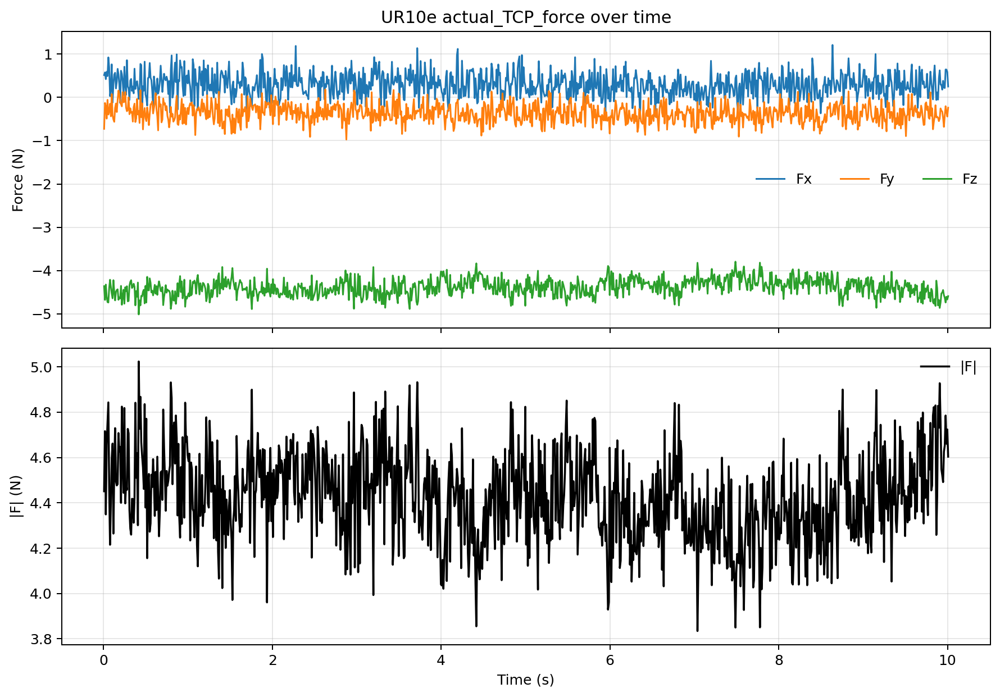

# UR10e T-ASE 仿真可用只读状态备份

日期：2026-05-25

## 目的

在 UR10e 仍然开机、网络可读的窗口内，把后续 T-ASE 仿真可能需要的真实机器人只读状态备份到本机。此次采集只做读取，不作为已批准的接触标定证据，也不关闭 T-ASE 复现项目的 completion gate。

## 安全边界

- 机器人运动命令：未发送
- URScript：未发送
- RTDE input/register 写入：未发送
- TCP / payload / CoG / URCap / OnRobot 配置写入：未发送
- `zero_ftsensor()` / bias / filter / speed 命令：未发送
- PolyScope 程序启动：未启动

## 机器人状态

- UR10e IP：`192.168.1.18`
- Ubuntu 直连网卡：`enp3s0`
- Ubuntu IP：`192.168.1.10/24`
- Dashboard：`Safetymode: NORMAL`
- Robot mode：`RUNNING`
- Program running：`false`
- Program state：`STOPPED <unnamed>`
- Remote control：`false`
- PolyScope：`URSoftware 5.11.9.1010452`

## 已备份数据

- UR 网络和端口诊断：
  - `diagnostics/ubuntu_network.json`
  - `diagnostics/ur_interfaces.json`
  - `diagnostics/dashboard_state.json`
- UR 当前 RTDE 仿真种子：
  - `diagnostics/rtde_sim_state_once.json`
  - `simulation_inputs/current_ur10e_sim_seed.yaml`
- UR kinematics calibration：
  - `calibration/ur10e_calibration_20260525T1641.yaml`
  - 已复制到 `/home/andy/ur10e_ros2_ws/src/ur10e_bringup/config/ur10e_calibration.yaml`
- 当前 payload / TCP / force 单次读数：
  - payload：`0.44 kg`
  - payload CoG：`[0.005, -0.005, 0.025] m`
  - TCP offset：`[0, 0, 0.12254, 0, 0, 0]`
- 当前关节/TCP 姿态：
  - `actual_q_deg`: `[40.4439, -96.3320, -146.0740, -27.8821, 90.0892, -49.7073]`
  - `actual_TCP_pose`: `[0.45619, 0.16055, 0.04466, 3.13747, 0.00705, -0.00627]`
- UR `actual_TCP_force` 10 s 只读采样：
  - CSV：`ur_rtde_force/ur10e_actual_tcp_force_readonly_10s_20260525_164226.csv`
  - samples：`1001`
  - requested rate：`100 Hz`
  - Fz mean：`-4.388 N`
- OnRobot Compute Box TCP DAQ 5 s 只读采样：
  - CSV：`onrobot_tcpdaq/onrobot_tcpdaq_readonly_5s_20260525_164241.csv`
  - samples：`27369`
  - raw tuple change rate：`249.74 Hz`
  - Fz range：`[-31.56, -30.76] N`
  - 注意：此路径的 `READFT` 数值不等同于 PolyScope OnRobot Variables 或 UR `actual_TCP_force`。
- RTDE output registers 24..29 只读采样：
  - CSV：`urcap_registers/urcap_ft_rtde_registers_readonly_5s_20260525_164308.csv`
  - samples：`555`
  - result：全部为 `0`
  - 解释：当前未证明 PolyScope 已把 OnRobot variables 映射到这些 output registers。

## 图

## 结论

这次备份成功保留了当前机器人 kinematics calibration、实际关节姿态、TCP pose、payload/TCP 设置和短时力数据。它足够用于下一步仿真初始化、URDF/driver calibration 文件补齐、当前姿态复现和力读数口径对比。

它不够用于接触模型接受、orientation gate 接受、硬件 readiness 或真实 force-control 验证。T-ASE repo 里的 approved-read-only evidence 仍然需要单独按注册 SOP 和明确批准流程执行。

## 下一步

继续仿真时，优先用 `simulation_inputs/current_ur10e_sim_seed.yaml` 作为当前实机种子，把 `ur10e_calibration_20260525T1641.yaml` 接入 UR10e MuJoCo/URDF 侧；然后只在仿真中推进 strict terminal feasibility 和 robustness blocker。
