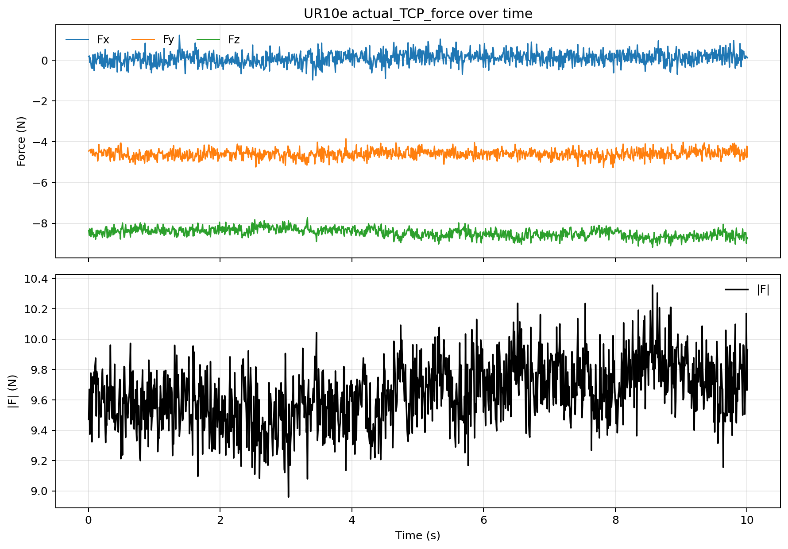

# UR10e Demo 1.1 只读准备记录

日期：`2026-05-27`

## 目的

推进 demo-1.1 local planar patch 的准备阶段，只做 no-contact / 静止只读验证：
网络、Dashboard、RTDE、payload/TCP、UR `actual_TCP_force`、OnRobot output
registers。未执行机器人运动、zero、TCP/payload 写入、URCap 设置改动或程序启动。

## 现场状态

Dashboard 读数：

- `Safetymode: NORMAL`
- `Robotmode: RUNNING`
- `Program running: false`
- `programState: STOPPED <unnamed>`
- `Remote Control: false`

当前 RTDE payload/TCP：

- payload：`0.44 kg`
- payload CoG：`[0.005, -0.005, 0.025] m`
- TCP offset：`[0, 0, 0.12254, 0, 0, 0]`

## 打印件称重证据

照片备注：

`/home/andy/ur10e_lab_vault/onrobot/hex_e_v2_3010007655/photo_notes/20260527_printed_material_weights.md`

归档照片：

`/Users/andyl/Documents/UR10e/ft_sensor/incoming_to_classify/20260527_printed_material_weights_20260527/`

读数：

- 白色打印 EOAT 主体含金属球/顶部紧固件：`51.5 g`
- 透明打印小件组：`19.0 g`
- 分项合计：`70.5 g`
- 整体照片 `IMG_1453.JPG` 读数也是 `70.5 g`；`IMG_1457.PNG` 确认了电子秤闪烁时
  原图看不清的小数位。

该重量只作为 payload 准备证据，不构成 payload/TCP 写入授权，也不证明 CoG。

## UR `actual_TCP_force` 静态采样

命令路线：RTDE `actual_TCP_force`，`125 Hz`，`10 s`。

结果：

- samples：`1251`
- `Fx` mean：`0.101255 N`，std：`0.296477 N`
- `Fy` mean：`-4.600494 N`，std：`0.207147 N`
- `Fz` mean：`-8.467851 N`，std：`0.222954 N`
- `F_norm` mean：`9.644487 N`，std：`0.209020 N`

## OnRobot output registers 静态读取

命令路线：RTDE `output_double_register_24..29`，`125 Hz`，`5 s`。

结果：

- samples：`577`
- `output_double_register_24..29` 全部为 `0.0`
- 解释：当前没有 OnRobot export 程序在写这些 registers。这个结果不能代表
  OnRobot PolyScope Variables 的真实接触力，只说明寄存器链路当前未被写入。

## 结论

demo-1.1 已完成 read-only static / no-contact 准备验证。下一阶段只能进入
用户明确授权后的 no-contact dry run；不能直接进入接触搜索、force/compliance 或任何
配置写入。

## No-contact Dry Run Attempt

用户已授权固定姿态、安全高度、短直线低速 no-contact dry run，边界为：不接触、
不 zero、不写 TCP/payload、不改 URCap。

计划路径：

- 当前位姿开始；
- base `+Z 5 mm` 抬高；
- 在抬高后的安全高度 base `+Y 5 mm` 短直线；
- 原路返回；
- 速度 `0.01 m/s`，加速度 `0.03 m/s^2`，姿态不变。

尝试结果：

- 脚本发送成功；
- Dashboard 前后均为 `Safetymode: NORMAL`、`Robotmode: RUNNING`、
  `Program running: false`、`programState: STOPPED <unnamed>`；
- RTDE 记录最大位移约 `0.104 mm`，没有达到计划的 `5 mm`；
- 因此本次不能算实际 no-contact dry run 运动成功，只能算外部执行路径尝试。

当前阻塞：

- Dashboard `Remote Control=false`，且 Ubuntu 无 `rtde_control` 模块；
- 已审查本地脚本：
  `scripts/demo_1_1_no_contact_dry_run.script`；
- 尝试上传到 UR 控制器
  `/programs/andyl/demo_1_1_no_contact_dry_run/demo_1_1_no_contact_dry_run.script`
  时 SSH 返回 `Permission denied (publickey,password)`，未确认写入控制器；
- 下一步需要用户切换/确认可远程执行，或由用户通过 teach pendant/USB/可用文件传输方式运行已审查脚本。
