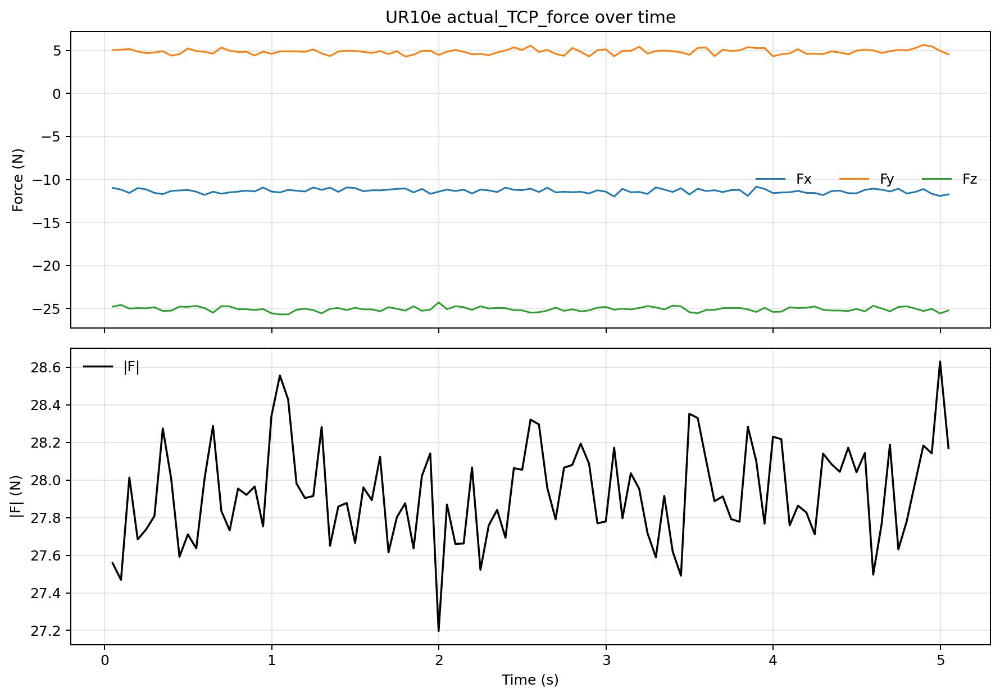
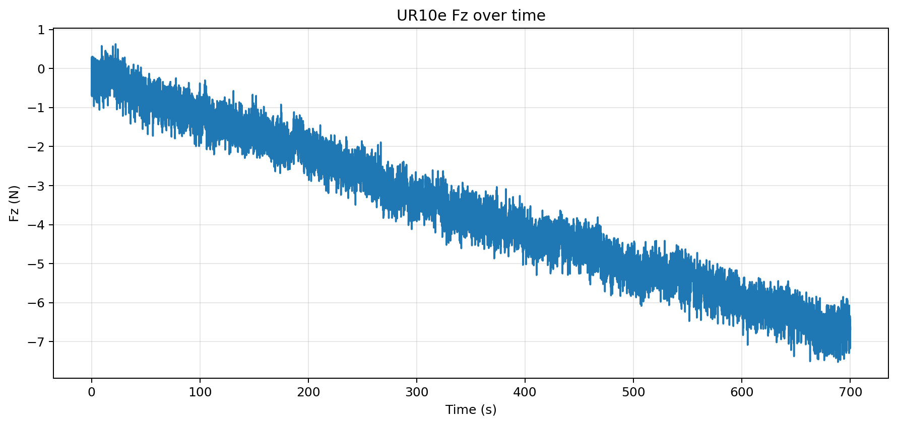

# UR10e 零漂初测 S00/S01 报告

记录时间：2026-05-18 晚，香港时间

分支：`exp/ur10e-zero-drift-20260518-initial`

## 实验目的

本次实验是在 UR10e 以太网和 Remote Control 连通后，建立第一组无运动、无接触的力传感器读数基线。S00 和 S01 不属于同一 protocol 下的重复实验：

- `S00`：未执行 `zero_ftsensor()`，只用于确认原始静态偏置量级。
- `S01`：执行一次 `zero_ftsensor()` 后记录 700 秒，用于观察清零后的 Fz 零漂。

因此，本报告只在统一统计口径下并排展示数值；结论中不会把 S00 和 S01 解释为同条件复测。

## 设备与实验条件

- 机器人 IP：`192.168.1.18`
- Ubuntu 直连网口：`enp3s0`，`192.168.1.10/24`
- Dashboard `29999`：打开
- Secondary Client `30002`：打开
- RTDE `30004`：打开
- Remote Control：`true`
- Safety mode：`NORMAL`
- Robot mode：`RUNNING`
- Program running：`false`
- Program state：`STOPPED <unnamed>`
- PolyScope：`URSoftware 5.11.9.1010452 (Jan 24 2022)`
- 本次没有发送任何机器人运动指令。

漂移测试前的 RTDE 快照：

- Payload：`1.07 kg`
- Payload CoG：`[0.002, 0.003, 0.057]`
- TCP offset：`[0, 0, 0, 0, 0, 0]`
- 清零前力读数约为：`Fx=-11.42 N`，`Fy=5.14 N`，`Fz=-25.01 N`，`|F|=27.97 N`

## 实验命令

S00 未清零快速原始采样：

```bash
python3 /home/andy/codex-private-skills/skills/ur10e-realsetup/scripts/sample_tcp_force.py \
  --seconds 5 --hz 20 --plot both \
  --prefix S00_quick_nozero_5s
```

S01 清零后 700 秒零漂：

```bash
python3 /home/andy/codex-private-skills/skills/ur10e-realsetup/scripts/measure_zero_drift_after_zeroft.py \
  --confirm-no-contact \
  --seconds 700 --hz 20 \
  --prefix S01_rezero_700s
```

## 数据与图片

数据文件：

- `data/S00_quick_nozero_5s_20260518_234115.csv`
- `data/S01_rezero_700s_20260518_235354.csv`

S00 图用于确认未清零时的原始偏置规模，不能直接当作零漂曲线：




S01 图是本次真正的清零后 Fz 漂移观察：



## Protocol 总表

| Segment | Zeroed? | Purpose   | Duration | Samples | Contact state | Command                              | Comparable as       |
| ------- | ------- | --------- | -------: | ------: | ------------- | ------------------------------------ | ------------------- |
| S00     | No      | 原始静态偏置基线  |   5.00 s |     101 | 无接触、无运动       | `sample_tcp_force.py`                | raw bias baseline   |
| S01     | Yes     | 清零后长时零漂测试 | 699.98 s |   14001 | 无接触、无运动       | `measure_zero_drift_after_zeroft.py` | post-zero drift run |

`Zeroed?` 是一级实验条件。S00 的作用是说明未清零前偏置有多大；S01 才回答清零后是否稳定。二者可以共享统计列，但不能被解释为同一条件下的前后复测。

## 轴向统计总表

下表对 S00 和 S01 使用同一套完整字段。`|x|>1/2/5` 是对应轴或合力超过阈值的样本数。

| Segment | Zeroed? | Axis | Mean N | Std N | Min N | P1 N | P50 N | P99 N | Max N | \|x\|>1 | \|x\|>2 | \|x\|>5 |
| --- | --- | --- | ---: | ---: | ---: | ---: | ---: | ---: | ---: | ---: | ---: | ---: |
| S00 | No | Fx | -11.344 | 0.249 | -11.988 | -11.918 | -11.345 | -10.922 | -10.844 | 101 | 101 | 101 |
| S00 | No | Fy | 4.850 | 0.296 | 4.273 | 4.288 | 4.868 | 5.551 | 5.623 | 101 | 101 | 27 |
| S00 | No | Fz | -25.056 | 0.256 | -25.678 | -25.666 | -25.045 | -24.574 | -24.276 | 101 | 101 | 101 |
| S00 | No | \|F\| | 27.931 | 0.255 | 27.197 | 27.469 | 27.915 | 28.557 | 28.631 | 101 | 101 | 101 |
| S01 | Yes | Fx | -1.742 | 0.854 | -3.792 | -3.281 | -1.785 | -0.116 | 0.281 | 10600 | 5981 | 0 |
| S01 | Yes | Fy | 0.309 | 0.409 | -1.017 | -0.603 | 0.302 | 1.240 | 1.651 | 632 | 0 | 0 |
| S01 | Yes | Fz | -3.560 | 1.940 | -7.522 | -6.916 | -3.729 | 0.030 | 0.628 | 12316 | 10217 | 4033 |
| S01 | Yes | \|F\| | 4.018 | 2.078 | 0.058 | 0.404 | 4.167 | 7.587 | 8.361 | 12813 | 10776 | 5145 |

S00 显示未清零时 Fz 均值约为 `-25.056 N`，合力均值约为 `27.931 N`，这是很大的原始静态偏置。S01 清零后初值被压低，但 700 秒窗口内 Fz 分布仍明显向负方向移动，`|Fz|>5 N` 的样本数为 `4033`。

## Fz 漂移派生指标

| Segment | Zeroed? | Start 5s mean N | End 5s mean N | Delta N | Linear slope N/s | Interpretation |
| --- | --- | ---: | ---: | ---: | ---: | --- |
| S00 | No | N/A | N/A | N/A | N/A | 未清零且只有 5 秒，只能作为原始偏置基线，不作为零漂测试。 |
| S01 | Yes | -0.184 | -6.556 | -6.373 | -0.009469 | 清零后 Fz 在 700 秒内持续向负方向漂移。 |

这里的 S00 不填漂移指标是有意的：未清零、短时 5 秒数据不应该被包装成零漂结论。S01 是本次唯一可用于判断清零后漂移的 segment。

## 结论

UR10e 当前已经能稳定连通并读取 RTDE 数据，但这组结果不能支持直接进入力控或接触实验。

S00 证明未清零前末端力读数存在明显静态偏置：Fz 约 `-25 N`，合力约 `28 N`。S01 证明执行 `zero_ftsensor()` 后初始偏置被压低，但 700 秒内 Fz 仍出现约 `-6.37 N` 的负向漂移，并且大量样本超过 `|Fz|>5 N`。

本轮最重要的判断是：未清零偏置和清零后零漂是两个不同问题。当前报告已经把它们分开；后续正式零漂实验应只在相同清零状态、相同姿态、相同时长和相同采样口径下比较。

## 下一步

下一次实验前，先检查末端工具、线缆、腕部和夹具是否存在缓慢加载、轻微接触或线缆牵扯。确认无接触后，重复一次清零后 700 秒零漂测试，并保持相同表格口径。如果相同趋势再次出现，再运行带 `tool_temperature` 的温漂记录，并复核 payload、TCP 和工具安装状态。
