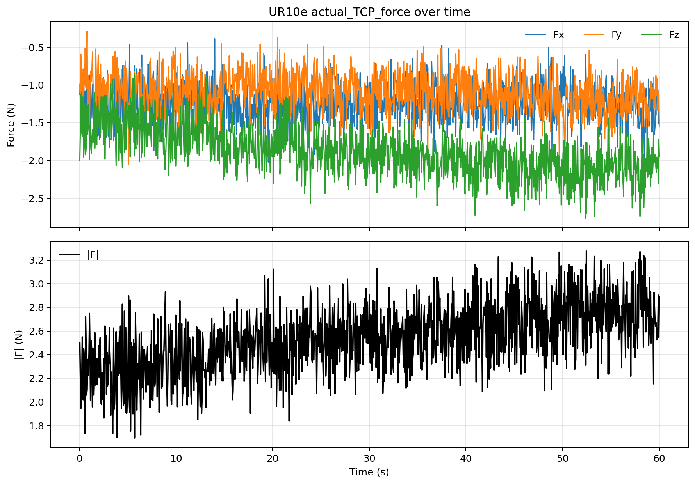
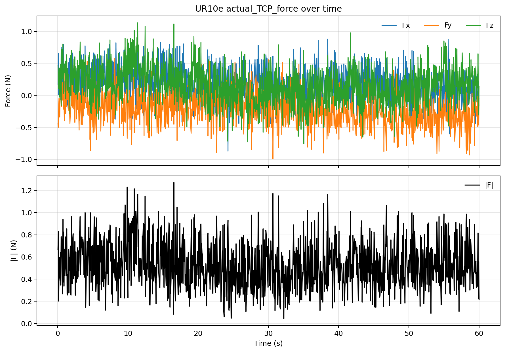
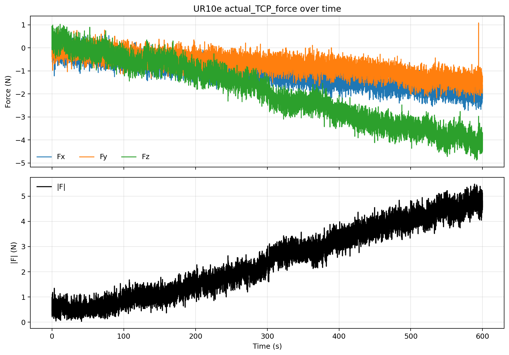
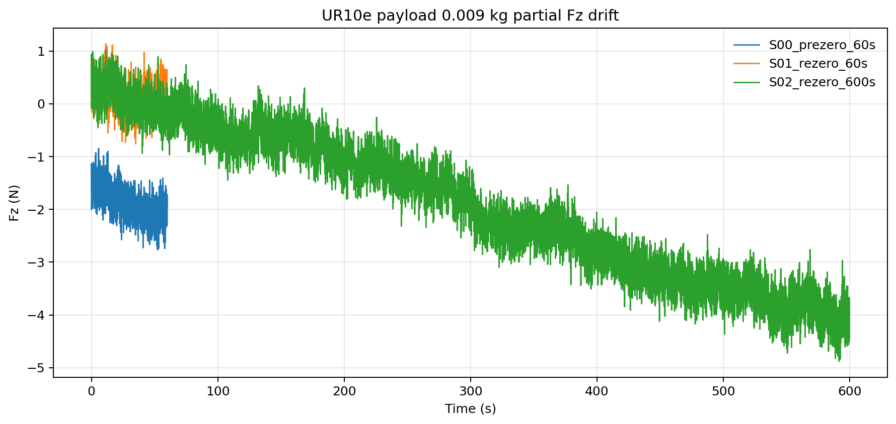

# UR10e Payload 0.009 kg 漂移复测中止报告

记录时间：2026-05-19，香港时间

状态：中止。S03 1800 秒段正在进行时，用户决定关闭 UR10e，并改为后续单独测量 OnRobot sensor 过夜漂移。因此本报告只记录已完成的 S00/S01/S02，不写成完整 60/600/1800 结论。

## 实验条件

- Payload：`0.009 kg`
- Payload CoG：`[0, 0, 0] m`
- TCP offset：`[0, 0, 0, 0, 0, 0]`
- 机器人状态：无运动、无接触
- 用户说明：第一次 S00 采样期间手碰到机器人，已立即停止并丢弃；本报告使用重新采集的干净 S00。

开始前只读快照：

- `Fx=-1.627 N`
- `Fy=-0.931 N`
- `Fz=-1.374 N`
- `|F|=2.325 N`

## 数据与图片

完整数据文件：

- `artifacts/S00_prezero_60s_20260519_030210.csv`
- `artifacts/S01_rezero_60s_20260519_030321.csv`
- `artifacts/S02_rezero_600s_20260519_031329.csv`
- `analysis/payload0009_partial_stats.csv`
- `analysis/payload0009_partial_stats.json`
- `manifest_partial.json`

S03 1800 秒段被中止，没有完整 CSV/PNG，不进入正式统计。

## Protocol 总表

| Segment | Zeroed? | Duration | Samples | Status | Purpose |
| --- | --- | ---: | ---: | --- | --- |
| S00_prezero_60s | No | 60 s | 1200 | complete | payload 修正后清零前基线 |
| S01_rezero_60s | Yes | 60 s | 1200 | complete | payload 修正后短时零漂 |
| S02_rezero_600s | Yes | 600 s | 12000 | complete | payload 修正后中时零漂 |
| S03_rezero_1800s | Yes | 1800 s | N/A | aborted | 用户切换到 OnRobot sensor 过夜测试前中止 |

## 统计结果

`Delta N` 是结束 5 秒均值减起始 5 秒均值。`Slope N/s` 是全段线性斜率。

| Segment | Zeroed? | Axis | Mean N | Std N | Min N | P50 N | Max N | \|x\|>1 | \|x\|>2 | \|x\|>5 | Delta N | Slope N/s |
| --- | --- | --- | ---: | ---: | ---: | ---: | ---: | ---: | ---: | ---: | ---: | ---: |
| S00_prezero_60s | No | Fx | -1.247 | 0.255 | -2.071 | -1.240 | -0.386 | 1012 | 3 | 0 | -0.086 | -0.000101 |
| S00_prezero_60s | No | Fy | -1.101 | 0.261 | -2.054 | -1.099 | -0.287 | 783 | 1 | 0 | -0.163 | -0.002746 |
| S00_prezero_60s | No | Fz | -1.877 | 0.326 | -2.767 | -1.890 | -0.844 | 1193 | 427 | 0 | -0.552 | -0.011259 |
| S00_prezero_60s | No | \|F\| | 2.539 | 0.288 | 1.693 | 2.546 | 3.276 | 1200 | 1160 | 0 | 0.506 | 0.009347 |
| S01_rezero_60s | Yes | Fx | 0.181 | 0.263 | -0.871 | 0.189 | 0.878 | 0 | 0 | 0 | -0.225 | -0.003703 |
| S01_rezero_60s | Yes | Fy | -0.210 | 0.262 | -0.991 | -0.218 | 0.579 | 0 | 0 | 0 | -0.238 | -0.004656 |
| S01_rezero_60s | Yes | Fz | 0.161 | 0.299 | -0.758 | 0.154 | 1.135 | 4 | 0 | 0 | -0.082 | -0.003243 |
| S01_rezero_60s | Yes | \|F\| | 0.533 | 0.214 | 0.044 | 0.511 | 1.270 | 20 | 0 | 0 | -0.018 | -0.000953 |
| S02_rezero_600s | Yes | Fx | -1.111 | 0.586 | -2.722 | -1.129 | 0.600 | 6887 | 674 | 0 | -1.856 | -0.003041 |
| S02_rezero_600s | Yes | Fy | -0.724 | 0.475 | -2.352 | -0.693 | 1.082 | 3378 | 24 | 0 | -1.331 | -0.002262 |
| S02_rezero_600s | Yes | Fz | -1.911 | 1.377 | -4.878 | -1.935 | 1.024 | 8016 | 5878 | 0 | -4.271 | -0.007741 |
| S02_rezero_600s | Yes | \|F\| | 2.429 | 1.406 | 0.033 | 2.367 | 5.477 | 9428 | 6624 | 130 | 4.130 | 0.007942 |

## 结论

Payload 从 `1.07 kg` 改为 `0.009 kg` 后，短时清零效果明显改善：S01 60 秒内 Fz 均值为 `0.161 N`，`|F|` 均值为 `0.533 N`。这比旧 payload 配置下的短时表现更合理。

但 600 秒段仍然出现明显漂移：S02 Fz end-start delta 为 `-4.271 N`，Fz 最小到 `-4.878 N`。因此，payload 修正改善了静态偏置，但没有消除中时漂移。

S03 1800 秒段没有完成，不能基于本轮数据写 1800 秒结论。后续工作已切换为单独测量 OnRobot sensor 过夜漂移。
