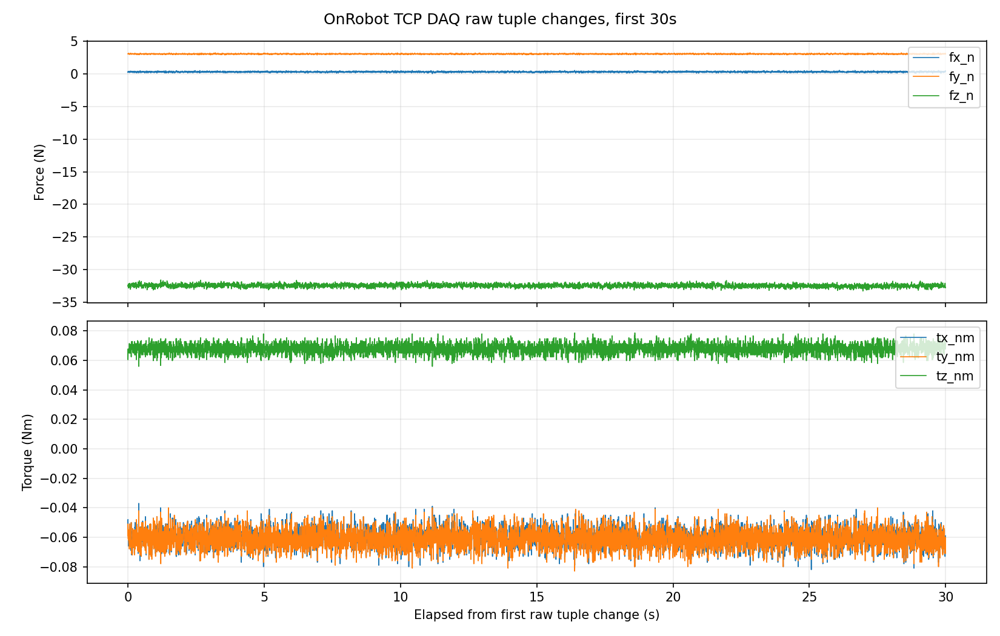
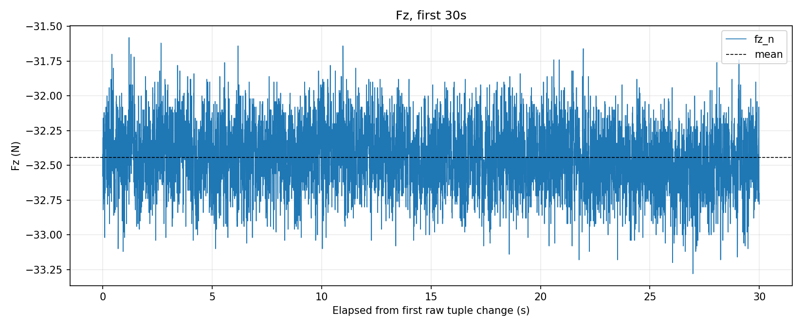
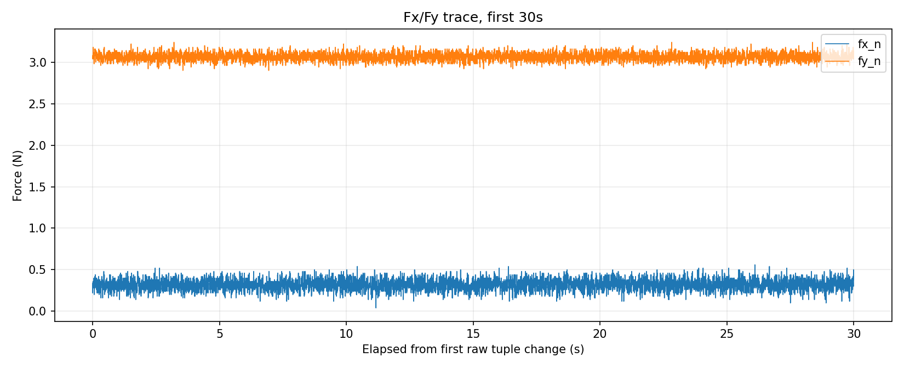
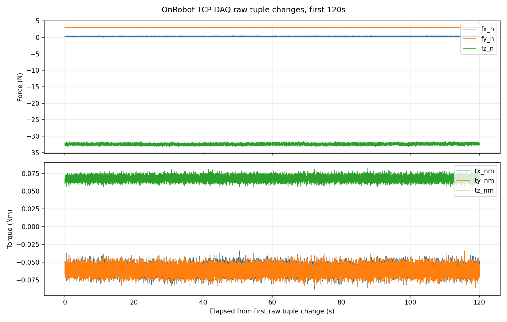
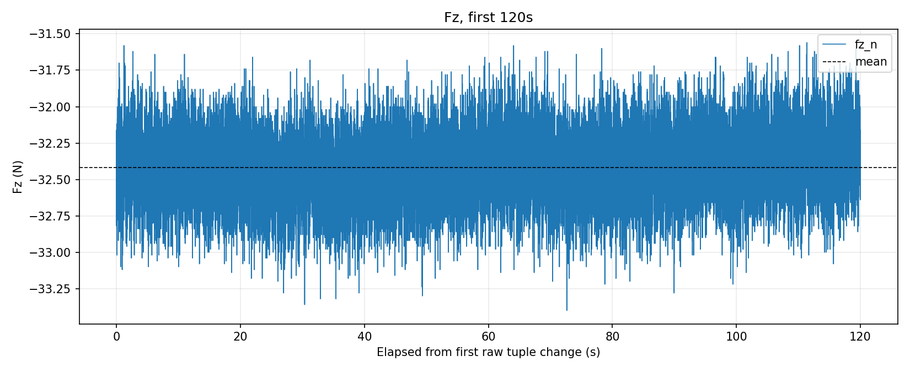
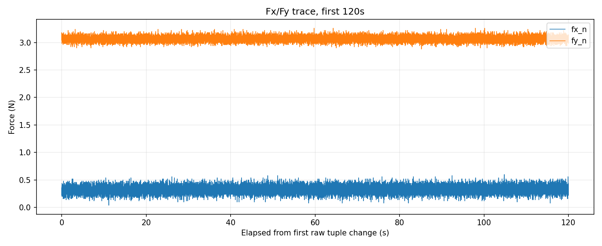
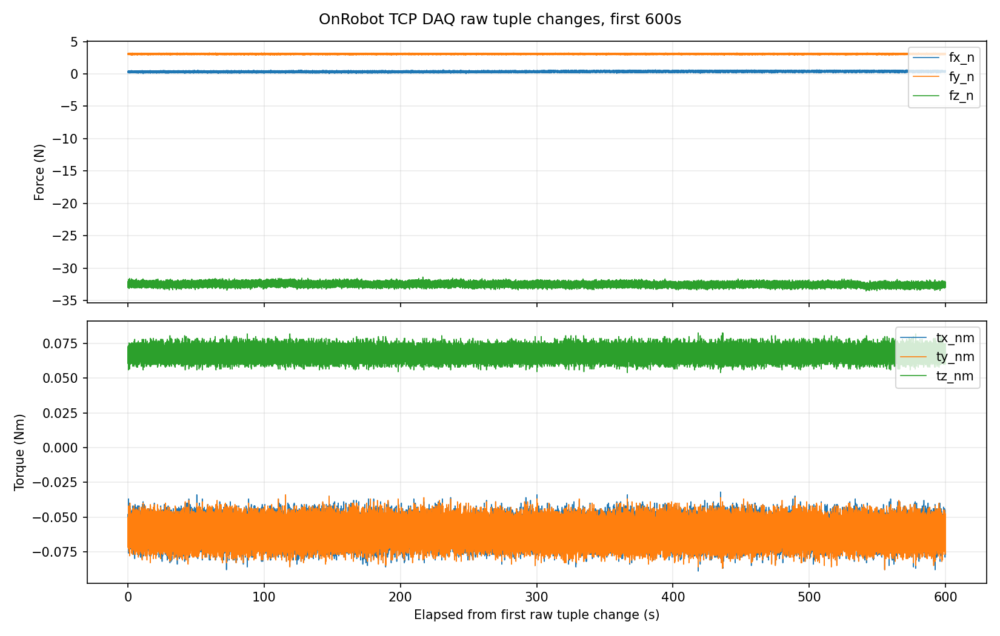
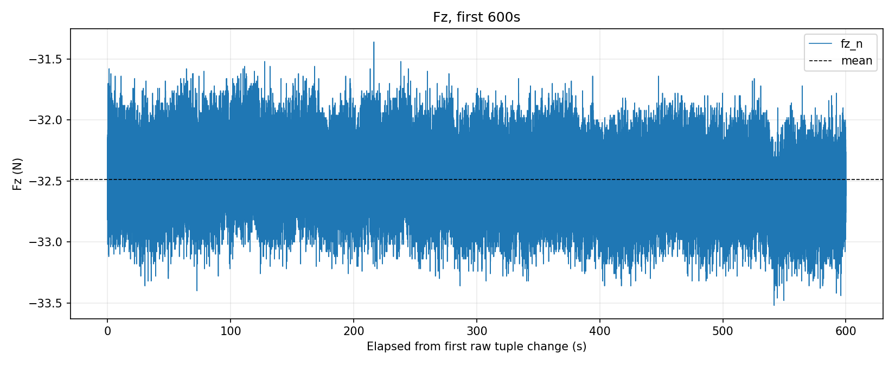
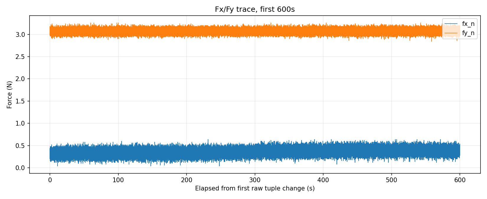

# OnRobot TCP DAQ 10 分钟只读测量报告

## 实验目的

本次实验验证当前 URCap/toolbar 状态下，Ubuntu 通过 OnRobot Compute Box `49151` TCP DAQ 只读读取时，raw tuple 新值率是否稳定接近 `250 Hz`。报告同时给出 30 s、120 s、600 s 三个累计检查点，用于判断短测结果是否能在 10 分钟内重复成立。

## 设备与实验条件

| 项目 | 内容 |
|---|---|
| 读取路径 | Ubuntu -> OnRobot Compute Box `192.168.1.1:49151` |
| 命令边界 | 先发送一次 `READCALIBRATIONINFO`，随后只重复 `READFT` |
| 安全边界 | 未发送 zero/bias/filter/speed/TCP/payload/URScript/program/motion 命令 |
| 采样解释 | 源 CSV 行频率是 PC request/response 吞吐；raw tuple transition rate 才是该只读路径可观察的新值率 |
| 源 CSV | `/home/andy/ur10e_ros2_ws/experiments/archive/onrobot/20260523_onrobot_tcpdaq_post_urcap_10min/onrobot_tcpdaq/onrobot_tcpdaq_post_urcap_10min_20260523_234203.csv` |
| 源 CSV 行数 | `3453086` |
| 源 CSV first-last 时长 | `599.9976 s` |
| 源 CSV 行频率 | `5755.1668 Hz` |
| raw tuple transition CSV | `/home/andy/ur10e_ros2_ws/experiments/archive/onrobot/20260523_onrobot_tcpdaq_post_urcap_10min/analysis/raw_tuple_changes.csv` |

## 程序状态与 250 Hz 解释

测量前 Dashboard 为 `Program running: false`、`STOPPED <unnamed>`；测量后为 `Program running: false`、`STOPPED <unnamed>`。
因此，这次 10 分钟测量证明：`wait 0.01` 程序没有正在运行时，仍然可以从 TCP DAQ 读到约 `251.5 Hz` 的 raw tuple transition rate。

这不能反推出“之前短暂跑过 wait 程序就是唯一原因”。更稳妥的解释是：URCap/toolbar、Compute Box 或之前短暂运行程序可能把系统带入了一个会持续一段时间的 post-URCap/toolbar 状态；本次数据只证明该状态在程序停止后仍然存在。要验证是否由短暂程序运行激活，需要另做受控对比：重启或断电恢复后先测一次，再短暂运行/停止后再测一次。

## 力值口径限制

本报告的 `251.5 Hz` 结论只针对 TCP DAQ raw tuple 新值率，不证明 TCP DAQ 的力值零点已经和 PolyScope Variables 一致。2026-05-24 用户观察到 PolyScope `Variables` 里的 `Fz` 约为 `0.04 N`，而同一阶段 Ubuntu 只读 TCP DAQ 5 s 复核仍显示 `Fz mean = -32.7114 N`、raw tuple transition rate `249.9168 Hz`，Dashboard 仍为 `Program running: false`、`STOPPED <unnamed>`。

因此，当前应把 PolyScope Variables 和 TCP DAQ `READFT` 视为两个不同口径：它们可能经过不同的 bias/zero、重力补偿、坐标/安装补偿或 URCap 变量处理。`wait 0.01` 程序是否会让 PolyScope Variables 正常刷新，和 TCP DAQ `READFT` 的 raw force 零点是否一致，是两个问题，不能直接混在一起判断。

## 统计结果

| 窗口 | raw tuple 数量（含首个） | transition 数 | transition 频率 | Fz 均值 | Fz std | Fz 末-首 | |F| 均值 | |F| 末-首 |
|---:|---:|---:|---:|---:|---:|---:|---:|---:|
| 30s | 7557 | 7556 | 251.8995 Hz | -32.4417 N | 0.2310 N | -0.2200 N | 32.5877 N | 0.2157 N |
| 120s | 30181 | 30180 | 251.5004 Hz | -32.4185 N | 0.2320 N | 0.3000 N | 32.5649 N | -0.3003 N |
| 600s | 150905 | 150904 | 251.5084 Hz | -32.4863 N | 0.2349 N | -0.1000 N | 32.6332 N | 0.1014 N |

## 数据与图片

每个检查点都保存了 raw tuple transition CSV、统计 JSON、全量力/力矩图、Fz 单轴图、以及 fxy 图。这里的 fxy 按既定报告口径表示 Fx 和 Fy 随时间变化的两条曲线，不是 Fx-Fy 平面散点。

### 30 s 检查点







- 数据：[checkpoints/30s/raw_tuple_changes.csv](checkpoints/30s/raw_tuple_changes.csv)
- 统计：[checkpoints/30s/summary.json](checkpoints/30s/summary.json)

### 120 s 检查点







- 数据：[checkpoints/120s/raw_tuple_changes.csv](checkpoints/120s/raw_tuple_changes.csv)
- 统计：[checkpoints/120s/summary.json](checkpoints/120s/summary.json)

### 600 s 检查点







- 数据：[checkpoints/600s/raw_tuple_changes.csv](checkpoints/600s/raw_tuple_changes.csv)
- 统计：[checkpoints/600s/summary.json](checkpoints/600s/summary.json)

## 与旧 7 小时记录的关系

旧 7 小时记录不是假数据，也不是这次频率问题的同一口径。旧记录用的是 `tools/onrobot_socketio_logger.py`，走 Web/Socket.IO 路径，约 `9 Hz`，而且当时 bench 状态不同。它适合解释那个路径和状态下的长时热漂/静态漂移，但不能直接拿来判断这次 `49151` TCP DAQ 的 raw tuple 新值率。

## 结论

1. 30 s、120 s、600 s 三个累计窗口的 raw tuple transition rate 都在约 `251.5 Hz`，说明短测看到的约 `250 Hz` 在本次 10 分钟内重复成立。
2. 这个数字应写为“当前 post-URCap/toolbar 状态下，`49151` TCP DAQ raw tuple transition rate 约 `251.5 Hz`”。它不能写成全局 OnRobot 传感器采样频率，也不能替代 PolyScope URCap 变量更新率。
3. 本次测量前后 Dashboard 都显示程序未运行，因此 `250 Hz` 不依赖 `wait 0.01` 程序正在运行。是否由之前短暂运行程序激活，只能作为假设，需要后续重启/断电前后对比验证。
4. TCP DAQ 当前 Fz 约 `-32 N`，而 PolyScope Variables 可见 Fz 约 `0.04 N`；这说明目前不能把 TCP DAQ `READFT` 力值当作 PolyScope 变量力值的等价数据源。

## 下一步

如果要确认 `250 Hz` 是持久状态还是被某个 URCap/程序动作激活，下一步应做一次只读状态机实验：重启或断电恢复后先测 30 s；再只打开 toolbar/变量页测 30 s；再短暂运行并停止 no-motion 程序后测 30 s。每一步都记录 Dashboard `programState`、PolyScope Variables 的 `Fx/Fy/Fz/T*` 可见值、UR RTDE `actual_TCP_force`、以及 TCP DAQ raw tuple transition rate 和 Fz 均值。

## 附录：复现命令

采集命令：

```bash
python3 /home/andy/codex-private-skills/skills/ur10e-onrobot-hex/scripts/sample_onrobot_tcp_daq.py \
  --host 192.168.1.1 \
  --seconds 600 \
  --output-dir /home/andy/ur10e_ros2_ws/experiments/archive/onrobot/20260523_onrobot_tcpdaq_post_urcap_10min/onrobot_tcpdaq \
  --prefix onrobot_tcpdaq_post_urcap_10min
```

分析命令：

```bash
python3 /home/andy/ur10e_ros2_ws/experiments/archive/onrobot/20260523_onrobot_tcpdaq_post_urcap_10min/analyze_checkpoints.py \
  --csv /home/andy/ur10e_ros2_ws/experiments/archive/onrobot/20260523_onrobot_tcpdaq_post_urcap_10min/onrobot_tcpdaq/onrobot_tcpdaq_post_urcap_10min_20260523_234203.csv \
  --output-root /home/andy/ur10e_ros2_ws/experiments/archive/onrobot/20260523_onrobot_tcpdaq_post_urcap_10min
```
