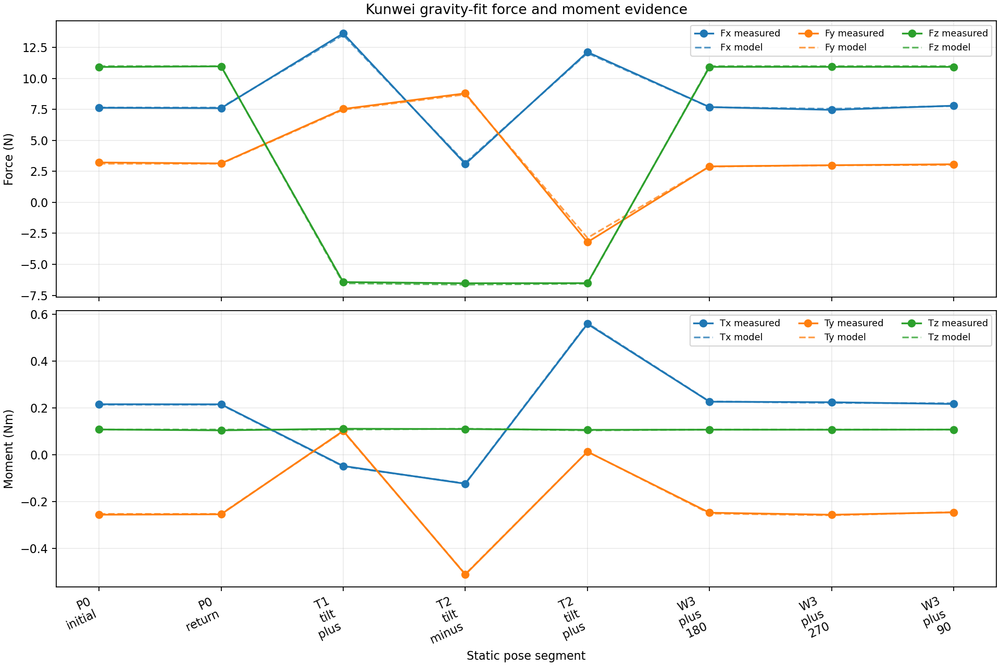

# Kunwei + UR 空夹爪自拟合报告

## 实验目的

用 Kunwei wrench + UR RTDE pose 对当前 RG2 打开、空夹爪状态做独立 gravity-axis 与 payload/CoG 拟合，并与已完成的 PolyScope 内置快照比较；本轮不写回控制器。

## 设备与实验条件

| 项目 | 记录 |
|---|---|
| Robot | UR10e, URSoftware 5.26.0.140462 |
| RG2 | 打开、空夹爪、无接触 |
| Kunwei | KWR75B TCP streaming, 1 kHz class |
| UR pose | RTDE observer, 静止姿态 |
| Zero/tare | 未执行 |
| PolyScope reference | 1.55 kg, CoG [1, 13, 51] mm |
| TCP readback | z=26.26 mm；与旧记录不一致，未用于替换 |
| Mass semantics | Kunwei sensing-plane candidate; not whole-assembly scale total |

## 实验命令

采集使用 `capture_kunwei_payload_cog_calibration.py`；分析优先读取同一 run 的 `summary.json`，原始 CSV/原始 Kunwei 帧保持不变。

## 数据与图片

- 原始 CSV：`/home/andy/ur10e_ros2_ws/experiments/sensor-integration/kunwei-kwr75b/measurements/gravity_axis_calibration/20260820_192100_rg2_open_custom_compare/gravity_axis_calibration.csv`
- 原始 Kunwei frames：`/home/andy/ur10e_ros2_ws/experiments/sensor-integration/kunwei-kwr75b/measurements/gravity_axis_calibration/20260820_192100_rg2_open_custom_compare/kunwei_raw_frames.bin`
- 主拟合图：

## 统计结果

| Segment | Samples | Contact | Zeroed | Purpose |
|---|---:|---|---|---|
| P0_initial | 4998 | no contact | no | static gravity pose |
| P0_return | 5035 | no contact | no | static gravity pose |
| T1_tilt_plus | 5000 | no contact | no | static gravity pose |
| T2_tilt_minus | 5000 | no contact | no | static gravity pose |
| T2_tilt_plus | 5000 | no contact | no | static gravity pose |
| W3_plus_180 | 5000 | no contact | no | static gravity pose |
| W3_plus_270 | 5036 | no contact | no | static gravity pose |
| W3_plus_90 | 5046 | no contact | no | static gravity pose |

| Method | Mass (kg) | CoG frame | CoG (mm) | Force RMSE (N) | Moment RMSE (Nm) | Status |
|---|---:|---|---|---:|---:|---|
| PolyScope built-in | 1.5500 | UR tool | [1, 13, 51] | N/A | N/A | reference snapshot |
| Kunwei custom | 1.0504405462464208 | Kunwei sensor | [0.35222305409425153, 0.34816338930613944, 59.14058970424245] | 0.09681035613265365 | 0.0021154765885357915 | fitted |

- mapping：`{'rmse_n': 0.09681035613265354, 'corr': 0.8758212970757474, 'alpha_kg': 1.0504405462464212, 'weight_n': 10.301302782847467, 'mass_kg': 1.0504405462464212, 'bias_n': [7.661211981926198, 3.0042916708259257, 0.6860922253426467], 'permutation': [0, 1, 2], 'signs': [1, 1, 1], 'formula': ['+F_K[0]', '+F_K[1]', '+F_K[2]']}`
- gravity rank：`3`；`max |g_T,z|=9.806047579177518` m/s²
- P0 return force drift norm：`0.09470511571310614` N
- P0 return moment drift norm：`0.003970984460827243` Nm

## 结论

Kunwei sensing-plane 自拟合质量候选为 `1.0504405462464208` kg，比内置 `1.55 kg` 低约 `-32.22964217765028`%；mapping 的最佳轴排列为当前同轴正号，force RMSE 约 `0.09681035613265354` N。该数值不能直接代表整套拆下称重的总质量。
CoG 当前只得到 Kunwei sensor origin frame 的结果；由于 sensor-origin 到 UR tool frame 的机械变换尚未确认，不能把它与 PolyScope 的 [1,13,51] mm 做直接坐标差，也不应据此写回配置。

## 下一步

测量并确认 Kunwei reference origin 到 UR tool frame 的平移/旋转，再用同一 raw run 重算 tool-frame CoG；在此之前保持 PolyScope 的 1.55 kg / [1,13,51] mm 不变。

## 附录

- JSON：`/home/andy/ur10e_ros2_ws/experiments/sensor-integration/kunwei-kwr75b/measurements/gravity_axis_calibration/20260820_192100_rg2_open_custom_compare/custom_payload_cog_analysis.json`
- Metadata：`/home/andy/ur10e_ros2_ws/experiments/sensor-integration/kunwei-kwr75b/measurements/gravity_axis_calibration/20260820_192100_rg2_open_custom_compare/metadata.json`
- Summary：`/home/andy/ur10e_ros2_ws/experiments/sensor-integration/kunwei-kwr75b/measurements/gravity_axis_calibration/20260820_192100_rg2_open_custom_compare/summary.json`

本报告为 diagnostic calibration record，不是 UR payload/TCP promotion certificate。
