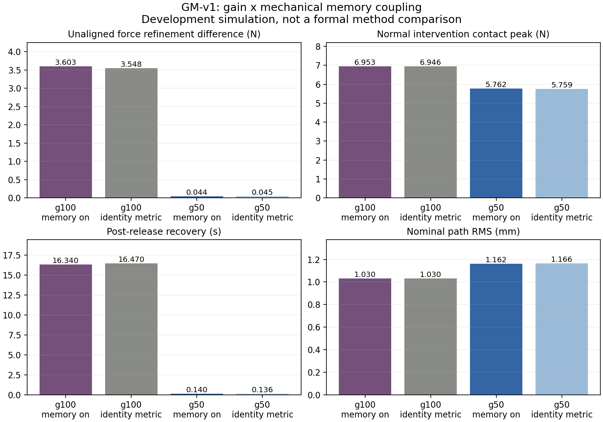

# GM-v1：输出增益与 memory 机械作用消融

Goal 继续 active，实机 pilot、正式公平预算与最终 holdout 未完成。
本轮接续 c5f1fb7f，不覆盖原始结果。共同外环、约束、指标不变。
16 个完整周期单元中复用 4 份严格匹配的 receipt，新运行 12 份。
参数、方程映射、完整状态、坐标、离散规则和 hashes 见 protocol.json。
所有这些数据都是 development data，不能再标为独立最终验证。

| Gain | Memory 机械作用 | 法向最大步长力差 N | 法向接触峰值 N | 恢复 s | nominal 路径 RMS mm |
|---|---|---:|---:|---:|---:|
| 原值 | 开 | 3.603 | 6.953 | 16.340 | 1.030 |
| 原值 | 关闭 A=I | 3.548 | 6.946 | 16.470 | 1.030 |
| 减半 | 开 | 0.044 | 5.762 | 0.140 | 1.162 |
| 减半 | 关闭 A=I | 0.045 | 5.759 | 0.136 | 1.166 |

关闭机械 memory 作用没有消除原 gain 下的问题；gain 减半则在两种 memory
条件下均改变结果。数据不支持将当前法向敏感性归因为 memory 本身。
保留 MSFC-GM-v1-g50-on 为开发候选，参数在
config/yield_gain_memory_v1/msfc_g50_on.json；原候选没有改写。
它是同一方程的参数版本，不宣称新的算法创新或优于 SFC。

代价是 nominal 路径 RMS 从 1.030 增至 1.162 mm，不能只看恢复。
完整指标、两种积分分辨率和尾部频谱见 [results.md](results.md)。
低步长差不是实机资格或全状态空间稳定性证明。



完整 memory 状态显示：持续法向干预时，原 gain 与减半 gain 的 metric
最小特征值分别为 0.9755、0.9880；nominal 时接近 1。
法向工况对 memory 的辨识较弱，不能将 on/off 相近推广为 memory 在所有任务中无效。
已有切向持续干预的最小特征值为 0.7868，具有更强激励。
各窗口的 force history、native 输入和加入恢复项之前的残差见 memory-activation.json。

beta=1 后 h/S 仍然演化，未重置 memory。新增 native 测试确认其在加载和释放
过程中等于机械参数完全匹配的 DSFC，1 项检查通过。这不把它当作已有的 DSFC
proposal，因为原 proposal 的 mu/g 不同。局部延迟模型仅作机制假设，见
[mechanism-hypothesis.md](mechanism-hypothesis.md)。未对齐逐点误差始终保留。
独立进程另对减半 gain 的完整法向干预 trial 进行了 31,916 tick 全状态回放，
无不一致，见 g50-full-state-replay.json；它不是独立物理模型验证。

下一步在切向持续干预、短时斜向扰动及第二组材料中检验此候选和 memory on/off，
补齐 SFC/DSFC 共同任务比较。若仍无收益，先检查 memory 驱动是否被恢复项抵消
及法向/摩擦的观测混淆，再决定修改或放弃；不无限增加控制器。
之后仍需完整数值检查、原平台 transport/pilot、正式公平预算、独立验证及贡献判断。

Fable 5.1/xhigh 第一轮讨论已完成，路由和 native model
证据见 discussion-route.json；主模型核验与分歧见 discussion/main-adjudication.md。
后续跨工况结果见 ../yield-transfer-v1/README.md。

复算时从实验根目录运行，输出目录必须是新的：

```bash
OPENBLAS_NUM_THREADS=1 OMP_NUM_THREADS=1 .venv-contact-six/bin/python tools/study_yield_gain_memory.py --output runs/NEW_GM_V1
.venv-contact-six/bin/python tools/analyze_yield_gain_memory.py --runs runs/NEW_GM_V1 --output report/NEW_GM_V1
python3 tools/plot_yield_gain_memory.py --summary runs/NEW_GM_V1/summary.json --output report/NEW_GM_V1
```

原始数据在 runs/yield-gain-memory-v1；复用输入按绝对路径和 SHA 绑定。
所有轨迹、状态及负结果保留，正式 24 paired units 未被本次开发消融替代。
