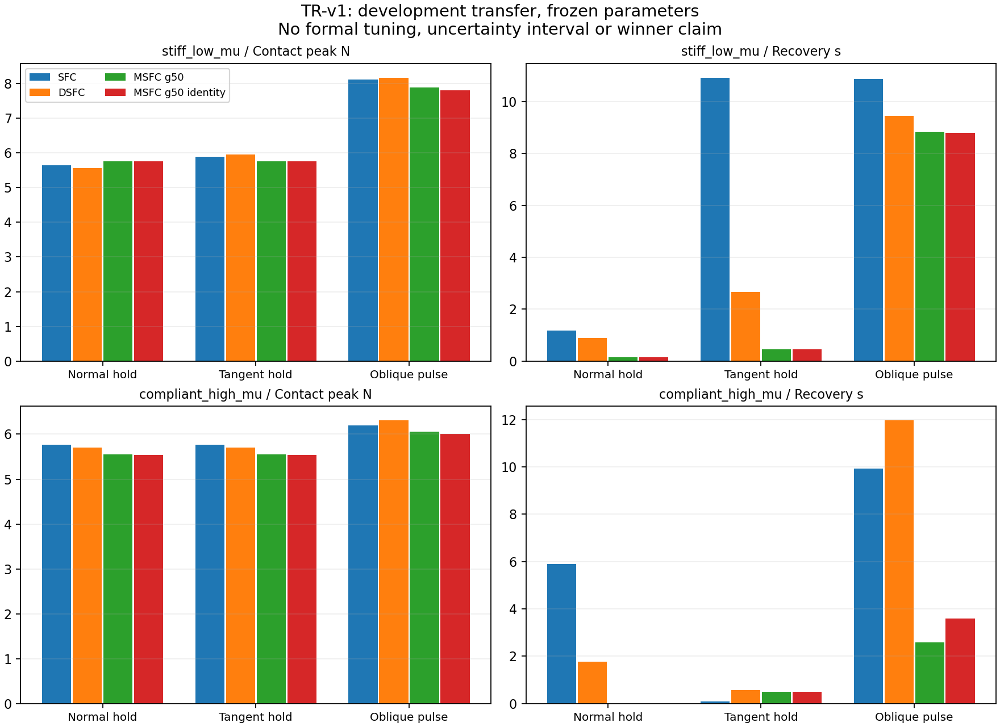

# TR-v1：固定参数的跨工况开发验证

32 个完整周期单元完成：24 个新运行、8 个严格匹配的既有结果复用。
两组材料、正常接触、持续法向/切向干预和短时斜向扰动均保留。
统一 2 ms 控制周期、8 个 plant 子步；没有重新调参，全部属于 development data。
本轮没有实机执行，也不占用或替代正式 24 paired units 与最终独立 holdout。

## 结果与判断

完整数据见 [results.md](results.md)，冻结协议与输入身份见 protocol.json。
刚性低摩擦材料的切向干预中，SFC、DSFC、减半 gain 的 MSFC 的恢复时间
分别为 10.926、2.660、0.460 s；接触峰值分别为 5.890、5.947、5.765 N。
这些是固定参数的开发观察，三种方法尚未完成公平调参，不能据此宣布胜者。
柔软高摩擦材料中，SFC 的切向恢复反而更快，说明排名取决于工况。
恢复为 0 表示释放时已满足现有指标的容差及持续窗口，不表示系统瞬时响应。

机械参数匹配的 memory 消融显示，大多数场景的 on/off 差异很小。
柔软材料的斜向短扰动中，开启 memory 的恢复时间减少 1.010 s，
但接触峰值增加 0.0504 N。刚性材料对应峰值增加 0.0809 N，恢复略慢。
因此目前不支持把减半 gain 的整体表现归为 memory 的独立贡献。
这一恢复差异还需步长检查和阈值敏感性分析，不能当作统计显著性结论。



## 共同模块问题与下一步

独立复算法向估计得到：既有正常工况的估计误差 RMS 为 6.7604 度，
初始 approach 先验仅为 1.4174 度，见 normal-estimate-audit.json。
这说明当前共同估计器引入了偏差；此处使用模拟真值评估，并非实机测量。
下一轮优先检查摩擦与运动激励的可辨识性、修复共同估计器，保持控制律固定，
而不是继续无限扩展候选控制器。不能只停用估计器便声称解决未知曲面任务。
plant 的关节速度硬裁剪及未辨识伺服参数仍是模型限制。

Fable 第一轮建议及主模型逐项裁定保留在
[讨论记录](../yield-gain-memory-v1/discussion/main-adjudication.md)。
原始未对齐步长指标、失败结果与完整初始过渡保留。
所有当前数据已用于开发，不能再充当最终独立验证。

## 复算

从实验根目录执行，选择新输出目录，保留旧结果：

```bash
OPENBLAS_NUM_THREADS=1 OMP_NUM_THREADS=1 .venv-contact-six/bin/python tools/study_yield_transfer_v1.py --output runs/NEW_TR_V1
python3 tools/report_yield_transfer_v1.py --runs runs/NEW_TR_V1 --output report/NEW_TR_V1
```

本地原始数据位于 runs/yield-transfer-v1，复用文件由协议中的路径与 SHA 绑定。
26 个本轮输出文件的 manifest 已重新核验；图表已目视检查。
实机 transport、pilot、公平预算、重复试验和最终贡献判断仍未完成。
