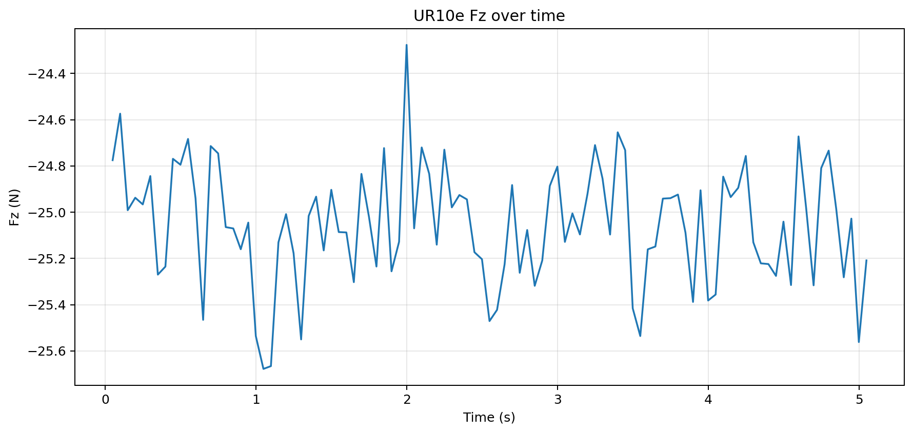

# UR10e 零漂初测 S00/S01 报告

记录时间：2026-05-18 晚，香港时间

分支：`exp/ur10e-zero-drift-20260518-initial`

## 实验目的

本次实验是在 UR10e 以太网连通后，建立第一组无运动、无接触的力传感读数基线：

- `S00`：不清零，快速读取当前自然力偏置。
- `S01`：执行一次 `zero_ftsensor()`，等待 2 秒，然后通过 RTDE 记录 700 秒力数据。

本次没有发送任何机器人运动指令。

## 设备与网络状态

- 机器人 IP：`192.168.1.18`
- Ubuntu 直连网口：`enp3s0`，`192.168.1.10/24`
- Dashboard `29999`：打开
- Secondary Client `30002`：打开
- RTDE `30004`：打开
- Remote Control：`true`
- Safety mode：`NORMAL`
- Robot mode：`RUNNING`
- Program running：`false`
- Program state：`STOPPED <unnamed>`
- PolyScope：`URSoftware 5.11.9.1010452 (Jan 24 2022)`

## Payload 与 TCP 快照

漂移测试前的 RTDE 快照：

- Payload：`1.07 kg`
- Payload CoG：`[0.002, 0.003, 0.057]`
- TCP offset：`[0, 0, 0, 0, 0, 0]`
- 清零前力读数约为：`Fx=-11.42 N`，`Fy=5.14 N`，`Fz=-25.01 N`，`|F|=27.97 N`

## 实验命令

S00 快速原始采样：

```bash
python3 /home/andy/codex-private-skills/skills/ur10e-realsetup/scripts/sample_tcp_force.py \
  --seconds 5 --hz 20 --plot both \
  --prefix S00_quick_nozero_5s
```

S01 清零后 700 秒零漂：

```bash
python3 /home/andy/codex-private-skills/skills/ur10e-realsetup/scripts/measure_zero_drift_after_zeroft.py \
  --confirm-no-contact \
  --seconds 700 --hz 20 \
  --prefix S01_rezero_700s
```

## 数据与图片

数据文件：

- `data/S00_quick_nozero_5s_20260518_234115.csv`
- `data/S01_rezero_700s_20260518_235354.csv`

S00 原始力与合力图：


S00 原始 Fz 图：



S01 清零后 Fz 零漂图：


## 统计结果

S00 快速原始采样，时长 `5.05 s`，共 `101` 个样本：

| 轴 | 均值 | 标准差 | 最小值 | 中位数 | 最大值 |
| --- | ---: | ---: | ---: | ---: | ---: |
| Fx N | -11.344 | 0.249 | -11.988 | -11.345 | -10.844 |
| Fy N | 4.850 | 0.296 | 4.273 | 4.868 | 5.623 |
| Fz N | -25.056 | 0.256 | -25.678 | -25.045 | -24.276 |
| \|F\| N | 27.931 | 0.255 | 27.197 | 27.915 | 28.631 |

S01 执行 `zero_ftsensor()` 后，记录 `700.03 s`，共 `14001` 个样本：

| 轴 | 均值 | 标准差 | 最小值 | P1 | 中位数 | P99 | 最大值 |
| --- | ---: | ---: | ---: | ---: | ---: | ---: | ---: |
| Fx N | -1.742 | 0.854 | -3.792 | -3.281 | -1.785 | -0.116 | 0.281 |
| Fy N | 0.309 | 0.409 | -1.017 | -0.603 | 0.302 | 1.240 | 1.651 |
| Fz N | -3.560 | 1.940 | -7.522 | -6.916 | -3.729 | 0.030 | 0.628 |
| \|F\| N | 4.018 | 2.078 | 0.058 | 0.404 | 4.167 | 7.587 | 8.361 |

S01 的 Fz 漂移指标：

- 起始 5 秒均值：`-0.182 N`
- 结束 5 秒均值：`-6.556 N`
- 结束减起始：`-6.375 N`
- 线性漂移斜率：`-0.009469 N/s`
- `|Fz| > 1 N`：`12316` 个样本
- `|Fz| > 2 N`：`10217` 个样本
- `|Fz| > 5 N`：`4033` 个样本

## 结论

UR10e 已经能稳定连通并读取 RTDE 数据，但这次清零后的 700 秒记录不能作为稳定零漂基线。Fz 在测试窗口内向负方向漂移约 `6.4 N`，并且有大量样本超过 `|Fz| > 5 N`。

基于这组证据，目前不建议直接进入力控或接触实验。

## 下一步

下一次实验前，先检查末端工具、线缆、腕部和夹具是否存在缓慢加载或轻微接触。确认无接触后，重复一次 700 秒清零后零漂测试。如果相同趋势再次出现，再运行带 `tool_temperature` 的温漂记录，并复核 payload、TCP 和工具安装状态。
