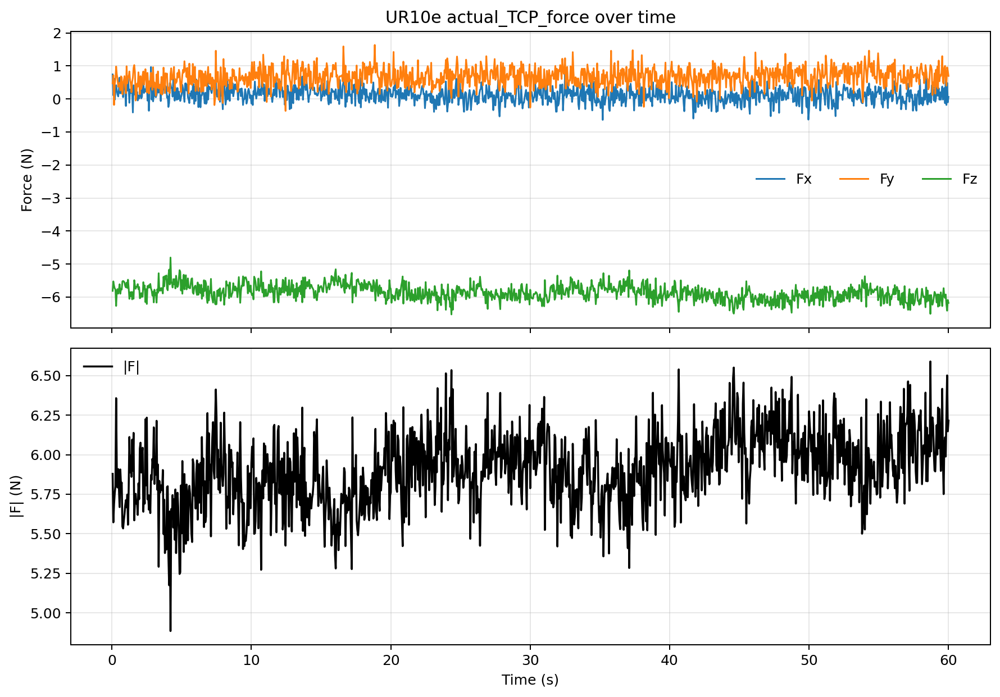
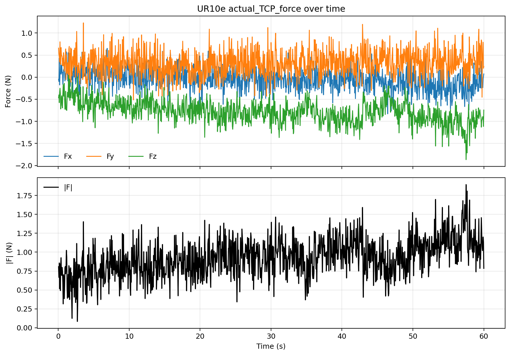
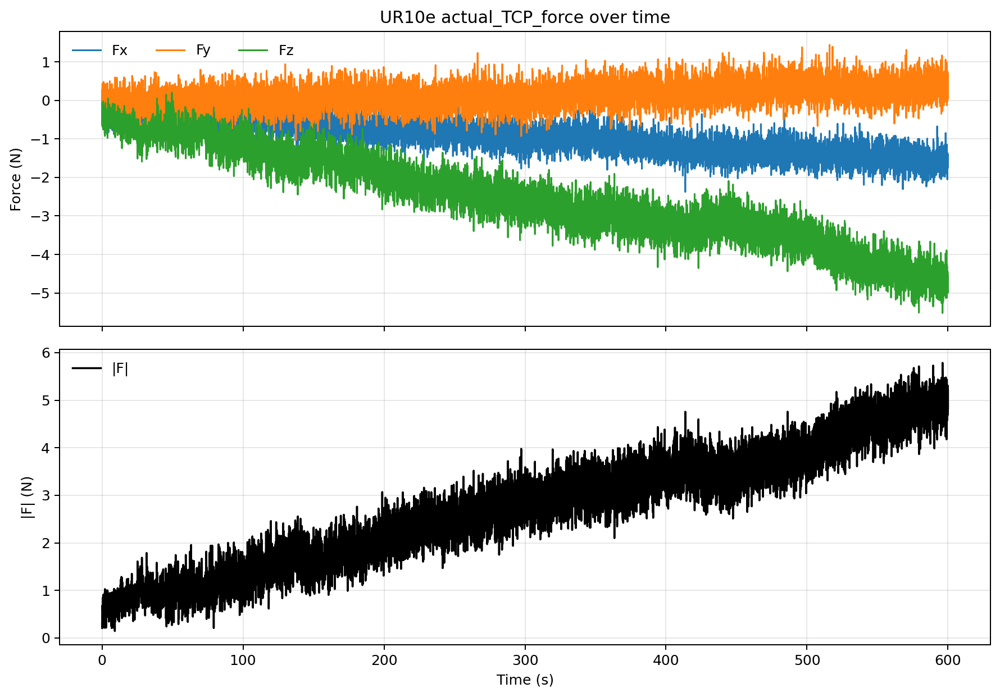
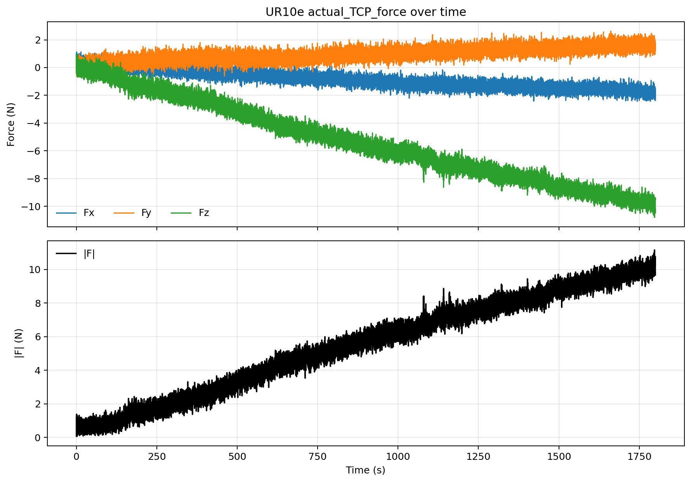
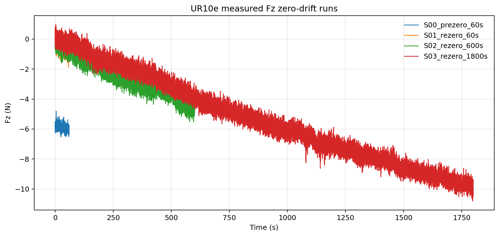
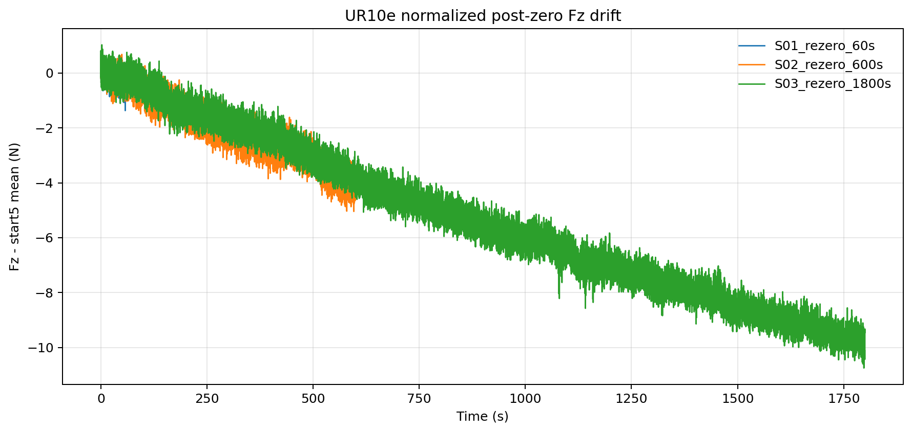

# UR10e 零漂 60/600/1800 报告

记录时间：2026-05-19，香港时间

分支：`exp/ur10e-zero-drift-matrix-20260519`

## 实验目的

本次实验记录末端工具摘下后、当前 payload/TCP 配置不变时的 UR10e 力传感器零漂。用户已确认末端无接触；机器人全程无运动。

本轮不修改 payload/TCP，因为 FT sensor 或残余安装件是否已被当前 payload 配置补偿未知。报告结论只对应“当前配置”，不等价于 payload 已准确标定后的最终 baseline。

## 设备与实验条件

- 机器人 IP：`192.168.1.18`
- Ubuntu 直连网口：`enp3s0`，`192.168.1.10/24`
- Remote Control：`true`
- Safety mode：`NORMAL`
- Robot mode：`RUNNING`
- Program running：`false`
- Payload：`1.07 kg`
- Payload CoG：`[0.002, 0.003, 0.057] m`
- TCP offset：`[0, 0, 0, 0, 0, 0]`
- 清零前快照：`Fx=0.312 N`，`Fy=0.634 N`，`Fz=-5.045 N`，`|F|=5.094 N`

## 实验命令

S00 清零前 60 秒基线：

```bash
python3 /home/andy/codex-private-skills/skills/ur10e-realsetup/scripts/sample_tcp_force.py \
  --seconds 60 --hz 20 --plot both \
  --output-dir /home/andy/ur10e_ros2_ws/experiments/zero_drift/20260519_zero_drift_60_600_1800/artifacts \
  --prefix S00_prezero_60s
```

S01/S02/S03 每段前执行一次 `zero_ftsensor()`，等待 2 秒后采样：

```bash
python3 /home/andy/codex-private-skills/skills/ur10e-realsetup/scripts/zero_ftsensor_once.py --confirm-no-contact
sleep 2
python3 /home/andy/codex-private-skills/skills/ur10e-realsetup/scripts/sample_tcp_force.py \
  --seconds <60|600|1800> --hz 20 --plot both \
  --output-dir /home/andy/ur10e_ros2_ws/experiments/zero_drift/20260519_zero_drift_60_600_1800/artifacts \
  --prefix <S01_rezero_60s|S02_rezero_600s|S03_rezero_1800s>
```

## 数据与图片

数据文件：

- `artifacts/S00_prezero_60s_20260519_010728.csv`
- `artifacts/S01_rezero_60s_20260519_010836.csv`
- `artifacts/S02_rezero_600s_20260519_011845.csv`
- `artifacts/S03_rezero_1800s_20260519_015109.csv`
- `analysis/zero_drift_60_600_1800_stats.csv`
- `analysis/zero_drift_60_600_1800_stats.json`

每个 segment 都有 Fx/Fy/Fz 与合力图：









Fz 对比图：





## Protocol 总表

| Segment | Zeroed? | Duration | Samples | Purpose |
| --- | --- | ---: | ---: | --- |
| S00_prezero_60s | No | 60 s | 1200 | 清零前当前配置基线 |
| S01_rezero_60s | Yes | 60 s | 1200 | 清零后短时零漂 |
| S02_rezero_600s | Yes | 600 s | 12000 | 清零后中时零漂 |
| S03_rezero_1800s | Yes | 1800 s | 36000 | 清零后长时零漂 |

原计划中的 3000 秒段已按用户更正取消，正式长时段以 1800 秒为准。

## 统计结果

`Delta N` 是结束 5 秒均值减起始 5 秒均值。`Slope N/s` 是全段线性斜率。

| Segment | Zeroed? | Axis | Mean N | Std N | Min N | P1 N | P50 N | P99 N | Max N | \|x\|>1 | \|x\|>2 | \|x\|>5 | Delta N | Slope N/s |
| --- | --- | --- | ---: | ---: | ---: | ---: | ---: | ---: | ---: | ---: | ---: | ---: | ---: | ---: |
| S00_prezero_60s | No | Fx | 0.126 | 0.230 | -0.635 | -0.391 | 0.125 | 0.641 | 0.965 | 0 | 0 | 0 | -0.142 | -0.002786 |
| S00_prezero_60s | No | Fy | 0.666 | 0.283 | -0.363 | -0.010 | 0.675 | 1.326 | 1.635 | 136 | 0 | 0 | 0.166 | 0.002123 |
| S00_prezero_60s | No | Fz | -5.857 | 0.234 | -6.526 | -6.386 | -5.856 | -5.324 | -4.803 | 1200 | 1200 | 1199 | -0.312 | -0.005363 |
| S00_prezero_60s | No | \|F\| | 5.907 | 0.234 | 4.885 | 5.375 | 5.910 | 6.425 | 6.590 | 1200 | 1200 | 1199 | 0.322 | 0.005469 |
| S01_rezero_60s | Yes | Fx | -0.045 | 0.241 | -0.832 | -0.635 | -0.038 | 0.528 | 0.653 | 0 | 0 | 0 | -0.275 | -0.004932 |
| S01_rezero_60s | Yes | Fy | 0.323 | 0.281 | -0.514 | -0.295 | 0.317 | 0.994 | 1.230 | 10 | 0 | 0 | 0.055 | 0.001625 |
| S01_rezero_60s | Yes | Fz | -0.783 | 0.255 | -1.868 | -1.387 | -0.779 | -0.207 | 0.043 | 226 | 0 | 0 | -0.545 | -0.007063 |
| S01_rezero_60s | Yes | \|F\| | 0.927 | 0.249 | 0.084 | 0.374 | 0.920 | 1.526 | 1.893 | 455 | 0 | 0 | 0.495 | 0.006815 |
| S02_rezero_600s | Yes | Fx | -0.944 | 0.461 | -2.376 | -1.887 | -0.953 | 0.032 | 0.381 | 5565 | 44 | 0 | -1.349 | -0.002249 |
| S02_rezero_600s | Yes | Fy | 0.137 | 0.326 | -1.029 | -0.595 | 0.130 | 0.904 | 1.443 | 52 | 0 | 0 | 0.468 | 0.000793 |
| S02_rezero_600s | Yes | Fz | -2.538 | 1.210 | -5.524 | -4.929 | -2.603 | -0.353 | 0.202 | 10397 | 7729 | 74 | -4.214 | -0.006685 |
| S02_rezero_600s | Yes | \|F\| | 2.749 | 1.255 | 0.146 | 0.524 | 2.805 | 5.226 | 5.786 | 10833 | 8184 | 334 | 4.336 | 0.006965 |
| S03_rezero_1800s | Yes | Fx | -0.863 | 0.647 | -2.440 | -2.011 | -0.958 | 0.574 | 1.125 | 17277 | 398 | 0 | -2.183 | -0.001133 |
| S03_rezero_1800s | Yes | Fy | 0.968 | 0.493 | -0.708 | -0.123 | 0.963 | 2.042 | 2.630 | 17061 | 468 | 0 | 1.438 | 0.000754 |
| S03_rezero_1800s | Yes | Fz | -5.358 | 2.899 | -10.806 | -9.990 | -5.635 | 0.045 | 0.976 | 33002 | 29604 | 20375 | -10.007 | -0.005527 |
| S03_rezero_1800s | Yes | \|F\| | 5.563 | 2.918 | 0.066 | 0.426 | 5.813 | 10.262 | 11.161 | 33533 | 30178 | 20869 | 9.689 | 0.005572 |

## 结论

摘下末端工具后，当前配置下清零前仍存在约 `-5.86 N` 的 Fz 偏置。这与 payload 仍为 `1.07 kg`、CoG 仍为 `[0.002, 0.003, 0.057] m` 一起说明：本轮结果不能解释为“payload 已经准确归零后的裸法兰结果”，只能解释为当前安装/配置状态下的力读数行为。

执行 `zero_ftsensor()` 后，60 秒窗口内 Fz 均值降到 `-0.783 N`，但随着采样时间拉长，负向漂移变得明显。600 秒窗口的 Fz end-start delta 为 `-4.214 N`；1800 秒窗口为 `-10.007 N`。这不是短时噪声，而是稳定的长时负漂趋势。

基于本轮证据，目前不建议进入力控或接触实验。下一步应先确认 FT sensor、法兰残余安装件、payload mass 和 CoG 的真实值；如果要得到最终 baseline，需要在确认 payload/TCP 后再重复 60/600/1800 或更长时段测试。

## 下一步

优先做两件事：

1. 确认当前 FT sensor 或残余末端硬件的实际质量和重心，并在 PolyScope Installation 中配置 payload/CoG。
2. 配置后重新跑同一套 60/600/1800 零漂，检查 Fz 长时负漂是否仍然存在。

如果配置后 1800 秒仍出现接近 `10 N` 级别漂移，再做 3600 秒温漂测试并同步记录 `tool_temperature`。
