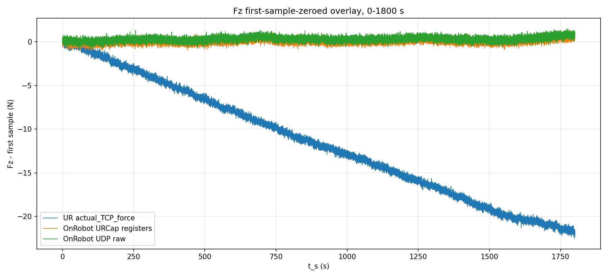
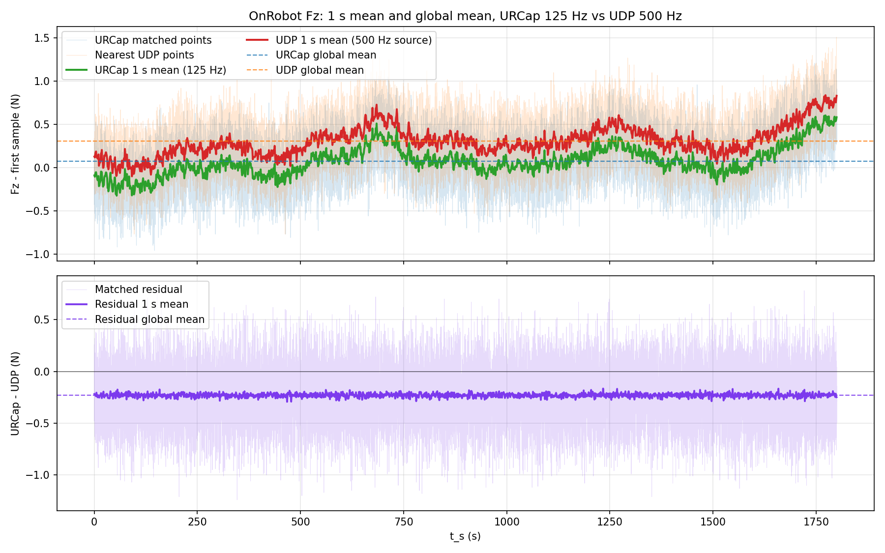
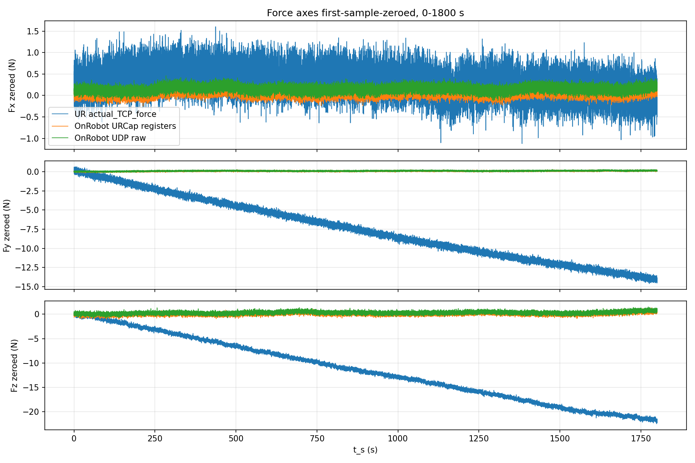
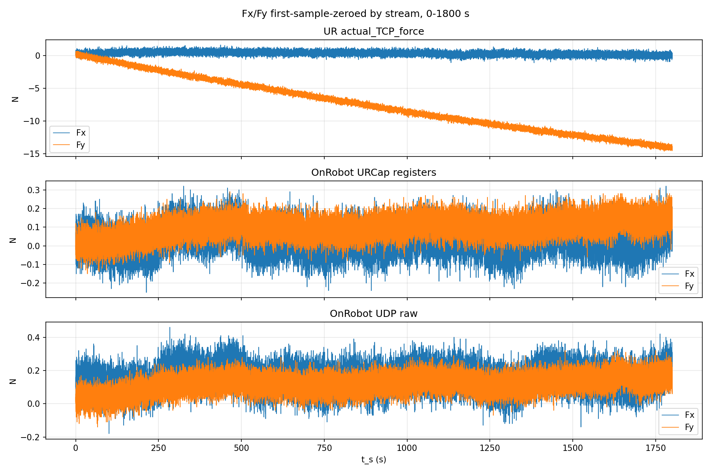
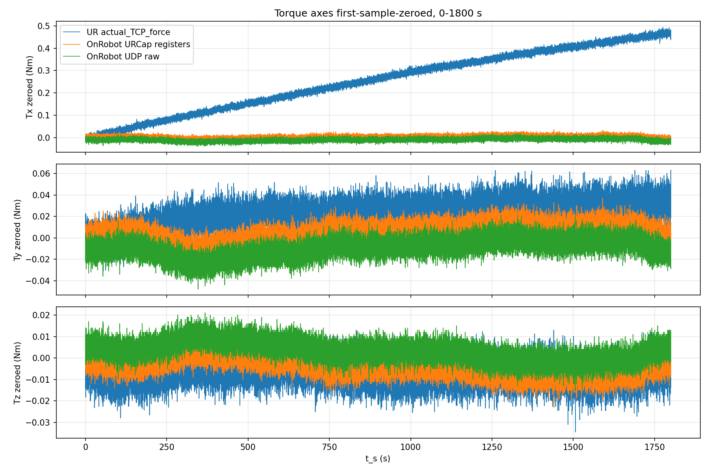

# OnRobot HEX / UR 三流冷启动漂移半小时中期报告

生成时间：2026-05-28T14:53:44

## 实验目的

在不停止当前 24 小时采集的前提下，先查看前 30 分钟数据是否持续、三条力流的频率是否符合预期，并用第一帧软件归零口径观察冷启动早期漂移。这个报告是中期快照，不替代长跑结束后的完整报告。

## 设备与实验条件

| 项目 | 当前口径 |
|---|---|
| 机器人 | UR10e，RTDE 读取 `actual_TCP_force` |
| OnRobot | HEX-E v2，经 Compute Box `192.168.1.1` |
| URCap 路线 | `Fx/Fy/Fz/Tx/Ty/Tz` 写入 `output_double_register_24..29` 后由 Ubuntu 读 RTDE |
| UDP 路线 | OnRobot high-speed UDP，发送过 `SPEED=2` 与 `START`；本报告未发送任何新命令 |
| 分析窗口 | `0.0-1800.0 s` |
| 窗口定义 | 从正在写入的 CSV 中只读取 `t_s <= 1800` 的已有行 |
| 归零状态 | 原始 CSV 未改动；统计和图只做第一样本软件相减 |
| 安全边界 | 未停止采集、未 `zero_ftsensor()`、未 OnRobot `BIAS/FILTER`、未运动、未 TCP/payload 写入 |
| TCP 速度检查 | 30 分钟窗口内最大线速度 `0.00010736 m/s`，最大角速度 `0.00031812 rad/s` |

## 实验命令

当前长跑仍由以下脚本采集，本报告只读取它已经写出的 CSV：

`/home/andy/ur10e_ros2_ws/scripts/run_onrobot_three_stream_coldstart_drift.sh`

报告生成脚本：

`/home/andy/ur10e_ros2_ws/scripts/report_onrobot_three_stream_partial.py --run-dir <run_dir> --window-seconds 1800`

## 数据与图片

原始数据仍在采集中；下列链接指向当前 run 目录里的 live CSV，不是报告脚本复制出来的截断副本。

| 数据 | 路径 |
|---|---|
| RTDE + URCap CSV | [three_stream_coldstart_drift_20260528_141152_rtde_ur500_urcap125.csv](../../../experiments/archive/onrobot/20260528_onrobot_three_stream_coldstart_drift/run_20260528_141149/three_stream_coldstart_drift_20260528_141152_rtde_ur500_urcap125.csv) |
| OnRobot UDP CSV | [three_stream_coldstart_drift_20260528_141152_onrobot_udp500_raw.csv](../../../experiments/archive/onrobot/20260528_onrobot_three_stream_coldstart_drift/run_20260528_141149/three_stream_coldstart_drift_20260528_141152_onrobot_udp500_raw.csv) |
| 中期 summary JSON | [onrobot_three_stream_half_hour_20260528_summary.json](../../assets/archive/onrobot/onrobot_three_stream_half_hour_20260528/onrobot_three_stream_half_hour_20260528_summary.json) |
| 当前 checkpoint | [three_stream_coldstart_drift_20260528_141152_checkpoint.json](../../../experiments/archive/onrobot/20260528_onrobot_three_stream_coldstart_drift/run_20260528_141149/three_stream_coldstart_drift_20260528_141152_checkpoint.json) |

图 1 是 Fz 的第一样本归零重叠图。它用于直接判断三条路线在半小时窗口内的低频漂移趋势，不用于判断绝对载荷是否一致。

图 2 专门比较两个 OnRobot Fz 路线：URCap 的 125 Hz 真实更新点，和 UDP 500 Hz 流中按时间戳最近的样本。淡线是匹配后的点，粗线是 `1 s` 分箱均值，虚线是全局均值；下半图是残差及其 `1 s` 分箱均值。两条曲线都只做第一样本软件归零，残差定义为 `URCap_zeroed_Fz - UDP_zeroed_Fz`。

图 3 展示 Fx/Fy/Fz 三个力轴。横向力 `Fx/Fy` 的漂移幅值和 Fz 分开看，避免只看 Fz 漏掉侧向变化。

图 4 是每条流内部的 Fx/Fy 对照。这里的 `fxy` 指 Fx 和 Fy 两条曲线，不是水平力模长。

图 5 给出三个力矩轴，用于判断力矩漂移是否和力轴同时出现。

## 统计结果

### 采集进度与频率

| 数据流 | 窗口样本数 | 首末时长 (s) | 行/包频率 (Hz) | tuple 更新数 | tuple 更新率 (Hz) | 口径 |
|---|---:|---:|---:|---:|---:|---|
| UR actual_TCP_force | 899994 | 1799.992 | 499.998 | 899994 | 499.998 | UR 内部 RTDE `actual_TCP_force`，不是 OnRobot 传感器值 |
| OnRobot URCap registers | 899994 | 1799.992 | 499.998 | 224998 | 124.999 | URCap `Fx..Tz` 经 `output_double_register_24..29` 导出 |
| OnRobot UDP raw | 899282 | 1799.989 | 499.604 | 899280 | 499.603 | Compute Box high-speed UDP，`SPEED=2` |

UDP 质量字段：`status_counts={0: 899282}`，`sequence_delta_counts={1: 899281}`，`sample_counter_delta_counts={2: 899253, -65534: 28}`。这说明前 30 分钟窗口内 UDP status 为 0，sequence number 连续；sample counter 以 `+2` 为主，`-65534` 是 16-bit 回绕后按模 65536 等价的 `+2`。

### OnRobot Fz 专门比较

这部分只比较 OnRobot 自身的两条路线，不包含 UR `actual_TCP_force`。URCap 路线使用去重后的真实更新点，避免把 125 Hz 值在 500 Hz RTDE 表里重复的行当作独立样本；UDP 路线使用每个 URCap 更新时间附近最近的 UDP 样本。

| 指标 | 数值 | 单位 |
|---|---:|---|
| 匹配样本数 | 224998 | 点 |
| URCap 更新率 | 124.999 | Hz |
| UDP 源包频率 | 499.604 | Hz |
| 最近时间差均值 | 0.5063 | ms |
| 最近时间差 P99 | 0.9917 | ms |
| URCap Fz 全局均值 | 0.0751 | N |
| UDP Fz 全局均值 | 0.3051 | N |
| 全局均值差 URCap-UDP | -0.2300 | N |
| 残差均值 | -0.2300 | N |
| 残差标准差 | 0.2664 | N |
| 残差 P1/P50/P99 | -0.8500 / -0.2300 / 0.3900 | N |
| MAE | 0.2873 | N |
| RMSE | 0.3519 | N |
| 最大绝对残差 | 1.5100 | N |
| 1 s 分箱均值残差 RMSE | 0.2308 | N |
| 1 s 分箱均值最大绝对残差 | 0.2934 | N |
| 1 s 分箱数 | 1800 | 个 |

### 力轴统计

下表全部采用第一样本软件归零后的值，单位为 N。

| 数据流 | 轴 | 样本数 | 均值 | 标准差 | Min | P1 | P50 | P99 | Max | 末值-首值 |
|---|---:|---:|---:|---:|---:|---:|---:|---:|---:|---:|
| UR actual_TCP_force | Fx | 899994 | 0.3144 | 0.3252 | -1.2084 | -0.4463 | 0.3171 | 1.0565 | 1.8851 | 0.2674 |
| UR actual_TCP_force | Fy | 899994 | -7.5042 | 4.1016 | -14.7602 | -13.9925 | -7.7768 | 0.0261 | 0.9675 | -14.3580 |
| UR actual_TCP_force | Fz | 899994 | -11.4926 | 6.4794 | -22.8510 | -21.6394 | -11.8345 | -0.2370 | 0.6126 | -21.7977 |
| OnRobot URCap registers | Fx | 899994 | 0.0411 | 0.0721 | -0.2800 | -0.1300 | 0.0400 | 0.2100 | 0.3500 | 0.0500 |
| OnRobot URCap registers | Fy | 899994 | 0.0965 | 0.0554 | -0.1500 | -0.0400 | 0.1000 | 0.2200 | 0.3100 | 0.1900 |
| OnRobot URCap registers | Fz | 899994 | 0.0751 | 0.2744 | -1.0600 | -0.5400 | 0.0700 | 0.7500 | 1.3300 | 0.6500 |
| OnRobot UDP raw | Fx | 899282 | 0.1510 | 0.0721 | -0.2000 | -0.0200 | 0.1500 | 0.3200 | 0.4800 | 0.3000 |
| OnRobot UDP raw | Fy | 899282 | 0.1165 | 0.0554 | -0.1700 | -0.0200 | 0.1200 | 0.2400 | 0.3800 | 0.1900 |
| OnRobot UDP raw | Fz | 899282 | 0.3050 | 0.2741 | -0.9700 | -0.3100 | 0.3000 | 0.9800 | 1.5600 | 0.6200 |

### 力矩轴统计

下表全部采用第一样本软件归零后的值，单位为 Nm。

| 数据流 | 轴 | 样本数 | 均值 | 标准差 | Min | P1 | P50 | P99 | Max | 末值-首值 |
|---|---:|---:|---:|---:|---:|---:|---:|---:|---:|---:|
| UR actual_TCP_force | Tx | 899994 | 0.2541 | 0.1366 | -0.0322 | 0.0010 | 0.2645 | 0.4682 | 0.4987 | 0.4749 |
| UR actual_TCP_force | Ty | 899994 | 0.0229 | 0.0121 | -0.0368 | -0.0089 | 0.0239 | 0.0478 | 0.0737 | 0.0405 |
| UR actual_TCP_force | Tz | 899994 | -0.0067 | 0.0054 | -0.0397 | -0.0193 | -0.0067 | 0.0058 | 0.0170 | -0.0084 |
| OnRobot URCap registers | Tx | 899994 | 0.0034 | 0.0077 | -0.0290 | -0.0140 | 0.0040 | 0.0210 | 0.0370 | -0.0030 |
| OnRobot URCap registers | Ty | 899994 | 0.0042 | 0.0088 | -0.0340 | -0.0170 | 0.0050 | 0.0230 | 0.0410 | 0.0060 |
| OnRobot URCap registers | Tz | 899994 | -0.0036 | 0.0047 | -0.0250 | -0.0140 | -0.0040 | 0.0070 | 0.0160 | -0.0040 |
| OnRobot UDP raw | Tx | 899282 | -0.0096 | 0.0077 | -0.0430 | -0.0270 | -0.0090 | 0.0080 | 0.0290 | -0.0230 |
| OnRobot UDP raw | Ty | 899282 | -0.0098 | 0.0088 | -0.0490 | -0.0310 | -0.0090 | 0.0090 | 0.0280 | -0.0200 |
| OnRobot UDP raw | Tz | 899282 | 0.0034 | 0.0047 | -0.0180 | -0.0070 | 0.0030 | 0.0140 | 0.0240 | 0.0070 |

### 前后 60 秒漂移

下表比较 `0-60 s` 和 `1740-1800 s` 的均值差。斜率按 29 分钟间隔近似，仅作为中期趋势指标。

| 数据流 | 轴 | 0-60 s 均值 | 1740-1800 s 均值 | 后60s-前60s | 斜率/分钟 |
|---|---:|---:|---:|---:|---:|
| UR actual_TCP_force | Fx | 0.2802 | -0.0079 | -0.2881 | -0.0099 |
| UR actual_TCP_force | Fy | -0.1323 | -13.8507 | -13.7184 | -0.4730 |
| UR actual_TCP_force | Fz | -0.3674 | -21.5084 | -21.1409 | -0.7290 |
| UR actual_TCP_force | Tx | 0.0065 | 0.4626 | 0.4561 | 0.0157 |
| UR actual_TCP_force | Ty | -0.0009 | 0.0321 | 0.0330 | 0.0011 |
| UR actual_TCP_force | Tz | -0.0064 | -0.0058 | 0.0006 | 0.0000 |
| OnRobot URCap registers | Fx | 0.0217 | 0.0799 | 0.0582 | 0.0020 |
| OnRobot URCap registers | Fy | 0.0115 | 0.1464 | 0.1349 | 0.0047 |
| OnRobot URCap registers | Fz | -0.1597 | 0.5191 | 0.6787 | 0.0234 |
| OnRobot URCap registers | Tx | 0.0028 | -0.0029 | -0.0057 | -0.0002 |
| OnRobot URCap registers | Ty | 0.0023 | 0.0015 | -0.0008 | -0.0000 |
| OnRobot URCap registers | Tz | -0.0013 | -0.0024 | -0.0011 | -0.0000 |
| OnRobot UDP raw | Fx | 0.1317 | 0.1908 | 0.0591 | 0.0020 |
| OnRobot UDP raw | Fy | 0.0310 | 0.1667 | 0.1357 | 0.0047 |
| OnRobot UDP raw | Fz | 0.0708 | 0.7474 | 0.6766 | 0.0233 |
| OnRobot UDP raw | Tx | -0.0102 | -0.0160 | -0.0058 | -0.0002 |
| OnRobot UDP raw | Ty | -0.0117 | -0.0125 | -0.0008 | -0.0000 |
| OnRobot UDP raw | Tz | 0.0057 | 0.0046 | -0.0011 | -0.0000 |

## 结论

1. 当前采集没有被中断；前 30 分钟窗口已经可用，RTDE/UDP 行数和时间戳均连续增长。
2. 频率口径符合预期：UR `actual_TCP_force` 行频率约 500 Hz，OnRobot URCap 寄存器 tuple 更新约 125 Hz，OnRobot UDP 原始流约 500 Hz。
3. OnRobot Fz 的 125 Hz URCap 更新点和 500 Hz UDP 最近样本在趋势上接近；图 2 的 `1 s` 分箱均值比原始重叠线更容易看出两条趋势是否一起漂，全局均值虚线只用于判断整体偏置。
4. 专门比较表给出了二者在第一样本归零后的残差、MAE/RMSE、`1 s` 分箱均值残差和时间匹配误差。
5. 报告中的 OnRobot 比较使用软件第一样本归零。原始 CSV 仍保留绝对值，因此后续可以重新选择归零窗口或做更严格的时间对齐。
6. 这个中期报告只证明前 30 分钟的数据完整性和漂移趋势；长时间热漂移结论要等 2 小时以上或最终 24 小时 summary 再下。

## 下一步

继续让当前采集运行。下一份建议在 2 小时 checkpoint 后生成，用同一口径加入 `0-30 min`、`30-60 min`、`60-120 min` 分段统计，避免把冷启动早期和后续慢漂移混在一个均值里。

## 附录

### 运行目录

`/home/andy/ur10e_ros2_ws/experiments/archive/onrobot/20260528_onrobot_three_stream_coldstart_drift/run_20260528_141149`

### 只读处理说明

报告脚本只读取两张 CSV 中 `t_s <= 1800` 的已有行，并把图和 JSON 写入报告 assets 目录。它没有向 UR 或 OnRobot 发送网络命令，也没有停止或重启采集进程。
