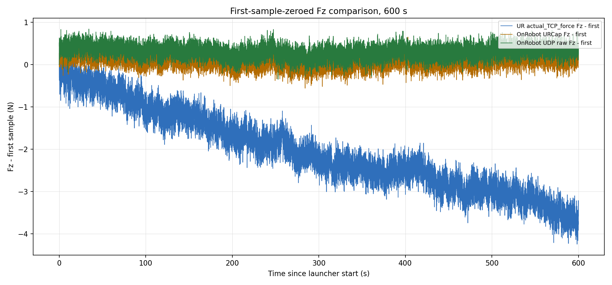
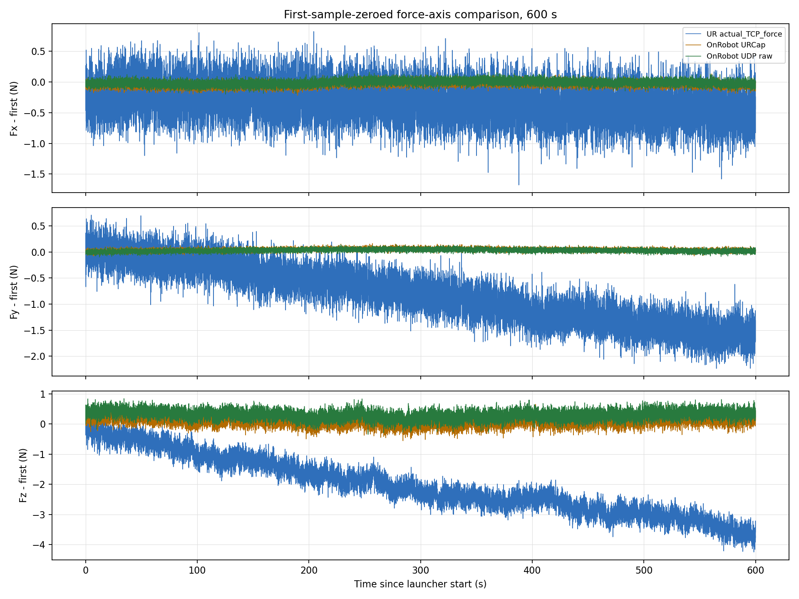
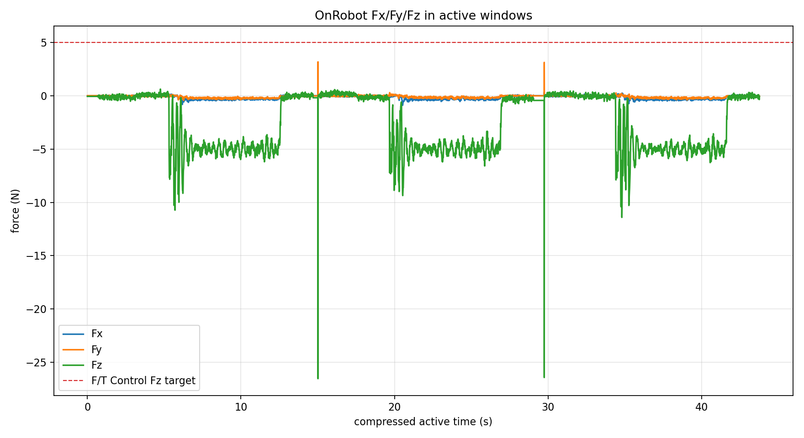
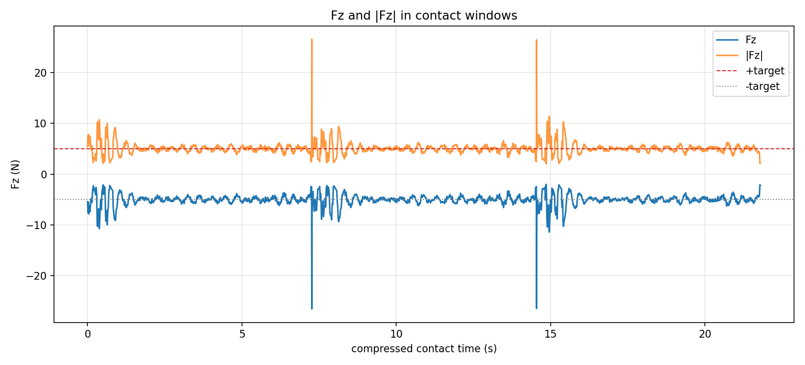
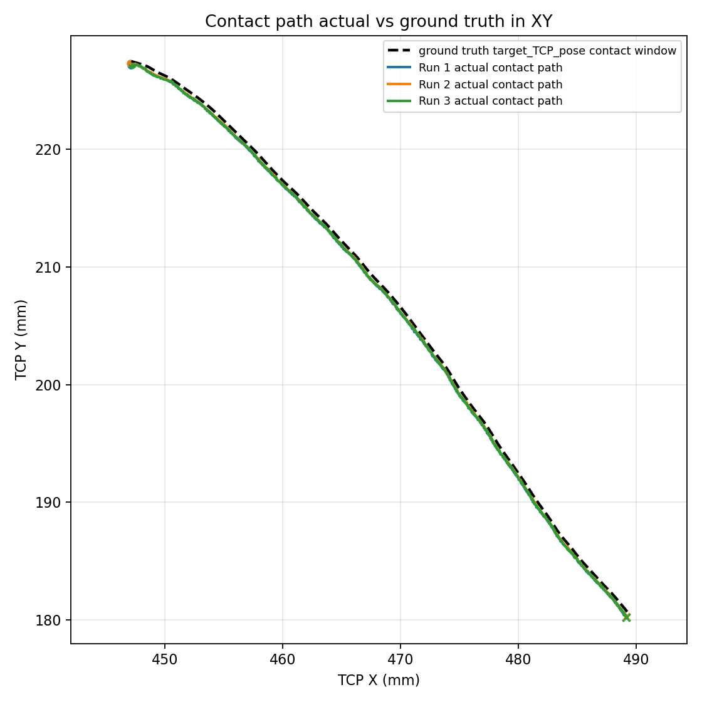
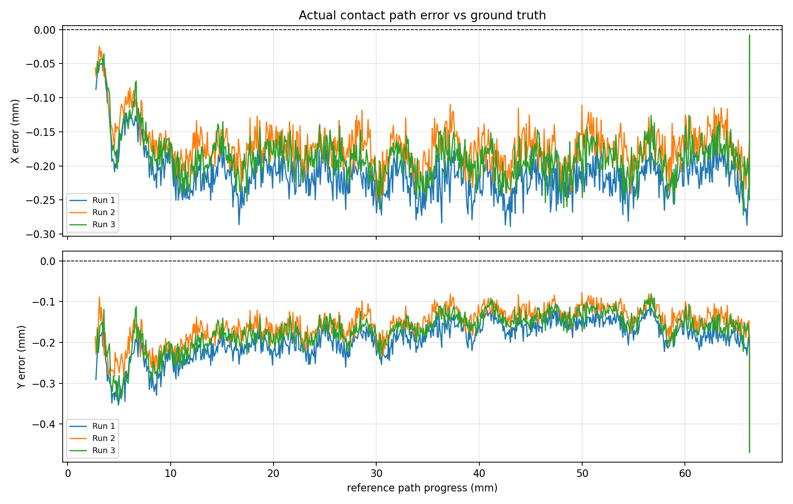
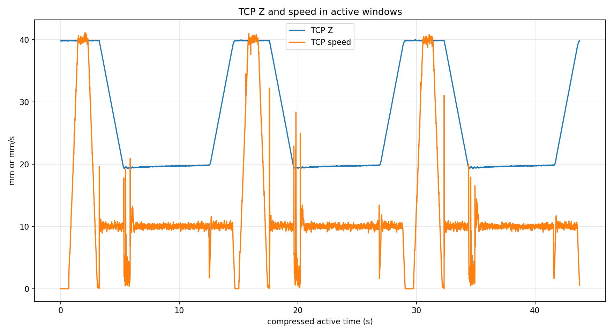

# UR10e / OnRobot demo-1.2 最终成功运行记录

## 实验目的

记录当前 `path_straight_line.urp` 成功运行时的力控参数、OnRobot 力数据和接触路径跟踪误差。本文回答两个问题：

- `F/T Control` 在当前 PID 参数下是否维持了接触力；
- 接触路径内 actual TCP 是否跟上 ground truth path，并分别给出 X/Y 误差。

## 设备与实验条件

| 字段 | 数值 |
| --- | --- |
| 程序 | `path_straight_line.urp` |
| 数据 CSV | [../ft_sensor/onrobot/hex_e_v2_3010007655/measurements/demo_1_2_final_success_20260528_022654/demo_1_2_final_success_onrobot_vars_20260528_022724.csv](../ft_sensor/onrobot/hex_e_v2_3010007655/measurements/demo_1_2_final_success_20260528_022654/demo_1_2_final_success_onrobot_vars_20260528_022724.csv) |
| 控制器脚本快照 | [../ft_sensor/onrobot/hex_e_v2_3010007655/measurements/demo_1_2_final_success_20260528_022654/controller_snapshot/path_straight_line.script](../ft_sensor/onrobot/hex_e_v2_3010007655/measurements/demo_1_2_final_success_20260528_022654/controller_snapshot/path_straight_line.script) |
| 采样频率 | 请求 125 Hz，实际 125.000 Hz |
| 样本数 | 15001 |
| 采样时长 | 120.000 s |
| Payload | 0.44 kg |
| TCP offset | `[0, 0, 0.12254, 0, 0, 0]` m/rad |

## 600 s 三路静态同步验证

本节使用新采集的 600 s 三路同步数据，不沿用旧 placeholder 图。三条数据流分别是：

- UR `actual_TCP_force`：299,994 rows，499.993 Hz；
- OnRobot URCap registers：74,996 tuple updates，124.993 Hz；
- OnRobot UDP raw，`SPEED=2`：299,756 packets，499.600 Hz。

采集完成且 `errors=[]`。UDP sequence delta 全部为 `+1`，UDP sample counter delta 全部为 `+2`。Dashboard 采集前后均为 `PLAYING 3.urp`、Safetymode `NORMAL`、Robotmode `RUNNING`。采集边界是只发送 OnRobot UDP `SPEED=2`、`START`、最终 `STOP`；没有 OnRobot `BIAS/FILTER`，没有 UR `zero_ftsensor()`，没有 URScript motion，也没有 TCP/payload write。

本节所有对比只做软件 zero：每条通道、每个轴各自减去自己的首个 logged sample，不做硬件 zero。URCap 125 Hz 与 UDP raw 500 Hz 的对比使用时间戳对齐，不按行号直接比较。六轴归一化 RMS 搜索得到最佳 lag 为 `-4.75 ms`，定义为 `URCap(t) - UDP(t + lag)`；在这个 lag 下，URCap 相邻 update 对应的 nearest UDP index delta 主要为 4 packets（74,057 次），说明动态形状接近 4x downsampling/hold。

但是，首值归零后的严格同值比较仍保留固定残差，尤其 Fz mean error 为 `-0.220 N`。因此本次结论按严格 first-zeroed 曲线写为：

> 首值归零后仍存在残差，URCap 不是简单的 UDP 每 4 帧抽样；可能存在滤波、补偿、时间对齐误差或不同 reference 处理。

更具体地说，lag 修正后 residual 的波动很小，说明动态形状相近；问题主要不是随机噪声，而是 independent first-sample zero reference 下的固定 offset。该固定 offset 大于力值量化误差和剩余时间对齐误差范围，因此不能把 URCap register 说成 UDP 每 4 帧的严格同值抽样。

| Axis | Unit | Mean error | Std | RMS | Max abs |
| --- | --- | ---: | ---: | ---: | ---: |
| Fx | N | -0.019982 | 0.003504 | 0.020287 | 0.100000 |
| Fy | N | 0.010022 | 0.002340 | 0.010291 | 0.060000 |
| Fz | N | -0.219995 | 0.011601 | 0.220300 | 0.510000 |
| Tx | Nm | 0.001990 | 0.000335 | 0.002018 | 0.011990 |
| Ty | Nm | 0.004998 | 0.000333 | 0.005009 | 0.014000 |
| Tz | Nm | -0.003996 | 0.000185 | 0.004001 | 0.010000 |

## 当前程序参数

| 参数 | 数值 | 证据 |
| --- | --- | --- |
| `F/T Search` 坐标系 | `frameID=1`，Tool | `path_straight_line.script` |
| Search 速度 | 0.010 m/s | `of_move_init` |
| Search waypoint | Tool Z = 50.0 mm | `of_waypoint(relativeP=...)` |
| Search 接触阈值 | `F3D=2.0 N` | `of_limit_start` |
| `F/T Control` 目标 | `Fz=5.0 N`，只开 Z compliant | `of_ft_control_start` |
| Force PID | `[0.5, 0.1, 0.1]` | `of_ft_control_start` |
| Torque PID | `[0.1, 0.0, 0.0]` | `of_ft_control_start` |
| `F/T Move` 速度 | 0.010 m/s | `of_move_init(frameID=0)` |
| `F/T Path` | `pathID=3964`, `relative=False` | `of_path_play` |
| Ground truth path | `target_TCP_pose`，contact-window progress 2.689-66.265 mm | `demo_1_2_rtde_20260528_012054.csv` |
| retract | Tool Z = -20.0 mm | `retract_after_ft_path_tool_minus_z.script` |

## 数据与图片

原始 CSV 保留完整 120 s 采样，但报告图和统计不使用从头到尾的全量窗口。截断规则如下：

- 运行窗口：`runtime_state=2`；
- 路径窗口：每个 run 内最长的连续接触移动段，规则是 `runtime_state=2`、`|Fz| >= 2 N`、TCP 线速度不低于 1 mm/s；
- 接触力窗口：`runtime_state=2` 且 `|Fz| >= 2 N`；
- 排除窗口：采样开始/结束空闲、程序间等待、无接触 approach/retract、停止态保留寄存器值。

图 1 只显示 active run 窗口内的 OnRobot `Fx/Fy/Fz`。图 2 只显示接触窗口内的 `Fz` 和 `|Fz|`。图 3 是接触路径窗口内 actual TCP 与 ground truth path 的 XY 对比。图 4 分别给出 X/Y tracking error。图 5 是 active run 窗口内的 TCP Z 和 TCP 速度。

## 统计结果

### 运行窗口

本次 120 s 采样内检测到 3 个 `runtime_state=2` 运行窗口。下表把三次运行按相同口径列出。

| Segment | Start (s) | End (s) | Active duration (s) | Active samples | Moving samples |
| --- | ---: | ---: | ---: | ---: | ---: |
| Run 1 | 29.984 | 44.680 | 14.696 | 1838 | 1718 |
| Run 2 | 54.272 | 68.616 | 14.344 | 1794 | 1711 |
| Run 3 | 85.024 | 99.736 | 14.712 | 1840 | 1720 |

周会展示稿内部取 `Run 2` 作为代表段：它的接触路径 2D P95 误差最低，接触窗口内 Fz 相对目标线的 MAE 为 0.612 N。这个 run 选择只保留在技术记录里，不写进 meeting-facing Markdown。

### 接触力统计

主统计只使用接触力窗口：`runtime_state=2` 且 `|Fz| >= 2 N`。这张表不包含采样开始/结束空闲、程序间等待、无接触 approach/search/retract，也不使用完整 120 s capture。

| Segment | Contact samples | Contact duration (s) | Fz Mean (N) | Fz Std (N) | Fz P50 (N) | Fz P99 (N) | `|Fz|-5` Mean (N) | `|Fz|-5` P99 (N) | ≤1 N (%) | ≤2 N (%) |
| --- | ---: | ---: | ---: | ---: | ---: | ---: | ---: | ---: | ---: | ---: |
| Run 1 | 883 | 7.256 | -5.103 | 0.994 | -5.024 | -2.735 | 0.622 | 4.160 | 85.4 | 94.2 |
| Run 2 | 894 | 11.920 | -5.080 | 1.143 | -5.016 | -2.566 | 0.612 | 3.589 | 85.9 | 94.4 |
| Run 3 | 880 | 11.896 | -5.142 | 1.245 | -5.005 | -2.825 | 0.635 | 4.811 | 83.9 | 94.1 |

| 总体接触窗口指标 | 数值 |
| --- | ---: |
| 样本数 | 2657 |
| 累计接触时长 | 31.072 s |
| Fz mean | -5.108 N |
| Fz std | 1.132 N |
| `|Fz|-5` 平均误差 | 0.623 N |
| `|Fz|-5` P99 误差 | 4.123 N |
| `|Fz|-5` 绝对误差 ≤ 1 N 比例 | 85.1 % |
| `|Fz|-5` 绝对误差 ≤ 2 N 比例 | 94.2 % |

### 运动窗口力统计（context）

下面只作为 context：窗口采用所有 `runtime_state=2` 且 TCP 线速度超过 1 mm/s 的样本，会混入 approach、search、path、retract 的无接触阶段，不用于判断 5 N 接触保持质量。

| 量 | Mean | Std | Min | P1 | P50 | P99 | Max |
| --- | ---: | ---: | ---: | ---: | ---: | ---: | ---: |
| Fx (N) | -0.153 | 0.166 | -0.887 | -0.487 | -0.083 | 0.101 | 0.261 |
| Fy (N) | -0.090 | 0.104 | -0.421 | -0.311 | -0.056 | 0.096 | 0.306 |
| Fz (N) | -2.629 | 2.612 | -11.405 | -8.281 | -3.155 | 0.349 | 0.636 |
| Fxy (N) | 0.202 | 0.171 | 0.002 | 0.008 | 0.114 | 0.551 | 0.891 |
| F3D (N) | 2.706 | 2.546 | 0.006 | 0.030 | 3.156 | 8.290 | 11.409 |

| 指标 | 数值 |
| --- | ---: |
| `|Fz|` 相对目标幅值误差均值 | 2.660 N |
| `|Fz|` 相对目标幅值误差 P99 | 4.995 N |
| `|Fz|-target` 绝对误差 ≤ 1 N 比例 | 43.6 % |
| `|Fz|-target` 绝对误差 ≤ 2 N 比例 | 48.2 % |

| Segment | Fz Mean (N) | Fz Std (N) | Fz Min (N) | Fz P50 (N) | Fz Max (N) | `|Fz|-5` Mean (N) | `|Fz|-5` P99 (N) | ≤1 N (%) | ≤2 N (%) |
| --- | ---: | ---: | ---: | ---: | ---: | ---: | ---: | ---: | ---: |
| Run 1 | -2.626 | 2.619 | -10.724 | -3.159 | 0.636 | 2.682 | 4.996 | 43.7 | 48.1 |
| Run 2 | -2.645 | 2.565 | -9.356 | -3.326 | 0.589 | 2.615 | 4.989 | 44.4 | 48.7 |
| Run 3 | -2.616 | 2.652 | -11.405 | -3.070 | 0.457 | 2.683 | 4.995 | 42.8 | 48.0 |

### 接触路径对比

Ground truth path 来自早先同一 `path_straight_line.urp` 的只读 RTDE 记录，字段为 `target_TCP_pose`。本节只比较当前 final success 中有接触且实际移动的路径段，不使用一开始的 approach/search path，也不使用无接触段。

| Ground truth 指标 | 数值 |
| --- | ---: |
| 来源 CSV | `demo_1_2_rtde_20260528_012054.csv` |
| 选择规则 | `target_TCP_pose` forward moving segment |
| 时间窗口 | 8.963 到 15.603 s |
| 样本数 | 831 |
| 完整 XY 长度 | 66.265 mm |
| 本次对比 progress | 2.689 到 66.265 mm |
| 本次对比 XY 长度 | 63.576 mm |
| X 范围 | 444.781 到 489.249 mm |
| Y 范围 | 180.685 到 228.664 mm |

| Segment | Samples | 当前接触路径时间 (s) | Actual XY length (mm) | Reference progress (mm) | X MAE (mm) | X RMS (mm) | X P95 abs (mm) | Y MAE (mm) | Y RMS (mm) | Y P95 abs (mm) | 2D P95 (mm) |
| --- | ---: | --- | ---: | --- | ---: | ---: | ---: | ---: | ---: | ---: | ---: |
| Run 1 | 806 | 36.120 到 42.560 | 69.516 | 2.743 到 66.265 | 0.210 | 0.213 | 0.259 | 0.196 | 0.202 | 0.290 | 0.358 |
| Run 2 | 809 | 60.040 到 66.504 | 69.925 | 2.689 到 66.265 | 0.168 | 0.172 | 0.216 | 0.159 | 0.166 | 0.239 | 0.304 |
| Run 3 | 804 | 91.176 到 97.600 | 68.896 | 2.825 到 66.265 | 0.184 | 0.188 | 0.233 | 0.173 | 0.181 | 0.271 | 0.332 |

| Overall tracking error | 数值 |
| --- | ---: |
| 样本数 | 2419 |
| X MAE | 0.188 mm |
| X RMS | 0.192 mm |
| X P95 abs | 0.244 mm |
| Y MAE | 0.176 mm |
| Y RMS | 0.184 mm |
| Y P95 abs | 0.270 mm |
| 2D P95 | 0.343 mm |

## 结论

当前报告可以直接证明三次运行里实际 TCP 都发生了接触路径运动，并给出接触路径相对 ground truth path 的 X/Y tracking error。按 `|Fz| >= 2 N` 的接触窗口看，三次运行的 Fz 均值接近 -5 N，`|Fz|-5` 平均误差约 0.6 N，大部分接触样本在 1 N 误差内。按接触路径窗口看，整体 X MAE 为 0.188 mm，整体 Y MAE 为 0.176 mm，2D P95 误差为 0.343 mm。

三次接触路径的 actual XY 长度分别见上表，图 3 直接叠加了 ground truth path 与三次 actual contact path；图 4 分别显示 X error 和 Y error。这次记录可以作为当前 PID `[0.5, 0.1, 0.1]` 下的成功 baseline。

600 s 三路静态同步采集进一步验证了当前 logging 路径的时序质量：UDP packet sequence 没有丢号，URCap register update 约为 UDP raw 的 1/4 频率。时间戳对齐后，URCap 和 UDP 的 first-zeroed 动态形状接近 4x downsampling/hold，但独立首值归零后仍存在固定残差，尤其 Fz 约 `-0.220 N`。所以本报告不把 URCap register 解释为 UDP raw 每 4 帧的严格同值抽样。

## 下一步

下一次如果继续调 PID，保留相同 ground truth path 和同样的接触路径窗口规则；报告直接比较 X/Y error 分布和接触力误差。

## 附录

### 采集边界

demo-1.2 final run 的 Ubuntu 侧只读 RTDE：没有发送 URScript、没有写寄存器、没有发运动、没有 zero/bias/filter/speed/TCP/payload 写入。

600 s 三路静态同步采集中只发送了 OnRobot UDP `SPEED=2`、`START`、最终 `STOP`；没有 OnRobot `BIAS/FILTER`，没有 UR `zero_ftsensor()`，没有 URScript motion，也没有 TCP/payload write。本文所说 zero 均为离线软件首值归零。

### 关键文件

- 原始 CSV：[demo_1_2_final_success_onrobot_vars_20260528_022724.csv](../ft_sensor/onrobot/hex_e_v2_3010007655/measurements/demo_1_2_final_success_20260528_022654/demo_1_2_final_success_onrobot_vars_20260528_022724.csv)
- 分析摘要：[analysis_summary.json](../ft_sensor/onrobot/hex_e_v2_3010007655/measurements/demo_1_2_final_success_20260528_022654/analysis/analysis_summary.json)
- 控制器脚本快照：[path_straight_line.script](../ft_sensor/onrobot/hex_e_v2_3010007655/measurements/demo_1_2_final_success_20260528_022654/controller_snapshot/path_straight_line.script)
- 程序树：[path_straight_line.txt](../ft_sensor/onrobot/hex_e_v2_3010007655/measurements/demo_1_2_final_success_20260528_022654/controller_snapshot/path_straight_line.txt)
- 600 s 三路 summary：[three_stream_600s_20260528_043052_summary.json](../experiments/20260528_onrobot_three_stream_600s_first_zero/run_20260528_043100/three_stream_600s_20260528_043052_summary.json)
- URCap/UDP 对齐统计：[three_stream_600s_20260528_043052_urcap_udp_alignment_stats.json](../experiments/20260528_onrobot_three_stream_600s_first_zero/run_20260528_043100/three_stream_600s_20260528_043052_urcap_udp_alignment_stats.json)
