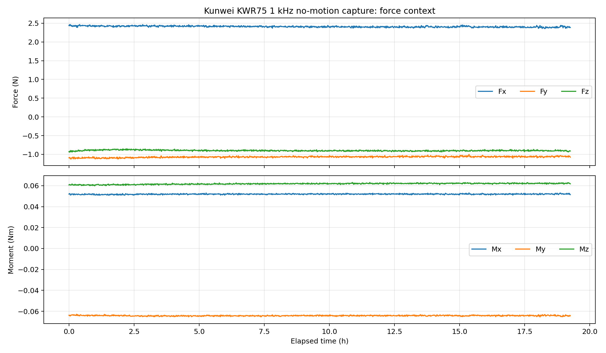
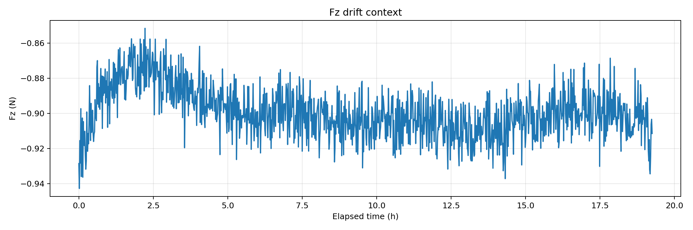
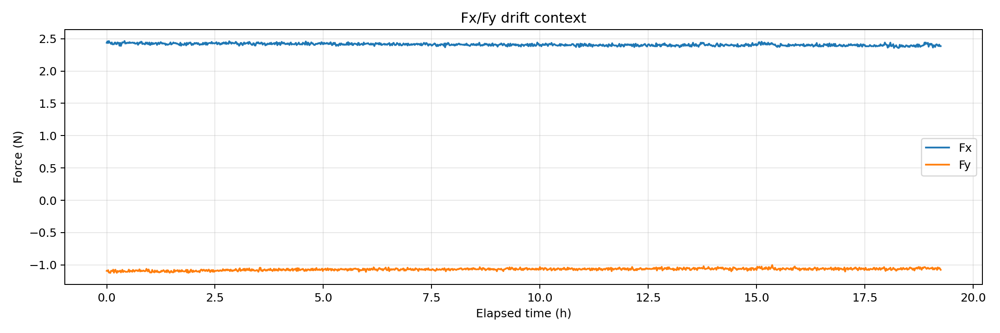
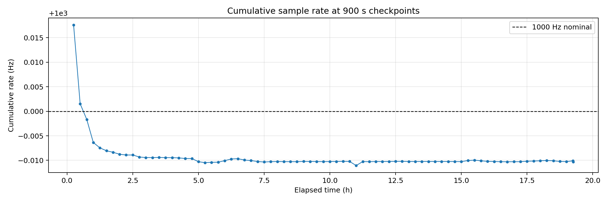

# Kunwei KWR75 1 kHz 无运动长时采集报告（19 h 15 min）

## 实验目的

这次实验用于判断 Kunwei KWR75/KWR75B 通过 Ethernet-TCP 路径做 `1 kHz` 长时间无运动采集时，数据链路是否稳定、是否出现帧解析错误，以及静态六维力/力矩读数在十几个小时尺度上的漂移量级。原计划是 24 h，用户在采集约 `19 h 15 min` 时主动要求停止；因此本报告只把它作为 `19 h 15 min` partial run，不作为完整 24 h run。

结论先给出：本次采集共得到 `69,325,059` 个有效 `0x48` streaming frame，first-to-last 时长 `69325.772877 s`（19 h 15 min 25.8 s），平均采样率 `999.989688 Hz`。最终 summary 记录 `parse_errors = 0`、`dropped_sync_bytes = 0`，说明这条 TCP 数据路径在本次时长内没有出现帧级解析失败或同步字节丢失。

## 设备与实验条件

| 项目 | 本次设置 |
|---|---|
| 传感器 | Kunwei KWR75/KWR75B 六轴力/力矩传感器 |
| 实验状态 | 无机器人运动、无接触操作；只测试传感器通信与静态读数 |
| 通信路径 | Ubuntu TCP client -> `192.168.50.25:5152` |
| 主机侧地址 | `192.168.50.26` |
| 采集命令 | 发送 `48 AA 0D 0A` 请求 1 kHz converted result stream |
| 停止方式 | 用户要求约 19 h 15 min 停止；Codex 向 tmux 采集进程发送 `C-c` |
| logger stop reason | `signal_2` |
| 开始时间 | `2026-06-02T19:57:27+08:00` |
| 结束时间 | `2026-06-03T15:12:53+08:00` |
| checkpoint 间隔 | `900 s` |
| 手册原始单位 | force: `Kg`；moment: `Kg*m` |
| 报告主单位 | CSV 派生列 `N` 与 `Nm`；原始 `Kg`/`Kg*m` 字段保留在 CSV 中 |
| latency=1 说明 | 手册 page 14 的 `latency_timer=1` 适用于 USB-serial `/sys/bus/usb-serial/.../latency_timer`；本次为 Ethernet TCP 路径，当前无 `/dev/ttyUSB*`，所以没有适用的 latency timer 可设置 |
| 配置写入 | 没有发送 `EE AA` IP/端口配置写命令 |

## 实验命令

主采集命令由 `capture_kunwei_kwr75_1khz.py` 执行，关键参数是 `--transport tcp-client --sensor-ip 192.168.50.25 --sensor-port 5152 --duration-s 86400 --checkpoint-interval-s 900`。最终用户提前停止后，脚本写出了 summary，并在清理阶段结束 streaming。

## 数据与图片

原始数据保留在 run 目录，报告图表和重建 checkpoint 统计放在 report-local assets 目录。

| artifact | 路径 |
|---|---|
| final summary | [../ft_sensor/kunwei/kwr75b/measurements/19h15min/capture/summary.json](../ft_sensor/kunwei/kwr75b/measurements/19h15min/capture/summary.json) |
| raw CSV | [../ft_sensor/kunwei/kwr75b/measurements/19h15min/capture/data.csv](../ft_sensor/kunwei/kwr75b/measurements/19h15min/capture/data.csv) |
| raw frames | [../ft_sensor/kunwei/kwr75b/measurements/19h15min/capture/raw_frames.bin](../ft_sensor/kunwei/kwr75b/measurements/19h15min/capture/raw_frames.bin) |
| analysis summary | [assets/kunwei-19h15-1khz-drift/analysis-summary.json](assets/kunwei-19h15-1khz-drift/analysis-summary.json) |
| 900 s checkpoint CSV | [assets/kunwei-19h15-1khz-drift/checkpoint-summary-900s.csv](assets/kunwei-19h15-1khz-drift/checkpoint-summary-900s.csv) |
| downsampled plot points | [assets/kunwei-19h15-1khz-drift/downsampled-plot-points.csv](assets/kunwei-19h15-1khz-drift/downsampled-plot-points.csv) |

### 全局上下文

图 1 显示全程下采样后的六维力/力矩读数。读数整体处在小偏置附近，主轴力的均值约为 `Fx = 2.410 N`、`Fy = -1.070 N`、`Fz = -0.899 N`。本图用于看全程趋势，不用于判断逐样本 jitter；TCP receive batching 会让 host timestamp 间隔出现极小和较大的瞬时值。



### Fz 漂移

图 2 单独展开 Fz。Fz 从首样本 `-0.928559 N` 到末样本 `-0.882841 N`，首末差 `+0.045719 N`；全程均值 `-0.899023 N`，标准差 `0.014582 N`。这说明本次无运动状态下 Fz 长时偏置变化很小，但它不是已知零载标定后的绝对零漂结论，因为本次没有执行 Kunwei tare/zero，也没有机械加载基准。



### Fx/Fy 漂移

图 3 显示 Fx/Fy。Fx 首末差 `-0.063257 N`，Fy 首末差 `+0.050381 N`。三轴力的长时首末变化都在约 `0.05-0.06 N` 量级；报告中保留首末差而不把它解释成纯传感器温漂，因为台架环境、安装姿态、静态预载和未归零偏置都可能参与这个数值。



### 采样率 checkpoint

图 4 是每 900 s checkpoint 的累计采样率。累计采样率稳定在 `999.99 Hz` 附近；最后一个窗口只有约 `25.8 s`，因为用户在 19 h 15 min 附近提前停止。



## 统计结果

### 分析窗口

| 窗口 | 选择规则 | 起点 | 终点 | 样本数 | 说明 |
|---|---|---:|---:|---:|---|
| analysis_window | 从第一条有效 `0x48` frame 到用户停止前最后一条有效 frame | `0.000 s` | `69325.772877 s` | `69,325,059` | 本次是无运动、无接触、传感器-only 采集；CSV 已从第一条有效 frame 开始，没有额外 approach/contact/retract phase 可剔除 |

### 总体通信质量

| 指标 | 数值 |
|---|---:|
| 样本数 | `69,325,059` |
| first-to-last duration | `69325.772877 s` |
| logger wall elapsed | `69325.791819 s` |
| 平均采样率 | `999.989688 Hz` |
| mean dt by host timestamp | `1.000010 ms` |
| min dt by host timestamp | `0.006061 ms` |
| max dt by host timestamp | `63.374629 ms` |
| packets received | `4,042,862` |
| bytes received | `1,941,101,672` |
| command count `0x48` | `69,325,059` |
| parse errors | `0` |
| dropped sync bytes | `0` |
| CSV size | `18,406,271,618 bytes` |
| raw frame size | `1,941,101,652 bytes` |

`min/max dt` 是 host-side timestamp 间隔，不等同于传感器内部采样周期。TCP 接收批量化会造成非常小的相邻 timestamp 和几十毫秒的较大间隔；本次更关键的链路指标是总样本数、累计采样率、`parse_errors=0` 与 `dropped_sync_bytes=0`。

### 六维读数统计

| 轴 | 单位 | first | last | last-first | mean | std | min | max |
|---|---|---:|---:|---:|---:|---:|---:|---:|
| Fx | N | 2.437944 | 2.374687 | -0.063257 | 2.409634 | 0.017686 | 2.262849 | 2.593968 |
| Fy | N | -1.092277 | -1.041895 | 0.050381 | -1.069552 | 0.017465 | -1.295566 | -0.908167 |
| Fz | N | -0.928559 | -0.882841 | 0.045719 | -0.899023 | 0.014582 | -1.603598 | -0.497041 |
| Mx | Nm | 0.052039 | 0.052428 | 0.000389 | 0.051958 | 0.000370 | 0.044225 | 0.058226 |
| My | Nm | -0.063840 | -0.063633 | 0.000207 | -0.064230 | 0.000387 | -0.070315 | -0.057355 |
| Mz | Nm | 0.060790 | 0.062054 | 0.001264 | 0.061831 | 0.000559 | 0.059143 | 0.064644 |

### 900 s checkpoint 表

每一行是从 CSV 重新按 `900 s` 窗口重建的 checkpoint。`rate_hz_cumulative` 用累计样本数除以该 checkpoint 末端 elapsed time；最后一行是用户提前停止后的短窗口。

| # | elapsed h | cumulative samples | cumulative Hz | window samples | window Hz | Fz mean N | Fz std N |
|---:|---:|---:|---:|---:|---:|---:|---:|
| 1 | 0.250 | 899987 | 1000.01761 | 899987 | 1000.018 | -0.921148 | 0.011884 |
| 2 | 0.500 | 1799980 | 1000.00152 | 899993 | 1000.039 | -0.905614 | 0.011002 |
| 3 | 0.750 | 2699972 | 999.99835 | 899992 | 1000.046 | -0.895815 | 0.010628 |
| 4 | 1.000 | 3599965 | 999.99364 | 899993 | 1000.034 | -0.889186 | 0.010542 |
| 5 | 1.250 | 4499958 | 999.99255 | 899993 | 1000.043 | -0.884872 | 0.010502 |
| 6 | 1.500 | 5399952 | 999.99195 | 899994 | 1000.044 | -0.879416 | 0.010565 |
| 7 | 1.750 | 6299946 | 999.99164 | 899994 | 1000.045 | -0.874747 | 0.010516 |
| 8 | 2.000 | 7199888 | 999.99124 | 899942 | 1000.043 | -0.873809 | 0.010456 |
| 9 | 2.250 | 8099882 | 999.99109 | 899994 | 1000.045 | -0.873498 | 0.010479 |
| 10 | 2.500 | 8999875 | 999.99109 | 899993 | 1000.045 | -0.874333 | 0.010558 |
| 11 | 2.750 | 9899869 | 999.99068 | 899994 | 1000.042 | -0.877249 | 0.010448 |
| 12 | 3.000 | 10799862 | 999.99057 | 899993 | 1000.043 | -0.878943 | 0.010373 |
| 13 | 3.250 | 11699855 | 999.99056 | 899993 | 1000.045 | -0.880194 | 0.010384 |
| 14 | 3.500 | 12599849 | 999.99059 | 899994 | 1000.045 | -0.883373 | 0.010441 |
| 15 | 3.750 | 13499842 | 999.99055 | 899993 | 1000.044 | -0.885696 | 0.010391 |
| 16 | 4.000 | 14399836 | 999.99055 | 899994 | 1000.044 | -0.888338 | 0.010419 |
| 17 | 4.250 | 15299829 | 999.99050 | 899993 | 1000.043 | -0.889901 | 0.010396 |
| 18 | 4.500 | 16199821 | 999.99037 | 899992 | 1000.042 | -0.891237 | 0.010422 |
| 19 | 4.750 | 17099814 | 999.99037 | 899993 | 1000.045 | -0.893175 | 0.010444 |
| 20 | 5.000 | 17999808 | 999.98972 | 899994 | 1000.032 | -0.895775 | 0.010424 |
| 21 | 5.250 | 18899802 | 999.98953 | 899994 | 1000.040 | -0.897119 | 0.010416 |
| 22 | 5.500 | 19799794 | 999.98960 | 899992 | 1000.045 | -0.899708 | 0.010440 |
| 23 | 5.750 | 20699738 | 999.98962 | 899944 | 1000.045 | -0.899987 | 0.010422 |
| 24 | 6.000 | 21599781 | 999.98994 | 900043 | 1000.051 | -0.898998 | 0.010447 |
| 25 | 6.250 | 22499775 | 999.99028 | 899994 | 1000.053 | -0.899241 | 0.010417 |
| 26 | 6.500 | 23399767 | 999.99034 | 899992 | 1000.046 | -0.898705 | 0.010432 |
| 27 | 6.750 | 24299712 | 999.99006 | 899945 | 1000.038 | -0.898381 | 0.010412 |
| 28 | 7.000 | 25199704 | 999.98995 | 899992 | 1000.041 | -0.898259 | 0.010434 |
| 29 | 7.250 | 26099698 | 999.98976 | 899994 | 1000.039 | -0.898512 | 0.010433 |
| 30 | 7.500 | 26999691 | 999.98966 | 899993 | 1000.040 | -0.899054 | 0.010438 |
| 31 | 7.750 | 27899684 | 999.98972 | 899993 | 1000.046 | -0.899889 | 0.010414 |
| 32 | 8.000 | 28799677 | 999.98976 | 899993 | 1000.045 | -0.900930 | 0.010441 |
| 33 | 8.250 | 29699670 | 999.98974 | 899993 | 1000.044 | -0.902699 | 0.010466 |
| 34 | 8.500 | 30599664 | 999.98973 | 899994 | 1000.044 | -0.905501 | 0.010427 |
| 35 | 8.750 | 31499657 | 999.98973 | 899993 | 1000.044 | -0.904810 | 0.010450 |
| 36 | 9.000 | 32399651 | 999.98977 | 899994 | 1000.046 | -0.906169 | 0.010484 |
| 37 | 9.250 | 33299644 | 999.98977 | 899993 | 1000.044 | -0.906576 | 0.010435 |
| 38 | 9.500 | 34199637 | 999.98975 | 899993 | 1000.043 | -0.905078 | 0.010455 |
| 39 | 9.750 | 35099630 | 999.98974 | 899993 | 1000.044 | -0.906472 | 0.010453 |
| 40 | 10.000 | 35999624 | 999.98975 | 899994 | 1000.045 | -0.905737 | 0.010454 |
| 41 | 10.250 | 36899616 | 999.98977 | 899992 | 1000.044 | -0.904392 | 0.010453 |
| 42 | 10.500 | 37799611 | 999.98979 | 899995 | 1000.046 | -0.905138 | 0.010444 |
| 43 | 10.750 | 38699603 | 999.98977 | 899992 | 1000.043 | -0.905063 | 0.010457 |
| 44 | 11.000 | 39599562 | 999.98894 | 899959 | 1000.007 | -0.904934 | 0.010464 |
| 45 | 11.250 | 40499540 | 999.98975 | 899978 | 1000.025 | -0.905397 | 0.010459 |
| 46 | 11.500 | 41399532 | 999.98972 | 899992 | 1000.042 | -0.905649 | 0.010470 |
| 47 | 11.750 | 42299527 | 999.98976 | 899995 | 1000.046 | -0.906267 | 0.010478 |
| 48 | 12.000 | 43199519 | 999.98975 | 899992 | 1000.043 | -0.907188 | 0.010470 |
| 49 | 12.250 | 44099513 | 999.98977 | 899994 | 1000.045 | -0.908397 | 0.010476 |
| 50 | 12.500 | 44999506 | 999.98978 | 899993 | 1000.045 | -0.908901 | 0.010508 |
| 51 | 12.750 | 45899500 | 999.98979 | 899994 | 1000.045 | -0.909359 | 0.010531 |
| 52 | 13.000 | 46799493 | 999.98976 | 899993 | 1000.042 | -0.910740 | 0.010546 |
| 53 | 13.250 | 47699486 | 999.98975 | 899993 | 1000.043 | -0.910586 | 0.010551 |
| 54 | 13.500 | 48599479 | 999.98976 | 899993 | 1000.044 | -0.909490 | 0.010564 |
| 55 | 13.750 | 49499472 | 999.98976 | 899993 | 1000.045 | -0.909858 | 0.010593 |
| 56 | 14.000 | 50399465 | 999.98976 | 899993 | 1000.044 | -0.911569 | 0.010826 |
| 57 | 14.250 | 51299460 | 999.98976 | 899995 | 1000.044 | -0.911984 | 0.010633 |
| 58 | 14.500 | 52199453 | 999.98975 | 899993 | 1000.043 | -0.907842 | 0.010694 |
| 59 | 14.750 | 53099446 | 999.98975 | 899993 | 1000.043 | -0.902239 | 0.010636 |
| 60 | 15.000 | 53999438 | 999.98974 | 899992 | 1000.043 | -0.902326 | 0.010614 |
| 61 | 15.250 | 54899432 | 999.98995 | 899994 | 1000.058 | -0.901316 | 0.011113 |
| 62 | 15.500 | 55799425 | 999.99005 | 899993 | 1000.050 | -0.906386 | 0.010569 |
| 63 | 15.750 | 56699419 | 999.98990 | 899994 | 1000.035 | -0.902087 | 0.010911 |
| 64 | 16.000 | 57599411 | 999.98980 | 899992 | 1000.038 | -0.899581 | 0.010593 |
| 65 | 16.250 | 58499355 | 999.98976 | 899944 | 1000.042 | -0.899202 | 0.010596 |
| 66 | 16.500 | 59399348 | 999.98972 | 899993 | 1000.041 | -0.896862 | 0.010632 |
| 67 | 16.750 | 60299342 | 999.98971 | 899994 | 1000.043 | -0.897380 | 0.010584 |
| 68 | 17.000 | 61199334 | 999.98972 | 899992 | 1000.045 | -0.896911 | 0.010604 |
| 69 | 17.250 | 62099329 | 999.98972 | 899995 | 1000.044 | -0.896418 | 0.010597 |
| 70 | 17.500 | 62999321 | 999.98983 | 899992 | 1000.050 | -0.898498 | 0.010595 |
| 71 | 17.750 | 63899314 | 999.98985 | 899993 | 1000.047 | -0.898695 | 0.010593 |
| 72 | 18.000 | 64799307 | 999.98991 | 899993 | 1000.048 | -0.897107 | 0.010622 |
| 73 | 18.250 | 65699302 | 999.98997 | 899995 | 1000.049 | -0.902080 | 0.011008 |
| 74 | 18.500 | 66599295 | 999.98991 | 899993 | 1000.039 | -0.904530 | 0.010602 |
| 75 | 18.750 | 67499288 | 999.98977 | 899993 | 1000.034 | -0.902626 | 0.010646 |
| 76 | 19.000 | 68399281 | 999.98974 | 899993 | 1000.041 | -0.903058 | 0.010675 |
| 77 | 19.250 | 69299273 | 999.98990 | 899992 | 1000.056 | -0.906235 | 0.011248 |
| 78 | 19.257 | 69325059 | 999.98970 | 25786 | 1001.366 | -0.910861 | 0.010625 |

## 结论

1. 本次 Ethernet-TCP 路径在 `19 h 15 min 25.8 s` 内稳定接收 `69,325,059` 条 `0x48` streaming frame，最终平均频率 `999.989688 Hz`，没有帧解析错误，也没有同步字节丢失。
2. 这次数据足以证明当前 Kunwei TCP 采集链路可以支撑十几个小时尺度的 `1 kHz` raw logging；它不能替代完整 24 h 报告，因为用户在约 `19 h 15 min` 主动停止。
3. 无运动状态下三轴力首末变化约 `0.046-0.063 N`，力矩首末变化最大约 `0.00126 Nm`。这些是本次台架状态下的观测漂移/偏置变化，不应直接解释成严格传感器本体零漂规格。
4. 手册 page 14 的 `latency=1` 本次没有可设置对象，因为实际采集路线不是 USB-serial，而是 Ethernet TCP；报告和 metadata 已明确记录这个限制。

## 下一步

- 如果要做 Kunwei vs OnRobot 的正式 A/B，下一轮应让两者在同一机械状态、同一无接触窗口下同步记录，并明确 OnRobot route 是 URCap register、UDP high-speed、还是 TCP DAQ，不能混成一个“传感器频率”。
- 如果要评估绝对零漂，下一轮需要先定义 Kunwei 的 zero/tare 策略、静态安装姿态和温度/通电预热条件；本次数据只能作为未归零静态偏置长时记录。
- 如果只关心通信链路，本次结果已经支持把 `tcp-client 192.168.50.25:5152` 作为当前 bench 的可用 1 kHz logging route。

## 附录

### 原始采集命令

```bash
/home/andy/ur10e_ros2_ws/ft_sensor/kunwei/kwr75b/tools/capture_kunwei_kwr75_1khz.py \
  --transport tcp-client \
  --sensor-ip 192.168.50.25 \
  --sensor-port 5152 \
  --duration-s 86400 \
  --checkpoint-interval-s 900 \
  --connect-timeout-s 5 \
  --output-dir /home/andy/ur10e_ros2_ws/ft_sensor/kunwei/kwr75b/measurements/19h15min/capture
```

### 用户主动停止命令

```bash
tmux send-keys -t kunwei_24h_20260602 C-c
```

### 图表生成说明

图表与 checkpoint 表由 chunked pandas 分析生成：顺序读取 CSV 的 `sample_index`、`t_monotonic_s`、`Fx_N`、`Fy_N`、`Fz_N`、`Mx_Nm`、`My_Nm`、`Mz_Nm` 列；按 `900 s` 重建分段统计；每 `60000` 行抽取一个点用于报告图。完整原始 CSV 和 raw frames 没有移动或重写。
