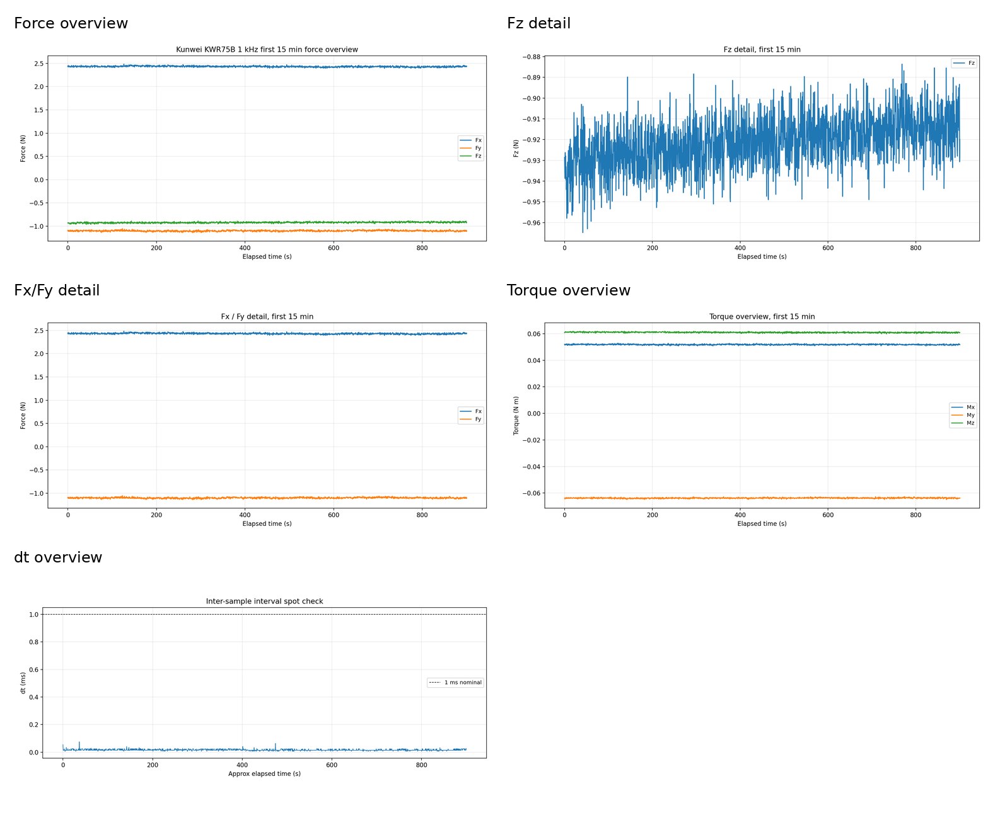
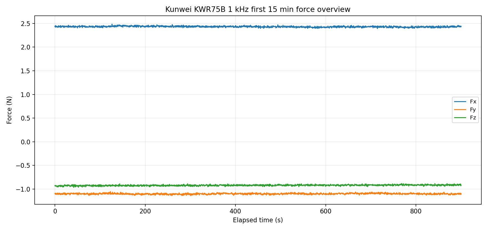
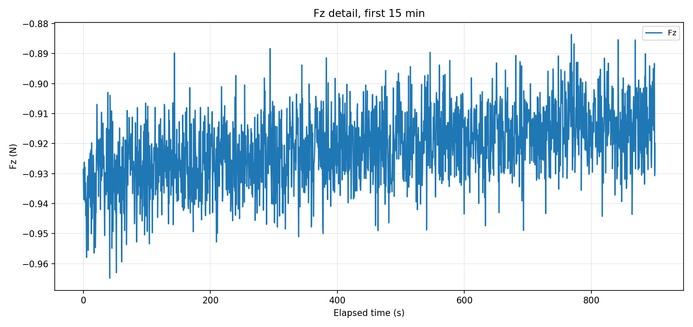
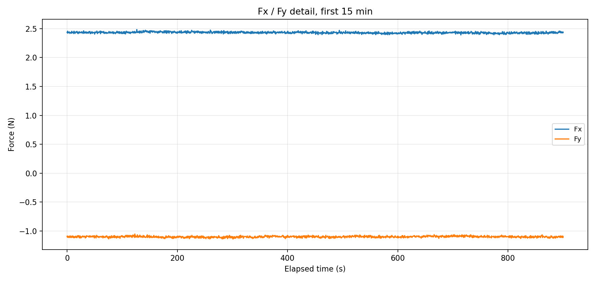
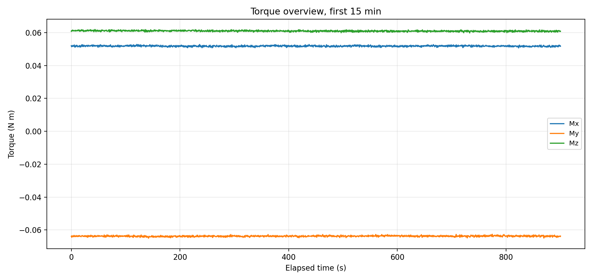
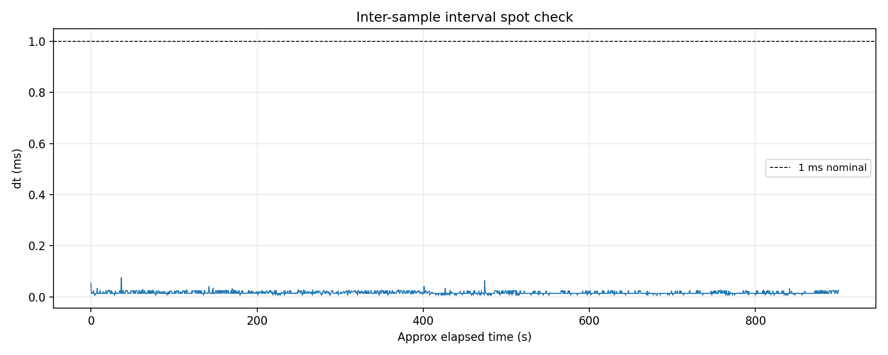

# Kunwei KWR75B 前 15 分钟 1 kHz 采集报告

## 实验目的

本报告只判断第一段 15 分钟 checkpoint 是否足以作为 24 小时采集的早期稳定性检查：采集链路是否持续输出、解析是否丢同步、实际采样频率是否接近 1 kHz，以及无接触静置条件下六轴读数是否有明显异常漂移。

这不是最终 24 小时漂移报告，也不用于判断标定精度或机器人接触控制性能。

## 设备与实验条件

| 项目 | 内容 |
|---|---|
| 传感器 | Kunwei KWR75B 六轴力/力矩传感器 |
| 通信方式 | TCP client 连接传感器侧以太网串口服务器 |
| 传感器地址 | `192.168.50.25:5152` |
| 目标采样率 | 1 kHz |
| 本报告窗口 | 第一个 900 s checkpoint，约 15 min |
| 样本数 | 900,022 |
| 接触状态 | 无接触静置采集 |
| 零点状态 | 未在本报告中执行新的零点校准；结果按当前原始偏置解释 |
| 单位换算 | CSV 同时保存 manual kg / kg m 与派生 SI 单位；力按 `kgf * 9.80665` 换算为 N |

## 实验命令

主采集进程仍在运行。本报告使用第一个 checkpoint 的统计量和 CSV 前 900,022 行生成图表。

采集命令来源：

`tools/capture_kunwei_kwr75_1khz.py --transport tcp-client --sensor-ip 192.168.50.25 --sensor-port 5152 --duration-s 86400 --checkpoint-interval-s 900 --connect-timeout-s 5`

## 数据与图片

原始数据位于：

| 文件 | 作用 |
|---|---|
| [CSV](../ft_sensor/kunwei/kwr75b/measurements/19h15min/capture/data.csv) | 六轴数据、时间戳、命令字、原始帧十六进制 |
| [checkpoint](../ft_sensor/kunwei/kwr75b/measurements/19h15min/capture/checkpoint.json) | 第一个 900 s checkpoint 的统计量 |
| [metadata](../ft_sensor/kunwei/kwr75b/measurements/19h15min/capture/metadata.json) | 采集配置与运行元数据 |
| [raw frames](../ft_sensor/kunwei/kwr75b/measurements/19h15min/capture/raw_frames.bin) | 原始二进制帧归档 |

图表总览先把本报告使用的五张时序图放在同一页，便于快速检查每个通道和采样间隔是否有明显异常。



图 1 给出三轴力的全窗口上下文。Fx/Fy/Fz 在 15 分钟内整体保持窄范围波动，Fz 只有少量短时尖峰；这类尖峰需要在后续 2 h / 4 h / 6 h / 24 h checkpoint 中继续观察。



图 2 单独展开 Fz。Fz 均值约为 -0.921 N，15 分钟首末差约为 0.0086 N；本窗口内没有看到持续单向漂移。



图 3 单独展开 Fx/Fy。Fx 首末差约为 -0.0032 N，Fy 首末差约为 -0.0177 N；横向力读数主要表现为低幅噪声与微小偏置变化。



图 4 给出三轴力矩。Mx/My/Mz 的 15 分钟首末差都低于 0.0004 N m，早期静置窗口没有明显力矩漂移。



图 5 是采样间隔抽查。平均采样间隔接近 1 ms，但 checkpoint 记录到一次最大间隔约 50.61 ms；这不影响本窗口的总体样本率判断，但应作为长时采集的时序风险项保留。



## 统计结果

### 采集链路

| 指标 | 数值 | 解释 |
|---|---:|---|
| 样本数 | 900,022 | 第一个 checkpoint 的有效帧数 |
| 首末时间跨度 | 900.0206 s | 按首末样本时间戳计算 |
| 实际频率 | 1000.0005 Hz | 按首末时间跨度计算 |
| 平均采样间隔 | 1.0000 ms | checkpoint 统计 |
| 最小采样间隔 | 0.0061 ms | checkpoint 统计 |
| 最大采样间隔 | 50.6096 ms | 需要继续观察的长间隔 |
| 解析错误 | 0 | 未发现解析失败 |
| 丢弃同步字节 | 0 | 未发现同步丢失 |
| 命令字 | `0x48`: 900,022 | 所有有效帧命令字一致 |

### 六轴统计

| 通道 | 均值 | 标准差 | 最小值 | 最大值 | 首末差 |
|---|---:|---:|---:|---:|---:|
| Fx (N) | 2.432290 | 0.013556 | 2.326884 | 2.529808 | -0.003199 |
| Fy (N) | -1.100876 | 0.012446 | -1.216054 | -1.026432 | -0.017685 |
| Fz (N) | -0.921148 | 0.011884 | -1.603594 | -0.496991 | 0.008606 |
| Mx (N m) | 0.051802 | 0.000332 | 0.046685 | 0.055497 | -0.000360 |
| My (N m) | -0.063751 | 0.000332 | -0.067513 | -0.060224 | 0.000151 |
| Mz (N m) | 0.060973 | 0.000335 | 0.059329 | 0.063010 | 0.000013 |

### 原始 manual 单位

| 通道 | 均值 | 标准差 | 最小值 | 最大值 | 首末差 |
|---|---:|---:|---:|---:|---:|
| Fx (kg) | 0.24802454 | 0.00138233 | 0.23725410 | 0.25790542 | -0.00032619 |
| Fy (kg) | -0.11225814 | 0.00126915 | -0.12400178 | -0.10466552 | -0.00180332 |
| Fz (kg) | -0.09393095 | 0.00121181 | -0.16352151 | -0.05068410 | 0.00087759 |
| Mx (kg m) | 0.00528229 | 0.00003389 | 0.00476085 | 0.00565978 | -0.00003669 |
| My (kg m) | -0.00650084 | 0.00003388 | -0.00688451 | -0.00614052 | 0.00001541 |
| Mz (kg m) | 0.00621749 | 0.00003418 | 0.00605145 | 0.00642453 | 0.00000128 |

## 结论

第一段 15 分钟 checkpoint 通过早期采集稳定性检查：样本数、实际频率、命令字一致性、解析错误数和同步状态都支持继续 24 小时长时采集。

本窗口内六轴读数没有表现出持续、明显的单向漂移。力通道的首末差低于 0.018 N，力矩通道的首末差低于 0.0004 N m。Fz 的短时尖峰和最大 50.61 ms 采样间隔是后续 checkpoint 必须保留的观察项。

这些结论只覆盖当前无接触静置窗口。由于本报告没有重新零点校准，也没有施加已知载荷，不能从这里推出绝对标定精度或接触测力精度。

## 下一步

继续等待 2 h / 4 h / 6 h / 24 h checkpoint。后续报告应使用同一张采集链路表和同一组六轴统计表，并补充每个 checkpoint 的全窗口、Fz、Fx/Fy 图，避免不同阶段使用不同口径。

如果 24 小时内再次出现大采样间隔，需要单独检查网络、串口服务器缓存、Python 读取循环和系统调度。

## 附录

完整采集命令：

```bash
python3 /home/andy/ur10e_ros2_ws/ft_sensor/kunwei/kwr75b/tools/capture_kunwei_kwr75_1khz.py \
  --transport tcp-client \
  --sensor-ip 192.168.50.25 \
  --sensor-port 5152 \
  --duration-s 86400 \
  --checkpoint-interval-s 900 \
  --connect-timeout-s 5 \
  --output-dir /home/andy/ur10e_ros2_ws/ft_sensor/kunwei/kwr75b/measurements/19h15min/capture
```

图表生成说明：本报告只读取 CSV 前 900,022 行，对应第一个 checkpoint，不包含后续仍在写入的样本。
