# Kunwei KWR75 当前进展报告（2026-06-08）

## 实验目的

这份报告把 Kunwei KWR75/KWR75B 当前证据单独整理出来，用于说明五件事：传感器与通信链路是否已经可用，长时间无运动 `1 kHz` 采集是否稳定，当前 Step2C 闭环直线实验走到什么程度，Step4D 圆轨迹接触实验是否完成，以及 Step4E paper-style 外环直线路线是否已经跑通。报告包含两层 OnRobot/Kunwei 对比：前 `600 s` 用于短窗口 noise/drift 判断，`6 h` 用于长时间漂移判断。当前版本只使用已有日志，不重做实验；两者都按各自窗口第一帧做 software zero，只作为 drift/noise 口径对照，不作为同机械状态下的绝对标定结论。

结论先给出：Kunwei TCP raw logging 已经支撑 `19 h 15 min`、约 `1 kHz`、无 parse error 的长跑；Step2C final 在 line 阶段保持 URScript stage25 echo cadence 约 `489.83 Hz`，路径跟踪 p95 约 `0.080 mm`，Fz error MAE 从 V4 的 `1.87 N` 降到 `1.39 N`。Step4D 已完成从 middle-half 直线路径生成的完整圆轨迹，arc progress 约 `99.875 mm`，closure error 约 `0.828 mm`，radial error p95 约 `0.111 mm`。Step4E v11 已用 Python 外环 command + UR `speedl` IK 跑完整条 `143.747 mm` 直线路径，XY path p95 约 `2.190 mm`；收尾问题是 clean-complete 阈值比 bridge progress clamp 高约 `0.0044 mm`，导致最终以 runtime timeout reason `10.0` 而不是 completion reason `1.0` 结束。它们都仍是 selected single-run evidence，不等于完整统计验证。

## 设备与实验条件

| 项目 | 当前口径 |
|---|---|
| 传感器 | Kunwei KWR75/KWR75B 六轴力/力矩传感器 |
| 当前主采集路线 | Ubuntu TCP client -> `192.168.50.25:5152`，converted result stream |
| Ubuntu bench IP | `192.168.50.26/24` on `enp3s0` |
| Vendor GUI 状态 | Windows 11 原生 `SensorLinker.exe` 已验证 live 数据与 CSV 记录；Ubuntu/Wine 不是当前默认路线 |
| 长时采集状态 | 无机器人运动、无接触操作，只测传感器通信和静态读数 |
| zero 口径 | 本报告 OnRobot/Kunwei 对比均为 first-value software zero；未调用 Kunwei hardware tare、OnRobot device bias/tare 或 UR `zero_ftsensor()` |
| Step2C 参考线 | 长度约 `63.58 mm` 的 XY straight-line reference |
| Step4D 圆轨迹 | 取 Step2C contact path 的 middle half 作为直径；半径约 `15.895 mm`，full-circle arc 约 `99.871 mm` |
| Step4E v11 直线路径 | 两张 TP Move 截图定义 XY 直线，bridge path length `143.747 mm`；Z 与姿态由 Step4E 外环 command 调整 |
| 本报告图表口径 | 统计用选定窗口内全样本；长 trace 图用 min/max envelope，不用等间隔抽样线作为主证据 |
| 最长可用公共窗口 | Kunwei `19.26 h`，OnRobot UDP `8.79 h`；本报告长对比采用更适合汇报的 `6.00 h` |
| Step2C final 口径 | final 从已有 `bridge_rtde_500hz.csv`、`kunwei_sensor_1khz.csv` 和 `stage_frequency_summary.json` 计算；不补实验、不补写 `summary.json` |

## 实验命令

长时采集由 `capture_kunwei_kwr75_1khz.py` 运行，核心参数是 `--transport tcp-client --sensor-ip 192.168.50.25 --sensor-port 5152 --duration-s 86400 --checkpoint-interval-s 900`。旧 Step2C 主 run 使用 `search5_guard20_line2ms_alpha70_vlim5` 版本；final 使用 `step2c_final` 程序包和 `search2ms_line1ms_alpha70` autowatch bridge，line 阶段目标仍是 `-5 N`。Step4D 使用 `step4d_circle_detsearch_attitude_v1` TP package。Step4E 使用 `step4e_line_outerloop_v11` TP package：Python bridge 计算 outer-loop Cartesian command，URScript 读取 input registers 后通过 `speedl` 执行，IK 仍交给 UR 控制器。

本报告的生成脚本只读取已有 CSV/JSON 并写出报告资产，没有向 UR、OnRobot 或 Kunwei 发送命令，也没有做视频多帧抽样或视频帧分析；HTML evidence clip 只使用转码 mp4 和一个 poster。

## 数据与图片

| artifact | 路径 |
|---|---|
| 本报告 summary | [assets/kunwei-kwr75-progress-20260608/analysis-summary.json](assets/kunwei-kwr75-progress-20260608/analysis-summary.json) |
| Kunwei 19h15min raw CSV | [../ft_sensor/kunwei/kwr75b/measurements/19h15min/capture/data.csv](../ft_sensor/kunwei/kwr75b/measurements/19h15min/capture/data.csv) |
| Kunwei 19h15min logger summary | [../ft_sensor/kunwei/kwr75b/measurements/19h15min/capture/summary.json](../ft_sensor/kunwei/kwr75b/measurements/19h15min/capture/summary.json) |
| Step2C metrics | [assets/step2c-kunwei-search5-guard20-line2ms/analysis-metrics.json](assets/step2c-kunwei-search5-guard20-line2ms/analysis-metrics.json) |
| Step2C V4 comparison run | [../experiments/kunwei/closed-loop-straight-line/2026-06-04/runs/bridge_step2c_admittance_search30_v4_search2ms_line1ms_alpha70_20260608_135945](../experiments/kunwei/closed-loop-straight-line/2026-06-04/runs/bridge_step2c_admittance_search30_v4_search2ms_line1ms_alpha70_20260608_135945) |
| Step2C final run | [../experiments/kunwei/closed-loop-straight-line/2026-06-04/runs/bridge_step2c_final_autowatch_search2ms_line1ms_alpha70_20260608_154123](../experiments/kunwei/closed-loop-straight-line/2026-06-04/runs/bridge_step2c_final_autowatch_search2ms_line1ms_alpha70_20260608_154123) |
| Step2C final video | [assets/kunwei-kwr75-progress-20260608/step2c_final_experiment.mp4](assets/kunwei-kwr75-progress-20260608/step2c_final_experiment.mp4) |
| Step4D circle run | [../experiments/kunwei/closed-loop-straight-line/2026-06-04/runs/bridge_step4d_circle_v1_autowatch_detsearch_attitude_20260608_165457](../experiments/kunwei/closed-loop-straight-line/2026-06-04/runs/bridge_step4d_circle_v1_autowatch_detsearch_attitude_20260608_165457) |
| Step4D demo video | [assets/kunwei-kwr75-progress-20260608/step4d_circle_experiment.mp4](assets/kunwei-kwr75-progress-20260608/step4d_circle_experiment.mp4) |
| Step4E v11 run | [../experiments/kunwei/closed-loop-straight-line/2026-06-04/runs/bridge_step4e_line_outerloop_v11_autowatch_20260609_135519](../experiments/kunwei/closed-loop-straight-line/2026-06-04/runs/bridge_step4e_line_outerloop_v11_autowatch_20260609_135519) |
| OnRobot 600s UDP raw CSV | [../experiments/20260528_onrobot_three_stream_600s_first_zero/run_20260528_043100/three_stream_600s_20260528_043052_onrobot_udp500_raw.csv](../experiments/20260528_onrobot_three_stream_600s_first_zero/run_20260528_043100/three_stream_600s_20260528_043052_onrobot_udp500_raw.csv) |
| OnRobot 6h UDP raw CSV | [../experiments/20260530_onrobot_three_stream_coldstart_drift/run_20260530_175217/three_stream_24h_20260530_20260530_175220_onrobot_udp500_raw.csv](../experiments/20260530_onrobot_three_stream_coldstart_drift/run_20260530_175217/three_stream_24h_20260530_20260530_175220_onrobot_udp500_raw.csv) |

图 1 是本报告最主要的 OnRobot/Kunwei 前 `600 s` 对比图。两条曲线都先减去各自窗口第一帧，因此显示的是本窗口内的相对变化。这个 zero 是软件分析口径，不是 device-side zero/tare。阴影是每个时间 bin 内的 min/max envelope，实线是 bin mean；统计表仍使用窗口内所有样本。

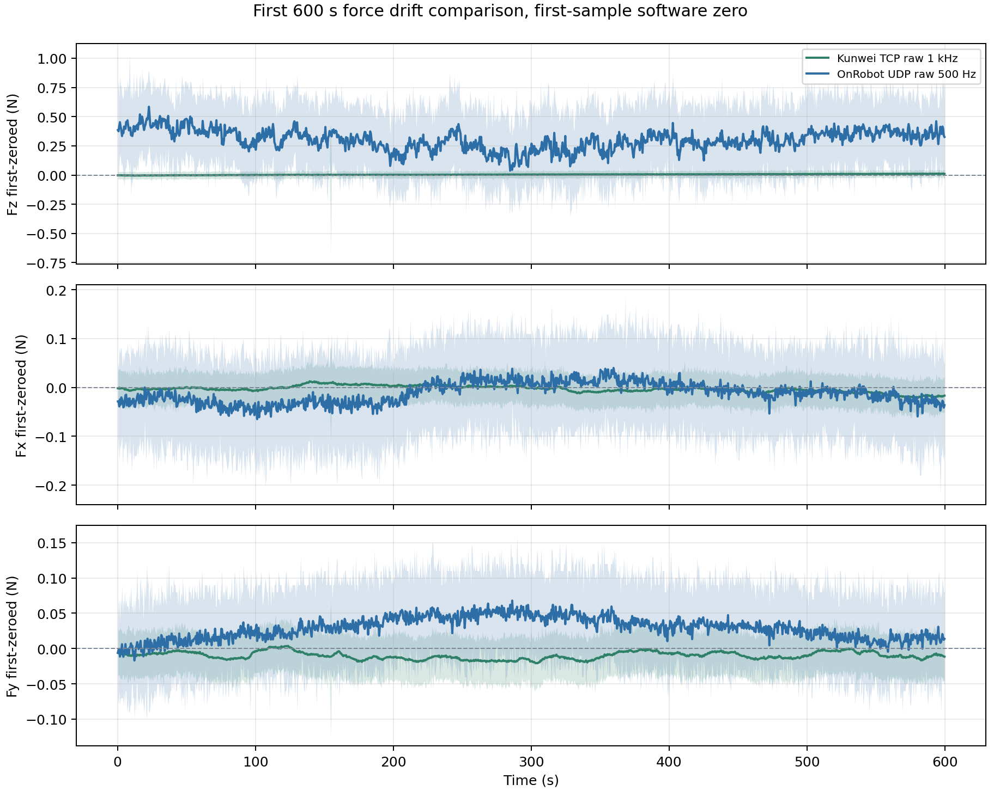

图 2 单独展开 Fz。Kunwei 前 `600 s` 的 first-value-zeroed Fz 标准差是 `0.0113 N`，OnRobot UDP raw 是 `0.1541 N`。这个数值不能直接解释成传感器规格优劣，因为两个窗口的安装、载荷和日期不同。

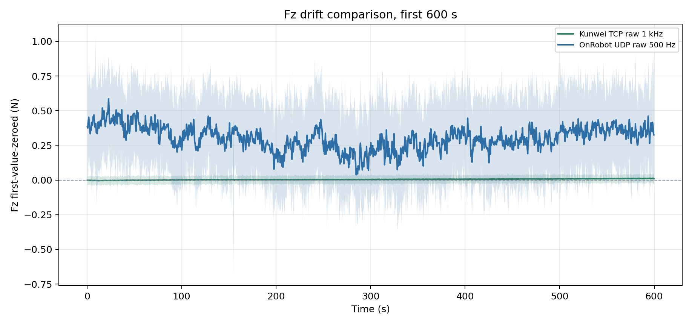

图 3 把前三个力轴的 first-value-zeroed 标准差放在同一张图里，用于快速看 `600 s` 窗口内的波动量级。

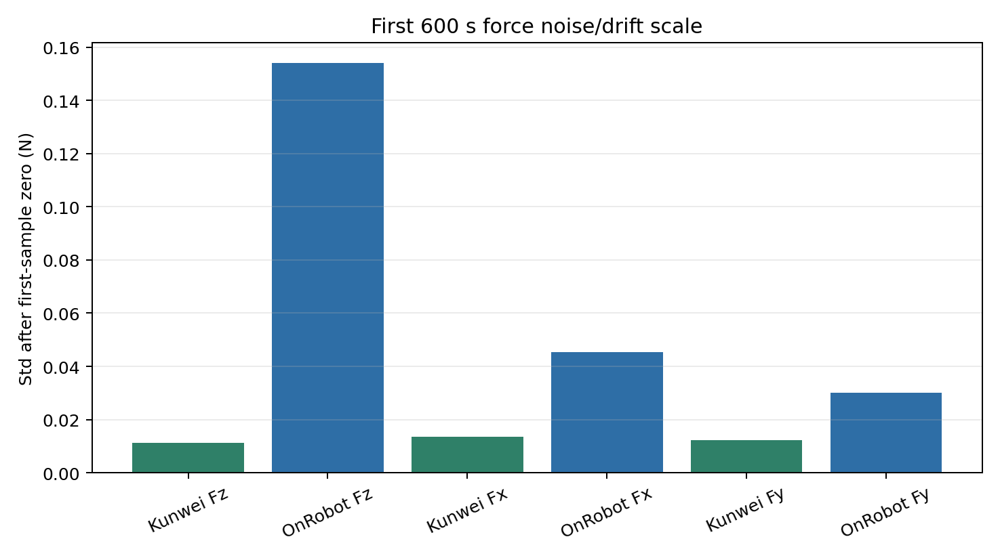

图 4 是本次新增的 `6.00 h` 长时间 Fz 对比。当前本地数据的最长公共窗口是 `8.79 h`，但本报告采用 `6.00 h` 作为主图口径，避免把会议汇报拖进过长的历史细节。统计仍使用 `6.00 h` 内全样本，图中阴影仍是 min/max envelope。

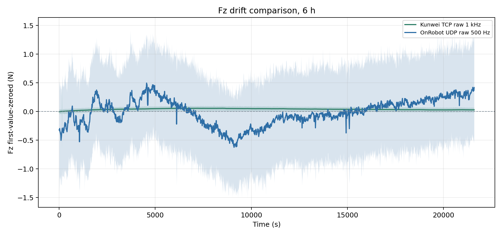

图 5 展示 `6 h` 的 Fx/Fy/Fz 三轴上下文。它用于判断 Fz 漂移是否伴随横向力变化。

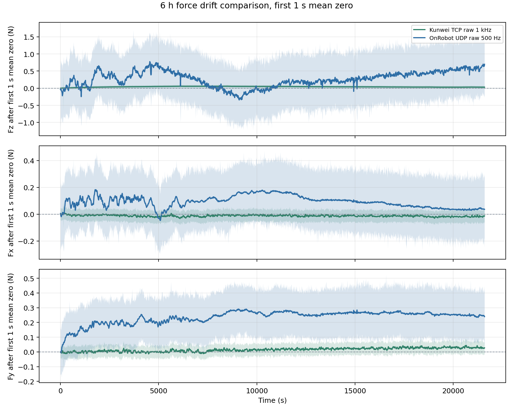

图 6 是 `6 h` 窗口下三个力轴的 first-value-zeroed 标准差。

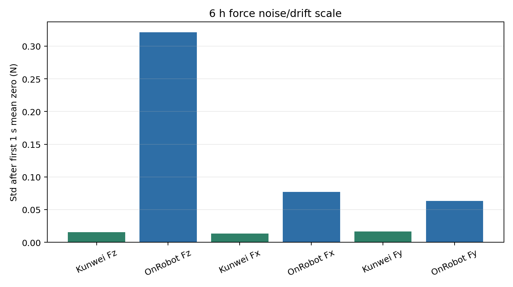

## 统计结果

### Kunwei 19h15min 长时采集

| 指标 | 数值 |
|---|---:|
| 样本数 | `69,325,059` |
| first-to-last duration | `69325.773 s` |
| 平均采样率 | `999.989703 Hz` |
| parse errors | `0` |
| dropped sync bytes | `0` |
| Fz mean/std | `-0.8990 / 0.0146 N` |
| Fz last-first | `0.0457 N` |

这条结果支持把 Kunwei TCP route 作为当前 bench 的可用 `1 kHz` logging route。它仍不是完整 24h 结论，因为用户在约 `19 h 15 min` 主动停止。

### Step2C 闭环直线进展

| 项目 | 结果 |
|---|---:|
| 旧成功 run | `bridge_step2c_search5_guard20_line2ms_alpha70_vlim5_20260606_220817` |
| V4 comparison run | `bridge_step2c_admittance_search30_v4_search2ms_line1ms_alpha70_20260608_135945` |
| final run | `bridge_step2c_final_autowatch_search2ms_line1ms_alpha70_20260608_154123` |
| 旧 run 是否完成 line | `yes` |
| bridge stop reason | `duration` |
| final bridge write / RTDE log rate | `507.53 / 507.53 Hz` |
| final raw sensor stage25 rate | `1007.59 Hz` |
| final stage25 echo rate | `489.83 Hz` |
| final stage25 Fz mean/std | `-5.09 / 1.67 N` |
| final stage25 Fz error MAE | `1.39 N` |
| final raw stage25 Fz min | `-11.71 N` |
| final XY error mean / p95 | `0.031 / 0.080 mm` |

V4 的主要意义是 frequency 层面的进展：stage25 echo cadence 从旧成功 Step2C 的约 `246.55 Hz` 提高到约 `489.83 Hz`，但 Fz error MAE 升到 `1.87 N`。final 保持同样的 measured URScript echo/motion-gate cadence，同时把 Fz error MAE 降到 `1.39 N`、p95 abs error 降到 `3.25 N`。这里仍然只写成 measured cadence，不写成内部 servo loop 频率；力控制结论也只针对这次 selected final run。

| Result | stage25 echo (Hz) | stage25 duration (s) | Fz mean/std (N) | Fz error MAE (N) | Fz p95 abs err (N) | XY p95 (mm) | note |
|---|---:|---:|---:|---:|---:|---:|---|
| previous Step2C | 246.55 | 6.392 | -5.13 / 1.96 | 1.57 | 3.62 | 0.100 | first successful line run |
| Step2C V4 | 489.83 | 6.390 | -5.08 / 2.36 | 1.87 | 4.58 | 0.083 | 489.83 Hz measured echo cadence evidence |
| Step2C final | 489.83 | 6.394 | -5.09 / 1.67 | 1.39 | 3.25 | 0.080 | selected final run; lower Fz error than V4 |

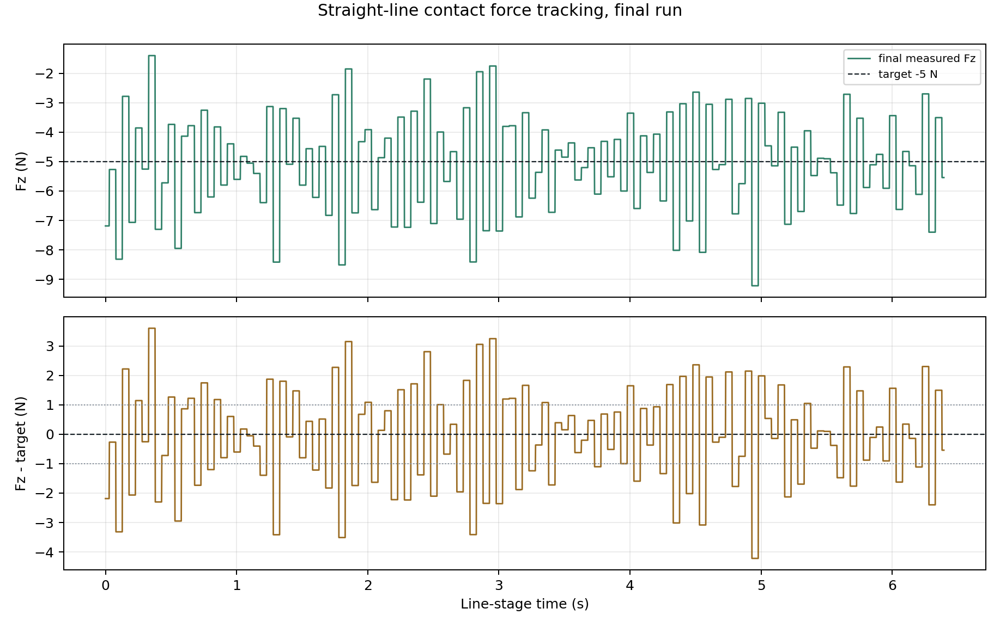

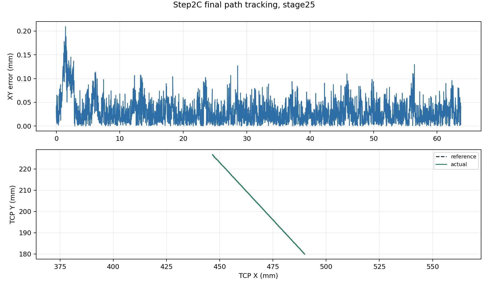

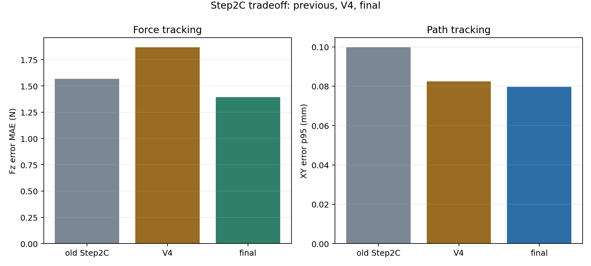

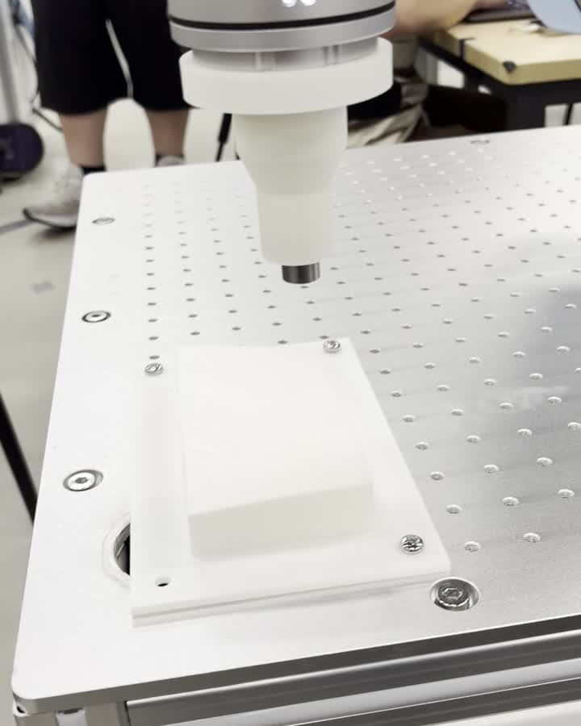

[Step2C final experiment video](assets/kunwei-kwr75-progress-20260608/step2c_final_experiment.mp4)

### Step4D 圆轨迹接触进展

Step4D 把 Step2C contact path 的中间一半作为直径，生成半径约 `15.895 mm` 的完整圆。程序复用 Step2C final 风格的高点进入、确定性接触搜索、卸载和回撤框架；圆阶段用 Cartesian `speedl` twist 走轨迹，Z 方向继续用 signed Fz velocity admittance，`wx/wy` 姿态修正来自 filtered Fx/Fy 与 Mx/My 的 bounded velocity admittance。

| Metric | Step4D result |
|---|---:|
| run | `bridge_step4d_circle_v1_autowatch_detsearch_attitude_20260608_165457` |
| circle completed | yes |
| stage25 samples | `19,883` |
| stage25 echo rate | `490.72 Hz` |
| radius / arc progress | `15.895 / 99.875 mm` |
| closure error | `0.828 mm` |
| radial error mean / p95 | `0.066 / 0.111 mm` |
| XY tracking error mean / p95 | `0.828 / 0.881 mm` |
| normal-force error MAE / p95 | `2.216 / 4.417 N` |
| lateral force p95 | `1.554 N` |
| torque norm p95 | `0.120 Nm` |

这次 Step4D 的关键结果是 stop reason 进入 `circle_complete`，arc progress 到 `99.875 mm`，接近 full-circle nominal `99.871 mm`。closure error 约 `0.828 mm`，radial error p95 约 `0.111 mm`。力控制部分还没有达到 Step2C final 的力误差水平，normal-force error MAE 为 `2.216 N`，所以这里的结论应写成“圆轨迹 contact scaffold 已跑通”，而不是“圆轨迹 force quality 已收敛”。

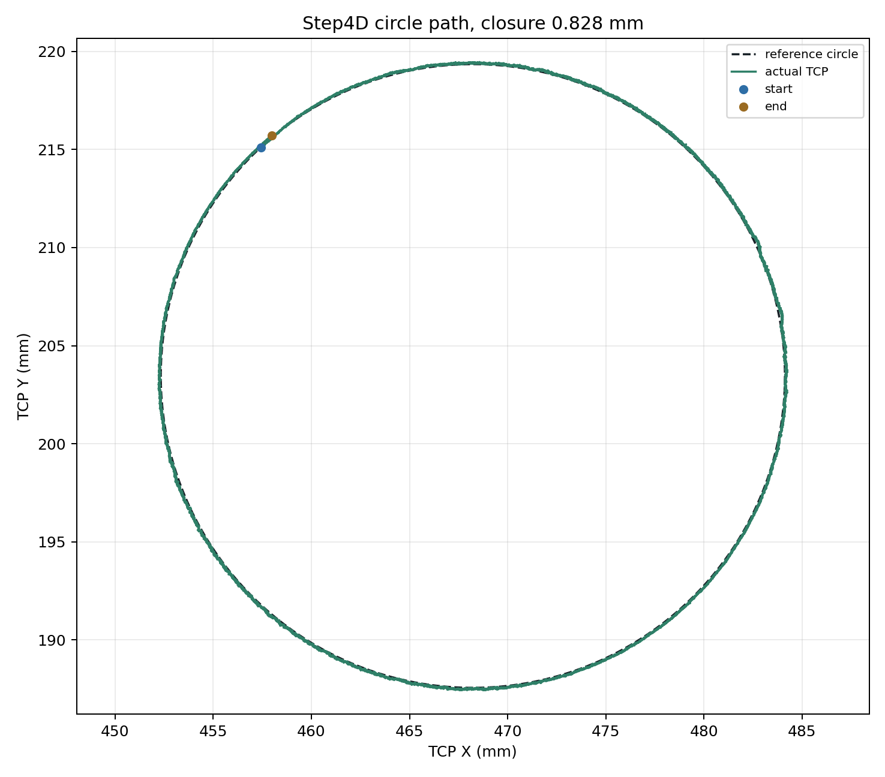

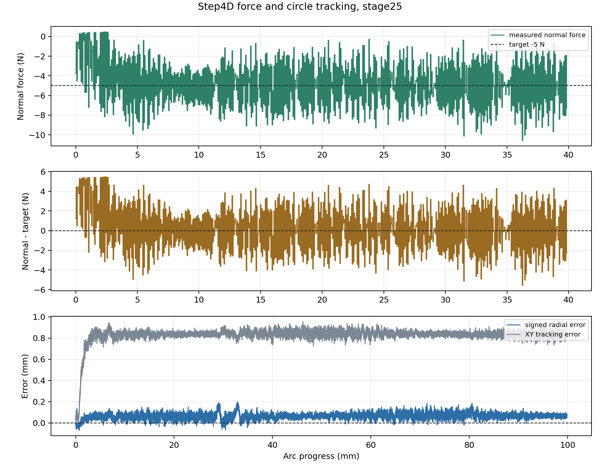

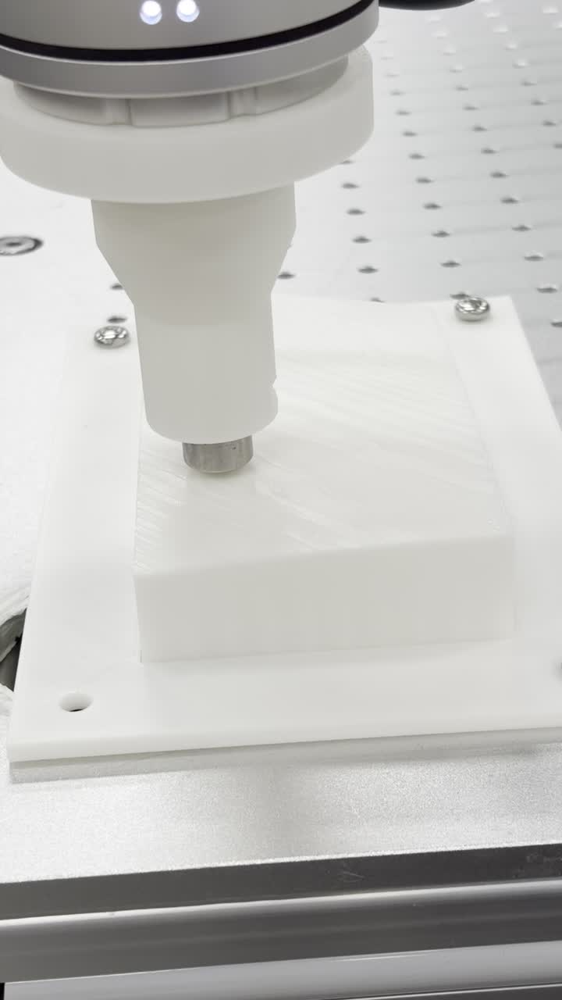

[Step4D demo video](assets/kunwei-kwr75-progress-20260608/step4d_circle_experiment.mp4)

### Step4E v11 外环直线进展

Step4E v11 是这次 paper-style 外环复现的小步验证：URP 仍负责高点进入、entry-pose re-zero、两阶段确定性接触搜索、line stage、短回撤和回 home；Python bridge 在 line stage 读取 Kunwei zeroed wrench 与 RTDE actual TCP pose，计算 Cartesian `vx/vy/vz/wx/wy` command，并通过 RTDE input registers 交给 URScript。机器人 IK 仍由 UR 控制器通过 `speedl` 处理。

| Metric | Step4E v11 result |
|---|---:|
| run | `bridge_step4e_line_outerloop_v11_autowatch_20260609_135519` |
| line path completed | yes |
| bridge path / script threshold | `143.747 / 143.752 mm` |
| progress max | `143.747 mm` |
| first 99.9% progress | `48.612 s` |
| final stop reason | `10.0 (line_runtime_timeout)` |
| retract/home evidence | `stage26 rows=576`, `stage27 rows=175` |
| length mismatch | `0.0044 mm` |
| stage25 samples / duration | `75,075` / `150.148 s` |
| stage25 echo rate | `249.73 Hz` |
| XY path error mean / p95 | `1.388 / 2.190 mm` |
| normal-load error MAE / p95 | `7.190 / 17.656 N` |
| orientation error mean / p95 | `0.129 / 0.369 rad` |
| force norm max / torque norm max | `35.953 N` / `0.468 Nm` |

这次 v11 的关键结果是路径层面已经跑满：bridge 侧 progress clamp 到 `143.747 mm`，等于 bridge path length `143.747 mm`，约 `48.612 s` 达到 `99.9%` progress。XY path error p95 为 `2.190 mm`。但 final stop reason 是 `10.0`，因为 URScript 的 completion threshold `143.752 mm` 比 bridge length 高 `0.0044 mm`，导致 clean completion 没有触发而进入 runtime timeout。数据中仍有 stage26/stage27 行，说明 retract/home 路径有执行证据；这里更准确的结论是“外环直线路径复现已跑通，clean-complete 判定和 force quality 仍需收尾”，不是“Step4E 已完全收敛”。

Step4E 的 normal-load force quality 还没有达到 Step2C final 水平：normal-load error MAE 为 `7.190 N`，p95 为 `17.656 N`。这条证据的价值主要是 architecture：Python 外环 command、UR register consumption、UR-side IK 和接触路径执行形成闭环。

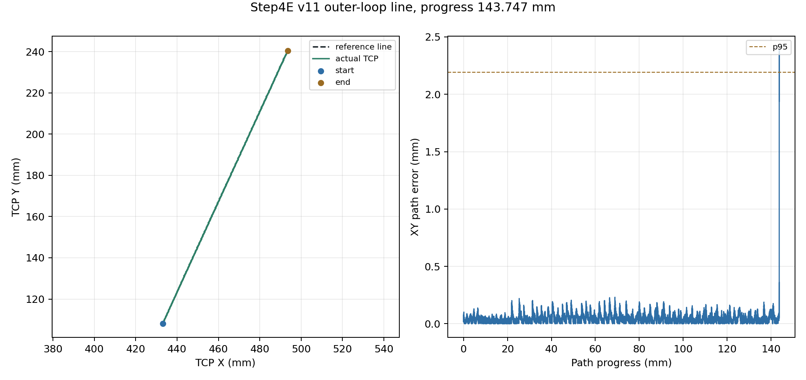

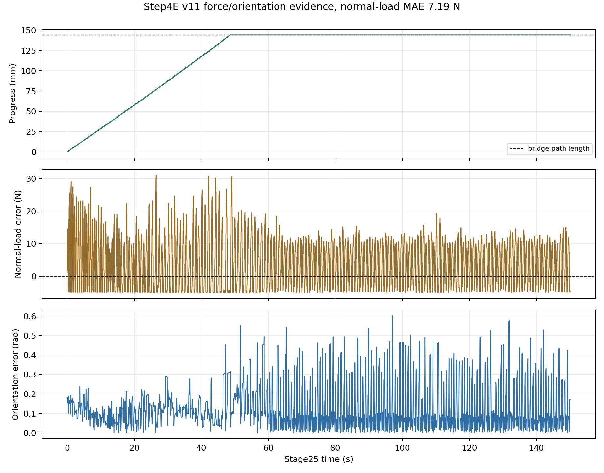

### OnRobot vs Kunwei 前 600s

| Sensor | Axis | samples | duration (s) | rate (Hz) | zeroed mean (N) | zeroed std (N) | zeroed last-first (N) | raw min/max (N) |
|---|---|---:|---:|---:|---:|---:|---:|---|
| Kunwei TCP raw | Fx | 599,988 | 599.971 | 1000.027 | -0.0034 | 0.0136 | -0.0389 | 2.327 / 2.529 |
| OnRobot UDP raw | Fx | 299,756 | 599.990 | 499.600 | -0.0119 | 0.0453 | -0.0400 | 0.060 / 0.470 |
| Kunwei TCP raw | Fy | 599,988 | 599.971 | 1000.027 | -0.0100 | 0.0122 | -0.0209 | -1.216 / -1.026 |
| OnRobot UDP raw | Fy | 299,756 | 599.990 | 499.600 | 0.0289 | 0.0302 | -0.0100 | 3.000 / 3.260 |
| Kunwei TCP raw | Fz | 599,988 | 599.971 | 1000.027 | 0.0043 | 0.0113 | 0.0219 | -1.604 / -0.497 |
| OnRobot UDP raw | Fz | 299,756 | 599.990 | 499.600 | 0.3025 | 0.1541 | 0.2200 | -25.900 / -24.500 |

| Sensor | Axis | zeroed std (Nm) | zeroed last-first (Nm) | raw min/max (Nm) |
|---|---|---:|---:|---|
| Kunwei TCP raw | Mx/Tx | 0.00033 | -0.00093 | 0.04669 / 0.05550 |
| OnRobot UDP raw | Mx/Tx | 0.00424 | -0.00299 | -0.00500 / 0.03200 |
| Kunwei TCP raw | My/Ty | 0.00033 | 0.00095 | -0.06751 / -0.06022 |
| OnRobot UDP raw | My/Ty | 0.00409 | 0.00000 | -0.10300 / -0.06700 |
| Kunwei TCP raw | Mz/Tz | 0.00033 | 0.00084 | 0.05950 / 0.06300 |
| OnRobot UDP raw | Mz/Tz | 0.00215 | 0.00300 | 0.06200 / 0.08100 |

比较限制必须写清楚：Kunwei 的前 `600 s` 来自 `19h15min` 未做 device-side zero/tare 的静态长跑，OnRobot 来自 `20260528` 的 dedicated `600s_first_zero` run；两者不是同一天、同治具、同预载的同步 A/B。这里能比较的是当前可用 raw stream 在自身 first-value software zero 口径下的短窗口稳定性和采样路线差异。

### OnRobot vs Kunwei 6h

本地可用数据里，Kunwei 最长为 `19.26 h`，OnRobot UDP raw 最长为 `8.79 h`，两者最长公共窗口为 `8.79 h`。本报告采用 `6.00 h` 作为长时间对比主口径；这个窗口已经足够覆盖慢漂移趋势，也更适合会议图表。

| Sensor | Axis | samples | duration (h) | rate (Hz) | zeroed std (N) | zeroed last-first (N) | back60-front60 mean (N) | raw min/max (N) |
|---|---|---:|---:|---:|---:|---:|---:|---|
| Kunwei TCP raw | Fx | 21,599,781 | 6.000 | 999.990 | 0.0135 | -0.0086 | -0.0136 | 2.327 / 2.529 |
| OnRobot UDP raw | Fx | 10,791,425 | 6.000 | 499.603 | 0.0770 | 0.0000 | 0.0471 | -0.130 / 0.640 |
| Kunwei TCP raw | Fy | 21,599,781 | 6.000 | 999.990 | 0.0165 | 0.0264 | 0.0261 | -1.216 / -1.008 |
| OnRobot UDP raw | Fy | 10,791,425 | 6.000 | 499.603 | 0.0634 | 0.2300 | 0.2449 | 2.670 / 3.370 |
| Kunwei TCP raw | Fz | 21,599,781 | 6.000 | 999.990 | 0.0156 | 0.0176 | 0.0308 | -1.604 / -0.497 |
| OnRobot UDP raw | Fz | 10,791,425 | 6.000 | 499.603 | 0.3212 | 0.4000 | 0.7036 | -25.490 / -22.480 |

这个 `6 h` 对比仍然不是严格同治具同步 A/B。它更适合回答“当前两条 raw stream 在首值归零后的长窗口稳定性量级如何”，不适合回答“哪个传感器绝对零点更准”。

## 结论

1. Kunwei TCP raw logging 路线已经可用：`19 h 15 min` 内约 `1 kHz`，`parse_errors=0`，`dropped_sync_bytes=0`。
2. Kunwei 已经从传感器 bring-up 进入机器人闭环验证阶段。旧 Step2C、V4 和 final 都能完成搜索、直线、卸载和回撤；均值层面能围绕 `-5 N` 工作。
3. final 的 stage25 measured echo cadence 约 `489.83 Hz`，比旧成功 Step2C 的 `246.55 Hz` 明显提高，并且 Fz error MAE 比 V4 更低；但这仍不能写成 UR 内部 servo loop 频率。
4. Step4D 首次把 “middle-half 直线路径作为直径 -> 完整圆 -> 接触搜索 -> 姿态 admittance -> 回撤” 这一套流程跑完；但圆轨迹与 Step2C 直线任务几何不同，不能把两者的 force/path 指标当作同任务直接排序。
5. Step4E v11 已证明 paper-style 外环 command + UR `speedl` IK 的直线复现路线可跑满 `143.747 mm` 路径；clean-complete 判定差 `0.0044 mm` 是小收尾问题，force quality 还不是最终水平。
6. OnRobot/Kunwei 前 `600 s` 与 `6 h` 对比图说明两条 raw stream 都可以用 first-value software zero 做短窗口和长窗口漂移分析；但由于机械状态不同，报告只解释相对漂移和波动，不解释绝对偏置或规格优劣。

## 下一步

- Step2C 下一步应围绕 final 的重复性和 contact-entry transient 继续验证；频率证据已经足够支持约 `490 Hz` measured echo cadence 进入报告，force quality 也相对 V4 有改善，但还不应该外推成跨治具、跨日期的传感器绝对性能结论。
- Step4D 下一步应先围绕完整圆的重复性、entry transient 和 normal-force ripple 收敛，不要急着把它写成传感器绝对性能或最终算法效果。若要进一步降低圆轨迹误差，再考虑是否把 IK/trajectory optimization 从 UR 内部逐步外移到脚本侧。
- Step4E 下一步不需要新实验来完成这版报告；工程上只需把 bridge line length 和 URScript completion threshold 统一，避免满路径后靠 runtime timeout 收尾。之后再谈 normal-load MAE 和 attitude gain 的调参。
- 本版本不需要新做 OnRobot/Kunwei A/B 实验；当前会议材料只使用已有日志，并明确标注为 first-value software zero 的历史窗口比较。若未来要回答绝对标定问题，再另开同机械状态、同无接触窗口、明确 device-side zero/tare 策略的实验。
- 如果目标是机器人侧 `500 Hz` 运动闭环，需要另开 `servoj/speedj`、多线程 URScript 或外部实时接口路线，而不是从当前 `speedl` echo 推断。

## 附录

### 报告生成命令

```bash
python3 /home/andy/ur10e_ros2_ws/weekly_meeting/build_kunwei_kwr75_report.py
```

### 生成口径

脚本对 `600 s` 窗口保留短窗口点列；对 `6 h` 窗口只保留统计量和时间 bin envelope，不把千万级样本全部留在内存里。统计直接使用窗口内所有样本；图形先按时间 bin 聚合为 min/max/mean envelope，保留尖峰范围，不使用等间隔抽样折线作为主要证据。HTML deck 使用生成的数据图和压缩后的 Step2C final / Step4D 视频，不嵌入原始 MOV。
