# UR10e Kunwei + RG2/QC Payload/CoG Calibration

## 实验目的

建立当前 UR10e 末端硬件、图片证据和 payload/CoG calibration 的单一
provenance，作为后续 SFC reproduction 的 bench 前置条件。Autotuner 在此
只表示现有 UR10e 硬件环境，不表示要运行 Autotuner controller。

## 核心结论

当前 UR controller 的有效值是：

- Payload：`1.33 kg`
- CoG：`[-2,-6,65] mm`
- TCP offset：`[0,0,262.6,0,0,0] mm`，本轮未修改

这组值已由 PolyScope wizard 写入并通过 RTDE fresh read-back 确认。Kunwei
独立拟合得到 `1.0617 kg`，但它属于 Kunwei sensing-plane diagnostic，不能
替换 UR 的 `1.33 kg`。旧的 `1.55 kg / [1,13,51] mm` 只保留为历史快照。

## 现场最短路径

1. 当前硬件使用 wired RG2/QC assembly；物理称重参考是 `IMG_2284.JPG`
   的约 `891.0 g`。
2. 不把旧白色 Autotuner adapter（`IMG_1688`）计入当前实验。
3. 不把 unwired `IMG_2285.JPG` 的 `873.0 g` 替代 wired 值。
4. 不把 Kunwei sensing-plane 的 `1.0617 kg` 写进 UR。
5. 下一步是 SFC reproduction，不启动 Autotuner trial。

## Visual Overview

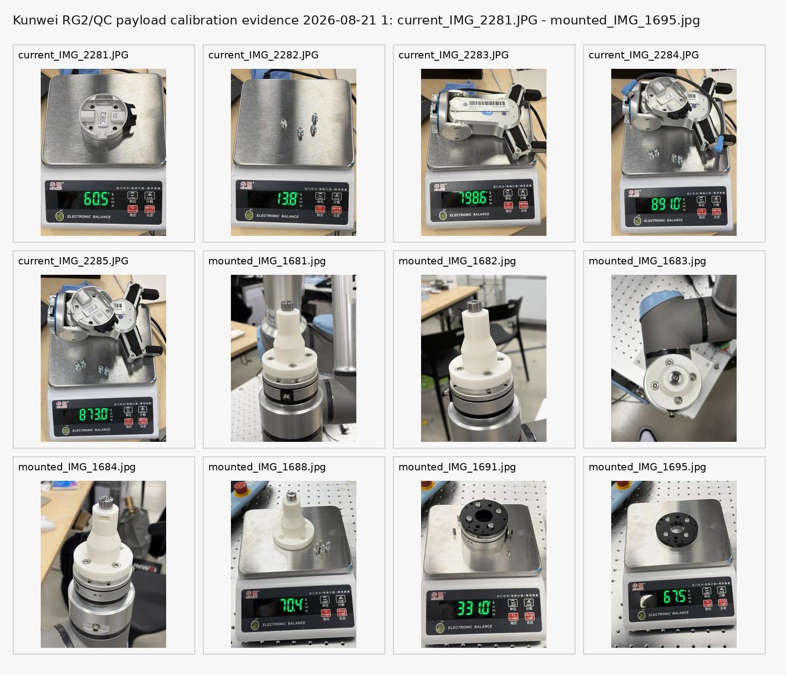

上半部分是 2026-08-21 当前 RG2/QC mass evidence，下半部分是历史 mounted
stack。第二张 contact sheet 是 2026-06-04 wiring-route keyframes：

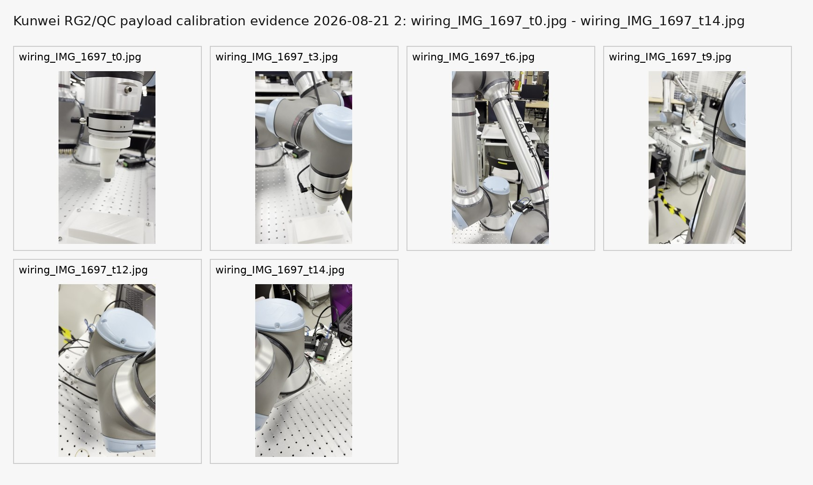

## 设备与实验条件

| 项目 | 当前条件 |
|---|---|
| Robot | UR10e，controller `192.168.1.18` |
| End-effector | OnRobot QC-R/RG2 wired assembly + Kunwei KWR75B |
| Gripper state | RG2 open，空载、无接触 |
| UR payload | `1.33 kg` |
| UR CoG | `[-2,-6,65] mm` |
| TCP | `[0,0,262.6,0,0,0] mm` |
| Kunwei route | TCP stream，raw frames + parsed SI wrench |
| UR pose route | RTDE observer，约 `125 Hz` |
| Kunwei stream | 约 `1 kHz`，raw frame 保留 |
| Sensor zero/tare | 未发送 Kunwei zero/tare/filter；未调用 `zero_ftsensor()` |
| Contact | 无接触 |
| Final live check | `Safety NORMAL`，`STOPPED 1.urp`，TCP speed zero |

## 图片证据 crosswalk

### 当前 AirDrop set：2026-08-21

Mac source set：

`/Users/andyl/Documents/UR10e/ft_sensor/kunwei/photo_sets/20260821_rg2_payload_calibration`

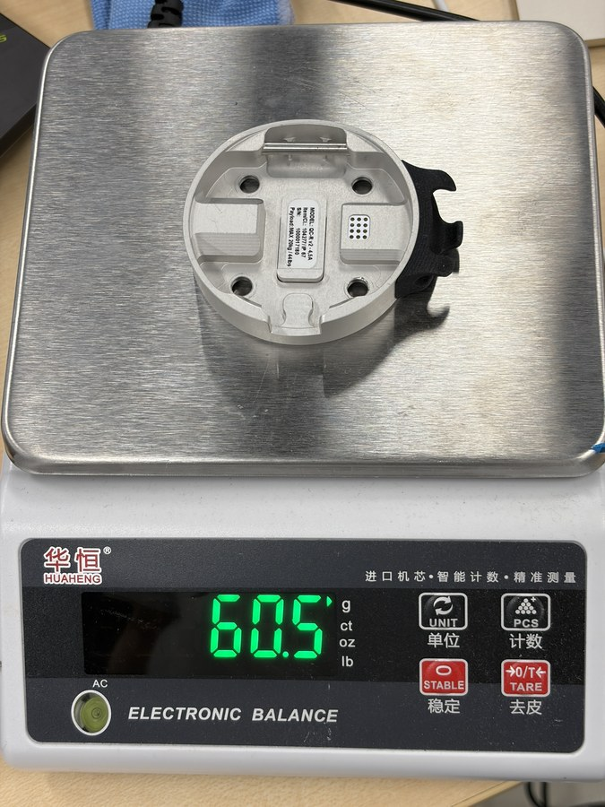

**OnRobot QC-R V2-4.5A label and scale.** 原图 `IMG_2281.JPG`；约
`605.5 g`，用于硬件身份和 mass bookkeeping。

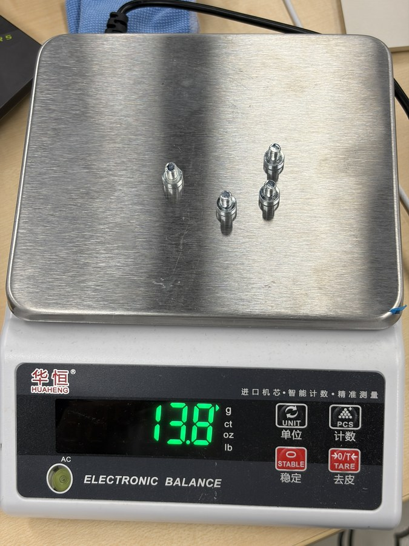

**Bolts/studs mass evidence.** 原图 `IMG_2282.JPG`；约 `13.8 g`，仅作
supporting hardware mass。

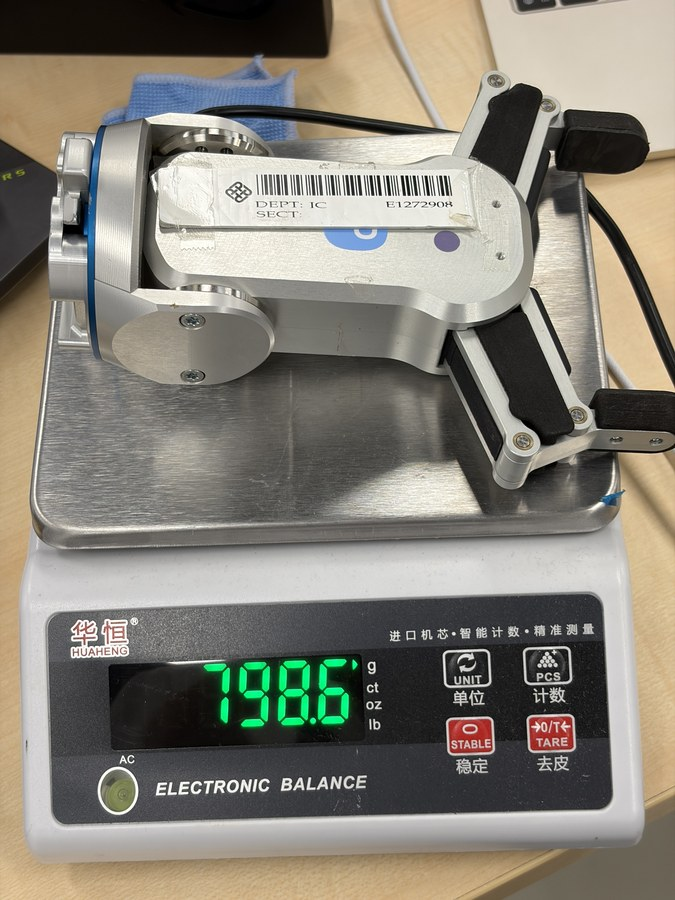

**RG2 assembly mass evidence.** 原图 `IMG_2283.JPG`；约 `798.6 g`。

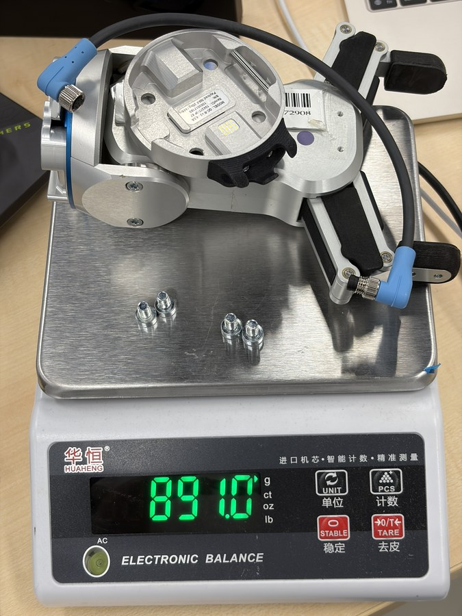

**Current wired RG2/QC assembly.** 原图 `IMG_2284.JPG`；约 `891.0 g`，是
当前物理状态的 authoritative photo evidence。

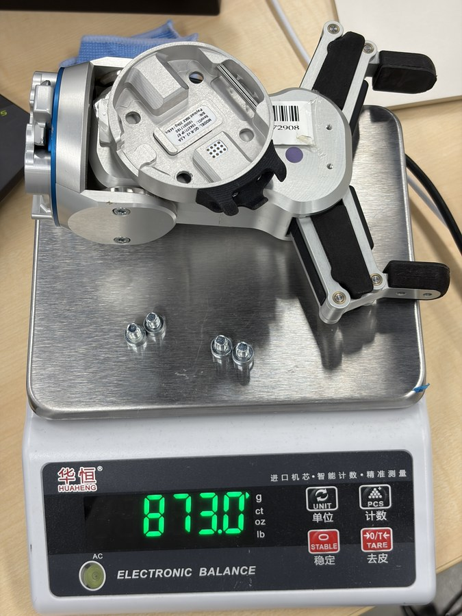

**Unwired comparison.** 原图 `IMG_2285.JPG`；约 `873.0 g`，只用于解释
线缆差异，不替代 wired 值。

### 历史 mounted/wiring set

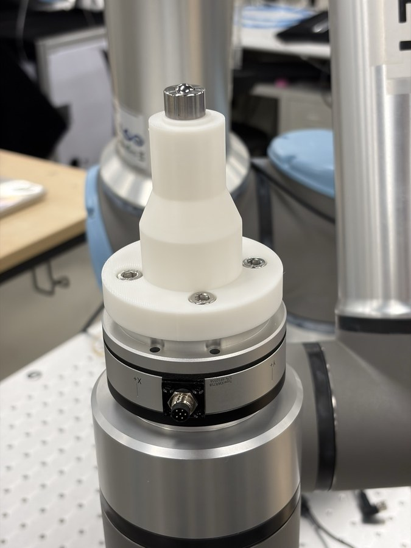

**Historical mounted overview.** 原图 `IMG_1681.HEIC`；用于确认旧安装上下文，
不能单独确定当前 TCP 或 payload。

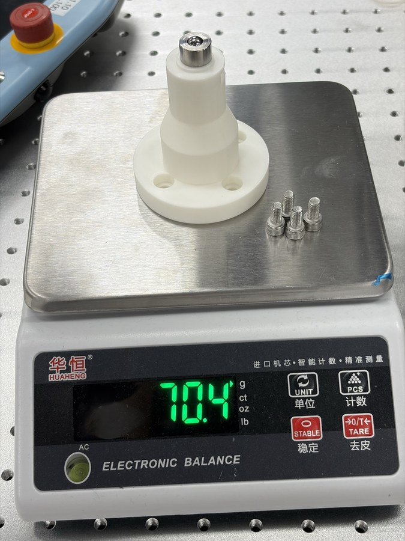

**Old white Autotuner adapter.** 原图 `IMG_1688.HEIC`；约 `70.4 g`，当前
SFC experiment **排除**。

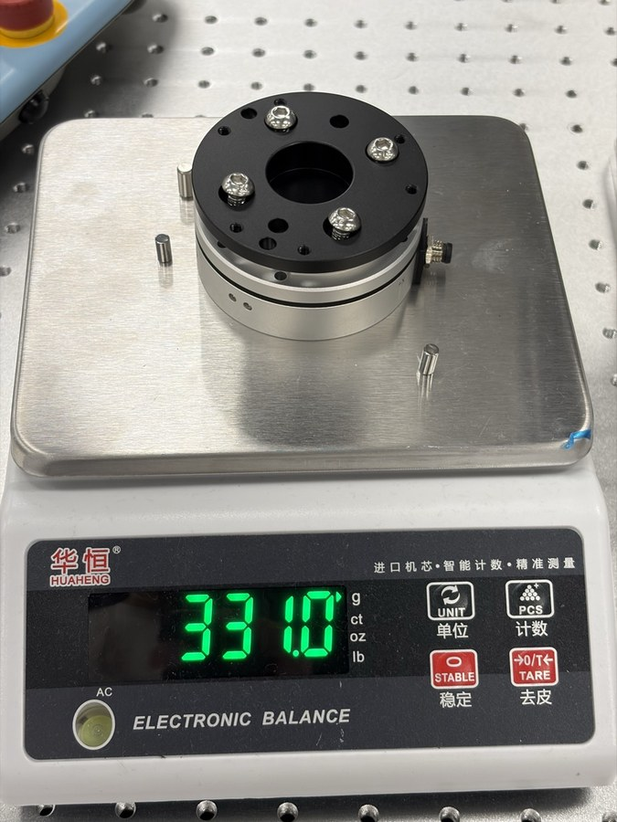

**Kunwei sensor-side stack.** 原图 `IMG_1691.HEIC`；约 `331.0 g`。它是历史
Kunwei-side mass evidence，不等同于 UR flange-downstream payload。

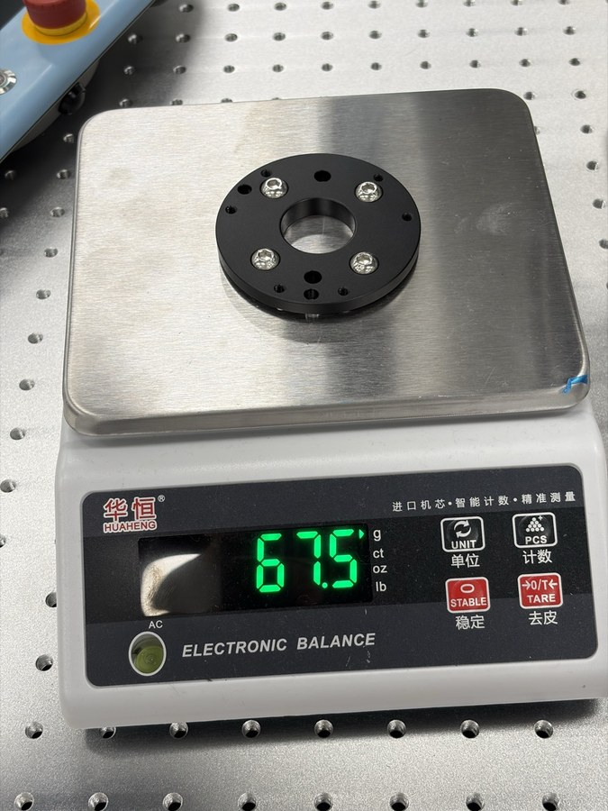

**Overlapping flange/adapter evidence.** 原图 `IMG_1695.HEIC`；约 `67.5 g`，
已包含在 `IMG_1691`，禁止重复相加。

## Calibration procedure

### 1. PolyScope built-in Payload/CoG wizard

每个姿态都保持夹爪悬空、线缆不绷、TCP speed zero 后再采样。下面是绝对
joint values，单位全部为 degrees，顺序为 `Base, Shoulder, Elbow, Wrist1,
Wrist2, Wrist3`。

| Pose | Absolute joint values (deg) | 操作 |
|---|---|---|
| P0 | `26.519, -95.928, -124.703, -2.543, -7.866, -203.612` | 当前基准 |
| P1 | `26.519, -95.928, -124.703, 42.457, -7.866, -203.612` | 仅 Wrist1 到 `42.457°` |
| P2 | `26.519, -95.928, -124.703, -47.543, -7.866, -203.612` | 仅 Wrist1 到 `-47.543°` |
| P3 | `26.519, -95.928, -124.703, -2.543, -67.866, -203.612` | Wrist1 回到 `-2.543°`，仅 Wrist2 到 `-67.866°` |

Wizard result：`1.33 kg`，CoG `[-2,-6,65] mm`。随后 RTDE read-back 为
`payload=1.33`、`payload_cog=[-0.002,-0.006,0.065]`。

### 2. Kunwei + UR RTDE independent fit

使用 operator-guided logger 同步保存 Kunwei raw frames、parsed wrench、UR
TCP pose、joint pose 和 speed。logger 不发送机器人 motion、UR payload/TCP
write、`zero_ftsensor()` 或 Kunwei zero/tare/filter/configuration command。

过程：

1. 保持相同 wired RG2/QC、RG2 open、空载和无接触状态。
2. 启动 Kunwei stream，保留 raw bytes 和 parsed SI CSV。
3. 记录 P0、P1、P2、P3 的静态窗口。
4. 丢弃 moving rows 和 stale RTDE rows。
5. 拟合 Kunwei axis mapping、有效质量和 sensor-frame CoG。
6. 将结果标为 sensing-plane diagnostic，不与 UR tool-frame CoG 直接做坐标差。

本次四姿态分析结果：

| Method | Mass (kg) | CoG frame | CoG (mm) | Force RMSE (N) | Moment RMSE (Nm) | Claim class |
|---|---:|---|---|---:|---:|---|
| PolyScope built-in | `1.3300` | UR tool | `[-2,-6,65]` | N/A | N/A | live controller calibration |
| Kunwei independent fit | `1.0617` | Kunwei sensor | `[0.08,0.27,58.49]` | `0.039` | `0.00144` | diagnostic / sensing-plane |

P1/P2 在确认消息漏发后从 uninterrupted transition stream 恢复；P3 是之后
单独完成的 8 秒 capture。因此这份 Kunwei 结果可用于诊断和 frame/mass
对照，但不替代 PolyScope wizard。

### Earlier gravity-axis mapping calibration

2026-06-11 的 wrist3 four-quadrant run 是独立的 axis-mapping calibration，
不是 payload/CoG calibration。它支持 `F_T_x=+Fx_K`、`F_T_y=+Fy_K`；本次
2026-08-21 四姿态 fit 选择相同的 positive-axis mapping，并达到 centered
gravity rank 3。它仍不能单独证明 contact normal-load sign，也不能替代
sensor-origin 到 UR tool frame 的机械变换确认。

## 数据与 artifacts

- [Recovered four-pose analysis JSON](../experiments/sensor-integration/kunwei-kwr75b/measurements/gravity_axis_calibration/20260821_013518_four_pose_recovered/custom_payload_cog_analysis.json)
- [Recovered four-pose analysis report](../experiments/sensor-integration/kunwei-kwr75b/measurements/gravity_axis_calibration/20260821_013518_four_pose_recovered/custom_payload_cog_report.md)
- [Force/moment fit plot](../experiments/sensor-integration/kunwei-kwr75b/measurements/gravity_axis_calibration/20260821_013518_four_pose_recovered/custom_payload_cog_fit.png)
- [Recovery metadata](../experiments/sensor-integration/kunwei-kwr75b/measurements/gravity_axis_calibration/20260821_013518_four_pose_recovered/recovery_metadata.json)
- Current photo manifest on Mac:
  `/Users/andyl/Documents/UR10e/ft_sensor/kunwei/photo_sets/20260821_rg2_payload_calibration/photo_manifest.csv`

The Mac photo set is the raw-image source of truth. The report-local `assets/`
directory contains normalized JPEG derivatives and contact sheets only.

## 结论

The current payload/CoG for the installed UR10e EOAT is `1.33 kg` and
`[-2,-6,65] mm`. The physical photo evidence supports the wired assembly as the
current hardware state, while the Kunwei fit confirms a stable independent
sensing-plane measurement but not a replacement UR payload value.

The old white adapter and old `1.55 kg` snapshot are historical/excluded. The
next experiment is SFC reproduction with Kunwei as the force/torque input;
Autotuner is only the existing UR10e bench context.

## 下一步

1. Bind the SFC paper parameters, input/output channels and contact task.
2. Verify the SFC implementation against the current Kunwei/UR data path.
3. Run a no-contact SFC startup check before any contact canary.

## 附录：source locations

- Canonical skill reference:
  `/home/andy/codex-private-skills-shared-main/skills/ur10e-kunwei-kwr75/references/current-eoat-photo-and-calibration.md`
- Current Mac photo set:
  `/Users/andyl/Documents/UR10e/ft_sensor/kunwei/photo_sets/20260821_rg2_payload_calibration`
- Current workspace root:
  `/home/andy/ur10e_ros2_ws/experiments/sensor-integration/kunwei-kwr75b`
- Historical report retained for provenance:
  `/home/andy/ur10e_ros2_ws/report/kunwei_rg2_payload_cog_compare_20260820.md`
