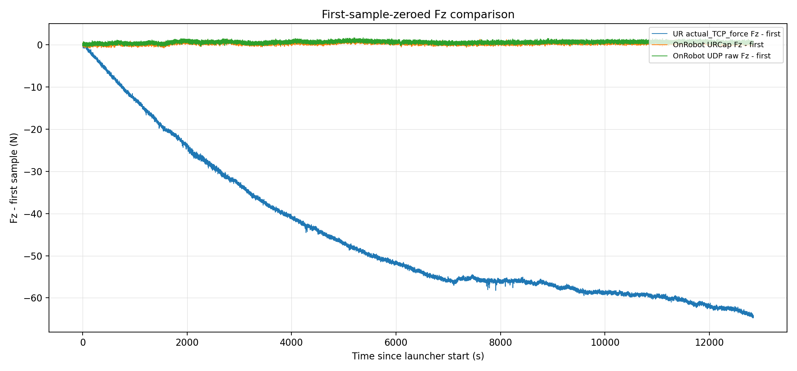
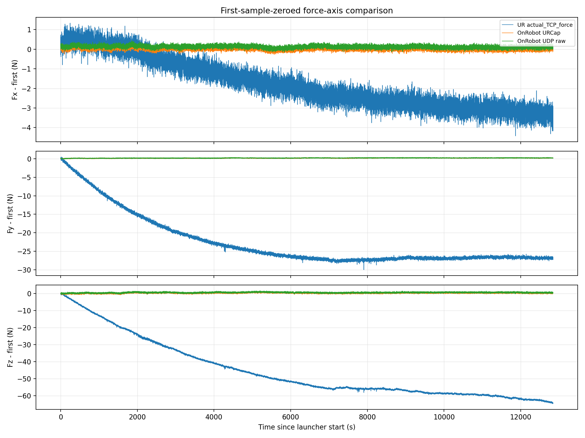
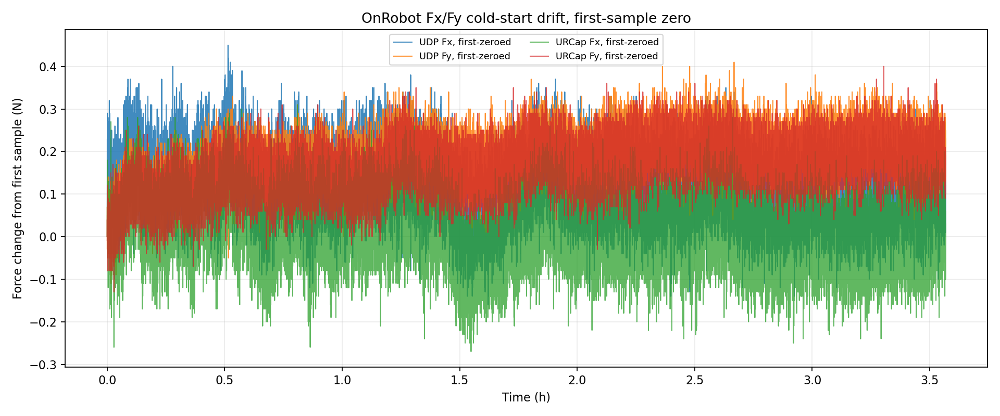

# OnRobot 三路冷启动静态漂移记录（2026-05-28）

## 核心结论

本次采集已经干净停止，OnRobot UDP final `STOP` 已发送，最终 summary 写出成功，`errors=[]`。实际采集时长为 `3.568 h`，不是完整 24 h；作为关机前的冷启动静态漂移记录已经足够可用，但不能当作全天候 24 h 漂移结论。

OnRobot 两条路径的 Fz 漂移口径如下：URCap 寄存器路径从首样本到末样本变化 `+0.310 N`，UDP `SPEED=2` raw 路径变化 `+0.810 N`。两条 OnRobot 路径的一阶趋势一致，但仍保持约 `0.230 N` 的一阶零点后均值差。UR 内置 `actual_TCP_force` 的 Fz 变化为 `-64.331 N`，该信号与 OnRobot 变量不是同一补偿/参考口径，本报告只把它作为 UR 侧上下文，不把它解释为 OnRobot 传感器漂移。

## 设备与实验条件

| 字段 | 值 |
|---|---:|
| 开始时间 | `2026-05-28T14:11:54` |
| 停止时间 | `2026-05-28T17:45:58` |
| 有效采集时长 | `12843.72 s` (`3.568 h`) |
| 停止原因 | `signal_2`，由人工中断触发收尾 |
| UR Dashboard 状态 | 采集前后均为 `Robotmode: RUNNING`、`Safetymode: NORMAL`、`Program running: true`、`programState: PLAYING 3.urp` |
| UR RTDE 目标路径 | `actual_TCP_force`，约 `500 Hz` |
| OnRobot URCap 路径 | `output_double_register_24..29`，约 `125 Hz` |
| OnRobot UDP 路径 | Compute Box UDP high-speed，`SPEED=2`，约 `500 Hz` |
| 分析零点 | 每条流减去自己的首样本；没有改写原始 CSV |

安全边界：本次没有发送机器人运动命令，没有上传或运行新的 URScript，没有执行 `zero_ftsensor()`，没有写 TCP/payload，没有发送 OnRobot `BIAS` 或 `FILTER`。OnRobot 侧只发送了 UDP `SPEED=2`、`START` 和最终 `STOP`。

## 数据与图片

图 1 显示三条路径的一阶零点后 Fz 曲线。它是这次关机前最直接的判断图：OnRobot URCap 与 UDP 都是缓慢正向变化，UR 内置 `actual_TCP_force` 则表现为完全不同口径的大幅负向变化。



图 2 给出 Fx/Fy/Fz 三轴上下文，避免只看 Fz 时误把单轴现象当成全局稳定性判断。



图 3 单独抽出 OnRobot Fx/Fy。Fx/Fy 的变化量明显小于 Fz，主要漂移判断仍应看 Fz。



## 统计结果

### 采样完整性

| 路径 | 样本/更新数 | 有效频率 | 关键完整性检查 |
|---|---:|---:|---|
| UR RTDE `actual_TCP_force` | `6,421,849` rows | `499.999 Hz` | p99 `dt = 2.063 ms`，max `dt = 14.739 ms` |
| OnRobot URCap registers | `1,605,451` tuple updates | `124.999 Hz` | 典型每 4 个 RTDE row 更新一次 |
| OnRobot UDP raw | `6,416,767` packets | `499.603 Hz` | sequence delta 全部 `+1`，sample-counter delta 全部 `+2`，status 全部 `0` |

### 一阶零点后漂移

| 信号 | 末样本 - 首样本 | 零点后均值 | 零点后 std | 零点后范围 |
|---|---:|---:|---:|---:|
| OnRobot URCap Fz | `+0.310 N` | `+0.353 N` | `0.288 N` | `-1.060` 到 `+1.820 N` |
| OnRobot UDP Fz | `+0.810 N` | `+0.583 N` | `0.288 N` | `-0.970` 到 `+2.050 N` |
| UR `actual_TCP_force` Fz | `-64.331 N` | `-45.334 N` | `17.112 N` | `-65.138` 到 `+0.613 N` |

URCap Fz 的零点后均值比 UDP Fz 低 `0.230 N`。这个差值与前面 600 s 静态比较中的固定偏移量级一致；因此当前数据支持“URCap 与 UDP 动态趋势一致但存在固定口径差”的判断，不支持把 URCap 视为 UDP 的严格同值抽取。

### OnRobot 横向力

| 信号 | 末样本 - 首样本 | 零点后均值 | 零点后 std |
|---|---:|---:|---:|
| URCap Fx | `+0.060 N` | `+0.015 N` | `0.074 N` |
| URCap Fy | `+0.200 N` | `+0.163 N` | `0.059 N` |
| UDP Fx | `+0.150 N` | `+0.125 N` | `0.074 N` |
| UDP Fy | `+0.150 N` | `+0.183 N` | `0.059 N` |

## 结论

1. 采集已经安全收尾，可以把这次记录作为 `3.57 h` 冷启动静态漂移数据使用。
2. OnRobot Fz 在 `3.57 h` 内存在可见慢变化，URCap 路径约 `+0.31 N`，UDP 路径约 `+0.81 N`。由于两条 OnRobot 路径仍有固定口径差，后续报告要继续明确区分 URCap 与 UDP。
3. UDP 数据链路质量很好：packet sequence 没有跳号，sample counter 按 `SPEED=2` 预期全部 `+2`，status 全部为 `0`。
4. UR 内置 `actual_TCP_force` 本次漂移幅度很大，但它与 OnRobot HEX 的零点、补偿和安装参考不同；不能用它否定 OnRobot 数据，也不能用它替代 OnRobot force-control 证据。

## 下一步

- 关机前不需要再等；本次 CSV、summary 和报告图已经落盘。
- 如果后续要做正式长时漂移结论，建议补一个完整 `6 h` 或过夜 run，并在同一报告里把 `3.57 h / 6 h / final` checkpoint 放进同一表格。
- 如果要解释 UR `actual_TCP_force` 的大幅变化，需要单独做 UR TCP/payload/安装状态/温漂口径检查，不要混进 OnRobot URCap-vs-UDP 主结论。

## 附录：文件位置

原始数据仍保留在实验目录，报告只复制了图和派生指标。

| 类型 | 路径 |
|---|---|
| final summary | [`three_stream_coldstart_drift_20260528_141152_summary.json`](../experiments/20260528_onrobot_three_stream_coldstart_drift/run_20260528_141149/three_stream_coldstart_drift_20260528_141152_summary.json) |
| checkpoint | [`three_stream_coldstart_drift_20260528_141152_checkpoint.json`](../experiments/20260528_onrobot_three_stream_coldstart_drift/run_20260528_141149/three_stream_coldstart_drift_20260528_141152_checkpoint.json) |
| RTDE/URCap CSV | [`three_stream_coldstart_drift_20260528_141152_rtde_ur500_urcap125.csv`](../experiments/20260528_onrobot_three_stream_coldstart_drift/run_20260528_141149/three_stream_coldstart_drift_20260528_141152_rtde_ur500_urcap125.csv) |
| UDP CSV | [`three_stream_coldstart_drift_20260528_141152_onrobot_udp500_raw.csv`](../experiments/20260528_onrobot_three_stream_coldstart_drift/run_20260528_141149/three_stream_coldstart_drift_20260528_141152_onrobot_udp500_raw.csv) |
| 派生指标 | [`derived_metrics.json`](assets/onrobot_three_stream_coldstart_drift_20260528/derived_metrics.json) |

本次 launcher 记录的启动命令等价于：

```bash
bash /home/andy/ur10e_ros2_ws/scripts/run_onrobot_three_stream_coldstart_drift.sh
```

Python logger 实际参数为：

```bash
python3 /home/andy/ur10e_ros2_ws/scripts/capture_onrobot_ur_three_stream_interruptible.py \
  --seconds 86400 \
  --checkpoint-interval-s 300 \
  --prefix three_stream_coldstart_drift \
  --output-dir /home/andy/ur10e_ros2_ws/experiments/20260528_onrobot_three_stream_coldstart_drift/run_20260528_141149 \
  --confirm INTERRUPTIBLE_THREE_STREAM_SPEED2
```
