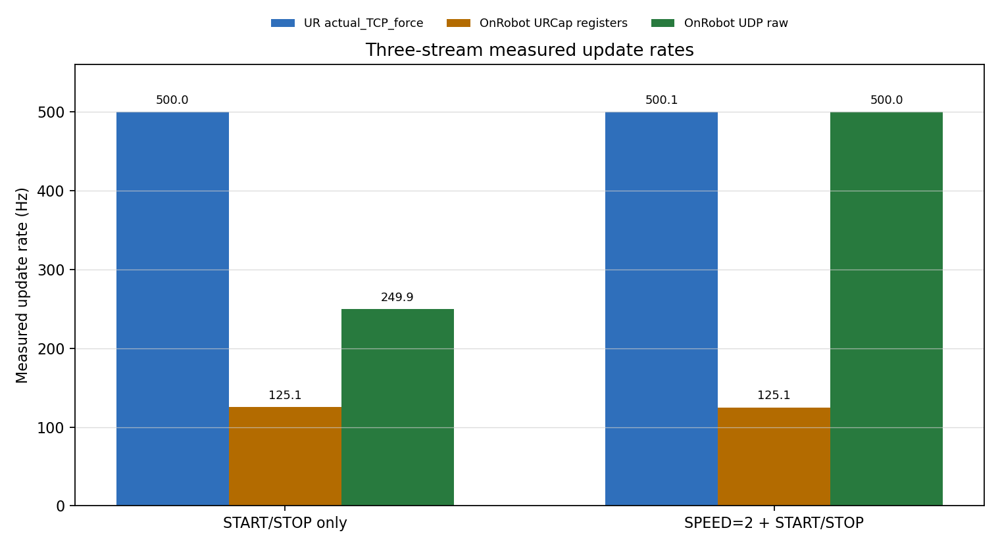
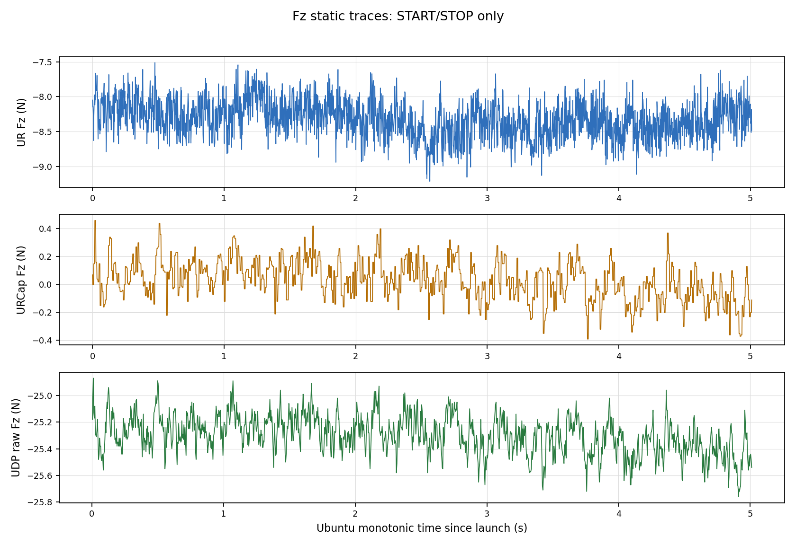
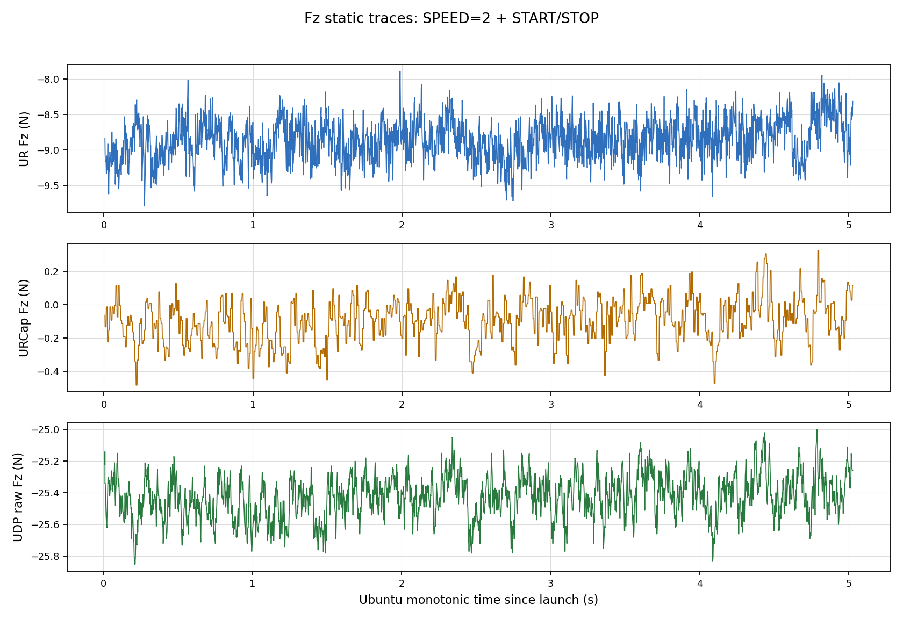
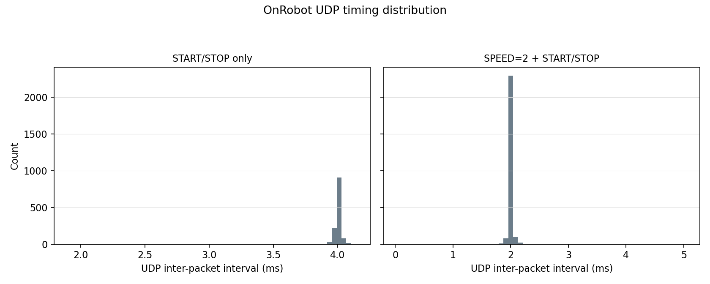

# OnRobot HEX 三路静态同步采集报告

日期：2026-05-28

## 实验目的

本实验要回答一个具体问题：在 UR10e 静止、无运动命令的条件下，OnRobot HEX 到底能以多高频率拿到数据，以及这个频率和 UR 自带 `actual_TCP_force`、URCap 寄存器出口是否是同一回事。

结论先写清楚：如果指 OnRobot Compute Box 的直连高速 UDP 原始流，本次 `SPEED=2` 后实测为 `499.9997 Hz`，即 500 Hz 级；如果指 OnRobot URCap / PolyScope 变量经 UR RTDE `output_double_register_24..29` 出口，本次实测约 `125 Hz`。UR `actual_TCP_force` 本次实测约 500 Hz，但它是 UR 内部力估计通道，不是 OnRobot HEX 本体的直接输出上限。

## 设备与实验条件

| 项目 | 条件 |
| --- | --- |
| 机器人 | UR10e |
| OnRobot 设备 | HEX-E v2 / Compute Box |
| UR 控制器地址 | `192.168.1.10` |
| OnRobot Compute Box 地址 | `192.168.1.1` |
| UR RTDE | 请求 `500 Hz` |
| OnRobot UDP | `49152` 高速数据流，控制端口按本次采集脚本发送 |
| 机器人状态 | 采集前后均为 `Program running: true`、`Robotmode: RUNNING`、`Safetymode: NORMAL` |
| 运动状态 | 无机器人运动命令、无 URScript 运动命令 |
| 接触状态 | 静态空载记录；本实验只验证通道更新率，不把力偏置当成接触力结论 |
| TCP / Payload | 本次未改写；不作为采样率判断条件 |
| Zero / Bias / Filter | 未发送 UR `zero_ftsensor()`，未发送 OnRobot `BIAS`，未发送 OnRobot `FILTER` |
| 数据窗口 | 每段约 5 s；完整采集窗口即本次 active logging window |

## 实验命令

主实验只改 OnRobot UDP 高速流的启动方式，不发送任何机器人运动命令。

| 条件 | UDP 命令序列 | 目的 |
| --- | --- | --- |
| `START/STOP only` | `START(0x0002, 3200)` -> `STOP(0x0000, 0)` | 测默认 UDP 高速流输出频率 |
| `SPEED=2 + START/STOP` | `SPEED(0x0082, 2)` -> `START(0x0002, 3200)` -> `STOP(0x0000, 0)` | 测 Compute Box 直连 UDP 能否达到 500 Hz |

## 数据与图片

图 1 对比三条通道的实测更新率。它是本报告的主图：`SPEED=2` 只改变 OnRobot Compute Box 直连 UDP 原始流，不改变 URCap 寄存器出口的 125 Hz 更新节奏。



图 2 是 `START/STOP only` 条件下的 Fz 静态曲线。三条曲线的偏置不同，说明它们不是同一个零点和补偿口径；本图用于检查通道存在和时间序列稳定性，不用于把三条 Fz 当成同一物理量直接比较。



图 3 是 `SPEED=2` 条件下的 Fz 静态曲线。UDP 原始流的点数增加到 500 Hz 级，但 URCap 寄存器出口仍保持约 125 Hz 的实际更新。



图 4 检查 OnRobot UDP 包间隔。`START/STOP only` 主要集中在 4 ms，`SPEED=2` 主要集中在 2 ms。



原始数据与摘要如下：

| 条件 | Summary | RTDE CSV | UDP CSV |
| --- | --- | --- | --- |
| `START/STOP only` | [summary](../experiments/20260528_static_three_stream_capture/start_stop_only_expected_125_250_500/start_stop_only_expected_125_250_500_summary_20260528_040832.json) | [rtde csv](../experiments/20260528_static_three_stream_capture/start_stop_only_expected_125_250_500/start_stop_only_expected_125_250_500_rtde_ur500_urcap125_20260528_040832.csv) | [udp csv](../experiments/20260528_static_three_stream_capture/start_stop_only_expected_125_250_500/start_stop_only_expected_125_250_500_onrobot_udp_raw_20260528_040832.csv) |
| `SPEED=2 + START/STOP` | [summary](../experiments/20260528_static_three_stream_capture/speed2_expected_125_500_500/speed2_expected_125_500_500_summary_20260528_040921.json) | [rtde csv](../experiments/20260528_static_three_stream_capture/speed2_expected_125_500_500/speed2_expected_125_500_500_rtde_ur500_urcap125_20260528_040921.csv) | [udp csv](../experiments/20260528_static_three_stream_capture/speed2_expected_125_500_500/speed2_expected_125_500_500_onrobot_udp500_raw_20260528_040921.csv) |

## 统计结果

协议表：

| 条件 | 角色 | OnRobot UDP `SPEED` | UDP START 数据 | 采集时长 | 可比较内容 | 不可直接比较内容 |
| --- | --- | ---: | ---: | ---: | --- | --- |
| `START/STOP only` | 默认 UDP 高速流基线 | `N/A` | `3200` | 约 5 s | 三通道更新率、包序号连续性 | 三通道 Fz 绝对偏置 |
| `SPEED=2 + START/STOP` | UDP 500 Hz 目标状态 | `2` | `3200` | 约 5 s | 三通道更新率、包序号连续性 | 三通道 Fz 绝对偏置 |

采样率与完整性统计：

| 条件 | UR RTDE rows | UR `actual_TCP_force` 更新率 (Hz) | OnRobot URCap 更新率 (Hz) | OnRobot UDP packets | OnRobot UDP 更新率 (Hz) | UDP seq delta | UDP sample-counter delta | 最大 TCP 线速度范数 | 最大 TCP 角速度范数 |
| --- | ---: | ---: | ---: | ---: | ---: | --- | --- | ---: | ---: |
| `START/STOP only` | `2506` | `499.9999` | `125.1497` | `1252` | `249.9090` | `+1: 1251` | `+4: 1251` | `9.19e-08` | `3.45e-07` |
| `SPEED=2 + START/STOP` | `2511` | `500.0815` | `125.1200` | `2509` | `499.9997` | `+1: 2508` | `+2: 2508` | `1.22e-07` | `4.59e-07` |

静态 Fz 描述统计只用于说明三条通道的偏置口径不同，不作为力值真值比较：

| 条件 | 通道 | Samples | Fz min (N) | Fz mean (N) | Fz std (N) | Fz max (N) |
| --- | --- | ---: | ---: | ---: | ---: | ---: |
| `START/STOP only` | UR `actual_TCP_force` | `2506` | `-9.2149` | `-8.3206` | `0.2681` | `-7.5139` |
| `START/STOP only` | OnRobot URCap registers | `2506` | `-0.3933` | `0.0279` | `0.1443` | `0.4567` |
| `START/STOP only` | OnRobot UDP raw | `1252` | `-25.7600` | `-25.2985` | `0.1442` | `-24.8700` |
| `SPEED=2 + START/STOP` | UR `actual_TCP_force` | `2511` | `-9.7951` | `-8.8603` | `0.2859` | `-7.8892` |
| `SPEED=2 + START/STOP` | OnRobot URCap registers | `2511` | `-0.4833` | `-0.0945` | `0.1336` | `0.3267` |
| `SPEED=2 + START/STOP` | OnRobot UDP raw | `2509` | `-25.8500` | `-25.4231` | `0.1349` | `-25.0000` |

通道定义：

| 标签 | 实际含义 | 本次可确认的最大/稳定更新率 |
| --- | --- | ---: |
| `ur_rtde_actual_tcp_force_500hz` | UR 控制器内部 `actual_TCP_force`，经 RTDE 读出 | 500 Hz 级 |
| `onrobot_urcap_registers_125hz` | OnRobot URCap / PolyScope 变量，经 UR RTDE double register 读出 | 125 Hz 级 |
| `onrobot_udp_raw_500hz` | OnRobot Compute Box 直连高速 UDP 原始/缩放数据流 | `SPEED=2` 后 500 Hz 级 |

## 结论

1. OnRobot HEX 的“最大”必须先区分出口。Compute Box 直连 UDP 原始流在本次 bench 上确认可到 500 Hz 级，实测 `499.9997 Hz`。
2. OnRobot URCap / PolyScope 变量经 UR RTDE 寄存器导出的链路不是 500 Hz，本次两段均稳定在约 125 Hz。
3. UR `actual_TCP_force` 约 500 Hz 是真实的 UR 内部力估计通道，但它不等于 OnRobot HEX 的直接原始输出。
4. 三条 Fz 的绝对偏置不同，不能在没有单独 zero/reference/compensation bridge 的情况下把它们当成同一个力值互相校准。

## 下一步

后续实验如果要用 OnRobot HEX 的最高直接数据率，应在日志协议里显式记录 `SPEED=2`，并把通道标成 `onrobot_udp_raw_500hz`。如果只通过 URCap/RTDE 寄存器拿 OnRobot 变量，应按 125 Hz 处理，不能上采样后称为新的 500 Hz OnRobot 数据。

若要比较 UR `actual_TCP_force` 与 OnRobot HEX 的力值，需要单独做一次静态零点、坐标系、重力/工具补偿口径的桥接实验；本报告只证明采样率和通道身份。

## 附录

### A. 采集字段

RTDE CSV 字段：

| 字段 | 含义 |
| --- | --- |
| `ur_fx_n` ... `ur_tz_nm` | UR `actual_TCP_force` 六维力/力矩 |
| `ur_vx_mps` ... `ur_wz_radps` | UR `actual_TCP_speed`，用于确认无运动 |
| `urcap_fx_n` ... `urcap_tz_nm` | OnRobot URCap / PolyScope double register 出口 |

UDP CSV 字段：

| 字段 | 含义 |
| --- | --- |
| `sequence_number` | OnRobot UDP 包序号 |
| `sample_counter` | OnRobot UDP 样本计数 |
| `status` | OnRobot UDP 状态字 |
| `fx_n` ... `tz_nm` | Compute Box UDP 原始/缩放力和力矩 |
| `fx_raw` ... `tz_raw` | Compute Box UDP raw integer 字段 |

### B. 命令与安全边界

本次没有发送机器人运动命令、URScript 运动命令、payload/TCP 写入、UR `zero_ftsensor()`、OnRobot `BIAS` 或 OnRobot `FILTER`。

OnRobot UDP 命令序列：

```text
START/STOP only:
  START 0x0002 data=3200
  STOP  0x0000 data=0

SPEED=2 + START/STOP:
  SPEED 0x0082 data=2
  START 0x0002 data=3200
  STOP  0x0000 data=0
```

### C. 旧报告状态

实验目录里的旧报告 [report_three_stream_static_capture_20260528.md](../experiments/20260528_static_three_stream_capture/report_three_stream_static_capture_20260528.md) 是本次 canonical 报告前的历史产物。以后引用这次结果时，应引用当前文件。
