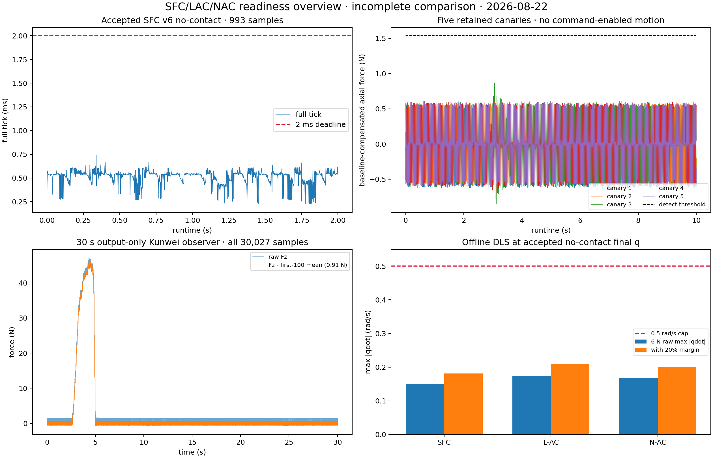
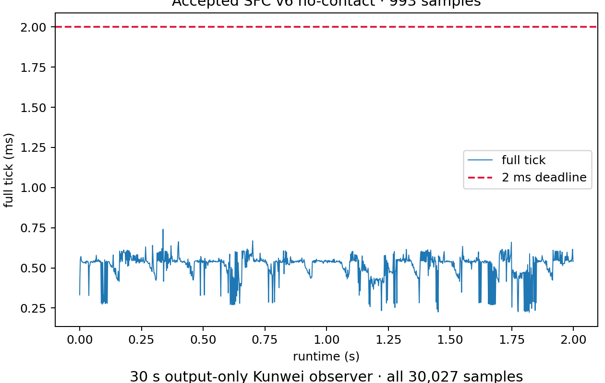
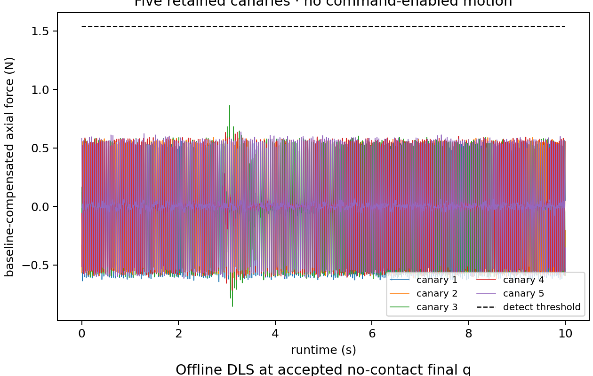
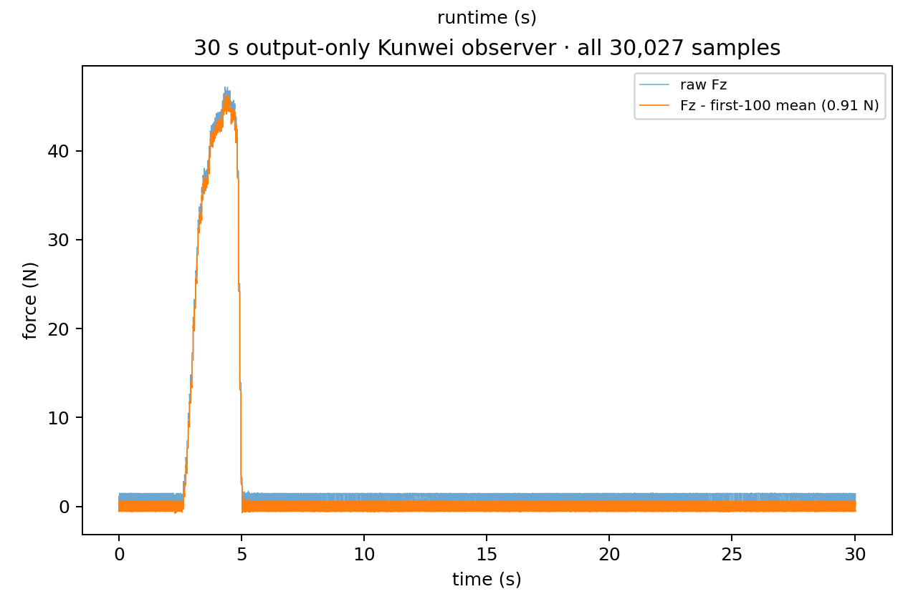
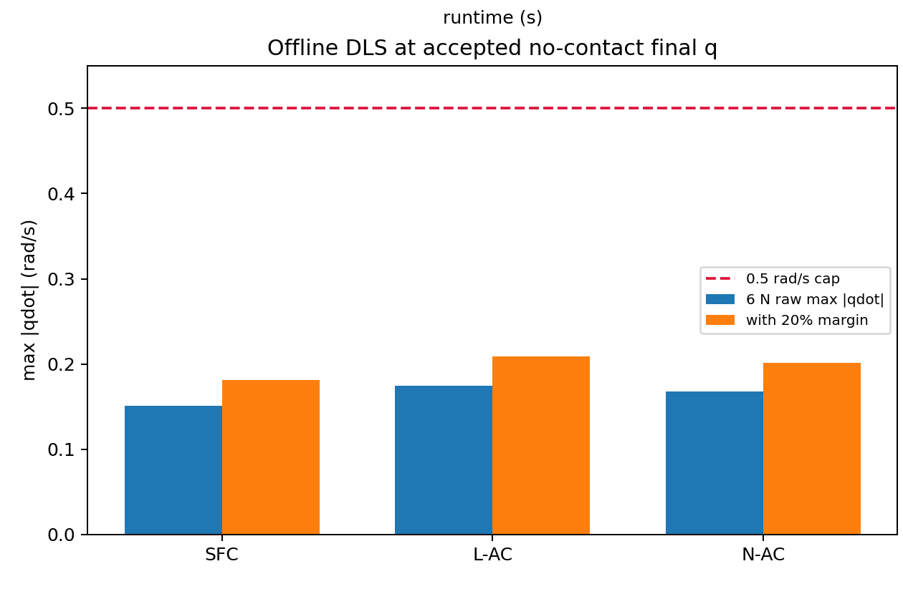

# SFC/LAC/NAC 上机准备审计（2026-08-22）

> **结论：incomplete comparison。** 今晚完成了 offline 三律 runtime/profile、TP candidate、fail-closed 菜单和证据审计；没有连接或运行机器人。SFC v6 的 no-contact 仍是有效历史 liveness/no-motion 证据，但当前未填充 89.6 g 纸盒必须重新建立 physical binding，故三律 moving phase 当前均不可执行。LAC/NAC 尚无 live evidence。

图 1 使用完整样本绘制：左上为 accepted no-contact 的 993 个 ticks，右上为 5 次 canary 的全量 force timeline，左下为 30 秒 observer 的 30,027 个样本，右下为同一 final q 下的 offline DLS。四个 panel 的 protocol role 不同，不能互相替代。

## 实验目的

审计既有 SFC live evidence，纠正 physical binding provenance，并为明日按 SFC → LAC → NAC 串行、逐 law 停下审计的上机流程准备固定入口和离线工件。本文支持的决定只有：哪些证据仍有效、哪些 gate 必须重做、明日最短安全顺序是什么。

## 设备与实验条件

| Segment | Law | Box state | Contact/command state | Duration | Samples | Rate | Comparable as |
|---|---|---|---|---:|---:|---:|---|
| v6 no-contact accepted | SFC | 当时 binding；现只保留历史作用 | no-contact；command/actual qdot 均为 0 | 1.999 s | 993 | 496.15 Hz | liveness/no-motion control |
| 5 × canary | SFC | 历史 setup 有变动 | `await_traction`；无 command-enabled motion | 各约 10 s | 4,955–4,970/run | 495.45–496.97 Hz | failed admission evidence |
| Kunwei observer | N/A | observer-only | 只读 sensor capture；无 RTDE input、Load/Play | 30.026 s | 30,027 | 1000.01 Hz | sensor visibility diagnostic |
| offline DLS | SFC/L-AC/N-AC | accepted no-contact final q | pure function + DLS；无 live | N/A | N/A | N/A | kinematic feasibility only |

当前物理状态锁定为**未填充纸盒，纸盒质量 89.6 g**。历史 `1.43 kg` 来自填充状态 wizard，且所谓 fresh read-back JSON 为事后手工落盘；它不再授权当前 moving phase。新的 `physical_binding_id` 必须同时覆盖 Payload/CoG wizard、RTDE Payload/CoG/TCP read-back、box state 与 RG2 UI fresh read-back。

共同 safety envelope 保持不变：force norm `12 N`、torque norm `3 Nm`、linear speed `0.08 m/s`、actual qdot acceptance `0.5 rad/s`、traction window `10 s`、dwell `0.1 s`。没有修改 fail-closed 阈值或 qualification logic。

## 数据与图片

主要 evidence：

- [accepted v6 no-contact summary](../../reproduction/sfc_ijrr2024_ws/runs/sfc_box_traction_v6/live/20260822T205229+0800_v6_no_contact_prefetch_gc_fifo20/summary.json)
- [30 秒 Kunwei observer summary](../../reproduction/sfc_ijrr2024_ws/runs/sfc_box_traction_v6/diagnostics/20260822T215212+0800_kunwei_30s_observer/summary.json)
- [physical binding correction receipt](../../reproduction/sfc_ijrr2024_ws/runs/sfc_box_traction_v6/audit/physical_binding_correction_20260822.json)
- [三律 stage registry](../../reproduction/sfc_ijrr2024_ws/config/control_law_stages_v1.json)
- [三律 offline numeric-sanity artifact](../../reproduction/sfc_ijrr2024_ws/runs/sfc_lac_nac_offline/numeric_sanity_20260822.json)

## 统计结果

### SFC v6 no-contact

| Samples | Duration (s) | Effective rate (Hz) | Heartbeat progress (Hz) | Max compute (ms) | Max full tick (ms) | Max command qdot | Max actual qdot | TCP drift from first (mm) | Acceptance |
|---:|---:|---:|---:|---:|---:|---:|---:|---:|---|
| 993 | 1.9994 | 496.15 | 476.64 | 0.247 | 0.741 | 0 | 0 | 0.174 | passed |

该 run 证明 v6 TP/RTDE 路径当时具备 live liveness、timing 与 no-motion closure；它不证明 traction，也不证明新的未填充 binding。

### 五次正式 canary

| Attempt | Samples | Duration (s) | Rate (Hz) | Peak `|axial force|` (N) | Max command qdot (rad/s) | Max actual qdot (rad/s) | Stop reason |
|---:|---:|---:|---:|---:|---:|---:|---|
| 1 | 4,969 | 9.998 | 496.89 | 0.644 | 0 | 0.000155 | `traction_not_detected` |
| 2 | 4,958 | 10.000 | 495.72 | 0.619 | 0 | 0.000126 | `traction_not_detected` |
| 3 | 4,955 | 9.998 | 495.49 | 0.861 | 0 | 0.000162 | `traction_not_detected` |
| 4 | 4,955 | 9.999 | 495.45 | 0.717 | 0 | 0.000096 | `traction_not_detected` |
| 5 | 4,970 | 9.999 | 496.97 | 0.637 | 0 | 0.000213 | `traction_not_detected` |

五次均未达到连续 0.1 秒 traction detection，故 controller command 始终未 enable。`3N` 是 `manual_exploratory` phase label，不是测得 3 N 的 claim。

### 30 秒 observer

observer 捕获 30,027 samples，first-last 30.026 s，1000.008 Hz，无 parse error。raw `Fz` 峰值约 `47.19 N`；以首 100 samples 均值 `0.91 N` 做 display-only baseline 后峰值约 `46.28 N`。该 signal 说明传感器可见明显人工载荷，但它没有 campaign identity、RTDE state 或 direction closure，不能 promotion 为 traction evidence。

### Offline 三律 DLS（6 N）

| Law | Paper fixed speed (m/s) | Raw max `|qdot|` (rad/s) | +20% margin (rad/s) | Shared cap (rad/s) | Offline result | Live no-contact |
|---|---:|---:|---:|---:|---|---|
| SFC | 0.052096 | 0.151262 | 0.181514 | 0.5 | pass | historical only; new binding required |
| L-AC | 0.060000 | 0.174211 | 0.209053 | 0.5 | pass | N/A — not run |
| N-AC | 0.057785 | 0.167779 | 0.201334 | 0.5 | pass | N/A — not run |

这些值由 `m7_live.numeric_sanity + Ur10eDlsAdapter` 从 retained final q、旧 run 中仍适用的 `tcp_xyz_m/traction_axis` geometry 与三个 profile 重新计算，并保存 source/profile SHA；**未使用旧 binding 的 rejected payload/CoG 字段**。它只说明当前 final q 下 6 N steady-state twist 的 DLS demand 低于 shared cap。12 N 时 L-AC steady speed 为 `0.12 m/s`，高于 `0.08 m/s` shared linear cap，因此 speed gate 仍是必要硬门。

## 已完成的 offline 变更

- 新增 versioned paper-law profile：显式记录 `control_law`、`paper_fixed`、`physical_binding_id` 与共同 envelope。
- 对**后续 comparison-profile runs**，live runtime 改为按 profile 选择现有 `BenchController`；新 tick、summary、envelope、anchor、admission 均绑定 law/binding identity，跨 law 或跨 binding admission fail-closed；actual TCP speed 与 actual qdot 也按 `0.08 m/s / 0.5 rad/s` 做逐 tick fail-stop。既有 v6 summary/envelope/anchor/admission 保持 historical legacy identity，仅作本文明确列出的历史证据，不能成为 current authorization。
- 保留 SFC v6 TP bytes；新增 L-AC/N-AC local TP triplet 和 internal-content validation。两者当前明确标为 `local_candidate_only`，明日 upload + fetched-back SHA closure 后才可称 package accepted。
- 新增 `sfc`、`lac`、`nac` 菜单及 canonical `.sh`；无参只进入菜单，不运动。disabled action 显示 blocker。
- operator 在 `await_traction` 第一帧响铃并提示“现在拉”，在 command 首次 enable 后提示继续保持；timeout 不降级。
- 新增 physical correction receipt；v1–v6、5 个 failed claims、raw observer 均保留未覆盖。

## 结论

**Observed fact：** v6 no-contact passed；5 次 SFC canary 均 `traction_not_detected` 且无 command-enabled motion；observer 见到约 47 N raw Fz；三律 offline DLS 均低于 0.5 rad/s cap。

**Authorization/readiness：** 当前 moving readiness 已失效为 `physical_rebind_required`。L-AC/N-AC package 只有 local validation。今晚没有生成任何 live acceptance。

**Limitation：** 本报告不是 SFC/LAC/NAC performance comparison；只有 SFC 历史 live no-contact/failed canary，LAC/NAC 没有 live cell，observer 也不是 campaign run。

## 下一步

按 [明日一页 runbook](sfc-lac-nac-runbook-20260823.md) 完成 physical binding 后，依次 SFC、L-AC、N-AC；每个 phase 独立 admission、独立 evidence、结束即回菜单审计。任一 identity、read-back、Safety、timing、force/torque、方向、滑移或 return gate 失败，保留 artifact 并停止该 law 后续阶段。

## 附录：入口与生成命令

用户入口：`sfc`、`lac`、`nac`；canonical compatibility：`sfc.sh`、`lac.sh`、`nac.sh`。代码完成后先执行了 `--status`、`--print-menu`、shell syntax、package internal-content 与 fake/offline tests；随后新增的 current operator session 已按本文末尾 addendum 执行并保留完整 live evidence。

先在 ROS 2 Humble environment 执行 `tools/build_comparison_numeric_sanity.py`，再执行 `tools/build_readiness_report_assets.py`，即可从 retained full-resolution evidence 与 numeric artifact 重建图表。明日 physical setup 另用一次 output-only RTDE state 为三个更新后 profile 生成 fresh bound numeric-sanity artifact；今晚 artifact 不替代该 live-readonly gate。

## 2026-08-23 live-session addendum

当前 binding 为未填充纸盒 `89.6 g`，payload/CoG wizard 与 RTDE fresh read-back 为
`1.57 kg / [4, 0, 74] mm`，RG2 UI fresh read-back 为 `20 N`。在当前 anchor 上新增并接受
了独立 `orientation-settle`：目标是把 tool-z 的水平投影作为姿态目标，保持零平移，5 s
窗口内姿态误差从 `0.06664 rad` 降至 `0.02646 rad`，最大 TCP 漂移 `0.157 mm`，最大实际
qdot `0.048 rad/s`，Safety/heartbeat/timing 均通过。随后 fresh no-contact 重新通过
（`993` samples，`495.8 Hz`，command qdot `0`，TCP 漂移 `0.132 mm`）并生成新 campaign。

该 campaign 的 away canary 随后保留为 `traction_not_detected`：10 s 内没有 active
samples，command qdot 始终为 `0`，峰值轴向力约 `0.62 N`。这表示本次没有形成持续的
远离-base 手动拉力，未执行 command-enabled traction motion；它不等于滑移或 SFC
响应已被否定。该一次性 admission 已消耗，重试必须重新完成 no-contact promotion。

## 2026-08-23 offline interactive-SFC revision

为响应“未检测到 traction 就始终零命令、不能形成实际人机交互”的问题，新增独立的
`sfc_box_traction_v7_interactive_100n` candidate。它不是对 v6 历史包的覆盖：

- 第一帧即进入 command-enabled SFC，固定 interactive window `20 s`；不使用 traction
  threshold、dwell、10 s timeout、wrong-direction 或 direction-valid qualification；
- interactive profile 的 force-norm hard stop 为 `100 N`，torque `3 Nm`、linear speed
  `0.08 m/s`、actual qdot `0.5 rad/s`、heartbeat、freshness、orientation 和 cage gate
  保持 fail-closed；
- paper Section 7.1.2 中的 `70 N` 只作为 external-impact/sample-time reference，不能
  直接当作 100 N 的安全证明；
- 离线 focused/runtime/operator 全部通过，workspace full suite 为 `195 tests passed`；
  v7 三件 TP bytes 的 SHA 与 manifest 一致，v6 三件 bytes SHA 保持不变；
- 当前 v7 仍是 `local_candidate_only`，尚未 upload/read-back，也没有 live motion。菜单在
  v7 package/read-back/current-stage closure 前保持 disabled；旧 v6 orientation/no-contact
  artifact 因 source SHA 改变而自动标记 stale，不能授权新 interactive run。

后续交互式 `sfc` 启动将把 tool-z `orientation-settle` 作为第一 live step：它基于
当前 fresh RTDE 姿态重新计算水平 tool-z 目标，完成后使旧 campaign/readiness timing
失效，强制重新 no-contact；`sfc --status/--json/--print-menu` 不触发运动。

## 2026-08-23 current operator session (final retained paths)

本次交互式 `sfc` 已按新入口完成自动第一步，且所有输出都有 session/operator log：

- session：`runs/sfc_box_traction_v6/operator_sessions/20260823T202306+0800_sfc_session.log`
- orientation-settle accepted：`runs/sfc_box_traction_v6/live/20260823T202308+0800_sfc_orientation_settle/summary.json`；
  5.0 s、`495.66 Hz`、姿态误差 `0.02631 → 0.01022 rad`、zero linear command、最大
  TCP 漂移 `0.278 mm`、最大实际 qdot `0.0207 rad/s`。
- fresh no-contact accepted：`runs/sfc_box_traction_v6/live/20260823T202439+0800_sfc_no_contact/summary.json`；
  `992` samples、`495.53 Hz`、command qdot `0`、最大 TCP 漂移 `0.117 mm`。
- away canary retained：`runs/sfc_box_traction_v6/live/20260823T202451+0800_operator_1269670/summary.json`；
  `9.998 s`、`traction_not_detected`、dynamic threshold `1.53485 N`、最大轴向力约
  `0.630 N`、active samples `0`、command qdot `0`。操作者确认本次没有施加持续远离
  base 的拉力，因此这是预期的 fail-closed no-traction 结果，不是滑移或控制器运动失败。

该 canary 的 sidecar 与证据日志均在同一 run 下：
`20260823T202451+0800_operator_1269670.operator.log`、
`20260823T202451+0800_operator_1269670.operator_events.jsonl`、
`live/20260823T202451+0800_operator_1269670/operator.log`、
`live/20260823T202451+0800_operator_1269670/operator_events.jsonl`。
日志中保留 WAIT、dynamic-threshold force、`3N exploratory (label-only)`、DWELL 和
SAFE HOLD 帧；`3N` 仍不是实测力 claim。

## 2026-08-23 latest low-force attempt

你按入口完成的下一次自动准备也已保留完整链路：

- orientation-settle：`runs/sfc_box_traction_v6/live/20260823T203321+0800_sfc_orientation_settle/summary.json`
  （5.00 s，`494.78 Hz`，姿态误差 `0.01026 → 0.00394 rad`）。
- fresh no-contact：`runs/sfc_box_traction_v6/live/20260823T203413+0800_sfc_no_contact/summary.json`
  （991 samples，`495.14 Hz`，command qdot `0`）。
- low-force away canary：`runs/sfc_box_traction_v6/live/20260823T203423+0800_operator_1270440/summary.json`。

本次自动流程的总 session log：
`runs/sfc_box_traction_v6/operator_sessions/20260823T203320+0800_sfc_session.log`；同一目录
的 `.json` manifest 记录 law、readiness、结束状态和每个 preparation/canary 命令。

这次确实检测到约 `3.92 N` 的远离-base 拉力并短暂进入 command，但随后因为
`cross_axis_command` fail-closed；最大 command qdot `0.00499 rad/s`、最大实际 qdot
`0.0115 rad/s`、最大 TCP 漂移 `0.202 mm`，没有形成可接受的 SFC motion evidence。
根因是旧 runtime 将 component-wise M1 vector state 直接用于斜向 traction axis；当前
binding 轴 `[0.88822345277, 0.459411686779, 0]` 的序列化数值又略非单位长度，因而
累积了横向 residual。现已修正为计算时严格归一化，并在 live seam 使用 scalar axial
M1 state 映射回 traction axis；raw component-wise candidate 只保留为诊断，cross-axis
guard 仍保持 fail-closed，原始 binding bytes 不变。

入口也已简化：`sfc` 先做 package fetch/read-back，再按 binding/profile hash 复用
accepted orientation/no-contact；只有 stale/mismatch 才重做，随后只显示“低力（约 3N，
远离 base）/退出”。终端进度为两行短条、2 Hz；完整帧仍写入 `operator_events.jsonl`，
不会丢诊断信息。

### Latest automatic preparation and timeout

新判定在 tool-z 已接近水平时通过：
`runs/sfc_box_traction_v6/live/20260823T210124+0800_sfc_orientation_settle/summary.json`
（初始 `0.000603 rad`，最终 `0.000155 rad`）。随后 fresh no-contact 通过：
`runs/sfc_box_traction_v6/live/20260823T210132+0800_sfc_no_contact/summary.json`。
低力入口已响铃提示，但 10 s 内没有持续远离-base 拉力，故
`runs/sfc_box_traction_v6/live/20260823T210157+0800_operator_1272573/summary.json`
以 `traction_not_detected` fail-closed，command qdot `0`；这不是控制器运动失败。

随后 `21:04:02` 的一次尝试在 `prewrite tick 2.39081 ms > 2 ms` 时
`timing_deadline_missed`；最大合力仅 `0.638 N`，command qdot 仍为 `0`。
该 failure 是 timing evidence，不是 force-limit 或传感器未读到力的结论。
