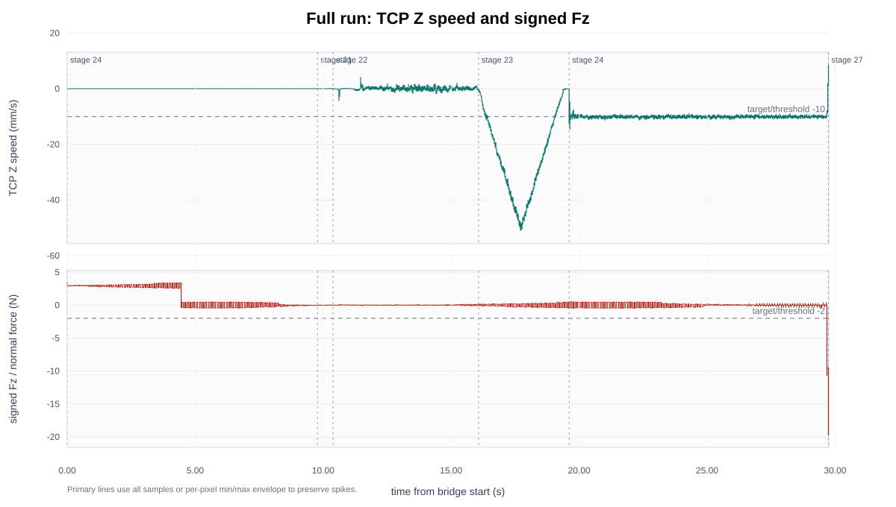
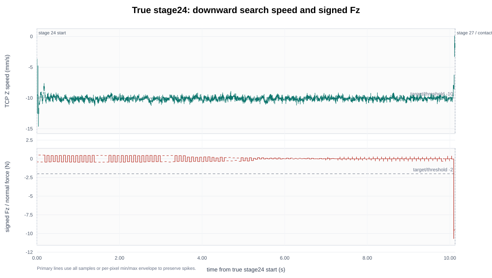
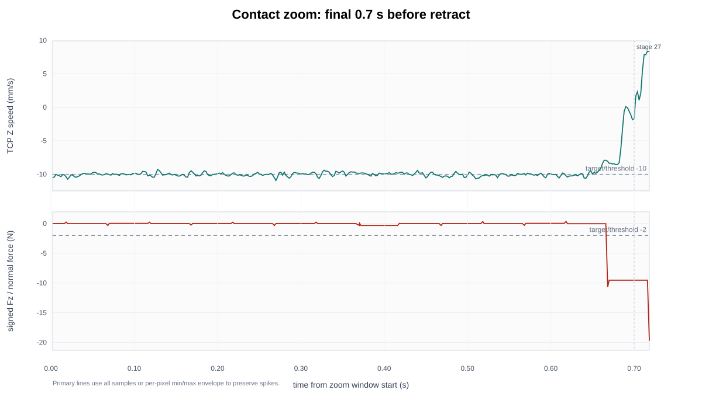

# Step2A 500Hz t10ms 速度与 Fz 记录

## 实验目的

本次实验验证 `speedl` hold time 从 `2 ms` 改成 `10 ms` 后，UR10e 是否能稳定执行 `10 mm/s` 末端 Z 向下降，同时保留 Kunwei raw 约 `1 kHz` 记录和 RTDE 约 `500 Hz` handoff。报告也回答一个控制实现问题：能否把 `speedl(..., t=10ms)` 每 `2 ms` 重发，做成类似 MPC 只执行开头一小段的形式。

## 设备与实验条件

| 字段 | 数值 |
| --- | --- |
| TP 程序 | `step2a_contact_search_500hz_nonblocking_stale100_z100_v10_acc500_t10ms.urp` |
| 程序 stamp | `2026-06-05T2323HKT_STEP2A_500HZ_NONBLOCKING_STALE100_Z100_V10_ACC500_T10MS_V1` |
| 下降命令 | `speedl([0,0,-0.010,0,0,0], a=0.500, t=0.010)` |
| 回撤命令 | `speedl([0,0,+0.050,0,0,0], a=0.500, t=0.010)` |
| 起始高度 | old contact Z + `100 mm` |
| 最大搜索深度 | `110 mm` |
| contact trigger | signed normal/Fz `<= -2 N` |
| hard guards | `|normal_force| > 12 N`, `force_norm > 50 N`, `torque_norm > 0.6 Nm`, stale `>100 ms` |
| Kunwei zero | bridge 软件 baseline，`baseline_s=5`；无 Kunwei 硬件 tare，未调用 UR `zero_ftsensor()` |
| bridge run | [bridge_step2a_500hz_nonblocking_stale100_z100_v10_acc500_t10ms_20260605_232736](../experiments/tase-contact-reproduction/runs/bridge_step2a_500hz_nonblocking_stale100_z100_v10_acc500_t10ms_20260605_232736) |
| bridge CSV | [bridge_rtde_500hz.csv](../experiments/tase-contact-reproduction/runs/bridge_step2a_500hz_nonblocking_stale100_z100_v10_acc500_t10ms_20260605_232736/bridge_rtde_500hz.csv) |
| Kunwei raw CSV | [kunwei_sensor_1khz.csv](../experiments/tase-contact-reproduction/runs/bridge_step2a_500hz_nonblocking_stale100_z100_v10_acc500_t10ms_20260605_232736/kunwei_sensor_1khz.csv) |

频率口径分开写：Kunwei raw sensor 是传感器到 Ubuntu 的记录频率；RTDE 是 Ubuntu 和 UR 控制器的数据 handoff；URScript motion gate 是 `speedl` 主循环实际执行节奏。这三个不能合并成一个“控制频率”。

## 数据与图片

图 1 是完整 bridge run 的速度和 signed Fz。前面一段 stage `24` 是 TP output register 的旧值残留，不作为真实下降窗口；真实下降窗口从 stage `23 -> 24` transition 后开始。

图 2 只显示 true stage24。速度从开始后约 `8 ms` 内到达 `-9 mm/s` 量级，之后稳定在 `-10 mm/s` 附近；接触前 Fz 基本围绕 0N，最后接触时快速下降。

图 3 放大接触前后。stage24 末端 Fz 快速超过 contact trigger，程序进入 stage27 回撤；bridge 最后一行因 raw normal force 超过 `12 N` hard guard 停止记录，但 UR safety 始终 NORMAL。

## 统计结果

### 频率与运行状态

| 项目 | 数值 |
| --- | ---: |
| Kunwei raw sensor rows | 30328 |
| Kunwei raw elapsed (s) | 29.758 |
| Kunwei raw rate (Hz) | 1019.137 |
| bridge writes | 15166 |
| bridge write rate (Hz) | 509.682 |
| RTDE output samples | 14879 |
| RTDE output rate (Hz) | 500.064 |
| RTDE reconnect events | 0 |
| Dashboard/safety result | UR safety remained NORMAL; final program stopped |
| bridge stop reason | `normal_force_guard` |

### Stage 窗口

| Stage | Rows | Duration (s) | Row rate (Hz) | Commanded Z (m/s) | Stop reason echo | Z start (mm) | Z end (mm) |
| --- | ---: | ---: | ---: | ---: | --- | ---: | ---: |
| 24 | 5177 | 9.776 | 529.483 | `-0.01` | `0.0` | 203.920 | 203.900 |
| 21 | 305 | 0.608 | 499.999 | `0.0` | `0.0` | 203.941 | 203.964 |
| 22 | 2841 | 5.680 | 500.000 | `0.0` | `0.0` | 203.952 | 203.978 |
| 23 | 1770 | 3.538 | 500.000 | `0.0` | `0.0` | 203.959 | 120.276 |
| 24 | 5064 | 10.126 | 500.000 | `-0.01` | `0.0` | 120.275 | 19.444 |
| 27 | 9 | 0.016 | 492.015 | `0.05` | `11.0` | 19.426 | 19.546 |

说明：上表第一段 stage `24` 是程序启动前 output register 保留值，不用于 true stage24 统计。true stage24 是 stage `23 -> 24` 之后的第二段 stage `24`，也就是图 2 的窗口。

### True Stage24 下降窗口

| 指标 | 数值 |
| --- | ---: |
| true stage24 rows | 5064 |
| true stage24 duration (s) | 10.126 |
| true stage24 row rate (Hz) | 500.000 |
| Z start (mm) | 120.275 |
| Z end (mm) | 19.444 |
| Z displacement (mm) | -100.831 |
| pose-derived average Z speed (mm/s) | -9.958 |
| actual_TCP_speed[2] mean (mm/s) | -10.069 |
| actual_TCP_speed[2] median (mm/s) | -10.096 |
| actual_TCP_speed[2] min/max (mm/s) | -14.616 / 0.103 |
| plateau speed mean/std (mm/s) | -10.107 / 0.306 |
| pre-contact plateau Fz mean/std (N) | -0.003 / 0.279 |
| stage24 Fz min/max (N) | -10.682 / 0.504 |
| echo transition rate during true stage24 (Hz) | 83.317 |
| echo median interval during true stage24 (ms) | 12.000 |

速度结论很直接：`10 ms` hold 版本的真实下降窗口平均速度为 `-9.96 mm/s`，plateau 均值为 `-10.11 mm/s`，已经接近目标 `-10 mm/s`。这和之前 `2 ms` hold 下接近 `-0.8 mm/s` 的结果形成明确对比。

Fz 结论也比较干净：接触前 plateau Fz 均值 `-0.003 N`、std `0.279 N`，没有明显噪音或持续偏置；接触末端 Fz 快速变负，触发程序接触 stop/retract。

## 关于“10ms command 每 2ms 重发”的判断

当前单线程 URScript 不能把 `speedl(..., t=0.010)` 当成“发一个 10ms 轨迹但每 2ms 取消并重发”的 MPC-like primitive。原因是 `speedl` 带 `t` 时会阻塞到函数返回；主线程在这 `10 ms` 内不能继续读寄存器、重新规划并再次调用 `speedl`。这次 true stage24 的 echo transition rate 约 `83.3 Hz`，median interval 约 `12.0 ms`，也说明 motion gate 不是 `500 Hz`。

因此这次证据支持的架构是：

| 层级 | 本次实测/设置 | 作用 |
| --- | ---: | --- |
| Kunwei raw sensor -> Ubuntu | `1019.1 Hz` | 保留原始 Fz/force/torque 证据 |
| Ubuntu bridge -> UR RTDE | `500.1 Hz` output；write 约 `509.7 Hz` | 高频 handoff 和事后对齐 |
| URScript motion gate | 约 `83.3 Hz` | 每次读取最新 register 后执行 `speedl(..., t=10ms)` |

如果后续要做真正 MPC-like “每 `2 ms` 重新规划，只执行开头”，需要另一个架构：例如外部实时控制接口、URScript 多线程/servoj/speedj 结构或 ROS 2 driver servo 路线，并且要重新设计 raw guard 和 stop 责任边界。不要把这个需求塞进当前单线程 `speedl(t=10ms)` 程序里。

## 结论

1. `speedl` hold time 从 `2 ms` 改到 `10 ms` 后，UR10e 实际 Z 速度已经达到目标 `10 mm/s` 量级，并且本次无明显噪音、无 UR fault。
2. 这次完整 run 同时证明 Kunwei raw 约 `1 kHz`、RTDE output 约 `500 Hz`、true stage24 row rate 约 `500 Hz`；但 motion gate 是约 `83-100 Hz`，不能把这些频率混成一个控制频率。
3. 接触前 Fz 干净，接触末端快速变负；程序进入 stage27，bridge 最终由 raw normal hard guard 停止记录，Dashboard safety 保持 NORMAL。
4. 当前结果支持继续用 `speedl(t=10ms, a=500 mm/s²)` 做 Step2A 接触搜索基线；不建议回到 `2 ms speedl`。

## 下一步

- 若继续调 motion primitive，下一组应比较 `10 ms` 与 `20 ms` hold，而不是先提高 acceleration。
- 若目标转为真正 MPC-like 每 `2 ms` 重发，需要单独设计新控制架构，并在报告里独立标记为新的实验路线。
- 下一次 bridge 可额外记录 controller log C-code snapshot，作为 fault-free run 的对照证据。

## 附录

### 复现实验命令口径

bridge 参数为 `--rtde-hz 500 --socket-timeout-s 0.0 --sensor-stale-s 0.10 --target-force-n 3 --normal-axis fz --normal-sign 1`。程序侧关键参数为下降 `10 mm/s`、回撤 `50 mm/s`、`speedl` acceleration `500 mm/s^2`、hold time `10 ms`。

### 主要原始文件

- [summary.json](../experiments/tase-contact-reproduction/runs/bridge_step2a_500hz_nonblocking_stale100_z100_v10_acc500_t10ms_20260605_232736/summary.json)
- [bridge_rtde_500hz.csv](../experiments/tase-contact-reproduction/runs/bridge_step2a_500hz_nonblocking_stale100_z100_v10_acc500_t10ms_20260605_232736/bridge_rtde_500hz.csv)
- [kunwei_sensor_1khz.csv](../experiments/tase-contact-reproduction/runs/bridge_step2a_500hz_nonblocking_stale100_z100_v10_acc500_t10ms_20260605_232736/kunwei_sensor_1khz.csv)
- [raw_frames.bin](../experiments/tase-contact-reproduction/runs/bridge_step2a_500hz_nonblocking_stale100_z100_v10_acc500_t10ms_20260605_232736/raw_frames.bin)
