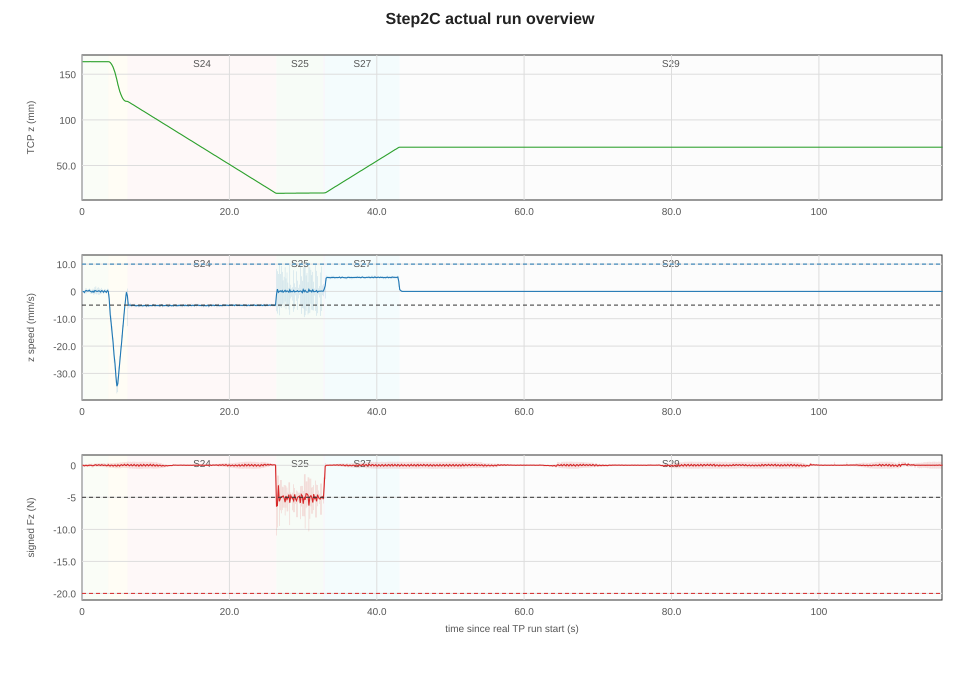
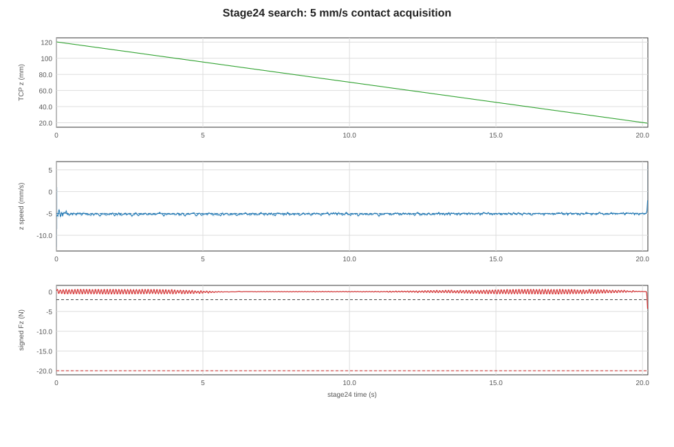
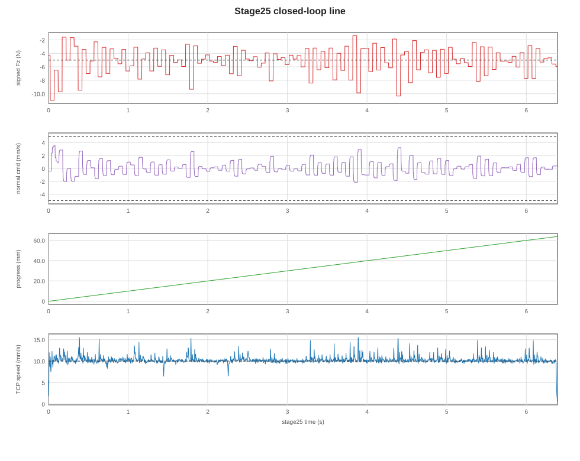
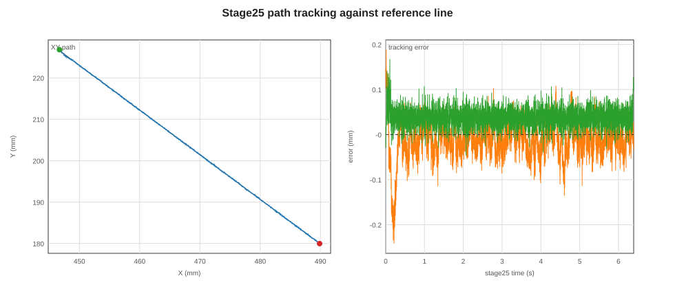
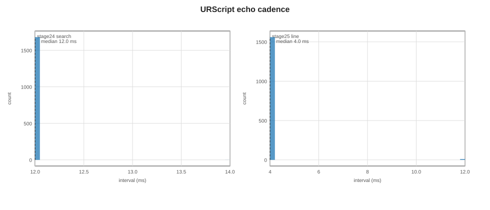
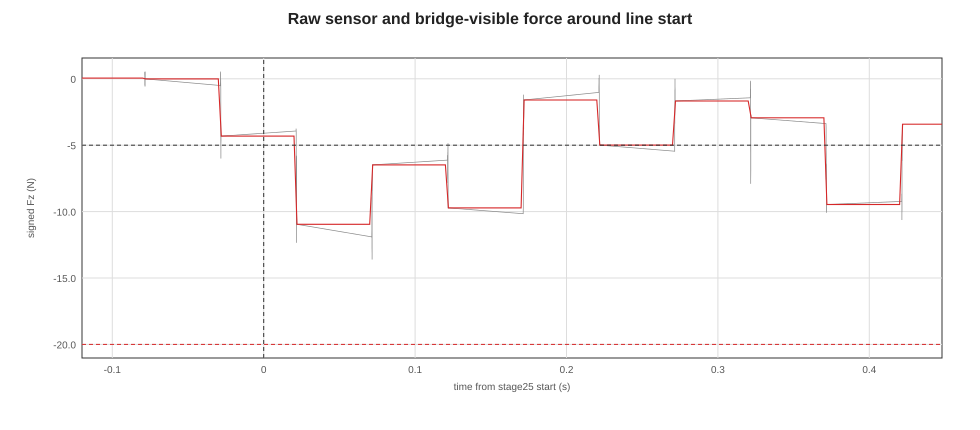

# Step2C Kunwei search5/guard20 line2ms 闭环直线实验

## 实验目的

本次实验验证 Kunwei KWR75B 外部力传感器能否支撑 UR10e Step2C 直线接触任务：先用较慢搜索速度找到接触，再沿参考直线运动并把 signed Fz 控制在 `-5 N` 附近。报告同时回答两个控制频率问题：

1. `500 Hz` RTDE bridge/logging 是否稳定。
2. URScript 侧 `speedl` 运动闭环是否真的达到 `500 Hz`。

频率口径必须分开：Kunwei raw sensor、Ubuntu bridge 写 RTDE input、UR RTDE output 日志、URScript stage echo/motion gate、实际闭环力控频率不是同一件事。

## 设备与实验条件

| 字段 | 数值 |
| --- | --- |
| TP 程序 | `step2c_aggressive_search5_guard20_line2ms_alpha70_vlim5_v1.urp` |
| 程序 stamp | `2026-06-06T2206HKT_STEP2C_AGGRESSIVE_SEARCH5_GUARD20_LINE2MS_ALPHA70_VLIM5_V1` |
| bridge run | [bridge_step2c_search5_guard20_line2ms_alpha70_vlim5_20260606_220817](../experiments/kunwei/closed-loop-straight-line/2026-06-04/runs/bridge_step2c_search5_guard20_line2ms_alpha70_vlim5_20260606_220817) |
| Kunwei zero | bridge 软件 baseline，`baseline_s=5`；未调用 Kunwei 硬件 tare，未调用 UR `zero_ftsensor()` |
| Kunwei route | TCP `192.168.50.25:5152`，Ubuntu `enp3s0` 上 `192.168.50.26/24` |
| bridge 参数 | `--rtde-hz 500 --socket-timeout-s 0.0 --sensor-stale-s 0.10 --target-force-n 5 --normal-axis fz --normal-sign 1 --max-normal-force-n 20` |
| search 命令 | `speedl([0,0,-0.005,0,0,0], a=0.500, t=0.010)`，即 `5 mm/s`、`500 mm/s²`、`10 ms` hold |
| line 命令 | `speedl([ux*0.010, uy*0.010, normal_velocity,0,0,0], a=0.500, t=0.010/0.002)` |
| line 切向速度/加速度 | `10 mm/s`、`500 mm/s²`；前 `0.10 s` 用 `10 ms` hold，之后切到 `2 ms` hold |
| force control | target signed Fz `-5 N`；`alpha=0.70`；`Kp=0.0006 m/s/N`；`Ki=0.00008 m/s/N/s`；normal velocity limit `±5 mm/s` |
| raw guards | `|normal_force| > 20 N`，`force_norm > 50 N`，`torque_norm > 0.6 Nm`，sensor stale `>100 ms` |
| reference line | [straight_line_reference.json](../experiments/kunwei/closed-loop-straight-line/2026-06-04/config/straight_line_reference.json)，长度 `63.58 mm`，XY unit `[0.679764156, -0.733430768]` |

本报告把 bridge 开始后、TP 真正进入 stage21 前的 `16646` 行 output register 残留排除。它们是上一轮 output register 的旧 stage 值，不代表本次程序正在运动。

## 数据与图片

图 1 是排除 pre-run 残留后的真实 TP run。stage24 是搜索接触，stage25 是闭环直线，stage26/27 是卸载与回撤，stage29 是程序结束后的稳定段。

图 2 放大 stage24。搜索速度为 `5 mm/s`，Fz 在接触前基本围绕 0N；接触触发线是 `-2 N`，hard guard 是 `-20 N`。

图 3 是 stage25 闭环直线。程序目标是 signed Fz `-5 N`，切向速度目标 `10 mm/s`，normal velocity 由 Kunwei Fz 的 PI 控制生成。

图 4 把 stage25 的实际 XY 路径和参考直线叠在一起。路径跟踪误差很小；本轮主要问题不在 XY 走线，而在接触进入 line 阶段后的力瞬态。

图 5 是 URScript echo heartbeat 的间隔分布。stage24 的主循环约 `12 ms` 一次；stage25 在切到 `2 ms` hold 后，实际 echo median 是 `4 ms`。

图 6 对齐 stage25 开始附近的 raw sensor Fz 和 bridge/controller-visible Fz。raw 1kHz 会看到更尖的瞬态，controller-visible RTDE 行看到的峰值较小；报告中的安全判断必须说明是哪一路。

## 统计结果

### Protocol 对照

| Run | 角色 | search speed | normal hard guard | 是否进入 stage25 | bridge stop reason | 关键观察 |
| --- | --- | ---: | ---: | --- | --- | --- |
| `bridge_step2c_aggressive_line2ms_alpha70_vlim5_20260606_220312` | 失败对照 | `10 mm/s` | `12 N` | 否 | `normal_force_guard` | stage24 接触瞬间 raw normal force 到 `-24.75 N`，不是 line controller 失败 |
| `bridge_step2c_search5_guard20_line2ms_alpha70_vlim5_20260606_220817` | 本次主 run | `5 mm/s` | `20 N` | 是 | `duration` | 程序完成 line、卸载、回撤；bridge 按 `150 s` duration 自然结束 |

### 频率与运行状态

| 层级 | 本次设置/实测 | 结论 |
| --- | ---: | --- |
| Kunwei raw sensor，全 bridge summary | `149985` samples，summary 约 `1 kHz` | 原始传感器记录为 kHz 级 |
| Kunwei raw sensor，真实 TP run 窗口 | `116699` rows，`1000.4 Hz` | 排除 pre-run 后仍为约 `1 kHz` |
| Ubuntu bridge 写 RTDE input | `75001` writes，`502.24 Hz` | 500Hz 级写入成立 |
| UR RTDE output 日志 | `74666` samples，`500.01 Hz` | 500Hz 级日志成立 |
| RTDE reconnect | `0` | 本次没有 RTDE reconnect 拖慢 |
| URScript stage24 echo | `83.33 Hz`，median `12.00 ms` | search motion gate 不是 500Hz |
| URScript stage25 echo | `246.55 Hz`，median `4.00 ms` | line motion gate 约 250Hz，不是 500Hz |

结论必须写保守：本次证明了 Kunwei raw、bridge write、RTDE output 可以稳定在高频；但真实 stage25 URScript echo/motion gate 是约 `246 Hz`，不能称为 `500 Hz` 机器人运动闭环。

### Stage 窗口

| Stage | 作用 | Duration (s) | Row rate (Hz) | Echo rate (Hz) | Z start/end (mm) | TCP speed mean (mm/s) | Fz min/mean/max (N) |
| --- | --- | ---: | ---: | ---: | --- | ---: | --- |
| 21 | 姿态对齐 | `0.224` | `500.00` | N/A | `163.76 -> 163.74` | `0.02` | `-0.20 / 0.01 / 0.19` |
| 22 | XY 到参考起点 | `3.354` | `500.00` | N/A | `163.77 -> 163.74` | `24.72` | `-0.37 / 0.00 / 0.40` |
| 23 | 到 old contact Z + 100mm | `2.604` | `500.00` | N/A | `163.74 -> 120.28` | `16.82` | `-0.47 / -0.01 / 0.53` |
| 24 | search down | `20.184` | `500.00` | `83.33` | `120.31 -> 19.54` | `5.14` | `-4.31 / 0.01 / 0.57` |
| 25 | closed-loop line | `6.392` | `500.00` | `246.55` | `19.54 -> 19.95` | `10.26` | `-10.96 / -5.13 / -1.38` |
| 26 | unload | `0.184` | `500.00` | `250.00` | `19.96 -> 20.08` | `1.34` | `-5.96 / -3.38 / 0.37` |
| 27 | retract | `10.156` | `500.00` | N/A | `20.04 -> 70.02` | `5.05` | `-0.56 / 0.01 / 0.57` |
| 29 | final stopped | `73.596` | `500.00` | N/A | `70.04 -> 70.07` | `0.00` | `-0.56 / 0.01 / 0.58` |

### Stage25 力控效果

| Window | Rows | Duration (s) | Fz mean/median/std (N) | Fz min/max (N) | Signed error mean (N) | Error MAE (N) | \|error\| p95 (N) | Normal cmd min/mean/max (mm/s) |
| --- | ---: | ---: | --- | --- | ---: | ---: | ---: | --- |
| stage25 full | `3197` | `6.392` | `-5.13 / -4.89 / 1.96` | `-10.96 / -1.38` | `-0.13` | `1.57` | `3.62` | `-2.15 / 0.08 / 3.56` |
| after first `0.5 s` | `2947` | `5.892` | `-5.08 / -4.87 / 1.80` | `-10.32 / -1.38` | `-0.08` | `1.46` | `3.35` | `-2.15 / 0.06 / 3.23` |
| after first `1.0 s` | `2697` | `5.392` | `-5.10 / -4.87 / 1.80` | `-10.32 / -1.38` | `-0.10` | `1.45` | `3.35` | `-2.15 / 0.07 / 3.23` |

均值层面，stage25 已经围绕 `-5 N` 工作；但波动仍然偏大，尤其 stage25 开始附近出现 controller-visible `-10.96 N`，raw 1kHz 在 stage25 窗口内最低到 `-13.93 N`。因此下一轮重点不是先追更高频率，而是降低进入 line 阶段的力瞬态和稳态波动。

### 路径跟踪

| 指标 | 数值 |
| --- | ---: |
| path progress | `0.00 -> 63.60 mm` |
| XY error mean | `0.054 mm` |
| XY error p95 | `0.100 mm` |
| XY error max | `0.247 mm` |
| cross-track abs mean | `0.032 mm` |
| cross-track abs p95 | `0.080 mm` |
| along-line abs p95 | `0.074 mm` |

路径结果比力控结果更干净。当前 `speedl([ux*0.010, uy*0.010, normal_velocity,...])` 对 XY 参考线的跟踪已经足够好；下一步不要为了路径误差去改 tangent speed 或参考线，先调接触进入和 normal force controller。

## 结论

1. `search5 + guard20` 解决了之前“一接触就停”的主要问题。失败对照没有进入 stage25，停在 stage24 的 `normal_force_guard`；本次主 run 成功进入 stage25 并完成直线、卸载、回撤。
2. 本次 RTDE 链路是干净的：bridge 写入约 `502 Hz`，RTDE output 约 `500 Hz`，RTDE reconnect 为 `0`。
3. 本次不能称为 `500 Hz` 机器人运动闭环。stage25 的 URScript echo cadence 是约 `246.55 Hz`，median `4.00 ms`；这更接近 `250 Hz`。
4. 力控已经能把 signed Fz 的均值拉到 `-5 N` 附近，但波动仍大，stage25 full 的 error MAE 为 `1.57 N`，after `0.5 s` 后仍为 `1.46 N`。
5. XY 路径误差很小，mean `0.054 mm`、p95 `0.100 mm`；当前调参瓶颈是接触力瞬态和 Fz 波动，不是走线精度。

## 下一步调参建议

下一轮默认不要先追 `500 Hz`。先把力控稳定性做稳，再判断是否值得换控制架构。

推荐 program 版本：在 contact trigger 和 stage25 line 之间加入一个 settle stage。

| 参数 | 建议值 | 理由 |
| --- | ---: | --- |
| search speed | `5 mm/s` | 本轮已验证可避免接触瞬间 hard guard |
| search acceleration | `500 mm/s²` | 当前没有触发 UR fault，保留 |
| raw normal hard guard | `20 N` | 本轮 raw stage25 最低 `-13.93 N`，仍有余量 |
| settle duration | 最多 `0.5 s` | 先消化接触瞬态，不立刻加 XY tangent motion |
| settle completion | signed Fz 连续 `100 ms` 落在 `[-6, -4] N` | 避免只靠单点过零 |
| line alpha | `0.50` | 比 `0.70` 更稳，减少对 raw spike 的放大 |
| line Kp | `0.0005 m/s/N` | 比 `0.0006` 稍保守，先降低过冲 |
| line Ki | `0.00008 m/s/N/s` | 先不改积分项，避免同时改太多变量 |
| normal velocity limit | `±3 mm/s` | 降低 Z correction 的峰值动作 |
| tangent speed | `10 mm/s` | 路径跟踪和任务长度已经可用，不先改 |
| line acceleration | `500 mm/s²` | 本轮可运行；不要回到 `2000/5000 mm/s²` |

如果只做最小改动，不加 settle stage，则优先把 normal velocity limit 从 `±5 mm/s` 降到 `±3 mm/s`，同时 alpha 从 `0.70` 降到 `0.50`。但这只是抑制控制动作，不能像 settle stage 那样专门处理 stage25 开始时的接触瞬态。

频率路线单独处理：如果后续目标必须是机器人侧 `500 Hz` 运动闭环，当前单线程 `speedl` 程序不是充分证据。需要另开路线比较 `servoj/speedj`、URScript 多线程或外部实时控制接口，并重新定义 raw guard 与 stop authority。

## 附录

### 原始文件

- [summary.json](../experiments/kunwei/closed-loop-straight-line/2026-06-04/runs/bridge_step2c_search5_guard20_line2ms_alpha70_vlim5_20260606_220817/summary.json)
- [metadata.json](../experiments/kunwei/closed-loop-straight-line/2026-06-04/runs/bridge_step2c_search5_guard20_line2ms_alpha70_vlim5_20260606_220817/metadata.json)
- [bridge_rtde_500hz.csv](../experiments/kunwei/closed-loop-straight-line/2026-06-04/runs/bridge_step2c_search5_guard20_line2ms_alpha70_vlim5_20260606_220817/bridge_rtde_500hz.csv)
- [kunwei_sensor_1khz.csv](../experiments/kunwei/closed-loop-straight-line/2026-06-04/runs/bridge_step2c_search5_guard20_line2ms_alpha70_vlim5_20260606_220817/kunwei_sensor_1khz.csv)
- [analysis-metrics.json](assets/step2c-kunwei-search5-guard20-line2ms/analysis-metrics.json)

### 失败对照文件

- [failed summary.json](../experiments/kunwei/closed-loop-straight-line/2026-06-04/runs/bridge_step2c_aggressive_line2ms_alpha70_vlim5_20260606_220312/summary.json)
- [failed metadata.json](../experiments/kunwei/closed-loop-straight-line/2026-06-04/runs/bridge_step2c_aggressive_line2ms_alpha70_vlim5_20260606_220312/metadata.json)

### Bridge 命令口径

本次主 run 的 bridge 命令口径为：Kunwei TCP stream enabled，写 UR RTDE input registers，`baseline_s=5`，`rezero_s=1`，`duration_s=150`，`rtde_hz=500`，`socket_timeout_s=0.0`，`sensor_stale_s=0.10`，`target_force_n=5`，`normal_axis=fz`，`normal_sign=1`，`max_normal_force_n=20`。

### 环境修复记录

报告生成前修复了本机 Python ABI 冲突：移除了 user-site 的 pip `numpy 2.2.6`，默认 `/usr/bin/python3` 现在加载 apt 自洽组合 `numpy 1.21.5`、`pandas 1.3.5`、`matplotlib 3.5.1`。matplotlib smoke test 已成功保存 `/tmp/codex_matplotlib_smoke.png`。
