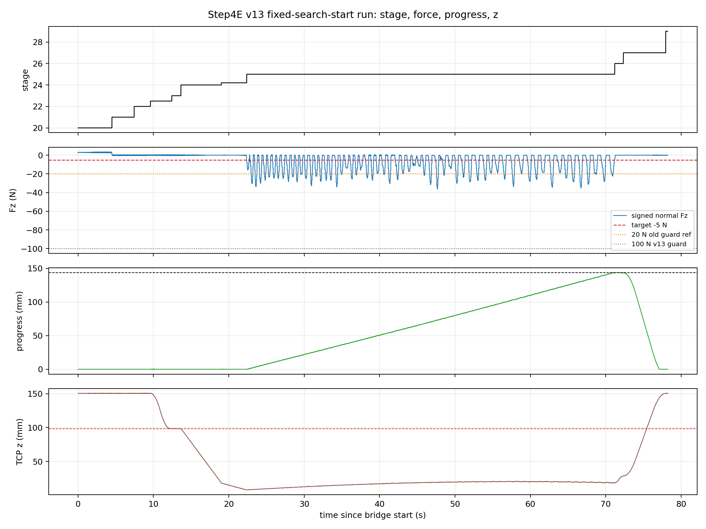
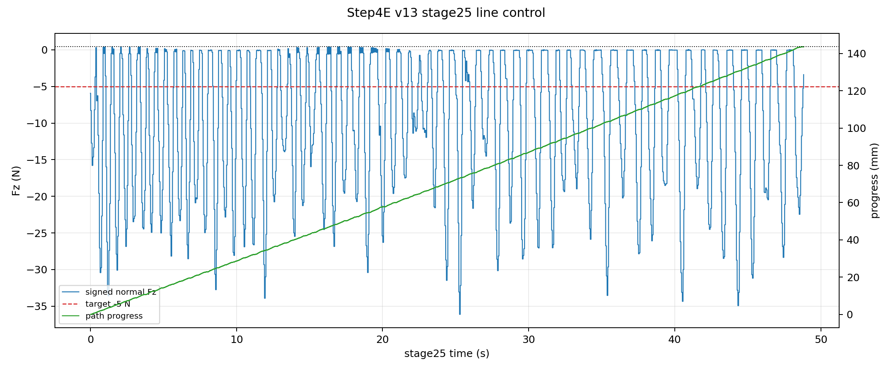
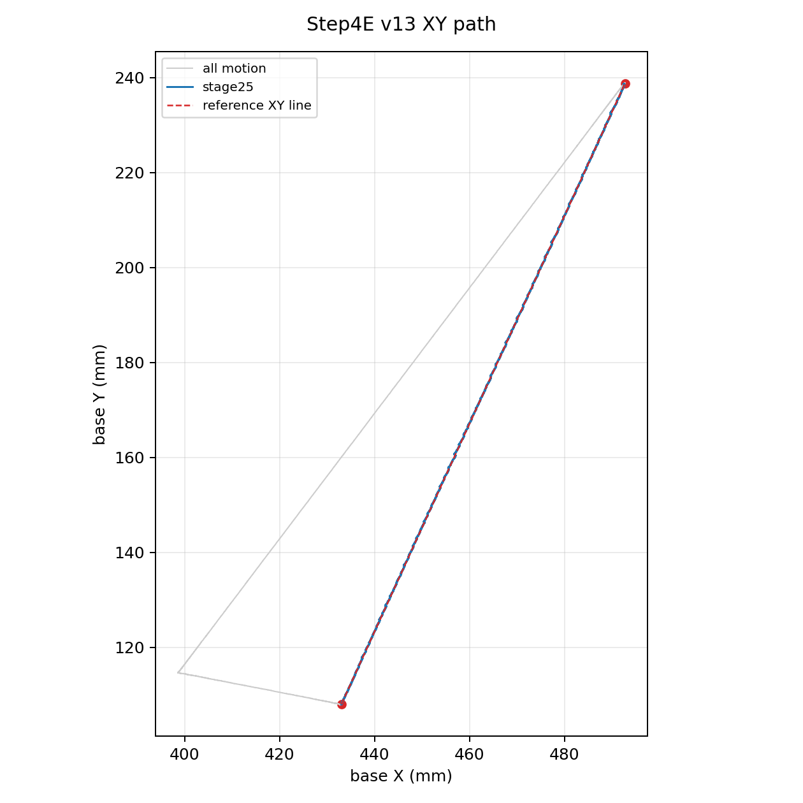

# Step4E v13 fixed search-start 直线外环实验报告

## 实验目的

这次实验解决 Step4E v12 暴露出的一个程序状态机问题：v12 的 contact search 从当前 TCP 高度开始计深度，若 TP 程序开始时 TCP z 过高，`max_search_down_m=92 mm` 会先到达深度上限而不是接触面，导致程序不进入 line-control stage。

v13 的改动是把 search 起点固定到已验证的 no-contact 高度 `z=0.09835 m`。程序流程变为：高位姿态/XY 进入 -> 移动到固定 search-start z -> entry-pose software re-zero -> two-stage contact search -> stage25 line outer-loop -> unload/retract/home。

本报告只评价这一次 v13 run。它证明 v13 修复了 v12 的 no-contact miss，并完成整条 line；它不证明 5N force quality 已收敛。

## 程序与数据

| 项目 | 值 |
|---|---|
| TP program | `/programs/andyl/kunwei/step4/step4e_line_outerloop_v13.urp` |
| program stamp | `2026-06-09T1409HKT_STEP4E_LINE_OUTERLOOP_V13` |
| source commit | `09c49ff Add Step4e v13 fixed search start` |
| run dir | [bridge_step4e_line_outerloop_v13_autowatch_20260609_141027](../experiments/kunwei/closed-loop-straight-line/2026-06-04/runs/bridge_step4e_line_outerloop_v13_autowatch_20260609_141027) |
| bridge summary | [summary.json](../experiments/kunwei/closed-loop-straight-line/2026-06-04/runs/bridge_step4e_line_outerloop_v13_autowatch_20260609_141027/summary.json) |
| bridge CSV | [bridge_rtde_500hz.csv](../experiments/kunwei/closed-loop-straight-line/2026-06-04/runs/bridge_step4e_line_outerloop_v13_autowatch_20260609_141027/bridge_rtde_500hz.csv) |
| Kunwei raw CSV | [kunwei_sensor_1khz.csv](../experiments/kunwei/closed-loop-straight-line/2026-06-04/runs/bridge_step4e_line_outerloop_v13_autowatch_20260609_141027/kunwei_sensor_1khz.csv) |
| derived metrics | [metrics.json](assets/step4e-v13-fixed-search-start/metrics.json) |

Controller delivery was verified before the run: local and controller SHA matched for the v13 `.script/.txt/.urp` package, and fetched-back `.urp` cache contained the v13 stamp, `fixed_search_start_z_m = 0.09835`, stage `22.5`, the same-named script reference, and `installationRelativePath="../../../default"`.

## v12 问题和 v13 修复

v12 failure was not a bridge failure. The bridge ran at 500Hz and the robot stayed in `NORMAL` safety mode. The failure was geometric/stateful:

| run | start TCP z | lowest search z | contact evidence | stop |
|---|---:|---:|---|---|
| v12 | about `150.5 mm` | about `58.5 mm` | no contact, max force norm about `0.51 N` before retract | `stop_reason=8`, max search depth |
| v13 | about `150.5 mm`, then fixed search-start `98.35 mm` | about `8.0 mm` | contact trigger in stage24.2, then stage25 line-control | UR stop reason `1`, success |

The essential v13 fix is stage `22.5`: before search, the URP explicitly moves from the high entry pose down to `z=98.35 mm`. After that, the same `92 mm` search window reaches the known contact region.

## Figures

Figure 1 shows the whole run. The important signature is stage `22.5` descending to fixed search-start z, stage `24/24.2` finding contact, stage `25` running line-control, then stage `26/27` unload/retract/home.

Figure 2 zooms into stage25. The path progress reaches the full line, but force regulation is aggressive and overshoots the `-5 N` target for much of the line.

Figure 3 shows XY path tracking. The line geometry is fine; the current limitation is force quality, not XY tracking.

## Stage Summary

| Stage | Meaning | Duration (s) | TCP z range (mm) | Fz min/mean/max (N) | max force norm (N) | max torque (Nm) |
|---|---|---:|---|---|---:|---:|
| 20 | wait/fresh bridge start | `4.493` | `150.41..150.53` | `0.46 / 2.96 / 3.46` | `9.86` | `0.372` |
| 21 | reference orientation | `2.944` | `150.37..150.59` | `-0.50 / -0.00 / 0.48` | `0.83` | `0.017` |
| 22 | XY entry at high z | `2.158` | `150.33..150.59` | `-0.48 / -0.02 / 0.46` | `0.82` | `0.016` |
| 22.5 | fixed search-start z | `2.836` | `98.30..150.49` | `-0.47 / 0.03 / 0.50` | `0.84` | `0.017` |
| 23 | entry re-zero | `1.202` | `98.30..98.41` | `-0.48 / -0.01 / 0.47` | `0.86` | `0.017` |
| 24 | far search | `5.364` | `18.28..98.36` | `-0.49 / 0.01 / 0.42` | `0.54` | `0.016` |
| 24.2 | near search/contact | `3.364` | `8.00..18.28` | `-5.93 / -0.08 / 0.48` | `6.01` | `0.073` |
| 25 | line outer-loop | `48.818` | `7.99..20.78` | `-36.12 / -9.75 / 0.42` | `36.26` | `0.564` |
| 26 | unload | `1.142` | `18.55..28.48` | `-3.39 / -0.15 / 0.04` | `3.52` | `0.061` |
| 27 | retract/home | `5.616` | `28.45..150.49` | `-0.32 / 0.01 / 0.38` | `0.80` | `0.015` |
| 29 | final stopped | `0.264` | `150.43..150.53` | `-0.22 / -0.03 / 0.10` | `0.67` | `0.008` |

UR output stop reason reached `1.0` in stage26/27, so the URP completed normally. The bridge summary has `stop_reason="signal_sigint"` because the operator lifecycle stops the Ubuntu bridge after the TP program stops; that is expected and is not a robot failure.

## Frequency Contract

| Layer | Result | Interpretation |
|---|---:|---|
| Kunwei raw CSV | `78,717` rows over `78.20 s`, about `1006.7 Hz` | Raw sensor logging is about 1kHz |
| bridge write timing | `503.37 Hz` | Ubuntu bridge wrote RTDE input at 500Hz class |
| RTDE output timing | `500.00 Hz` | RTDE output logging stayed at 500Hz class |
| RTDE reconnects | `0` | No reconnect-induced slowdown |
| stage24 far search echo | about `249.81 Hz` | URScript stage echo, not internal servo-loop |
| stage24.2 near search echo | about `247.32 Hz` | URScript stage echo, not internal servo-loop |
| stage25 line-control echo | about `249.23 Hz` | Measured URScript echo/motion gate, not 500Hz internal control proof |

This run again separates the frequency layers. It supports 500Hz bridge/write/logging, but the measured stage25 URScript echo cadence is about 250Hz.

## Line-Control Result

| Metric | Value |
|---|---:|
| nominal line length | `143.747 mm` |
| max bridge progress | `143.618 mm` |
| progress at stage26 transition | `143.602 mm` |
| stage25 duration | `48.818 s` |
| stage25 Fz mean/median/std | `-9.75 / -7.37 / 9.77 N` |
| stage25 Fz min/max | `-36.12 / 0.42 N` |
| stage25 signed error mean vs `-5 N` | `-4.75 N` |
| stage25 absolute error MAE | `8.54 N` |
| stage25 absolute error p95 | `22.34 N` |
| stage25 force norm max | `36.26 N` |
| stage25 torque norm max | `0.564 Nm` |
| stage25 command `vz` min/mean/max | `-1.84 / 0.20 / 3.73 mm/s` |

The line completed, but force quality is not acceptable if the target is stable `5 N` normal load. v13 spent much of stage25 more negative than `-5 N`, with a worst controller-visible normal force of about `-36 N`. This stayed below the temporary `100 N` raw normal guard and below the `1.0 Nm` torque guard, but it is clearly too aggressive for the final controller.

## Path Tracking

| Metric | Value |
|---|---:|
| XY error mean | `0.050 mm` |
| XY error p95 | `0.137 mm` |
| XY error max | `0.313 mm` |
| cross-track abs mean | `0.050 mm` |
| cross-track abs p95 | `0.137 mm` |

XY tracking is good. The v13 problem is force regulation, not line geometry or UR IK for the XY path.

## Conclusion

v13 is the correct checkpoint for ending this session:

1. It fixes v12's height-dependent no-contact miss.
2. It opens as a normal TP `.urp` package and was verified through controller read-back.
3. It enters stage25 and completes the full `143.7 mm` line with UR stop reason `1`.
4. It retracts and returns home, with safety mode remaining `NORMAL`.
5. It preserves the frequency evidence: bridge/write/logging are 500Hz class, while URScript echo is about 250Hz.

Do not describe v13 as a final 5N force-quality result. It is a successful program-flow and path-completion baseline with poor force regulation. The next controller iteration should reduce normal-force aggressiveness before any claim of paper-style force control quality.

## Suggested Next Tuning Direction

Use v13 as the baseline scaffold and tune only force behavior:

| Change | Suggested direction |
|---|---|
| normal hard guard | bring back down from `100 N` after debugging, likely `30..50 N` before final demos |
| target acquisition | add or strengthen a settle stage before XY tangent motion |
| force gain | reduce `Kp` or normal velocity limit; current v13 is too aggressive |
| line speed | keep XY speed unchanged for now, since path tracking is good |
| completion logic | keep v13 endpoint success logic; it works |
| fixed search-start z | keep `0.09835 m` until a better measured pre-contact height is defined |

The next version should aim for normal force near `-5 N` with p95 absolute error below about `3..5 N` before increasing speed or changing frequency architecture.
