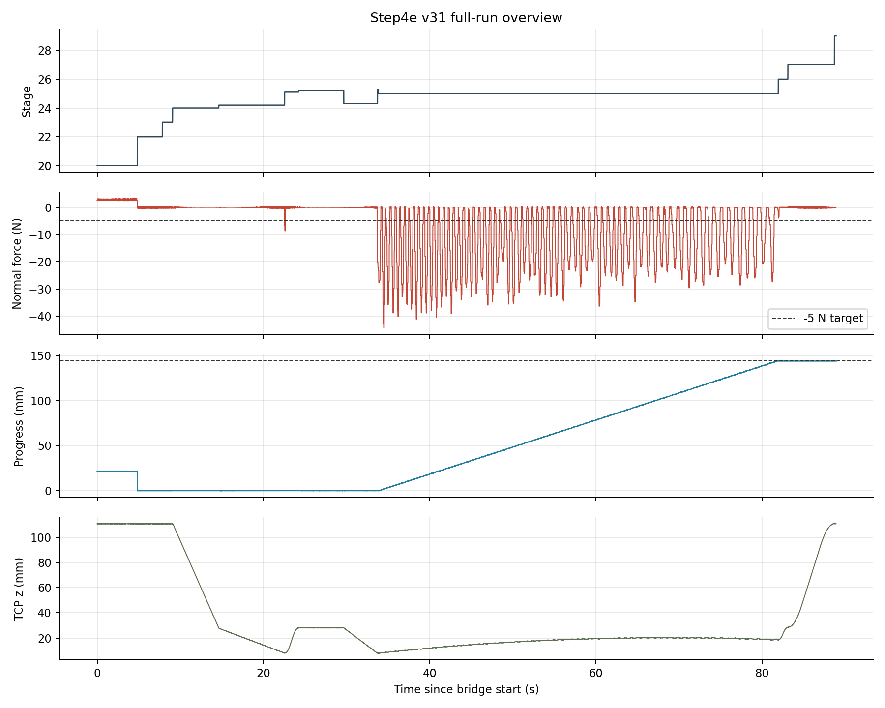
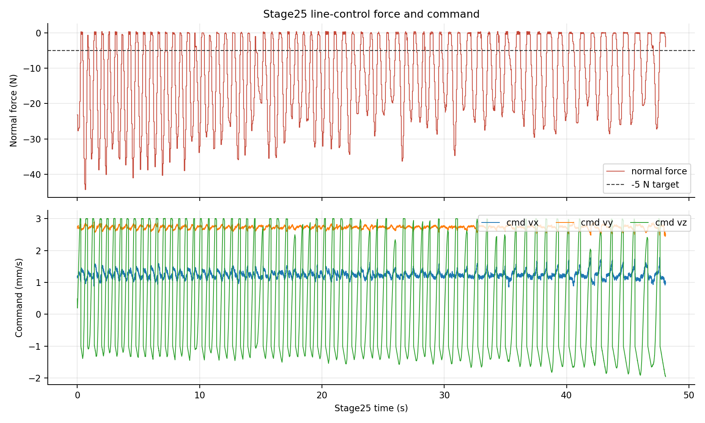
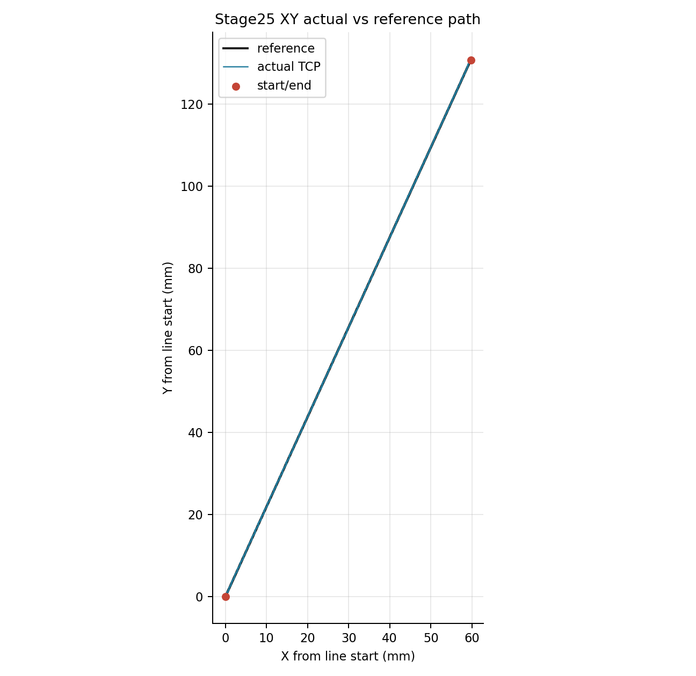
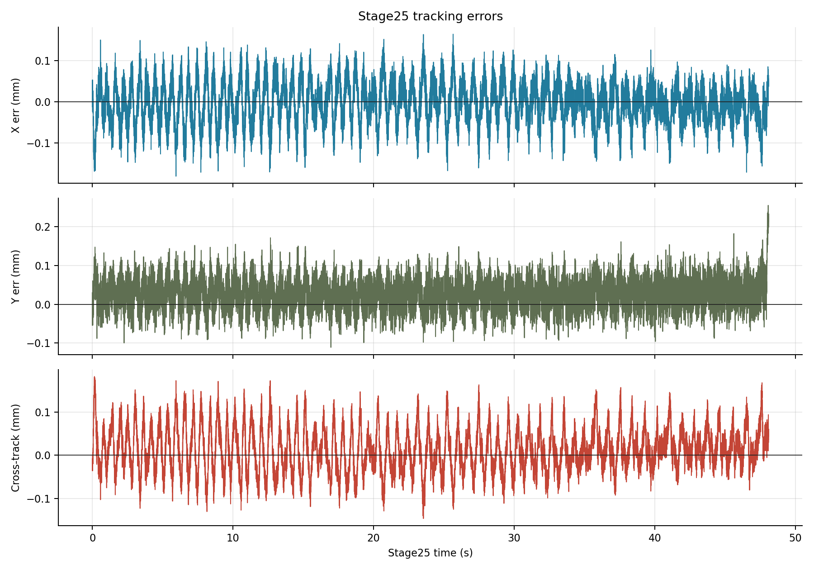

# Step4e v31 外环复现成功技术报告

## 实验目的

本报告记录 `step4e_seed_normal_loop_v31` 在 UR10e + Kunwei KWR75B bench 上完成 Step4e/TASE 外环流程复现的正式结果。成功口径是：TP program 完成完整外环状态机，stage 最终到 `29.0`，UR output stop register `30 = 1.0`，line progress 达到目标线长，bridge/RTDE/Kunwei 链路在 guard contract 内完成记录，且运行后 Kunwei stream 可安静停止。

结论先给出：本次 run 证明当前 v31 完成了外环流程和整条线任务复现。它不证明 force quality 已达到高质量、paper-faithful 的稳定 `5 N` 控制；stage25 已有实际闭环响应，但 normal force 仍明显过冲，后续优化重点应放在 line 阶段 force quality。

## 设备与实验条件

| 字段 | 本次设置 |
|---|---|
| TP program | `/programs/andyl/kunwei/step4/step4e_seed_normal_loop_v31.urp` |
| local triplet | `programs/step4e_seed_normal_loop_v31.{script,txt,urp}` |
| program stamp | `2026-06-12T0459HKT_STEP4E_SEED_NORMAL_LOOP_V31` |
| run id | `bridge_step4e_seed_normal_loop_v31_20260612_050155` |
| run 目录 | [bridge_step4e_seed_normal_loop_v31_20260612_050155](../experiments/kunwei/closed-loop-straight-line/2026-06-04/runs/bridge_step4e_seed_normal_loop_v31_20260612_050155) |
| bridge profile | `--step4e-version v31`，`--step4e-mode line`，`--rtde-hz 500` |
| normal follow mode | `filtered_live`；`normal_filter_alpha=0.35`，`normal_min_force=2.0 N`，`normal_friction_projection=on` |
| target force | `5.0 N` normal load；报告中 signed target 按 `-5 N` 解释 |
| line speed / length | `3 mm/s` nominal tangent speed；目标线长 `143.747123 mm` |
| guard contract | normal `50 N`，force norm `60 N`，torque norm `3.0 Nm` |
| Kunwei zero | bridge 软件 baseline；`baseline_s=5`，随后 `rezero_s=1`；未发送 Kunwei hardware tare/zero |
| UR zero/tare/filter/config | 未调用 UR `zero_ftsensor()`；未写 UR TCP/payload；未从 Ubuntu 发送机器人运动命令 |
| Kunwei config/filter | 未发送 Kunwei zero/tare/filter/config；只允许 stream command 与 stop-stream |
| Dashboard preflight | `PLAYING step4e_seed_normal_loop_v31.urp`，`Safetymode: NORMAL`，`Robotmode: RUNNING` |

本次 bridge summary 的 `stop_reason="signal_sigint"` 是操作生命周期记录：TP 已经完成并停止后，Ubuntu 侧 bridge 被结束。UR output stop register `30 = 1.0` 才是这次 TP 任务完成的主判据。

## 实验命令

本次由 Step4e operator/bridge 流程启动，关键 runtime 参数保存在 [metadata.json](../experiments/kunwei/closed-loop-straight-line/2026-06-04/runs/bridge_step4e_seed_normal_loop_v31_20260612_050155/metadata.json)。报告图表和指标由 [generate_assets.py](assets/step4e-v31-outer-loop-reproduction-success/generate_assets.py) 从原始 CSV/JSON 重新生成，输出 [metrics.json](assets/step4e-v31-outer-loop-reproduction-success/metrics.json)。

## 数据与图片

### 全程上下文

图 1 显示完整 run 的 stage、normal force、progress 和 TCP z。关键 signature 是：search 和 normal latch 后进入 stage25 line-control，progress 持续增长到 `143.747 mm`，随后执行 unload/retract 并进入 final stage `29.0`。



### Stage25 line-control

图 2 放大 stage25。命令层面可见 XY tangent command 和 normal correction command 同时工作；force 曲线说明闭环确实参与控制，但阶段内 normal force 最低到 `-44.38 N`，相对 `-5 N` 目标仍偏粗糙，force-quality 还不是最终状态。



### XY actual-vs-reference path

图 3 将 stage25 实际 TCP XY 轨迹和由 `start_xy + progress * line_unit` 构造的 reference 线叠加。路径几何非常干净，说明本次主要限制不在 XY path tracking。



### Tracking error

图 4 展示 X/Y error 和 cross-track error。cross-track signed mean 为 `+0.013 mm`，absolute p99 为 `0.133 mm`；路径误差已经远小于力控误差对应的任务影响。



## 统计结果

### Protocol 表

| 项目 | 结果 |
|---|---:|
| bridge rows | `44,555` |
| Kunwei samples | `89,092` |
| bridge writes | `44,555` |
| RTDE reconnect events | `0` |
| parse errors | `0` |
| dropped sync bytes | `0` |
| baseline ready | `true` |
| baseline samples | `1,001` |
| final TP stage, output register 35 | `29.0` |
| final TP stop reason, output register 30 | `1.0` |
| final progress, output register 31 | `0.143747123 m` |
| target line length | `0.143747123 m` |
| non-empty `guard_reason` rows | `0` |
| Kunwei quiet stop | `ok=true`，probe `quiet=true` |

### Stage summary

| Stage | 作用 | Duration (s) | TCP z range (mm) | normal force min/mean/max (N) | max force norm (N) | max torque (Nm) | progress end (mm) |
|---:|---|---:|---:|---:|---:|---:|---:|
| `20.0` | start/wait | `4.828` | `110.82..110.94` | `0.40 / 2.80 / 3.22` | `9.05` | `0.367` | `21.546` |
| `22.0` | XY entry | `3.008` | `110.74..110.96` | `-0.46 / 0.01 / 0.45` | `0.48` | `0.015` | `0.000` |
| `23.0` | software zero | `1.236` | `110.82..110.93` | `-0.40 / -0.00 / 0.42` | `0.44` | `0.014` | `0.037` |
| `24.0` | first far search | `5.552` | `27.97..110.88` | `-0.39 / 0.01 / 0.30` | `0.40` | `0.012` | `0.012` |
| `24.2` | first near search | `7.920` | `7.98..27.96` | `-6.70 / -0.03 / 0.44` | `6.76` | `0.072` | `0.052` |
| `24.3` | second far search | `4.060` | `7.93..28.06` | `-20.25 / -0.16 / 0.27` | `20.31` | `0.111` | `0.088` |
| `25.05` | normal latch | `0.002` | `8.00..8.00` | `-6.70 / -6.70 / -6.70` | `6.76` | `0.072` | `0.035` |
| `25.1` | detach/lift | `1.668` | `7.96..27.98` | `-8.66 / -0.51 / 0.44` | `8.74` | `0.098` | `0.044` |
| `25.2` | orientation correction | `5.438` | `27.92..28.11` | `-0.25 / -0.02 / 0.33` | `0.36` | `0.010` | `0.096` |
| `25.3` | force reacquire | `0.104` | `7.87..7.97` | `-23.19 / -21.51 / -20.25` | `23.25` | `0.121` | `0.104` |
| `25.0` | line control | `48.090` | `7.80..20.54` | `-44.38 / -12.79 / 0.44` | `44.67` | `0.912` | `143.747` |
| `26.0` | unload | `1.158` | `18.47..28.50` | `-3.93 / -0.34 / 0.29` | `3.93` | `0.042` | `143.747` |
| `27.0` | retract/home | `5.590` | `28.46..110.98` | `-0.42 / -0.00 / 0.47` | `0.63` | `0.015` | `143.747` |
| `29.0` | final | `0.206` | `110.86..110.95` | `-0.05 / 0.02 / 0.13` | `0.13` | `0.006` | `143.747` |

### Line-control result

| 指标 | 数值 |
|---|---:|
| stage25 rows | `24,046` |
| stage25 duration | `48.089999 s` |
| nominal line length | `143.747123 mm` |
| max/final progress | `143.747123 / 143.747123 mm` |
| normal force mean/median/std | `-12.79 / -11.06 / 11.60 N` |
| normal force min/max | `-44.38 / 0.44 N` |
| signed error mean vs `-5 N` | `-7.79 N` |
| force error MAE vs `-5 N` | `10.98 N` |
| `|force error|` p95 / p99 | `27.68 / 32.92 N` |
| force norm max | `44.67 N`，低于 `60 N` guard |
| torque norm max in stage25 | `0.912 Nm` |
| torque norm max full run | `0.913 Nm`，低于 `3.0 Nm` guard |
| command `vz` min/mean/max | `-1.96 / 0.19 / 3.01 mm/s` |

本表是本报告的主要限制说明：任务完成与路径复现成立，但 force quality 仍偏粗糙。stage25 中的 normal-force overshoot 没有触发 guard，却已经明显超出“稳定贴近 `5 N`”的质量口径。

### Path tracking

| 指标 | 数值 |
|---|---:|
| X error mean | `-0.003 mm` |
| X error p95 abs / p99 abs | `0.098 / 0.124 mm` |
| Y error mean | `0.025 mm` |
| Y error p95 abs / p99 abs | `0.087 / 0.114 mm` |
| XY error mean / p95 / p99 / max | `0.060 / 0.118 / 0.145 / 0.260 mm` |
| along-line signed mean | `0.021 mm` |
| along-line abs mean / p99 abs | `0.033 / 0.107 mm` |
| cross-track signed mean | `0.013 mm` |
| cross-track abs mean / p99 abs / max abs | `0.042 / 0.133 / 0.183 mm` |

路径结果非常好。即使按 XY norm 看，p99 也只有 `0.145 mm`；按 cross-track 看，signed mean 约 `0.013 mm`，absolute p99 约 `0.133 mm`。

### Frequency contract

| 层级 | 实测 | 解释 |
|---|---:|---|
| Kunwei raw logging | `89,092` samples；约 `1 kHz` class | 原始传感器 stream，不等同于 URScript servo loop |
| bridge write timing | `501.23 Hz` | Ubuntu bridge 写 RTDE input register 的频率 |
| RTDE output logging | `499.99 Hz` | UR RTDE output log 的频率 |
| echo heartbeat transitions | `248.98 Hz` | URScript echo/motion gate 观测，不是 RTDE/bridge rate |
| stage25 line-control echo | `249.41 Hz` over `48.09 s` | stage25 的 URScript echo cadence |
| stage25 RTDE row rate | `500.00 Hz` | stage25 的 RTDE output row cadence |
| reconnect events | `0` | 本次没有 RTDE reconnect |

频率结论必须分层写：本次证明 bridge write 与 RTDE output logging 是 `500 Hz` class，stage25 URScript echo cadence 约 `249 Hz`。echo cadence、RTDE/bridge rate 和机器人内部 servo-loop 频率是三个不同层级。

## 结论

1. `step4e_seed_normal_loop_v31` 完成了外环流程和整条线任务复现。TP 最终 stage 到 `29.0`，UR output stop register `30 = 1.0`，final progress `0.143747123 m` 与目标线长一致。
2. 运行过程保持在 guard contract 内。full-run force norm max `44.67 N < 60 N`，torque norm max `0.913 Nm < 3.0 Nm`，CSV 中没有 `guard_reason`，Dashboard preflight 记录为 v31 `.urp` 正在 PLAYING 且 safety `NORMAL`。
3. 路径跟踪非常好。stage25 cross-track signed mean 约 `0.013 mm`，absolute p99 约 `0.133 mm`；XY norm p99 约 `0.145 mm`。
4. 力控有实际闭环响应，但 force quality 仍偏粗糙。stage25 normal force 最低到 `-44.38 N`，force error MAE 为 `10.98 N`，因此不能宣称已经达到高质量 `5 N` paper-faithful force control。
5. Kunwei quiet stop 通过：stop-stream 后 probe 没有看到 frame bytes，说明本次采集链路收尾正常。

## 下一步

- 保留 v31 的完整流程和 path tracking scaffold，下一轮只聚焦 force quality。
- 降低 line 阶段过冲：优先检查 stage25 进入时 force reacquire 到 line-control 的瞬态，以及 normal velocity limit / damping / filtered-live normal 的组合。
- 分析 filtered-live normal 与 rough surface contact 的关系：区分真实表面法向变化、摩擦投影、raw spike 和 filter response 对 normal command 的贡献。
- 下一份 force-quality 报告应把 stage25 初始过冲窗口与稳定窗口分开统计，避免用整段均值掩盖 transient。

## 附录

### 原始文件

| artifact | 路径 |
|---|---|
| summary | [summary.json](../experiments/kunwei/closed-loop-straight-line/2026-06-04/runs/bridge_step4e_seed_normal_loop_v31_20260612_050155/summary.json) |
| metadata | [metadata.json](../experiments/kunwei/closed-loop-straight-line/2026-06-04/runs/bridge_step4e_seed_normal_loop_v31_20260612_050155/metadata.json) |
| stage frequency summary | [stage_frequency_summary.json](../experiments/kunwei/closed-loop-straight-line/2026-06-04/runs/bridge_step4e_seed_normal_loop_v31_20260612_050155/stage_frequency_summary.json) |
| bridge RTDE CSV | [bridge_rtde_500hz.csv](../experiments/kunwei/closed-loop-straight-line/2026-06-04/runs/bridge_step4e_seed_normal_loop_v31_20260612_050155/bridge_rtde_500hz.csv) |
| Kunwei sensor CSV | [kunwei_sensor_1khz.csv](../experiments/kunwei/closed-loop-straight-line/2026-06-04/runs/bridge_step4e_seed_normal_loop_v31_20260612_050155/kunwei_sensor_1khz.csv) |
| Kunwei quiet stream | [kunwei_quiet_stream.json](../experiments/kunwei/closed-loop-straight-line/2026-06-04/runs/bridge_step4e_seed_normal_loop_v31_20260612_050155/kunwei_quiet_stream.json) |
| derived metrics | [metrics.json](assets/step4e-v31-outer-loop-reproduction-success/metrics.json) |

### 生成命令

```bash
python3 /home/andy/ur10e_ros2_ws/report/assets/step4e-v31-outer-loop-reproduction-success/generate_assets.py
```

该脚本读取本 run 的 `bridge_rtde_500hz.csv`、`summary.json`、`metadata.json`、`stage_frequency_summary.json` 和 `kunwei_quiet_stream.json`，重新计算 stage/window/path/frequency 指标，并生成本报告嵌入的四张 PNG。

### 频率口径说明

- `bridge_write_timing` 是 Ubuntu bridge 向 RTDE input 写 register 的频率。
- `rtde_output_timing` 是 UR RTDE output logging 的频率。
- `stage*_echo_rate` 来自 UR output heartbeat transition，是 URScript echo/motion gate 观测。
- Kunwei raw stream、bridge write、RTDE output、URScript echo 和机器人内部 servo loop 不是同一个频率层级。
