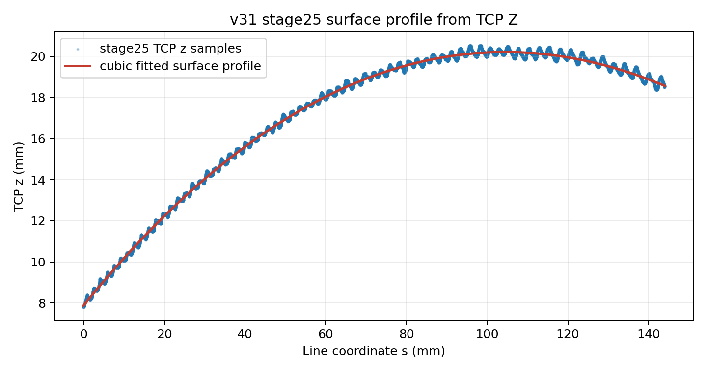
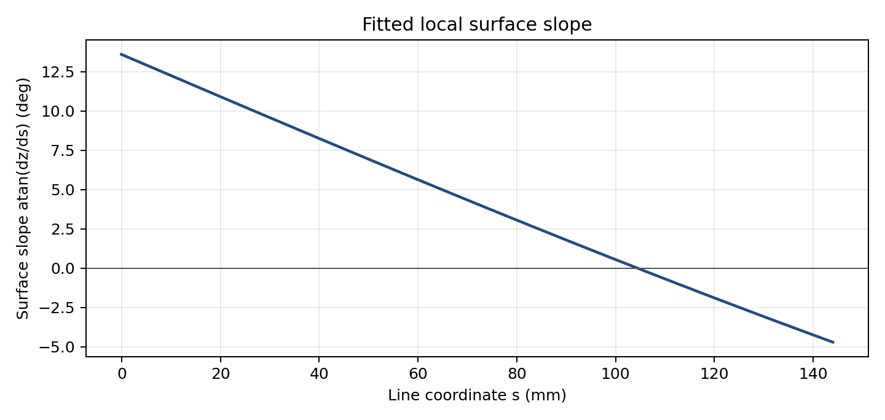
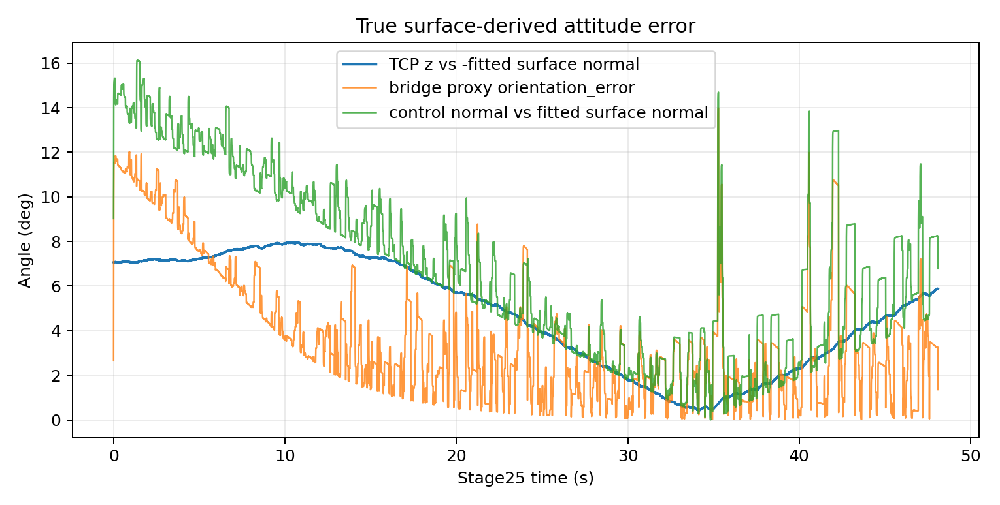
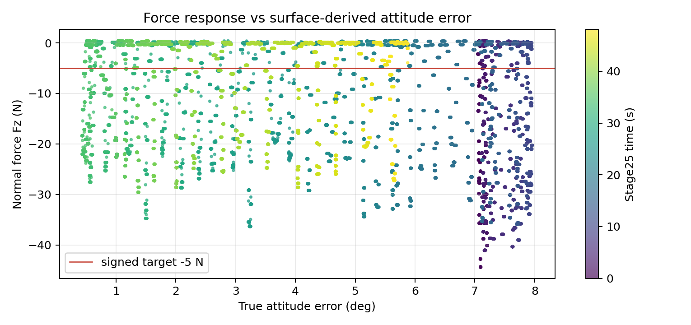
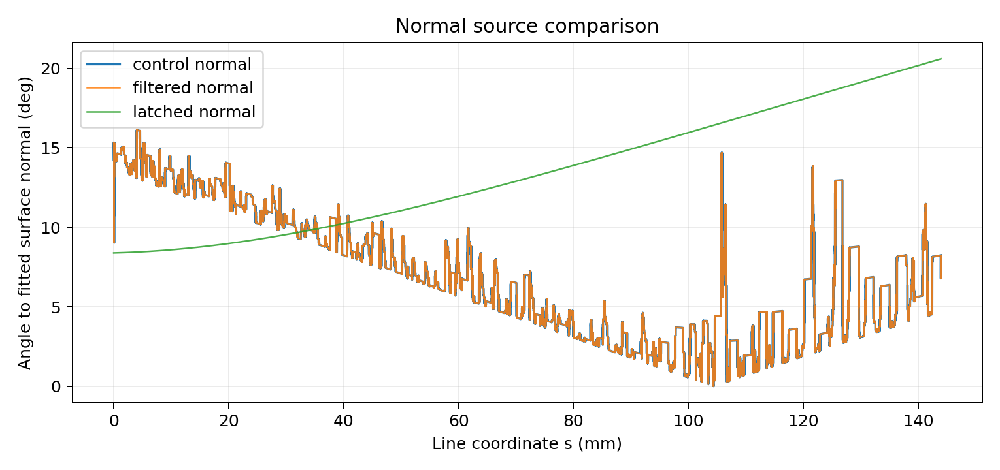

# Step4e v31 曲面姿态校正报告

## 实验目的

本报告把 v31 stage25 的 TCP XY/Z、rotvec、bridge normal 和 force log 转成一个 data-first 的局部曲面姿态检查。
目标不是重新证明 v31 已完成整条线，而是给下一轮姿态/normal 校正提供真实曲面派生的误差口径：先从 `z=f(s)` 拟合局部 surface profile，再比较 TCP z-axis 与 `-surface_normal` 的夹角。

## 设备与实验条件

| 字段 | 本次设置 |
|---|---:|
| 数据 run | `bridge_step4e_seed_normal_loop_v31_20260612_050155` |
| 分析窗口 | stage `25.0` line-control |
| stage25 rows / duration | `24046` / `48.090 s` |
| line coordinate range | `-0.046..144.001 mm` |
| expected line length | `143.747123 mm` |
| TCP z range | `7.797..20.545 mm` |
| surface fit | cubic `z=f(s)` in normalized line coordinate |
| normal sign | `+z` fitted surface normal；true attitude error 用 TCP z-axis 对 `-surface_normal` |
| UR zero / payload / TCP writes | 本分析不调用 `zero_ftsensor()`，不写 payload/TCP，不 load/play program |
| bridge/controller state | 使用已完成 v31 run log；本轮只做 controller file handoff 和 read-back validation |
| video reference | Mac source SHA `4f2556e47aad9e83...`，duration `69.162 s`，resolution `1846x1036` |

## 实验命令

报告由 [generate_surface_calibration.py](assets/step4e-v31-surface-calibration/generate_surface_calibration.py) 生成。
脚本读取 v31 `bridge_rtde_500hz.csv`、controller read-back manifest 和 ignored 本地视频副本，输出图表、metrics、抽帧和 review HTML。
完整命令放在附录。

## 数据与图片

图 1 是这次校正的主证据。
二次以上多项式已经足够解释 stage25 的 TCP z 变化；最终采用 cubic fit，p95 residual 为 `0.287 mm`，max residual 为 `0.424 mm`。



图 2 展示由 `z=f(s)` 得到的局部坡度。
坡度不是常数，说明用单个 fixed normal 解释整段 line 会漏掉一部分真实曲面变化。



图 3 是真正的姿态误差口径。
蓝线是 TCP z-axis 与 `-surface_normal` 的夹角；它和 bridge proxy orientation error 不完全相同，因为 bridge proxy 仍来自控制 normal，而不是从 measured surface profile 反推的 surface normal。



图 4 把 force 和 true attitude error 放在同一张散点图里。
这张图用于判断 force overshoot 是否和局部姿态误差共同出现；它不单独证明因果，只给后续 segment 标注和校正候选提供 evidence。



图 5 比较 control/filtered/latched normal 与 fitted surface normal。
control normal 和 fitted surface normal 的平均夹角为 `6.861 deg`，说明 surface-normal 符号可判定，但控制 normal 仍没有完全贴合曲面。



## 统计结果

### Surface fit 与 attitude

| 指标 | mean | median | p95 abs | min | max |
|---|---:|---:|---:|---:|---:|
| fit residual (mm) | `-0.000` | `-0.015` | `0.287` | `-0.375` | `0.424` |
| slope angle (deg) | `4.196` | `4.073` | `12.633` | `-4.699` | `13.597` |
| true attitude error (deg) | `4.797` | `5.148` | `7.871` | `0.431` | `7.963` |
| bridge proxy error (deg) | `3.761` | `2.973` | `10.510` | `0.014` | `13.979` |
| control normal vs fitted normal (deg) | `6.861` | `6.522` | `13.718` | `0.013` | `16.119` |

### Sanity checks

| 检查 | 结果 |
|---|---:|
| line length `143.747 mm` | `True` |
| TCP Z range 与旧报告一致 | `True` |
| fit residual p95 `< 0.5 mm` | `True` |
| surface normal sign 可由 z-up/control-normal 判定 | `True` |
| synthetic plane fixture | `True` |

### Step4f/4g controller handoff

| Program | Controller `.urp` | SHA/read-back/cache checks |
|---|---|---:|
| `step4f_cycloid_seed_normal_v1` | `/programs/andyl/kunwei/step4/step4f_cycloid_seed_normal_v1.urp` | `True` |
| `step4g_eight_seed_normal_v1` | `/programs/andyl/kunwei/step4/step4g_eight_seed_normal_v1.urp` | `True` |

## HTML review

交互 review 页在 [calibration_review.html](assets/step4e-v31-surface-calibration/calibration_review.html)。
它展示 v31 surface fit、Step4f/4g reference preview、supplementary screenshots 和本次视频抽帧。
页面支持在图上点击打 marker，并导出 `calibration-markers.json`，后续可作为曲线段/视频帧/曲线区域的人工标注输入。

## 结论

1. v31 stage25 的 `z=f(s)` 是可用的单值局部曲面 profile；cubic fit p95 residual `0.287 mm`，没有触发“残差过大先讨论”的 gate。
2. surface normal 的符号可判定：`+z` fitted normal 与 control normal 同向，true attitude error 应比较 TCP z-axis 与 `-surface_normal`。
3. true surface-derived attitude error 平均 `4.797 deg`，p95 `7.871 deg`；它和 bridge proxy error 有系统差异，后续校正不应只看 proxy。
4. Step4f/4g 现在可以称为 TP-ready：controller 上的 `.script/.txt/.urp` triplets 已上传并 read-back 校验，且 `.urp cachedContents` 与 `.script` 精确一致。

## 下一步

- 先在 HTML review 中标出 v31 曲面 profile 中最像当前小平台候选段的区间。
- 如果标注区间和 Step4f/4g 小平台曲线候选不一致，先讨论 anchor，不直接改 TP program。
- 下一轮控制侧只改 surface/normal 校正口径，保持 v31/Step4f/Step4g TP scaffold 不变。

## 附录

### 生成命令

```bash
python3 /home/andy/ur10e_ros2_ws/report/assets/step4e-v31-surface-calibration/generate_surface_calibration.py
```

### 关键 artifacts

| artifact | 路径 |
|---|---|
| metrics | [metrics.json](assets/step4e-v31-surface-calibration/metrics.json) |
| controller handoff | [controller-handoff-step4fg.json](assets/step4e-v31-surface-calibration/controller-handoff-step4fg.json) |
| video manifest | [video-reference-manifest.json](assets/step4e-v31-surface-calibration/video-reference-manifest.json) |
| stage25 downsampled calibration CSV | [stage25-surface-calibration-window.csv](assets/step4e-v31-surface-calibration/stage25-surface-calibration-window.csv) |
