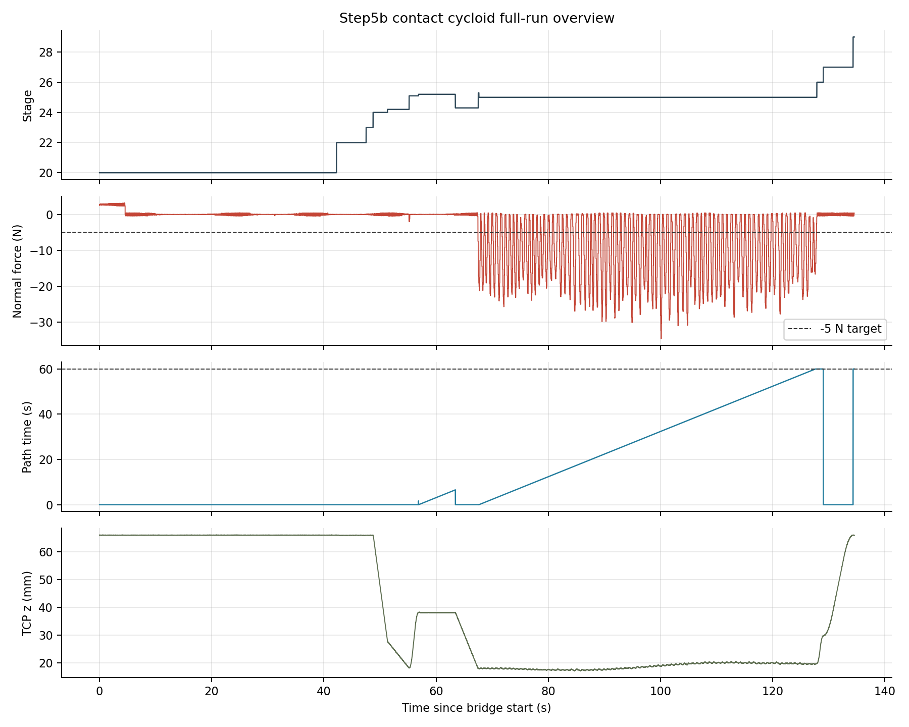
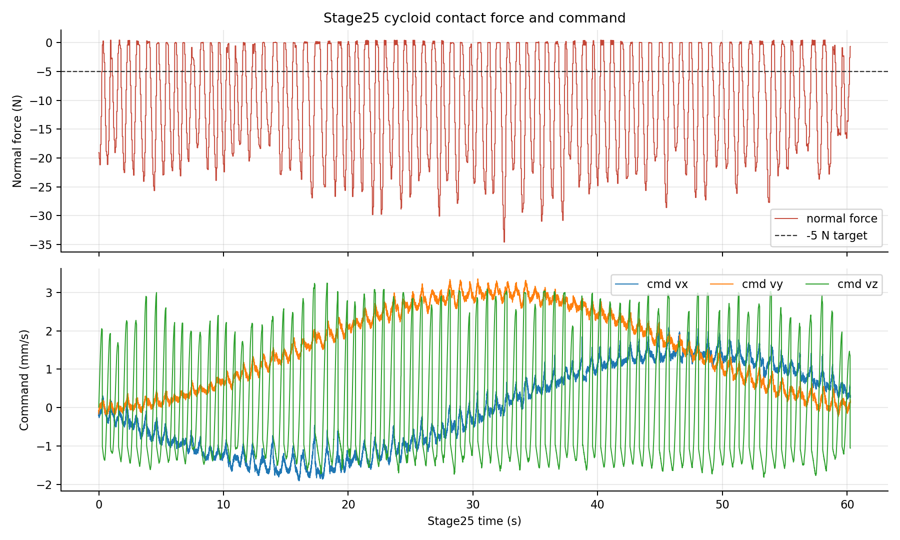
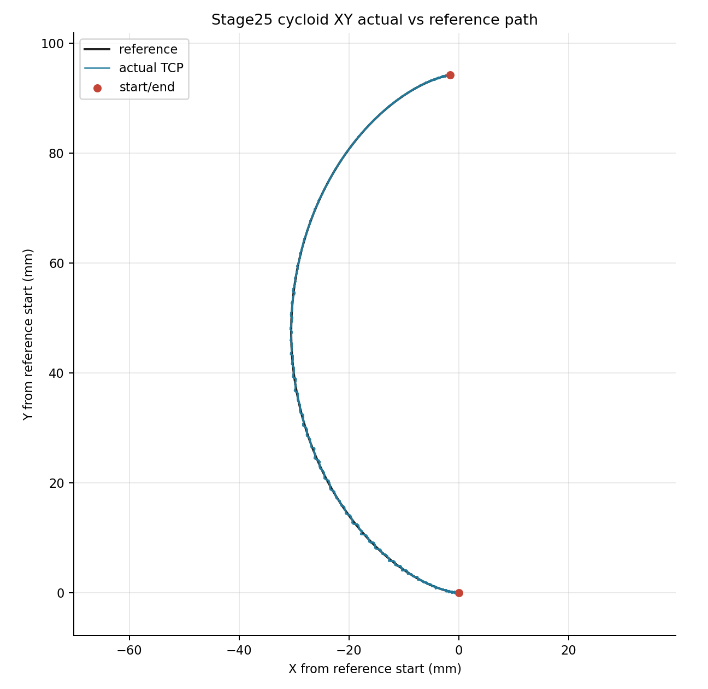
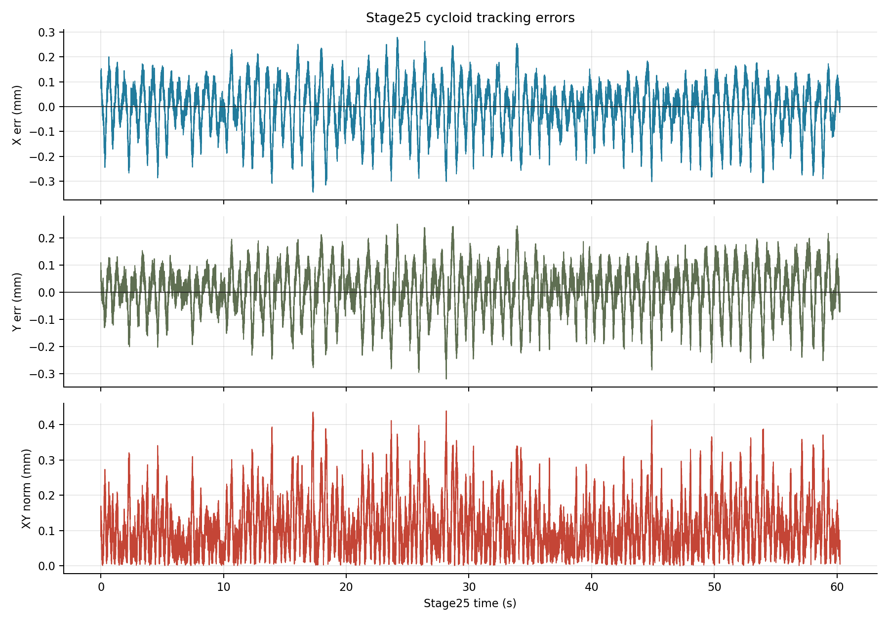
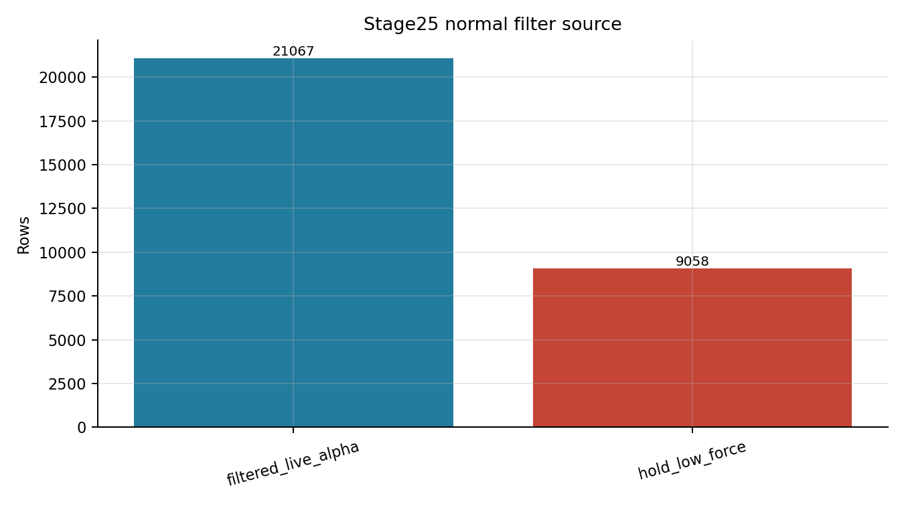

# Step5b Contact Cycloid Baseline 技术报告

## 实验目的

本报告记录 `step5b_contact_cycloid_baseline_v1` 在 UR10e + Kunwei KWR75B bench 上的第一次 Step5b contact cycloid baseline 运行结果。成功口径是：TP program 完成 60 s cycloid contact window，final stage 到 `29.0`，UR output stop register `30 = 1.0`，bridge/RTDE/Kunwei 链路在 guard contract 内完成记录，并且运行后 Kunwei stream 可安静停止。

结论先给出：这次 Step5b baseline 基本成功。它证明了 Step5b 的 bridge-owned cycloid reference、TP executor/guard、filtered-live normal 和 `5 N` contact baseline 能够完成整段 contact path；但 force quality 仍偏粗糙，不能宣称已经达到稳定贴近 `5 N` 的 paper-faithful force control。

## 设备与实验条件

| 字段 | 本次设置 |
|---|---|
| TP program | `/programs/andyl/kunwei/step5/step5b_contact_cycloid_baseline_v1.urp` |
| local triplet | `experiments/tase-contact-reproduction/programs/step5/step5b_contact_cycloid_baseline_v1.{script,txt,urp}` |
| program stamp | `2026-06-12T0821HKT_STEP5B_CONTACT_CYCLOID_BASELINE_V1` |
| run id | `bridge_step5b_contact_cycloid_baseline_v1_20260612_082352` |
| run 目录 | [bridge_step5b_contact_cycloid_baseline_v1_20260612_082352](../experiments/tase-contact-reproduction/runs/bridge_step5b_contact_cycloid_baseline_v1_20260612_082352) |
| bridge profile | `--step4e-version step5b_v1`，`--step4e-mode line`，`--step4e-path-shape cycloid`，`--rtde-hz 500` |
| Step5 stage id | `step5_contact_cycloid_baseline_v1` |
| reference owner | bridge computes `desired_xy`、`desired_vxy`、`path_error`、`progress/path_time`；TP 只执行 register command 和 guard |
| cycloid timing | `duration_s=60.0`，`omega=0.1 rad/s`，final phase `6.0 rad` |
| normal follow mode | `filtered_live`；`normal_filter_alpha=0.35`，`normal_min_force=2.0 N`，`normal_friction_projection=on` |
| target force | `5.0 N` normal load；报告中 signed target 按 `-5 N` 解释 |
| guard contract | normal `50 N`，force norm `60 N`，torque norm `3.0 Nm` |
| Kunwei zero | bridge 软件 baseline；`baseline_s=5`，随后 `rezero_s=1`；未发送 Kunwei hardware tare/zero |
| UR zero/tare/filter/config | 未调用 UR `zero_ftsensor()`；未写 UR TCP/payload；未从 Ubuntu 发送机器人运动命令 |
| Kunwei config/filter | 未发送 Kunwei zero/tare/filter/config；只允许 stream command 与 stop-stream |
| Dashboard preflight | bridge 启动前已加载该 `.urp`，`Safetymode: NORMAL`，`Robotmode: RUNNING` |

本报告中的 `progress=60.0` 指 Step5 cycloid 的 path time / elapsed seconds，不是 60 m 距离。

`summary.stop_reason="signal_sigint"` 是 Ubuntu 侧 bridge 生命周期记录：TP 已经停止后 operator 结束 bridge。主完成判据是 final stage `29.0`、UR output stop register `30 = 1.0`、final path time `60.0 s`。

## 实验命令

本次由 Step5b operator/bridge 流程启动，关键 runtime 参数保存在 [metadata.json](../experiments/tase-contact-reproduction/runs/bridge_step5b_contact_cycloid_baseline_v1_20260612_082352/metadata.json)。报告图表和指标由 [generate_assets.py](assets/step5b-contact-cycloid-baseline/generate_assets.py) 从原始 CSV/JSON 重新生成，输出 [metrics.json](assets/step5b-contact-cycloid-baseline/metrics.json)。

## 数据与图片

### 全程上下文

图 1 显示完整 run 的 stage、normal force、path time 和 TCP z。关键 signature 是：search 和 reacquire 后进入 Step5b cycloid contact 段，path time 增长到 `60.0 s`，随后 unload/retract 并进入 final stage `29.0`。



### Step5b contact force

图 2 放大 Stage25 contact window。命令层面可见 XY cycloid command 与 Z normal correction command 同时工作；normal force 多数时间在 `-5 N` 目标以下并有明显周期性过冲，说明本次是“流程和路径 baseline 成功”，不是“force quality 已完成”。



### XY actual-vs-reference cycloid path

图 3 将 Stage25 实际 TCP XY 轨迹和 bridge 生成的 Step5 cycloid reference 叠加。路径几何跟踪非常干净，说明当前主要限制不是 XY reference 或 TP executor，而是接触力质量。



### Tracking error

图 4 展示 X/Y tracking error 和 XY norm。Stage25 的 XY error p99 为 `0.328 mm`，max 为 `0.439 mm`，相对当前 force oscillation 已经不是主要矛盾。



### Normal filter evidence

图 5 是 Stage25 normal filter source 的 row count。`filtered_live_alpha=21067` rows，`hold_low_force=9058` rows，说明这次 Step5b 确实使用了 filtered-live normal；低力窗口会 hold 前一 filtered normal。



## 统计结果

### Protocol 表

| 项目 | 结果 |
|---|---:|
| bridge rows | `67,507` |
| Kunwei samples | `134,978` |
| bridge writes | `67,507` |
| RTDE reconnect events | `0` |
| parse errors | `0` |
| dropped sync bytes | `0` |
| baseline ready | `true` |
| baseline samples | `1,001` |
| final TP stage, output register 35 | `29.0` |
| final TP stop reason, output register 30 | `1.0` |
| final path time, output register 31 | `60.0 s` |
| target cycloid duration | `60.0 s` |
| non-empty `guard_reason` rows | `0` |
| Kunwei quiet stop | `ok=true`，probe `quiet=true` |

### Stage summary

| Stage | 作用 | Duration (s) | Path time end (s) | normal force min/mean/max (N) | max force norm (N) | max torque (Nm) |
|---:|---|---:|---:|---:|---:|---:|
| `20.0` | start/wait | `42.239` | `0.000` | `-0.43 / 0.33 / 3.18` | `8.95` | `0.365` |
| `22.0` | XY entry | `5.284` | `0.000` | `-0.08 / -0.01 / 0.11` | `0.29` | `0.006` |
| `23.0` | software zero | `1.236` | `0.000` | `-0.24 / 0.02 / 0.19` | `0.31` | `0.009` |
| `24.0` | first far search | `2.560` | `0.000` | `-0.39 / -0.01 / 0.41` | `0.45` | `0.014` |
| `24.2` | first near search | `3.864` | `0.000` | `-1.88 / -0.01 / 0.46` | `1.90` | `0.021` |
| `24.3` | second far search | `4.090` | `0.000` | `-17.07 / -0.12 / 0.45` | `17.22` | `0.203` |
| `25.05` | normal latch | `0.004` | `0.000` | `-1.88 / -1.88 / -1.88` | `1.90` | `0.021` |
| `25.1` | detach/lift | `1.668` | `0.002` | `-2.04 / -0.12 / 0.03` | `2.07` | `0.025` |
| `25.2` | orientation correction | `6.558` | `6.450` | `-0.19 / 0.02 / 0.17` | `0.32` | `0.006` |
| `25.3` | force reacquire | `0.104` | `0.100` | `-19.08 / -17.28 / -16.87` | `19.24` | `0.215` |
| `25.0` | cycloid contact | `60.248` | `60.000` | `-34.58 / -10.65 / 0.44` | `36.14` | `0.879` |
| `26.0` | unload | `1.150` | `60.000` | `-0.66 / -0.01 / 0.44` | `0.73` | `0.015` |
| `27.0` | retract/home | `5.310` | `0.000` | `-0.43 / 0.01 / 0.45` | `0.64` | `0.015` |
| `29.0` | final | `0.202` | `60.000` | `-0.42 / -0.00 / 0.40` | `0.46` | `0.014` |

### Step5b contact result

| 指标 | 数值 |
|---|---:|
| Stage25 rows | `30,125` |
| Stage25 duration | `60.248 s` |
| path time start/final/max | `0.102 / 60.000 / 60.000 s` |
| normal force mean/median/std | `-10.65 / -10.08 / 9.20 N` |
| normal force min/max | `-34.58 / 0.44 N` |
| signed error mean vs `-5 N` | `-5.65 N` |
| force error MAE vs `-5 N` | `8.81 N` |
| `|force error|` p95 / p99 | `20.39 / 23.82 N` |
| force norm max in Stage25 | `36.14 N`，低于 `60 N` guard |
| torque norm max in Stage25 | `0.879 Nm` |
| torque norm max full run | `0.890 Nm`，低于 `3.0 Nm` guard |
| command `vz` min/mean/max | `-1.81 / 0.01 / 3.24 mm/s` |
| normal filter source | `filtered_live_alpha=21,067` rows；`hold_low_force=9,058` rows |

本表是本报告的主要限制说明：Step5b contact baseline 已完成路径和状态机，但 Stage25 normal force 相对 `-5 N` 目标仍有明显负向偏差和振荡。guard 未触发并不等于 force quality 已达标。

### Path tracking

| 指标 | 数值 |
|---|---:|
| X error mean | `-0.009 mm` |
| X error p95 abs / p99 abs | `0.199 / 0.253 mm` |
| Y error mean | `0.004 mm` |
| Y error p95 abs / p99 abs | `0.169 / 0.216 mm` |
| XY error mean / median | `0.108 / 0.091 mm` |
| XY error p95 / p99 / max | `0.258 / 0.328 / 0.439 mm` |

路径结果足够干净。当前路径误差量级低于 `0.5 mm`，因此下一轮不应优先重写 Step5 cycloid reference 或 TP executor。

### Frequency contract

| 层级 | 实测 | 解释 |
|---|---:|---|
| Kunwei raw logging | `134,978` samples；约 `1 kHz` class | 原始传感器 stream，不等同于 URScript servo loop |
| bridge write timing | `501.74 Hz` | Ubuntu bridge 写 RTDE input register 的频率 |
| RTDE output logging | `500.01 Hz` from summary | UR RTDE output log 的频率 |
| Stage25 line-control echo | `249.78 Hz` over `60.248 s` | URScript echo/motion gate 观测，不是 RTDE/bridge rate |
| Stage25 RTDE row rate | `500.00 Hz` | Stage25 的 RTDE output row cadence |
| reconnect events | `0` | 本次没有 RTDE reconnect |

频率结论必须分层写：本次证明 bridge write 与 RTDE output logging 是 `500 Hz` class，Stage25 URScript echo cadence 约 `250 Hz`。echo cadence、RTDE/bridge rate 和机器人内部 servo-loop 频率不是同一个层级。

## 结论

1. `step5b_contact_cycloid_baseline_v1` 完成了 Step5b contact cycloid baseline。TP final stage 到 `29.0`，UR output stop register `30 = 1.0`，final path time `60.0 s` 与 Step5 table 目标一致。
2. 运行过程保持在 guard contract 内。full-run force norm max `36.36 N < 60 N`，normal force min `-34.80 N` 未超过 `50 N` normal guard，torque norm max `0.890 Nm < 3.0 Nm`，CSV 中没有 `guard_reason`。
3. 路径跟踪成立。Stage25 XY error mean `0.108 mm`，p99 `0.328 mm`，max `0.439 mm`；Step5 bridge-owned cycloid reference 和 TP executor/guard 的接口可保留。
4. Force quality 仍是主要问题。Stage25 normal force mean `-10.65 N`，相对 signed target `-5 N` 的 MAE 为 `8.81 N`，p99 abs error 为 `23.82 N`；不能写成稳定 `5 N` contact control。
5. filtered-live normal 已实际启用。Stage25 中 `filtered_live_alpha` 占 `21,067` rows，`hold_low_force` 占 `9,058` rows；下一轮应分析 normal filter、reacquire transient 和 Z correction 对周期性过冲的贡献。
6. Kunwei quiet stop 通过：stop-stream 后 probe 没有看到 frame bytes，说明采集链路收尾正常。

## 下一步

- 保留 Step5b 的 TP package、bridge-owned cycloid reference、RTDE register contract 和 path tracking scaffold。
- 下一轮只聚焦 force quality：先分开统计 force reacquire transient、Stage25 前 5 s、稳定中段和末段，避免整段平均掩盖过冲来源。
- 优先检查 `filtered_live` normal、normal velocity limit、force damping/P/I gain 与 rough surface 接触的耦合。
- 若要继续现场迭代，建议下一次只改一个变量，并保持 `target_force_n=5.0`、Step5 table 和 TP executor 不变。

## 附录

### 原始文件

| artifact | 路径 |
|---|---|
| summary | [summary.json](../experiments/tase-contact-reproduction/runs/bridge_step5b_contact_cycloid_baseline_v1_20260612_082352/summary.json) |
| metadata | [metadata.json](../experiments/tase-contact-reproduction/runs/bridge_step5b_contact_cycloid_baseline_v1_20260612_082352/metadata.json) |
| stage frequency summary | [stage_frequency_summary.json](../experiments/tase-contact-reproduction/runs/bridge_step5b_contact_cycloid_baseline_v1_20260612_082352/stage_frequency_summary.json) |
| bridge RTDE CSV | [bridge_rtde_500hz.csv](../experiments/tase-contact-reproduction/runs/bridge_step5b_contact_cycloid_baseline_v1_20260612_082352/bridge_rtde_500hz.csv) |
| Kunwei sensor CSV | [kunwei_sensor_1khz.csv](../experiments/tase-contact-reproduction/runs/bridge_step5b_contact_cycloid_baseline_v1_20260612_082352/kunwei_sensor_1khz.csv) |
| Kunwei quiet stream | [kunwei_quiet_stream.json](../experiments/tase-contact-reproduction/runs/bridge_step5b_contact_cycloid_baseline_v1_20260612_082352/kunwei_quiet_stream.json) |
| derived metrics | [metrics.json](assets/step5b-contact-cycloid-baseline/metrics.json) |

### 生成命令

```bash
python3 /home/andy/ur10e_ros2_ws/report/assets/step5b-contact-cycloid-baseline/generate_assets.py
```

该脚本读取本 run 的 `bridge_rtde_500hz.csv`、`summary.json`、`metadata.json`、`stage_frequency_summary.json` 和 `kunwei_quiet_stream.json`，重新计算 stage/window/path/frequency 指标，并生成本报告嵌入的 PNG。

### 频率口径说明

- `bridge_write_timing` 是 Ubuntu bridge 向 RTDE input 写 register 的频率。
- `rtde_output_timing` 是 UR RTDE output logging 的频率。
- `stage*_echo_rate` 来自 UR output heartbeat transition，是 URScript echo/motion gate 观测。
- Kunwei raw stream、bridge write、RTDE output、URScript echo 和机器人内部 servo loop 不是同一个频率层级。
