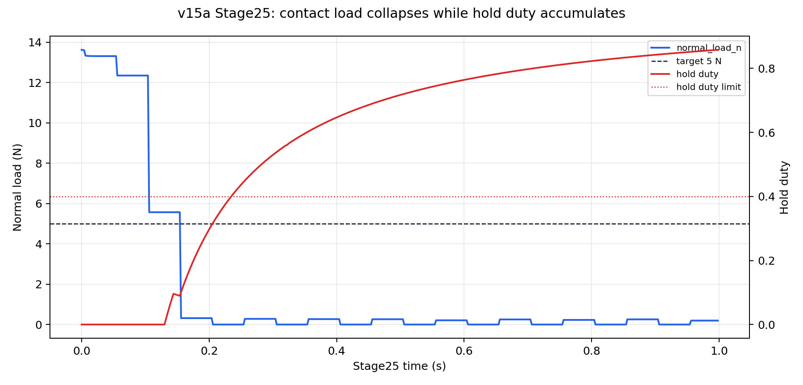
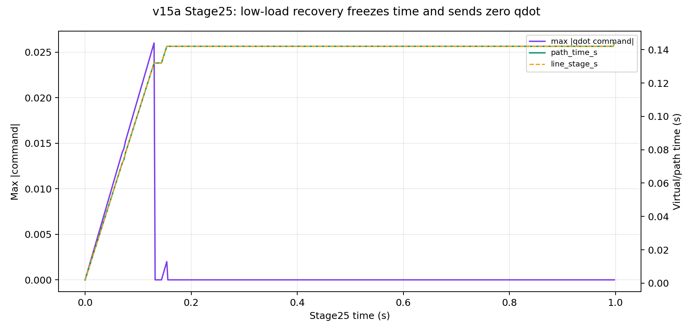
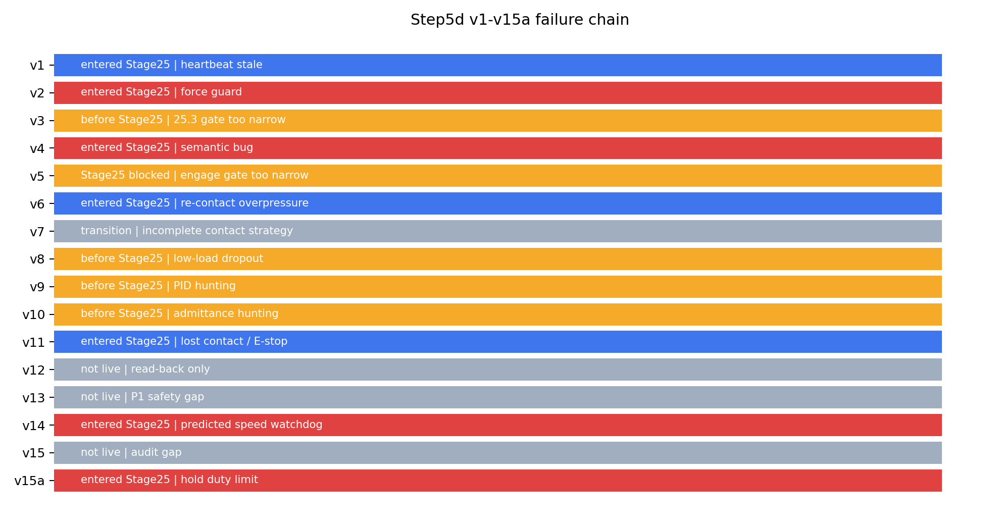

# Step5d v1-v15a 失败原因与整体实验分析

## 实验目的

这份报告用于内部技术复盘，不是会议展示稿。

目标是把 Step5d `v1` 到 `v15a` 的失败链路整理成可继续工作的上下文：每一版解决了什么、被什么挡住、最新 `v15a` 为什么仍然失败，以及下一版为什么应切到 ROS2 remote-control / pure outer-loop 路线。

结论先行：`v15a` 不是 cage 边界失败，也不是 force/torque hard guard 失败。
它在 Stage25 低载荷/失接触后进入 `hold_zero_qdot`，名义上是 reacquire，实际命令为 0，不能重新压回接触面，最终 `hold_duty_limit` 停止。
因此这次数据支持一个更明确的设计判断：`hold` 只能作为短周期 debounce / emergency pause，不能作为 contact recovery 策略。

## 设备与实验条件

| 字段 | 本次分析口径 |
|---|---|
| Robot / route | UR10e + Kunwei bridge + TP package |
| Step | Step5d strict RNN live-prep |
| 最新 live run | `../experiments/tase-contact-reproduction/runs/bridge_step4e_line_outerloop_step5d_strict_rnn_liveprep_v15a_20260616_160355/` |
| 最新 package | `step5d_strict_rnn_liveprep_v15a` |
| TP / safety state | Dashboard preflight: TP program `PLAYING`, Safetymode `NORMAL` |
| Contact convention | `reaction_normal` 用于 load，`approach_normal = -reaction_normal` 用于 posture/press direction |
| Force target | `5 N` positive `normal_load_n` |
| Stage25 duration | `0.99799955 s` |
| Stop reason | `step5d_contact_safety:hold_duty_limit` |
| Hard guard status | force norm max `13.99 N`，torque norm max `0.37 Nm`，未触发 hard force/torque guard |
| Runtime rate evidence | bridge write `508.23 Hz`，RTDE output `437.73 Hz`，Stage25 echo `496.99 Hz` |

这些版本不是同一 protocol 的重复试验。
报告把它们作为 mixed-protocol failure chain 使用，不能把所有 metric 当作 formal A/B comparison。

## 实验命令

本报告资产由只读分析脚本生成：

`../experiments/tase-contact-reproduction/tools/build_step5d_failure_report_assets.py`

脚本只读取 CSV、summary、stage table，并写入报告资产目录。
它不启动 bridge，不连接 controller，不加载 TP program，不发送 URScript，也不改变 robot state。

## 数据与图片

主要数据源：

| 角色 | 相对路径 |
|---|---|
| v15a live CSV | `../experiments/tase-contact-reproduction/runs/bridge_step4e_line_outerloop_step5d_strict_rnn_liveprep_v15a_20260616_160355/bridge_rtde_500hz.csv` |
| v15a live summary | `../experiments/tase-contact-reproduction/runs/bridge_step4e_line_outerloop_step5d_strict_rnn_liveprep_v15a_20260616_160355/summary.json` |
| v15a offline gate summary | `../experiments/tase-contact-reproduction/runs/step5d_v15a_permissive_recovery_offline_20260616/summary.json` |
| generated metrics | `assets/step5d-v1-v15-failure-analysis/metrics.json` |



图 1 显示 `v15a` 的核心失败：Stage25 初始 load 约 `13.6 N`，随后快速掉到接近 0N；hold duty 在接触丢失后持续累积，越过 `0.40` limit，最终达到 `0.858` 并停止。



图 2 显示恢复动作的真正问题：进入低载荷 hold 后，`path_time_s` 和 `line_stage_s` 冻结在约 `0.142 s`，命令变为 zero qdot。
这能降低 runaway 风险，但没有主动压回接触面，所以不能恢复 5N contact。
长时间依赖 hold 只是在等待接触自己回来；在这次 run 中它没有回来。



图 3 概括 v1-v15a 的失败链路。
颜色不是安全等级，而是版本状态：未 live/read-back only、未进入 Stage25、进入 Stage25 后失败、以及过渡版本。

## 统计结果

### v15a Stage25 关键指标

| 指标 | 数值 |
|---|---:|
| Stage25 rows | `500` |
| Stage25 duration (s) | `0.99799955` |
| pass solver rows | `71` |
| hold rows | `428` |
| stop rows | `1` |
| hold rows with nonzero command | `0` |
| pass rows with nonzero command | `70` |
| final hold duty | `0.858` |
| final hold event count | `10` |
| final consecutive hold (s) | `0.546` |
| final cage braking margin (m) | `0.0143498989` |
| cage reason | `inside_broad_tcp_cage` |

### v15a Stage25 signal statistics

| Signal | Samples | Min | Mean | P50 | P95 | Max |
|---|---:|---:|---:|---:|---:|---:|
| `normal_load_n` | 500 | 0.000 | 1.755 | 0.229 | 13.309 | 13.622 |
| `force_norm_n` | 500 | 0.071 | 1.814 | 0.230 | 13.368 | 13.624 |
| `actual_tcp_speed_m_s` | 500 | 0.000000 | 0.001652 | 0.000052 | 0.008701 | 0.011413 |
| `predicted_tcp_speed_m_s` | 71 | 0.000000 | 0.019266 | 0.018826 | 0.039134 | 0.041759 |
| `tcp_cage_braking_margin_m` | 500 | 0.009989 | 0.014079 | 0.014339 | 0.014381 | 0.015144 |
| `hold_duty` | 500 | 0.000 | 0.583 | 0.717 | 0.851 | 0.858 |
| `consecutive_hold_s` | 500 | 0.000 | 0.157 | 0.050 | 0.496 | 0.546 |

### v15a contact-safety reason counts

| Reason | Rows | 解释 |
|---|---:|---|
| `ok` | 71 | solver 可以输出 qdot 的短窗口 |
| `early_tcp_escape_recoverable_hold` | 10 | 速度可疑但未 hard stop，转 zero-qdot hold |
| `soft_low_contact_hold` | 72 | 低载荷 hold |
| `hard_lost_contact_hold` | 74 | 失接触 hold |
| `low_load_reacquire_hold_timeout_deferred` | 272 | 低载荷 timeout 被延后，但动作仍是 zero-qdot hold |
| `hold_duty_limit` | 1 | bounded recovery 最终停止 |

### v1-v15a 失败链路

| Version | Stage 状态 | 主要失败原因 | 对下一版的影响 |
|---|---|---|---|
| v1 | entered Stage25 | heartbeat stale | 证明 qdot/speedj route 可进入，但 runtime/heartbeat 不稳 |
| v2 | entered Stage25 | force guard | 高预载进入后 qdot hit cap，暴露过载风险 |
| v3 | before Stage25 | 25.3 gate too narrow | strict 5N settle 过窄，进不了 Stage25 |
| v4 | entered Stage25 | semantic bug | 暴露 force/frame 语义错误 |
| v5 | Stage25 blocked | engage gate too narrow | semantic 修好后，`2-15 N` engage gate 拦住 17-21N |
| v6 | entered Stage25 | re-contact overpressure | `2-40 N` 太宽，掩盖 24.3 re-contact overpressure |
| v7 | transition | incomplete contact strategy | 过渡到更主动的 25.3 settle |
| v8 | before Stage25 | low-load dropout | 低载荷 dropout 被当作 violation stop |
| v9 | before Stage25 | PID hunting | direct force-PID under point contact hunting timeout |
| v10 | before Stage25 | admittance hunting | scalar admittance 仍饱和/翻符号 |
| v11 | entered Stage25 | lost contact / E-stop | deadband acquire 可进 Stage25，但失接触后 qdot 发散 |
| v12 | not live | read-back only | 加 guard 但未 live，被 v13 planning supersede |
| v13 | not live | P1 safety gap | first-sample dwell 可能放过 solver，被 v14 修正 |
| v14 | entered Stage25 | predicted speed watchdog | 避免 runaway，但 stop 太早，未恢复接触 |
| v15 | not live | audit gap | cage 未真正 online，bounded hold 不完整 |
| v15a | entered Stage25 | hold duty limit | cage/hold 接入后，zero-qdot hold 无法主动恢复接触 |

## 结论

1. `v15a` 的直接停止原因是 `hold_duty_limit`。
   cage 始终 inside，braking margin 最小约 `0.00999 m`，最终约 `0.01435 m`；force/torque hard guard 也没有接近阈值。

2. `v15a` 的实际根因是 recovery action 不足。
   `low_load_reacquire_hold_timeout_deferred` 只是延后 hard stop，runtime action 仍是 `hold_zero_qdot`。
   在 hold rows 中，command 全为 0；因此系统降低了风险，但没有向接触面重新施加受限 press/reacquire motion。

3. `hold` 这条逻辑本身不应再被当作 recovery。
   它适合覆盖 1-2 个控制周期的 measurement jitter、contact patch 瞬时跳变或 emergency pause。
   一旦低载荷/失接触持续超过短 dwell，系统应退出 Stage25 并进入显式 active reacquire，或者 fail fast。
   把长时间 `hold_zero_qdot` 称为 reacquire 会误导设计，因为它不改变 TCP 位置、姿态、法向或接触载荷。

4. offline replay 对 v15a 给出通过，是因为它是 guard replay，不是闭环物理 replay。
   历史 success CSV 中低载荷片段来自旧控制策略的结果；把新 guard 套到旧轨迹上只能证明“不 hard stop”，不能证明新 zero-qdot hold 会自己恢复接触。

5. Step5d 的主瓶颈不再是 strict RNN solver 是否能算出 qdot。
   真正瓶颈是 contact acquisition、contact retention、lost-contact recovery，以及安全策略如何在不 runaway 的情况下允许主动 reacquire。

6. TP+bridge 路线已经产生足够证据，但每轮迭代成本太高。
   下一版应直接切到已有成功 pure outer-loop 的 ROS2 remote-control 路线，把 contact recovery / cage / watchdog 放在 ROS2 node 中快速迭代。

## 下一步

下一版不要继续 v15a TP 小修。

建议直接写 ROS2 remote-control handoff，目标不是重建完整 ROS2 safety stack，而是复用之前成功过的 pure outer-loop 实验入口：

| 要求 | 决策 |
|---|---|
| 起点 | 找回并跑通旧 successful pure outer-loop ROS2 experiment |
| 第一阶段 | no-motion / replay / shadow command |
| 第二阶段 | 把 Step5d cage、bounded recovery、watchdog diagnostics 移植进去 |
| hold policy | `hold` 只保留为短 dwell/debounce 或 emergency pause，不再作为 recovery |
| recovery policy | 低载荷不能只 zero-qdot hold；必须退出 Stage25 做 bounded active reacquire，或 fail fast |
| hard stop | cage margin exhausted、semantic failure、force/torque/joint/sensor hard failure、bounded recovery exhausted |
| metrics | hold duty、hold event、active reacquire duration、normal_load tracking、actual-vs-reference path、Fz/force evidence |

ROS2 下一版最小成功条件：

- 能复用旧 pure outer-loop path，产生与历史 success run 相同结构的 logs。
- no-motion/shadow 下能复现 v11/v14/v15a 的 failure classification。
- live 前能证明低载荷 recovery 不是 zero command，而是 bounded active reacquire。
- live 后报告必须包含 raw Fz/normal load、actual-vs-reference path、hold/reacquire duty、cage margin 和 stop reason。

## 附录

### 复现资产生成

```bash
cd /home/andy/ur10e_ros2_ws/experiments/tase-contact-reproduction
python3 tools/build_step5d_failure_report_assets.py
```

### 关键 artifact

| Artifact | 路径 |
|---|---|
| generated metrics | `assets/step5d-v1-v15-failure-analysis/metrics.json` |
| v15a load/hold plot | `assets/step5d-v1-v15-failure-analysis/v15a-stage25-load-hold-duty.png` |
| v15a command freeze plot | `assets/step5d-v1-v15-failure-analysis/v15a-command-freeze.png` |
| version timeline plot | `assets/step5d-v1-v15-failure-analysis/step5d-version-timeline.png` |
| stage table | `../experiments/tase-contact-reproduction/config/step5_stage_table.json` |
| flow notes | `../experiments/tase-contact-reproduction/STEP5_FLOW.md` |

### 解释边界

这份报告没有把 `v1-v15a` 当作同一 protocol 的重复试验。
它是失败归因报告，不是 formal performance comparison。

`normal_load_n` 使用 Step5/Step6 contract 的 positive load 口径。
raw force sign 不直接作为 posture/press direction；press direction 仍应使用 `approach_normal = -reaction_normal`。
