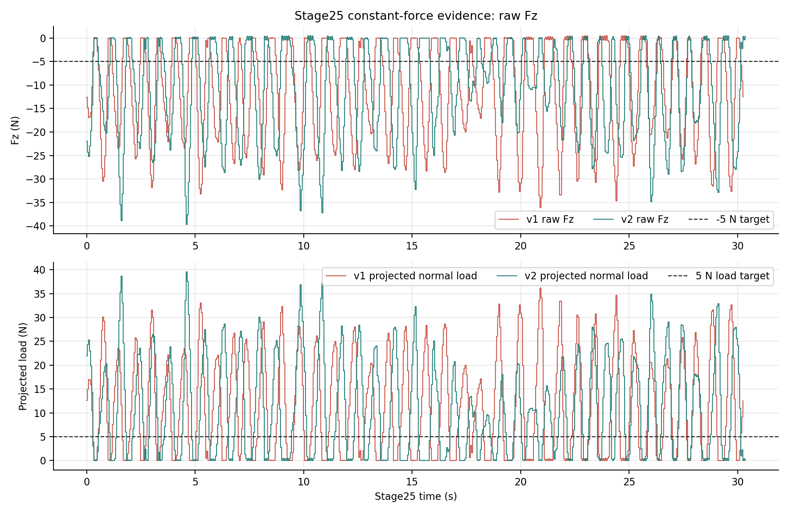
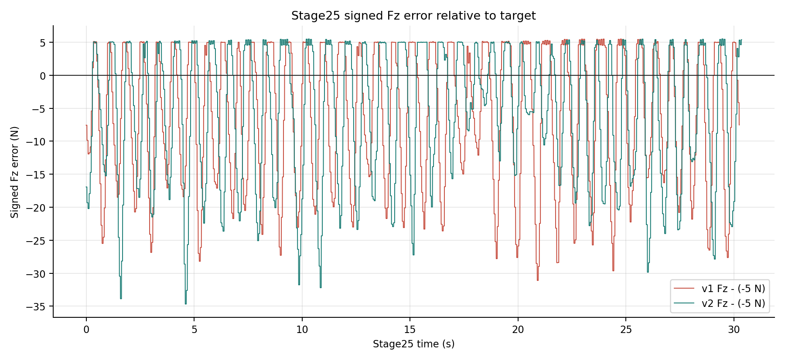
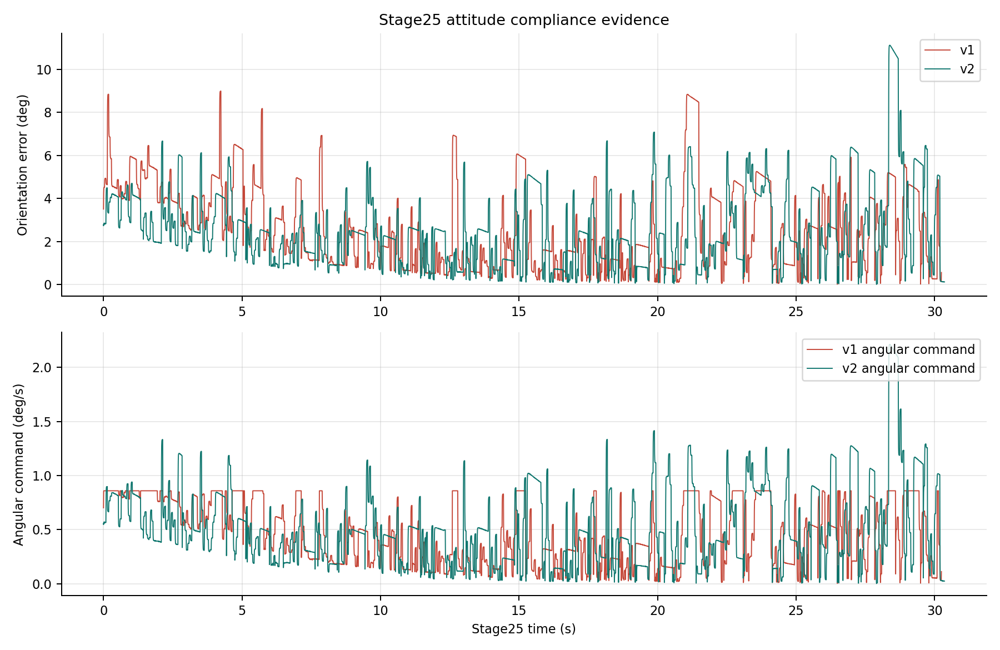
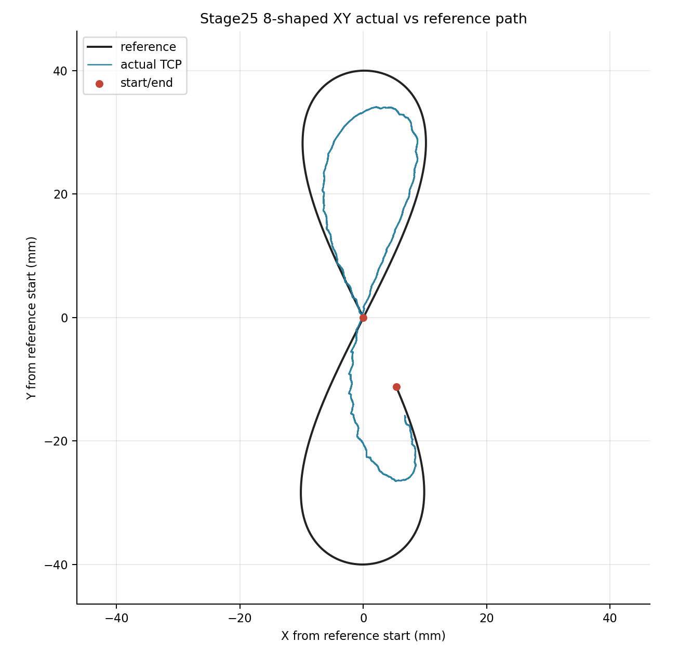
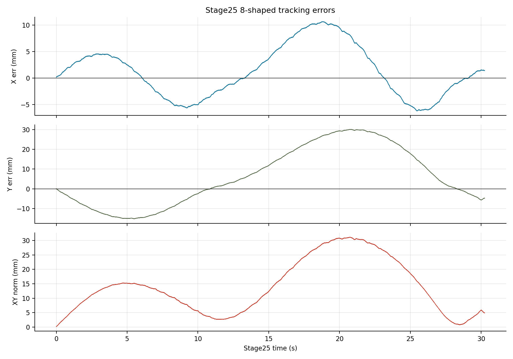
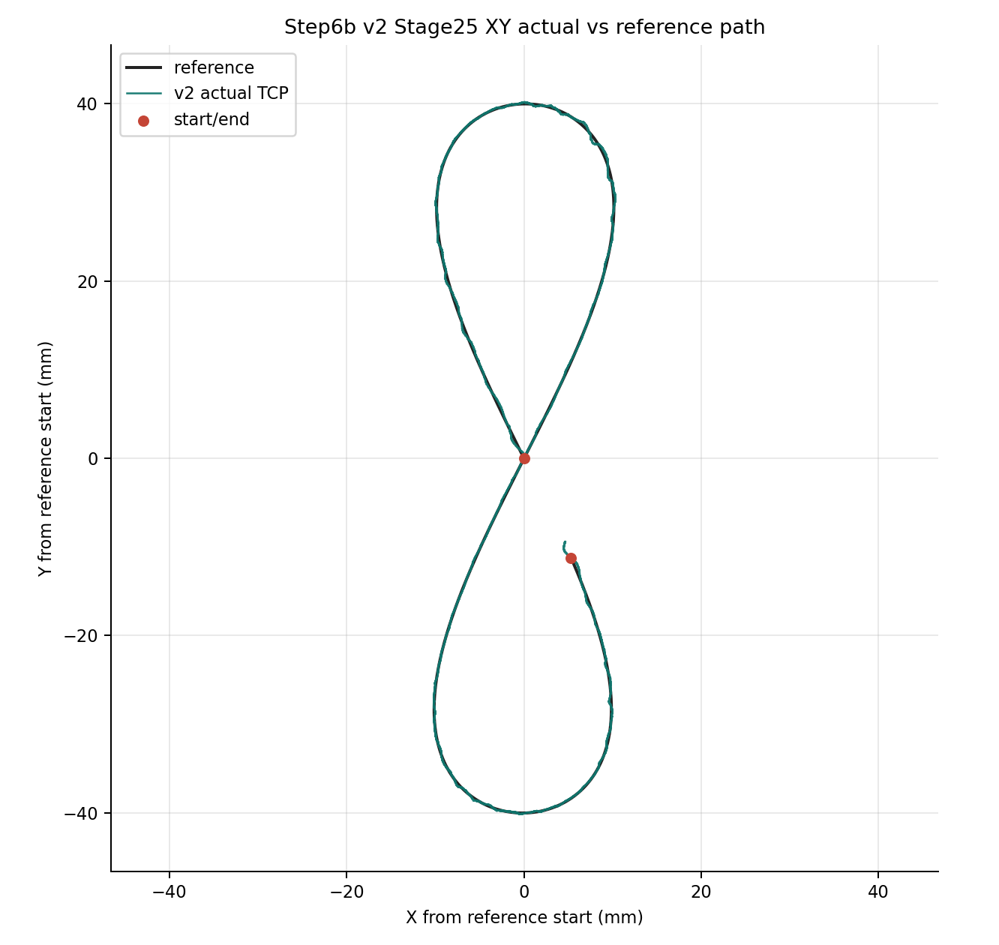
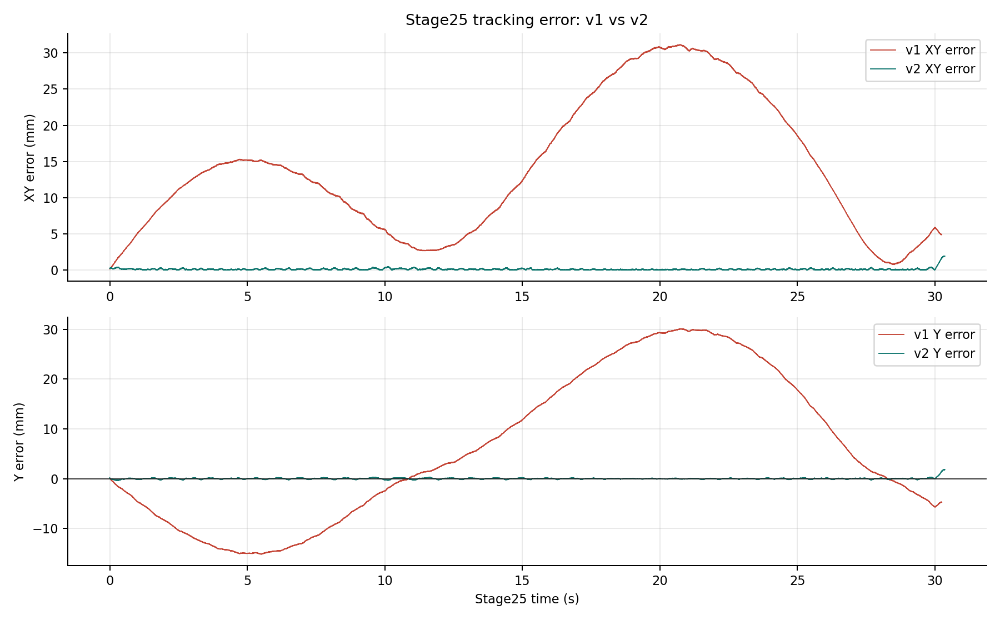
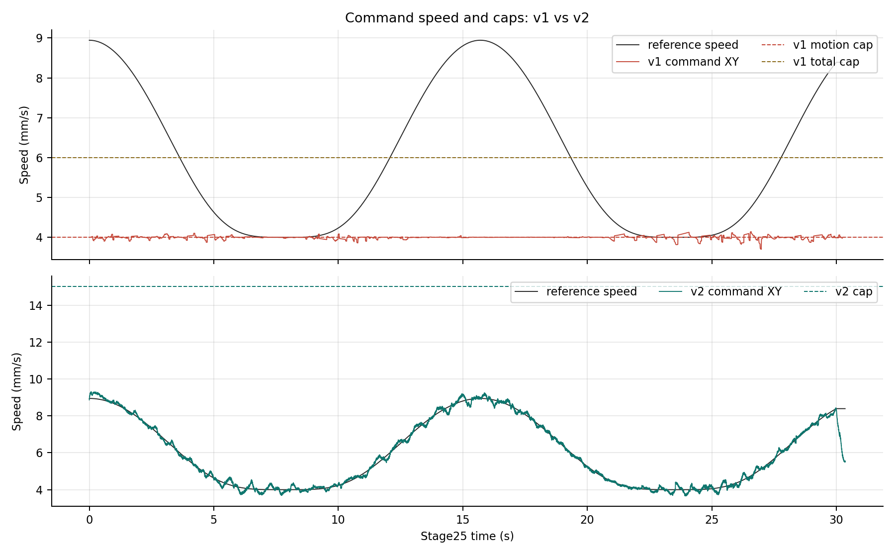

# Step6b Contact 8-Shaped Baseline 技术报告

## 实验目的

本报告记录 Step6b contact 8-shaped baseline 的两次运行，并按复现目标分开判定三类 evidence：

- 恒力接触：必须看 raw `Fz` 相对 signed target `-5 N` 的时序和误差。
- 姿态 compliance：当前用 Stage25 `step4e_orientation_error_rad` 和 angular command 作为可观测证据。
- 轨迹跟踪：看 XY actual vs reference、X/Y error 和 command cap。

IK/joint 相关 error 暂不纳入本报告，因为当前 run 没有定义 joint reference/error 口径。

- `v1`: `step6b_contact_eight_baseline_v1`，第一次 contact 8-shaped baseline。它完成了 runtime/state-machine，但 XY path quality 不合格。
- `v2`: `step6b_contact_eight_baseline_v2`，保留同一 Step6 safe frame 和 30 s 8-shaped reference，只把 bridge speed profile 改为 15 mm/s path cap、15 mm/s total linear cap、0.060 rad/s attitude cap。它完成 runtime/state-machine，并且 XY tracking 显著改善。

结论先给出：`v1` 不能算 path-quality success；`v2` 可以作为当前 Step6b contact 8-shaped baseline 的轨迹 evidence run，但不能算 force-quality success。`v1` 的 Stage25 XY error mean 为 `13.93 mm`、p95 为 `30.45 mm`；`v2` 降到 mean `0.124 mm`、p95 `0.281 mm`。同时，v2 的 Stage25 raw `Fz` mean 为 `-10.75 N`，相对 `-5 N` 的 signed-error MAE 仍为 `9.16 N`，恒力控制还需要继续修。

## 实验条件

| 字段 | v1 | v2 |
|---|---|---|
| TP program | `/programs/andyl/kunwei/step6/step6b_contact_eight_baseline_v1.urp` | `/programs/andyl/kunwei/step6/step6b_contact_eight_baseline_v2.urp` |
| run id | `bridge_step6b_contact_eight_baseline_v1_20260612_223047` | `bridge_step6b_contact_eight_baseline_v2_20260612_225841` |
| run 目录 | [v1 run](../experiments/kunwei/closed-loop-straight-line/2026-06-04/runs/bridge_step6b_contact_eight_baseline_v1_20260612_223047) | [v2 run](../experiments/kunwei/closed-loop-straight-line/2026-06-04/runs/bridge_step6b_contact_eight_baseline_v2_20260612_225841) |
| bridge profile | `step6b_v1` | `step6b_v2` |
| Step6 reference | `along=0.04*sin(0.2t)`, `lateral=0.01*sin(0.4t)`, duration `30 s` | same |
| reference speed max | `8.944 mm/s` | `8.944 mm/s` |
| path motion cap | `4 mm/s` | `15 mm/s` |
| total linear cap | `6 mm/s` | `15 mm/s` |
| normal velocity cap | `3 mm/s` | `3 mm/s` |
| 25.2 attitude cap | `0.015 rad/s` | `0.060 rad/s` |
| target force | raw `Fz=-5.0 N`; projected normal load target `5.0 N` | same |
| force channel | `normal_axis=fz`, `normal_sign=1.0`; `normal_force_n == fz_n_zeroed` | same |
| guard contract | normal `50 N`, force norm `60 N`, torque norm `3.0 Nm` | same |
| safety boundary | no UR `zero_ftsensor()`, no TCP/payload write, no Ubuntu URScript motion send | same |

两次运行使用同一个 Step6 five-waypoint rigid no-scale safe frame。两次 `summary.stop_reason="signal_sigint"` 都是 TP program stopped 后 operator 停 Ubuntu bridge；success/failure 判断使用 TP final stage、output stop register、path time、guards、Fz/attitude/XY task-window metrics。

## 启动命令

v1:

```bash
cd /home/andy/ur10e_ros2_ws/experiments/kunwei/closed-loop-straight-line/2026-06-04
STEP6B_CONFIRM='LIVE STEP6B CONTACT RUN' scripts/step6b-contact-operator.sh contact-bridge
```

v2:

```bash
cd /home/andy/ur10e_ros2_ws/experiments/kunwei/closed-loop-straight-line/2026-06-04
STEP6B_CONFIRM='LIVE STEP6B CONTACT RUN' scripts/step6b-v2-contact-operator.sh contact-bridge
```

报告图表和指标由 [generate_assets.py](assets/step6b-contact-eight-baseline/generate_assets.py) 从 run CSV/JSON 重新生成，输出 [metrics.json](assets/step6b-contact-eight-baseline/metrics.json)。

## 运行完成情况

| 指标 | v1 | v2 |
|---|---:|---:|
| bridge rows | `33,367` | `39,035` |
| bridge write rate | `500.34 Hz` | `500.29 Hz` |
| RTDE output logging rate | `500.00 Hz` | `500.01 Hz` |
| Stage25 active duration | `30.244 s` | `30.354 s` |
| final stage register 35 | `29.0` | `29.0` |
| final stop register 30 | `1.0` | `1.0` |
| final path time register 31 | `30.0 s` | `30.0 s` |
| non-empty `guard_reason` rows | `0` | `0` |
| force norm max full run | `36.64 N` | `42.69 N` |
| normal force min full run | `-36.49 N` | `-41.47 N` |
| torque norm max full run | `0.731 Nm` | `0.878 Nm` |
| RTDE reconnect events | `0` | `0` |
| Kunwei quiet stop | `ok=true` | `ok=true` |

两次都完成了 Step6b TP runtime/state-machine。差异不在“有没有跑完”，而在 Stage25 active path quality。

## 恒力接触 / Fz Evidence

Fz 不能被 projected normal load 或 force norm 代替。这里 raw `Fz` 来自 `fz_n_zeroed`；在本 run 配置下 `normal_force_n == fz_n_zeroed`，因为 bridge 参数是 `normal_axis=fz`, `normal_sign=1.0`。恒力目标线按 signed target 画为 `-5 N`。



raw `Fz` 图说明 v2 的 XY 修复没有自动带来恒力质量修复。v2 Stage25 `Fz` mean 是 `-10.75 N`，min 到 `-39.68 N`；这已经远离 `-5 N` target。下半图的 projected normal load 是控制诊断量，可以说明 bridge 实际控制的 normal-load 投影也偏大，但它不能替代 raw `Fz` 作为论文恒力目标证据。



| Fz 指标 | v1 | v2 |
|---|---:|---:|
| Stage25 raw Fz mean | `-11.05 N` | `-10.75 N` |
| Stage25 raw Fz min / max | `-36.10 / 0.48 N` | `-39.68 / 0.50 N` |
| Fz signed error mean vs `-5 N` | `-6.05 N` | `-5.75 N` |
| Fz signed error MAE vs `-5 N` | `9.52 N` | `9.16 N` |
| Fz signed error p95 abs | `24.37 N` | `23.32 N` |
| projected normal load mean | `11.06 N` | `10.79 N` |
| projected load error MAE vs `5 N` | `9.51 N` | `9.14 N` |

因此 v2 的 force 结论必须写成：Fz 恒力目标没有达成，下一版需要单独做 force regulation/contact transient 改进。

## 姿态 Compliance

姿态 compliance 也应该有图。当前可用证据是 Stage25 的 orientation error 和 bridge angular command。它不是 joint-level IK error；joint reference/error 还没进入数据口径。



| 姿态指标 | v1 | v2 |
|---|---:|---:|
| orientation error mean | `2.62 deg` | `2.62 deg` |
| orientation error p95 | `5.96 deg` | `5.96 deg` |
| orientation error max | `8.99 deg` | `11.13 deg` |
| angular command max | `0.86 deg/s` | `2.21 deg/s` |

v2 的 25.2 attitude cap 提高到 `0.060 rad/s` 是为进入 Stage25 前的姿态调整留足速度；Stage25 内仍然能看到姿态误差和 angular command。这个图用于保留姿态 compliance 证据，但当前不能替代后续 joint/IK error 分析。

## XY 轨迹跟踪

### v1: XY Path Failed

`v1` 的 reference 是完整 Step6 safe-frame 8-shaped path，但 actual TCP 被明显压缩。Reference span 为 `X=20.28 mm`、`Y=80.00 mm`，actual TCP span 只有 `X=15.47 mm`、`Y=60.66 mm`。



`v1` tracking error 的主要贡献来自 Y 方向：Y error p99 abs 为 `29.91 mm`，XY norm p99 为 `30.95 mm`。



### v2: XY Tracking Clean

`v2` 用同一 reference 和 safe frame，但 15 mm/s cap 不再压住 path command。Actual TCP 基本贴合 reference。Reference span 为 `X=20.28 mm`、`Y=80.00 mm`，actual TCP span 为 `X=20.55 mm`、`Y=80.38 mm`。



v1/v2 tracking error 对比很直接：v2 的 error 基本降到 sub-mm 区间。



v1/v2 command speed 对比说明根因：v1 command 被约 4 mm/s path cap 卡住；v2 command max `9.31 mm/s`，高于 reference max `8.94 mm/s`，但低于 15 mm/s cap。



### Tracking 统计

| 指标 | v1 | v2 |
|---|---:|---:|
| XY error mean | `13.928 mm` | `0.124 mm` |
| XY error median | `12.657 mm` | `0.079 mm` |
| XY error p95 | `30.451 mm` | `0.281 mm` |
| XY error p99 | `30.946 mm` | `0.442 mm` |
| XY error max | `31.162 mm` | `1.942 mm` |
| X error p99 abs | `10.474 mm` | `0.338 mm` |
| Y error p99 abs | `29.908 mm` | `0.360 mm` |
| reference X/Y span | `20.279 / 79.999 mm` | `20.279 / 79.999 mm` |
| actual X/Y span | `15.474 / 60.657 mm` | `20.545 / 80.381 mm` |
| cmd XY p99 | about `4.10 mm/s` | `9.19 mm/s` |
| cmd XY max | `4.14 mm/s` | `9.31 mm/s` |
| reference speed max | `8.944 mm/s` | `8.944 mm/s` |

## Fz 与接触质量

Force quality 仍然需要继续修：v2 修好了 XY tracking，但没有把 force control 修干净。本节保留 force norm 和 torque norm 作为 guard/接触质量补充；恒力主证据以上面的 raw `Fz` 图为准。

| 指标 | v1 | v2 |
|---|---:|---:|
| Stage25 normal force mean | `-11.05 N` | `-10.75 N` |
| Stage25 force MAE vs `-5 N` | `9.52 N` | `9.16 N` |
| Stage25 force norm max | `36.24 N` | `42.48 N` |
| Stage25 torque norm max | `0.727 Nm` | `0.877 Nm` |
| full-run force norm max | `36.64 N` | `42.69 N` |
| full-run normal force min | `-36.49 N` | `-41.47 N` |
| full-run torque norm max | `0.731 Nm` | `0.878 Nm` |

v2 的 force transient 更大一些，但仍在 guard contract 内。当前结论应写成：v2 solves path tracking under contact; Fz force regulation remains rough and is the next control-quality target.

## 为什么 v1 图 4 的 XY 很差

这件事本应离线检查出来。Step6 reference 的最大 XY speed 是：

```text
along_v_max = 0.04 * 0.2 = 0.008 m/s
lateral_v_max = 0.01 * 0.4 = 0.004 m/s
combined max = sqrt(8^2 + 4^2) = 8.944 mm/s
```

`v1` bridge 的 path motion cap 是 `4 mm/s`，total linear cap 是 `6 mm/s`。即使不考虑 path error P correction，reference velocity 本身就超过 path cap；如果再给 normal force correction 留 `3 mm/s` reserve，总需求约 `9.434 mm/s`，也超过 total cap。因此 v1 的 path command 被限幅，actual 只能走出压缩的 8 字。

`v2` 把 path cap 和 total linear cap 都提高到 `15 mm/s`，离线 gate 通过；实际 run 也验证 command XY max `9.31 mm/s`，没有撞 15 mm/s cap。

## 已做修正

v2 package 和 operator 已经落地：

- local triplet: `programs/step6/step6b_contact_eight_baseline_v2.{script,txt,urp}`
- controller target: `/programs/andyl/kunwei/step6/step6b_contact_eight_baseline_v2.urp`
- controller read-back verified: [read-back dir](../experiments/kunwei/closed-loop-straight-line/2026-06-04/runs/controller_readback_step6b_contact_eight_baseline_v2_20260612_225651)
- operator: `scripts/step6b-v2-contact-operator.sh`
- offline feasibility gate: package generation前检查 reference speed、total-with-normal reserve、25.2 attitude capacity。

v2 的 25.2 attitude cap 也从 `0.015 rad/s` 调到 `0.060 rad/s`。设计窗口为：

```text
0.060 rad/s * 8 s = 0.480 rad
hard stop 0.523599 rad - success threshold 0.052360 rad = 0.471239 rad
```

这说明 v2 的 25.2 姿态速度上限覆盖了 30 deg hard-stop 到 3 deg success threshold 的设计窗口。

## 下一步改进建议

保留 v2 作为当前有效 evidence run。下一版可以考虑两个机械/流程效率改动，但应单独做 v3，不混在 v2 结论里：

1. Far search speed 可以增加 `+5 mm/s`。
   - 当前第一段 far search 是 `15 mm/s`，第二次 far search 是 `5 mm/s`。
   - 建议明确成 v3 profile：第一段 far search `20 mm/s`，第二次 far search `10 mm/s`，near search 仍保守保持 `2.5..3 mm/s`。
   - 这主要改善 runtime，不应改变 Stage25 path reference。
2. First contact 后 lift 再姿态调整的上升距离可以减少 `5 mm`。
   - 当前 scaffold 是 first contact 后 lift `20 mm` 再做 25.2 attitude correction。
   - 建议 v3 改成 lift `15 mm`，减少第二次下探距离和总耗时。
   - 这需要保留姿态阶段的 linear-zero gate，确保 25.2 仍只执行 angular speedl，不混入 linear command。

另一个必须保留的工程规则：以后生成 step script/package 前，必须先跑数值仿真 gate，至少检查 reference max speed、command caps、normal reserve、attitude correction capacity。不能只看流程是否能跑完。

## 结论

1. `v1` 保留为失败 evidence：runtime 完成，但 path-quality failed。根因是 bridge command cap 离线不可行。
2. `v2` 是有效的 XY 修正：runtime 完成，guards 未触发，Kunwei quiet stop 通过，XY tracking 达到 sub-mm 级别。
3. v2 仍不是 force-quality success。Stage25 raw `Fz` signed-error MAE 仍约 `9.16 N`，下一阶段应单独处理 Fz regulation/contact transients。
4. 姿态 compliance 已补图保留证据；joint/IK error 目前没有 reference/error 数据，暂不判定。
5. 后续优化建议进入 `v3`：far search `+5 mm/s`，first-contact lift distance `-5 mm`。

## 附录

### 原始文件

| artifact | v1 | v2 |
|---|---|---|
| summary | [v1 summary](../experiments/kunwei/closed-loop-straight-line/2026-06-04/runs/bridge_step6b_contact_eight_baseline_v1_20260612_223047/summary.json) | [v2 summary](../experiments/kunwei/closed-loop-straight-line/2026-06-04/runs/bridge_step6b_contact_eight_baseline_v2_20260612_225841/summary.json) |
| metadata | [v1 metadata](../experiments/kunwei/closed-loop-straight-line/2026-06-04/runs/bridge_step6b_contact_eight_baseline_v1_20260612_223047/metadata.json) | [v2 metadata](../experiments/kunwei/closed-loop-straight-line/2026-06-04/runs/bridge_step6b_contact_eight_baseline_v2_20260612_225841/metadata.json) |
| stage frequency | [v1 stage frequency](../experiments/kunwei/closed-loop-straight-line/2026-06-04/runs/bridge_step6b_contact_eight_baseline_v1_20260612_223047/stage_frequency_summary.json) | [v2 stage frequency](../experiments/kunwei/closed-loop-straight-line/2026-06-04/runs/bridge_step6b_contact_eight_baseline_v2_20260612_225841/stage_frequency_summary.json) |
| bridge RTDE CSV | [v1 bridge CSV](../experiments/kunwei/closed-loop-straight-line/2026-06-04/runs/bridge_step6b_contact_eight_baseline_v1_20260612_223047/bridge_rtde_500hz.csv) | [v2 bridge CSV](../experiments/kunwei/closed-loop-straight-line/2026-06-04/runs/bridge_step6b_contact_eight_baseline_v2_20260612_225841/bridge_rtde_500hz.csv) |
| Kunwei quiet stream | [v1 quiet](../experiments/kunwei/closed-loop-straight-line/2026-06-04/runs/bridge_step6b_contact_eight_baseline_v1_20260612_223047/kunwei_quiet_stream.json) | [v2 quiet](../experiments/kunwei/closed-loop-straight-line/2026-06-04/runs/bridge_step6b_contact_eight_baseline_v2_20260612_225841/kunwei_quiet_stream.json) |
| derived metrics | [metrics.json](assets/step6b-contact-eight-baseline/metrics.json) | same |

### 生成命令

```bash
python3 /home/andy/ur10e_ros2_ws/report/assets/step6b-contact-eight-baseline/generate_assets.py
```

### 频率口径说明

- `bridge_write_timing` 是 Ubuntu bridge 向 RTDE input 写 register 的频率。
- `rtde_output_timing` 是 UR RTDE output logging 的频率。
- `stage*_echo_rate` 来自 UR output heartbeat transition，是 URScript echo/motion gate 观测。
- Kunwei raw stream、bridge write、RTDE output、URScript echo 和机器人内部 servo loop 不是同一个频率层级。
