## Bench Setup

The current contribution is the working UR10e / OnRobot HEX bench: mounted force sensor, small switch, Compute Box, Ethernet/RTDE path, and repeatable force-control measurements.

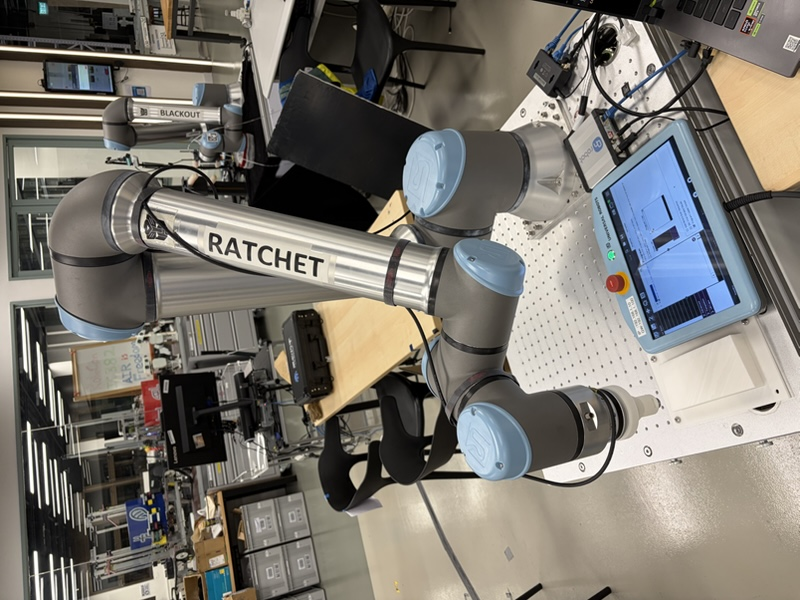

[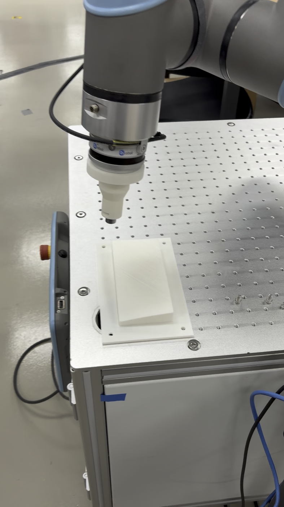](assets/final_wiring.mp4)

| View | Evidence |
| --- | --- |
| HEX sensor | 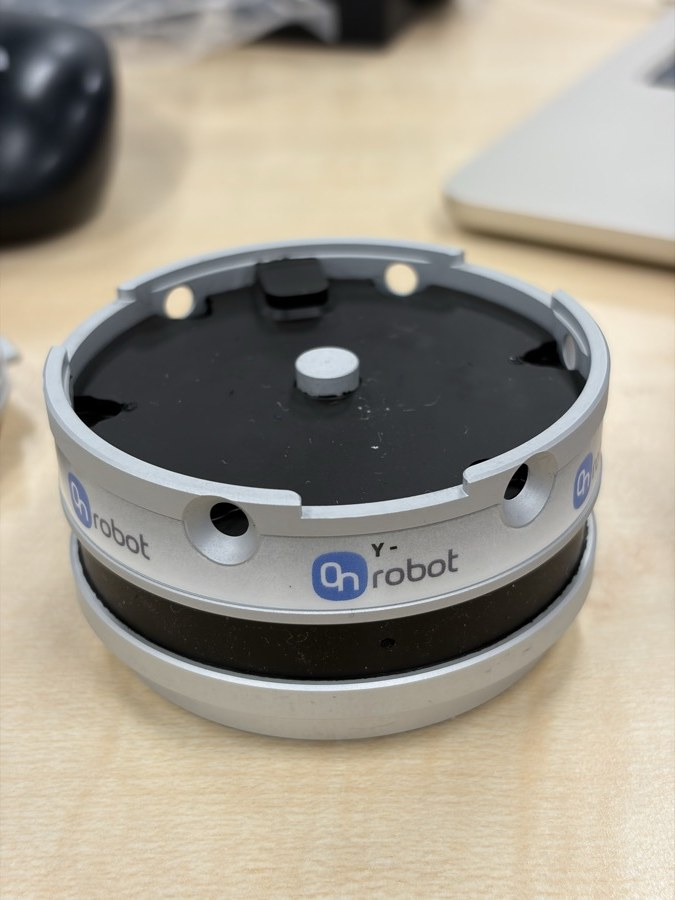 |
| Small Ethernet switch | 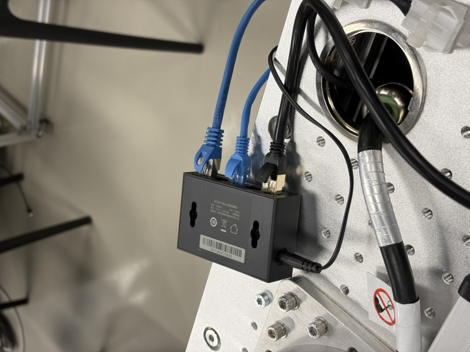 |
| Compute Box | 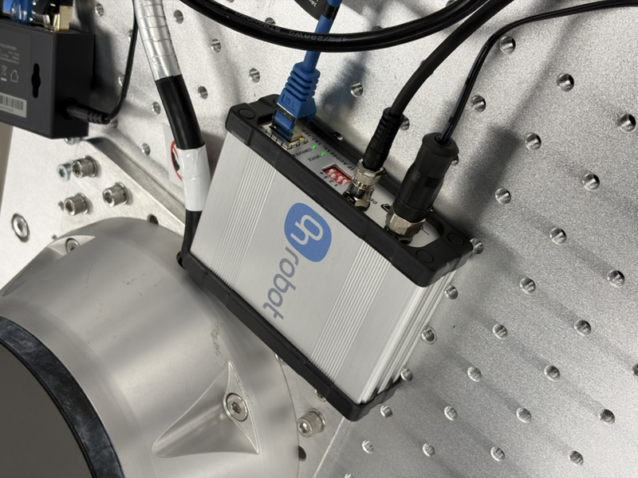 |

## Sensor Baseline

The 600 s static validation section focuses on Fz. UR `actual_TCP_force` was logged at 500 Hz, OnRobot URCap registers at 125 Hz, and OnRobot UDP raw at SPEED=2 near 500 Hz. The capture completed with `errors=[]`; UDP sequence deltas were all `+1`, and UDP sample-counter deltas were all `+2`.

Software zero rule: each stream/channel subtracts its own first logged sample. No hardware zero was sent: no OnRobot `BIAS`, no OnRobot `FILTER`, no UR `zero_ftsensor()`, no URScript motion, and no TCP/payload writes. Dashboard before/after remained `PLAYING 3.urp`, Safetymode `NORMAL`, Robotmode `RUNNING`.

Timestamp alignment result: best lag is -4.75 ms using `URCap(t) - UDP(t + lag)`. Nearest UDP sample spacing from one URCap update to the next is mostly 4 packets (`4: 74057`), consistent with about 4x downsampling/hold in shape.

Conclusion: Strict first-zero equality is not supported. After timestamp alignment, the Fz residual keeps a fixed mean offset of -0.220 N (RMS 0.220 N, max abs 0.510 N), which is larger than force quantization and the remaining timestamp-alignment error. The dynamic shape is still consistent with approximately 4x downsampling/hold.

| Axis | Unit | Mean error | Std | RMS | Max abs |
| --- | --- | ---: | ---: | ---: | ---: |
| Fz | N | -0.219995 | 0.011601 | 0.220300 | 0.510000 |

## Force-Control Demo

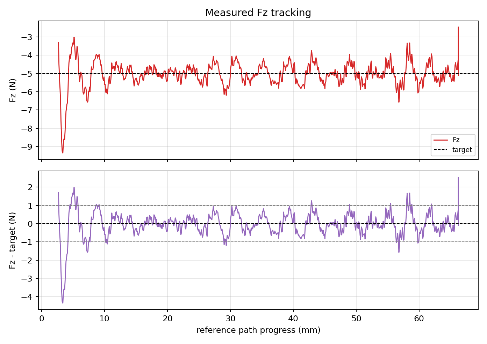

| Metric | Value |
| --- | ---: |
| Fz error MAE (N) | 0.612 |
| Fz error IAE (N*s) | 58.232 |
| Within +/-1 N (%) | 85.9 |
| Within +/-2 N (%) | 94.4 |

## Path Tracking

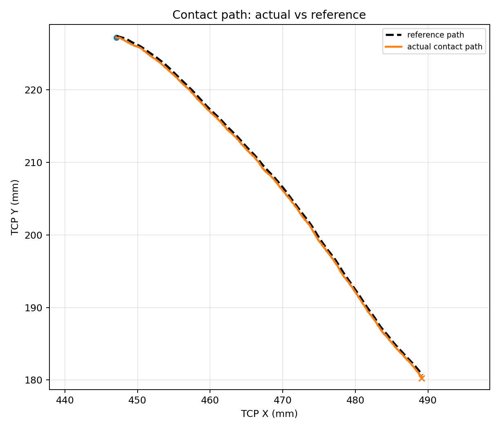

[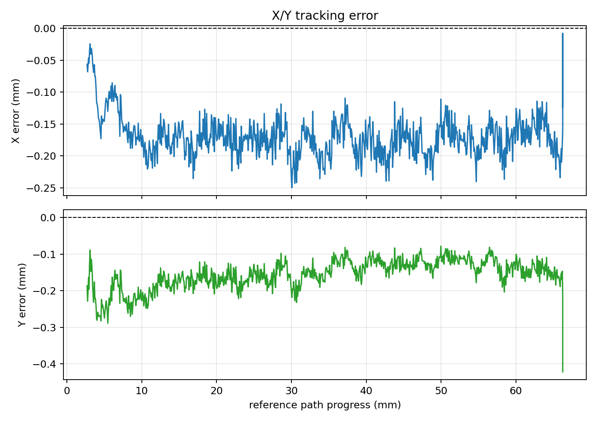](assets/path_tracking_xy_error.png)

| Metric | Value |
| --- | ---: |
| X MAE (mm) | 0.168 |
| Y MAE (mm) | 0.159 |
| 2D P95 (mm) | 0.304 |

## Settings

| Item | Setting |
| --- | --- |
| `F/T Control` | Tool Z compliant, target `Fz=+5 N` |
| Force PID | `[0.5, 0.1, 0.1]` |
| `F/T Move` | speed 0.010 m/s |

## Program Interface

[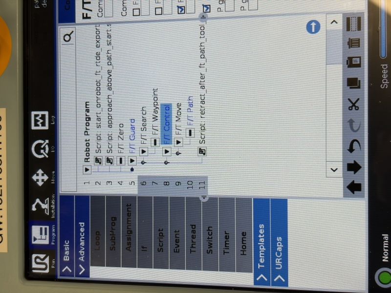](assets/program_interface.mp4)

## Demo Video

[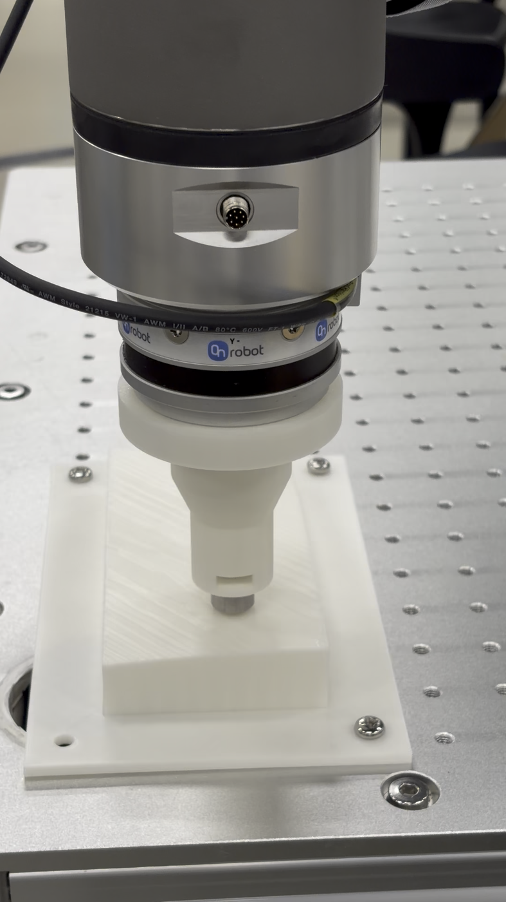](assets/demo_experiment.mp4)

## Appendix: Six-Axis Stream Validation

The appendix keeps the non-Fz plots and the URCap-versus-UDP 500 Hz comparison out of the main weekly-meeting flow.

| Axis | Unit | Mean error | Std | RMS | Max abs |
| --- | --- | ---: | ---: | ---: | ---: |
| Fx | N | -0.019982 | 0.003504 | 0.020287 | 0.100000 |
| Fy | N | 0.010022 | 0.002340 | 0.010291 | 0.060000 |
| Fz | N | -0.219995 | 0.011601 | 0.220300 | 0.510000 |
| Tx | Nm | 0.001990 | 0.000335 | 0.002018 | 0.011990 |
| Ty | Nm | 0.004998 | 0.000333 | 0.005009 | 0.014000 |
| Tz | Nm | -0.003996 | 0.000185 | 0.004001 | 0.010000 |

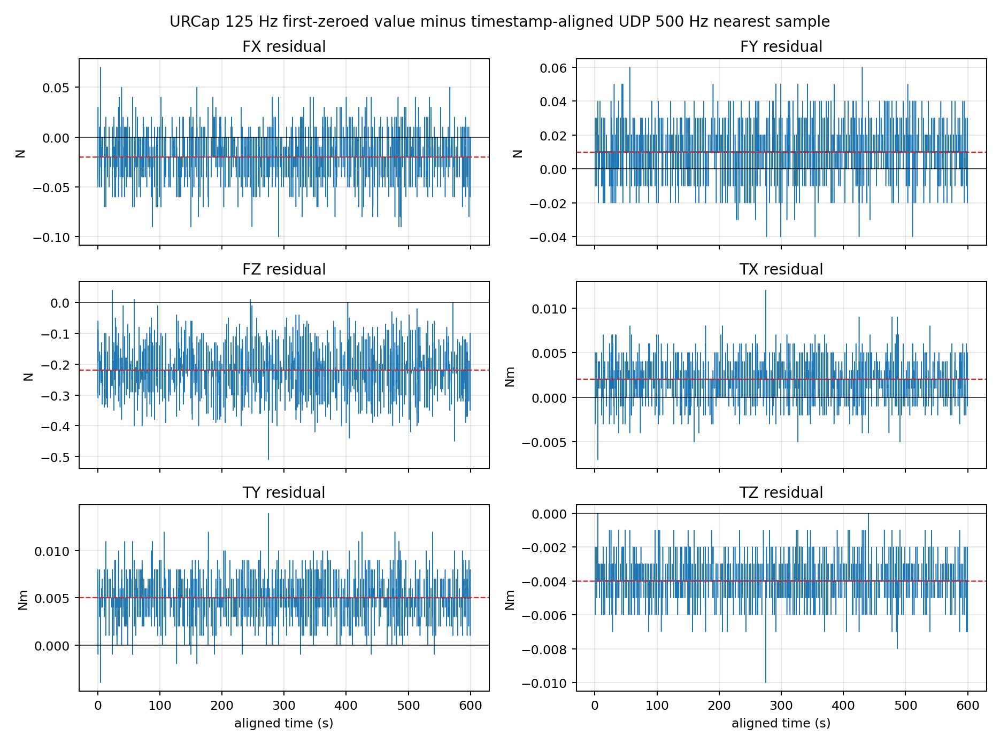
