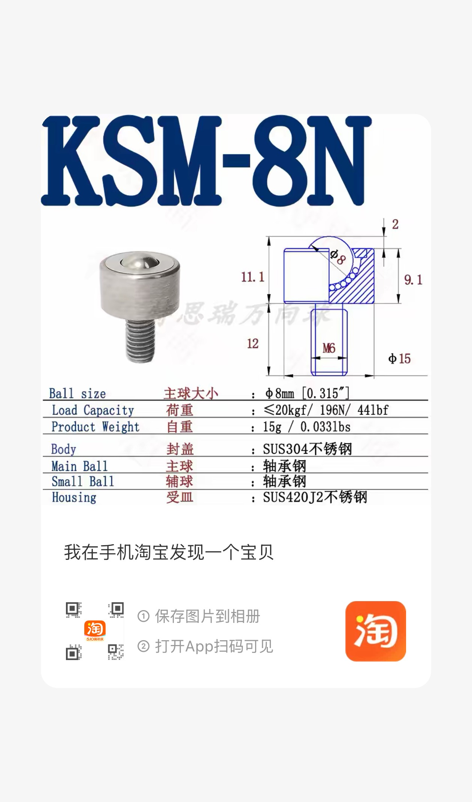
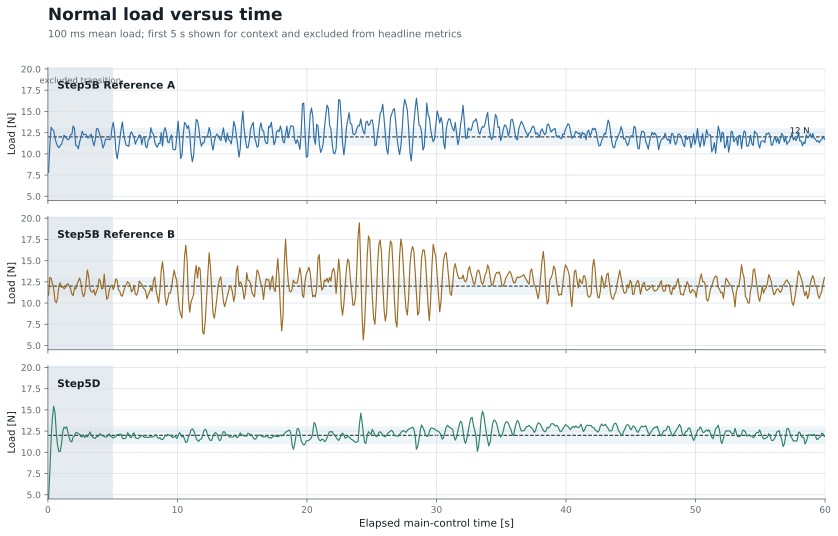
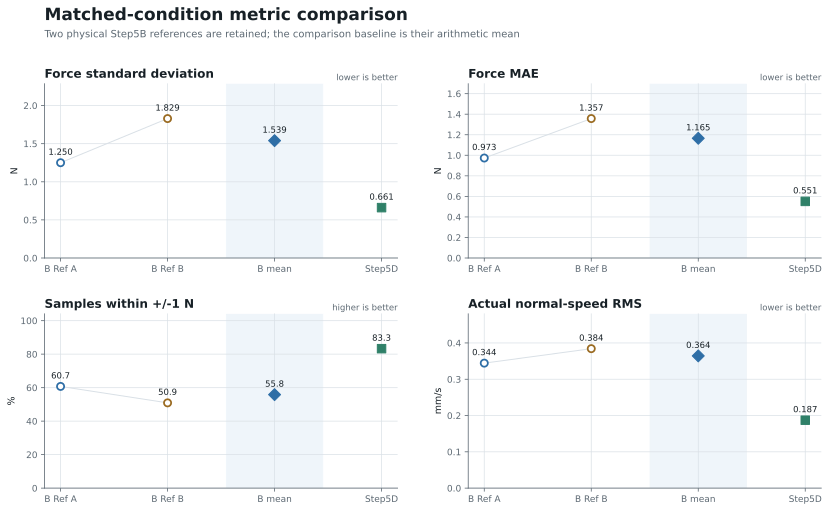
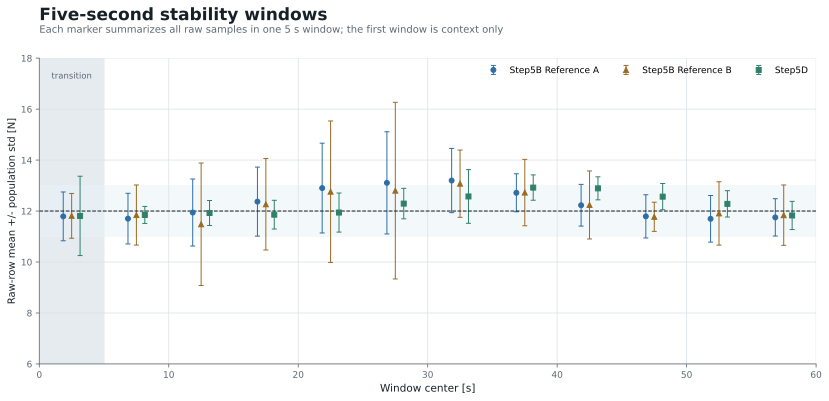
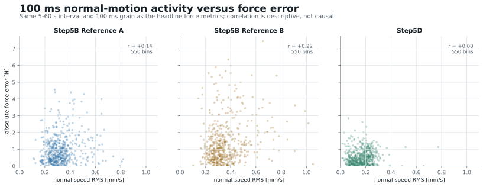

<section id="summary" class="hero" markdown="1">

UR10e contact-control progress · Group meeting · 16 July 2026

# Step5D Force-Control Progress

## Executive summary

**Under matched outer-loop gains and a common 12 N target, Step5D reduces force fluctuation and normal-motion activity without materially shifting the mean load.**

- Force standard deviation is **57.1% lower** than the mean of two Step5B references.
- Force MAE is **52.7% lower**, while coverage inside 12 ± 1 N increases by **27.5 percentage points**.
- Actual normal-speed RMS is **48.6% lower**, consistent with less normal-direction excitation.
- The surface was prepared before both comparison campaigns, so sanding is a common condition rather than an explanation for the controller difference.
- Twelve newtons is an empirical preload choice supported by a low-load dropout attempt, a completed 10 N run, and a completed 12 N reference. It is not derived from the KSM-8N model name and is not claimed to be mathematically optimal.
- The automatic-tuning framework is implemented, but this report contains **no fabricated or provisional tuning result**.

Force std<strong>0.661 N</strong><small>57.1% below Step5B mean</small>

Force MAE<strong>0.551 N</strong><small>52.7% below Step5B mean</small>

Within ±1 N<strong>83.3%</strong><small>+27.5 percentage points</small>

Normal-speed RMS<strong>0.187 mm/s</strong><small>48.6% below Step5B mean</small>

**Interpretation boundary.** These values compare independent physical runs with matched outer-loop parameters. Step5B and Step5D use different inner command realizations, so the data support a stability comparison but do not isolate one causal component.

Report contents

1. [Executive summary](#summary)
2. [Experimental setup and contact mechanics](#setup)
3. [Surface preparation](#surface-preparation)
4. [Why 12 N instead of 5 N](#why-12n)
5. [From Step5B to Step5D](#step5b-to-step5d)
6. [Fair comparison protocol](#comparison-protocol)
7. [Force stability results](#force-stability)
8. [Why Step5D appears more stable](#stability-mechanism)
9. [Current Step5D completion boundary](#completion-boundary)
10. [Automatic tuning objective](#tuning-objective)
11. [Parameter grid and Bayesian Optimization](#parameter-search)
12. [Physical experiment loop](#physical-loop)
13. [Video evidence and next experiment](#video-next)

</section>

<section id="setup" markdown="1">

Experiment basis

## Experimental setup and contact mechanics

The UR10e end effector uses a KSM ball-transfer unit as the rolling contact point. The measured Cartesian force is projected onto the current control normal, while the robot follows the prescribed tangential cycloid motion and regulates the normal load.

### What the controller must regulate

- **Normal direction:** maintain a compressive contact load near 12 N.
- **Tangential direction:** complete the same cycloid motion without injecting unnecessary normal motion.
- **Orientation:** remain locally consistent with the contact frame.
- **Joint realization:** convert the Cartesian objective into commands that the robot can execute smoothly and safely.

The contact force is not determined by the outer force law alone. Surface geometry, the rolling-ball mechanism, robot kinematics, command smoothing, joint acceleration, and the low-level robot controller all affect the measured response.

### Evidence timeline

  
<strong>Before 29 June</strong>Controlled surface preparation completed

  
<strong>2 July</strong>Step5B reference data collected

  
<strong>15 July</strong>Step5D comparison data collected

The preparation therefore precedes both controller comparisons.

</section>

<section id="surface-preparation" markdown="1">

Controlled experimental condition

## Surface preparation

**The contact plate was progressively prepared using 240#, 320#, 400#, and 600# abrasive papers.** The purpose was to remove local high spots and reduce abrupt changes along the rolling-contact path.

<figure class="span-5 figure portrait-figure">
  

    
  

  <figcaption>Abrasive papers used for controlled surface preparation: 240#, 320#, 400#, and 600#. The screenshot documents the selected materials; it is not a surface-roughness measurement.</figcaption>
</figure>

<figure class="span-7 figure">
<svg class="schematic" viewBox="0 0 820 390" role="img" aria-labelledby="surface-title surface-desc">
  <title id="surface-title">Before and after surface-preparation schematic</title>
  <desc id="surface-desc">A rolling ball encounters a local high spot before preparation and a smoother path after preparation.</desc>
  <defs>
    <marker id="arrow-blue" markerWidth="9" markerHeight="9" refX="7" refY="3" orient="auto"><path d="M0,0 L0,6 L8,3 z" fill="#2e6ea6"/></marker>
    <marker id="arrow-gray" markerWidth="9" markerHeight="9" refX="7" refY="3" orient="auto"><path d="M0,0 L0,6 L8,3 z" fill="#5c6872"/></marker>
  </defs>
  <text x="30" y="42" class="svg-heading">Before preparation</text>
  <path d="M30 250 C100 238, 145 258, 205 246 L245 188 L285 248 C345 258, 372 238, 395 244" class="surface-line rough"/>
  <circle cx="245" cy="132" r="49" class="ball"/>
  <line x1="245" y1="182" x2="245" y2="220" class="load-arrow" marker-end="url(#arrow-blue)"/>
  <line x1="176" y1="235" x2="154" y2="178" class="normal-arrow" marker-end="url(#arrow-gray)"/>
  <line x1="245" y1="188" x2="286" y2="143" class="normal-arrow" marker-end="url(#arrow-gray)"/>
  <line x1="310" y1="242" x2="330" y2="184" class="normal-arrow" marker-end="url(#arrow-gray)"/>
  <text x="151" y="290" class="svg-label">local high spot</text>
  <text x="81" y="328" class="svg-note">surface normal changes rapidly</text>

  <line x1="410" y1="28" x2="410" y2="350" class="divider"/>

  <text x="445" y="42" class="svg-heading">After progressive preparation</text>
  <path d="M445 250 C520 244, 575 247, 635 242 C700 238, 752 244, 790 241" class="surface-line smooth"/>
  <circle cx="630" cy="188" r="49" class="ball"/>
  <line x1="630" y1="238" x2="630" y2="270" class="load-arrow" marker-end="url(#arrow-blue)"/>
  <line x1="535" y1="243" x2="535" y2="183" class="normal-arrow" marker-end="url(#arrow-gray)"/>
  <line x1="630" y1="240" x2="630" y2="180" class="normal-arrow" marker-end="url(#arrow-gray)"/>
  <line x1="725" y1="240" x2="725" y2="180" class="normal-arrow" marker-end="url(#arrow-gray)"/>
  <text x="492" y="303" class="svg-label">smoother height variation</text>
  <text x="488" y="334" class="svg-note">surface normal changes more continuously</text>
</svg>
<figcaption>A local high spot can create a short contact-force disturbance as the rolling ball crosses it. Progressive preparation reduces this uncontrolled geometric input, but no profilometer or Ra/Rz measurement is available.</figcaption>
</figure>

**Common-condition conclusion.** Surface preparation was common to both Step5B and Step5D comparison runs. It reduced uncontrolled surface disturbances, but it does not explain the observed difference between the two controllers.

</section>

<section id="why-12n" markdown="1">

Target-force decision

## Why 12 N instead of 5 N

The preload target was selected from the installed contact mechanics and physical evidence, not from the text “8N” in the product name.

<figure class="span-4 figure product-figure">
  

    
  

  

    <b>Model</b>KSM-8N
    <b>Main ball</b>φ 8 mm
    <b>Vendor capacity</b>≤196 N
  

  <figcaption>“KSM-8N” is the model identifier; 8N does not mean 8 newtons. The same vendor image separately specifies an 8 mm main ball and a nominal load capacity of up to 196 N.</figcaption>
</figure>

<figure class="span-4 figure">
<svg class="schematic ksm" viewBox="0 0 430 470" role="img" aria-labelledby="ksm-title ksm-desc">
  <title id="ksm-title">Schematic load path through the ball-transfer unit</title>
  <desc id="ksm-desc">A main ball rests on supporting balls within a housing and contacts a surface below.</desc>
  <defs><marker id="arrow-load" markerWidth="9" markerHeight="9" refX="7" refY="3" orient="auto"><path d="M0,0 L0,6 L8,3 z" fill="#2e6ea6"/></marker></defs>
  <path d="M88 110 L88 350 Q88 390 128 390 L302 390 Q342 390 342 350 L342 110" class="housing"/>
  <circle cx="215" cy="185" r="86" class="ball main-ball"/>
  <circle cx="145" cy="285" r="25" class="support-ball"/>
  <circle cx="215" cy="305" r="25" class="support-ball"/>
  <circle cx="285" cy="285" r="25" class="support-ball"/>
  <rect x="58" y="390" width="314" height="18" class="contact-surface"/>
  <path d="M112 222 C138 250, 164 250, 184 236" class="clearance-zone"/>
  <line x1="215" y1="40" x2="215" y2="91" class="load-arrow" marker-end="url(#arrow-load)"/>
  <text x="230" y="57" class="svg-label">normal preload</text>
  <line x1="313" y1="158" x2="372" y2="127" class="leader"/><text x="309" y="112" class="svg-label">main ball</text>
  <line x1="291" y1="285" x2="377" y2="285" class="leader"/><text x="300" y="270" class="svg-label">supporting balls</text>
  <line x1="93" y1="160" x2="28" y2="132" class="leader"/><text x="16" y="116" class="svg-label">housing</text>
  <line x1="110" y1="239" x2="21" y2="239" class="leader"/><text x="10" y="218" class="svg-label">free-play /</text><text x="10" y="237" class="svg-label">reseating region</text>
  <text x="123" y="442" class="svg-label">contact surface</text>
</svg>
<figcaption>Engineering schematic, not to scale. The installed unit transfers load through a main ball, small supporting balls, and housing. The possible free-play/reseating region is a mechanical interpretation, not a measured deadband.</figcaption>
</figure>

### Physical evidence ladder

**5 N — insufficient margin in one attempt**

One 5→15 N ramp attempt lost contact before the target exceeded approximately **5.1 N**. This is one physical attempt, not a strict mechanical threshold.

**10 N — continuous motion validated**

60.2 s completed; mean/median 10.26/10.21 N; p05/p95 7.11/13.47 N; max 18.55 N; 0.20 s below 5 N; 0 s above 20 N.

**12 N — selected operating point**

60 s completed; mean/median 12.265/12.197 N; p05/p95 10.298/14.611 N; max 16.952 N; 0 s below 5 N and 0 s above 20 N.

**Decision.** Twelve newtons provides more preload margin than 5 N while remaining well inside the observed force envelope. It is about 6.1% of the vendor’s nominal 196 N component capacity, but robot and EOAT safety still depend on the actual guards and assembly—not on the vendor rating alone.

</section>

<section id="step5b-to-step5d" markdown="1">

Controller realization

## From Step5B to Step5D

Both controllers use the same local outer force law and target:

vn,cmd = 0.001 eF + 10−5 ∫eFdt − 7 vn, &nbsp; Ftarget = 12 N

The difference is how that Cartesian objective becomes robot motion.

Step5B

outer force-motion law

→

Cartesian speed command

→

robot

Step5D

outer force-motion law

→

constrained RNN joint velocity

→

host slew limit

→

robot acceleration limit

→

robot

### What Step5D adds

- A joint-space solver coordinates all six joints while satisfying the task-space objective.
- Joint-velocity changes are explicitly limited before transmission.
- The robot-side acceleration setting adds another smoothing boundary.

### What remains matched

- 12 N target, **P = 0.001**, **I = 10⁻⁵**, **damping = 7**.
- Same integral limit and tangential gain.
- Locally equivalent orientation gain and the same contact path.

</section>

<section id="comparison-protocol" markdown="1">

Measurement contract

## Fair comparison protocol

**The comparison keeps the outer-loop conditions fixed and reports two Step5B physical references rather than hiding run-to-run variation.**

| Comparison item | Locked value |
|---|---:|
| Target force | 12 N |
| P | 0.001 |
| I | 10⁻⁵ |
| Damping | 7 |
| Integral limit | 1 N·s |
| Tangential gain | 1.5 |
| Headline interval | 5–60 s of main contact control |
| Resampling | fixed 100 ms bins |
| Samples per run | exactly 550 bin means |

### Metric definitions

- **Force standard deviation:** population standard deviation of 550 mean-load bins.
- **Force MAE:** mean (|F_i-12|) over the same bins.
- **Within ±1 N:** share of bins satisfying |Fi − 12| ≤ 1 N.
- **Normal-speed RMS:** RMS of raw Cartesian speed projected onto the control normal over the same 5–60 s interval.

The historical comparison uses elapsed monotonic time measured from the first main-control row. This preserves 550 bins for all three runs despite scheduler gaps in the Step5D recording. The first 5 s are shown separately as contact-transition context and are excluded from headline metrics.

**Limitations.** These are independent physical runs, not a randomized A/B experiment. Step5B and Step5D have different inner realizations. The evidence therefore compares observed stability under matched outer parameters; it cannot attribute every improvement to the RNN alone.

</section>

<section id="force-stability" class="results-section" markdown="1">

Matched 12 N comparison

## Force stability results

### Step5D lowers fluctuation without shifting the mean load

| Metric | Step5B mean | Step5D | Change |
|---|---:|---:|---:|
| Force standard deviation | 1.539 N | 0.661 N | 57.1% lower |
| Force MAE | 1.165 N | 0.551 N | 52.7% lower |
| Within ±1 N | 55.8% | 83.3% | +27.5 percentage points |
| Normal-speed RMS | 0.364 mm/s | 0.187 mm/s | 48.6% lower |
| Mean load | 12.278 N | 12.265 N | −0.013 N |

The mean load changes by only 0.013 N, so the primary difference is reduced variation rather than a shifted operating point.

<figure class="figure wide">
  
  <figcaption><b>Normal load versus time.</b> The gray 0–5 s region is shown for context and excluded from headline metrics. Step5D remains visibly tighter around the 12 N target through the full cycloid interval. Source: physical RTDE logs, independently recomputed at 100 ms.</figcaption>
</figure>

The time-series view shows where the aggregate improvement comes from: both Step5B references contain larger oscillatory intervals, while Step5D’s deviations are smaller and more uniform.

<figure class="figure wide">
  
  <figcaption><b>Four matched metrics.</b> Both Step5B physical points are shown, followed by their mean and the Step5D result. This avoids presenting a single favorable Step5B run as the baseline.</figcaption>
</figure>

The improvement is consistent across all four headline measures: lower force spread, lower absolute error, greater target-band coverage, and lower actual normal-direction motion.

<figure class="figure wide">
  
  <figcaption><b>Five-second stability windows.</b> Error bars summarize raw-row mean ± population standard deviation in each 5 s interval. The first window is transition context; all later windows cover the motion used for the headline comparison.</figcaption>
</figure>

Step5D’s window-to-window mean still follows the contact path, but its within-window spread remains consistently smaller—especially where Step5B exhibits the largest oscillations.

</section>

<section id="stability-mechanism" markdown="1">

Mechanism and limits

## Why Step5D appears more stable

The strongest direct mechanism evidence is the reduction in actual normal-direction motion: **0.364 mm/s RMS for the Step5B mean versus 0.187 mm/s for Step5D**. Less normal-motion excitation is consistent with smaller contact-force fluctuation.

<figure class="figure wide">
  
  <figcaption><b>Motion–force relationship at 100 ms grain.</b> Step5D occupies a tighter low-motion, low-error region. Within-run correlations are weak (r = +0.08 to +0.22), so the chart supports co-occurrence at the run level rather than a simple one-variable causal model.</figcaption>
</figure>

Three mechanisms plausibly act together:

1. The constrained RNN solver coordinates the six joints while satisfying the Cartesian task.
2. The host joint-velocity slew limit suppresses abrupt command changes.
3. The robot-side acceleration limit further smooths the realized joint motion.

**Causal boundary.** The current runs change the entire inner realization together. The next controlled study should separately remove or vary the host slew limit and the robot-side acceleration limit before assigning the full improvement to the RNN solver.

</section>

<section id="completion-boundary" markdown="1">

Current evidence boundary

## Current Step5D completion boundary

  
Physical evidence<strong>Completed</strong>
A complete contact trajectory produced the force/path data used in this report, with the robot remaining inside the observed force envelope.

  
Scheduler remediation<strong>Implemented and checked offline</strong>
The revised scheduling route completed an offline 60.15 s timing test with 1.18 ms p99, 4.01 ms maximum gap, and no gap above 20 ms.

  
Remaining confirmation<strong>Physical run pending</strong>
The scheduler-remediated route still needs a physical contact confirmation. A new Step5D video and tuning campaign follow after that check.

The force-stability conclusion is tied to the completed physical run. The timing remediation is described as implemented and offline-verified—not as fully validated on the robot.

</section>

<section id="tuning-objective" markdown="1">

No invented tuning results

## Automatic tuning objective

The optimizer minimizes force-tracking error over the same 55 s evaluation window:

J(θ) = (1/N) Σi=1N |12 N − Fi|, &nbsp; N = 550

Here, Fi is the mean normal load in one fixed 100 ms bin from 5–60 s. The first 5 s are excluded from the objective.

### Optimization variables

- P
- I
- damping

The execution profile—normal rate, host slew, and robot acceleration—is recorded separately so controller gains are not silently mixed with motion aggressiveness.

### Feasibility constraints

- safety and force-envelope checks;
- continuous contact;
- path and orientation tracking;
- feedback freshness and controller alignment;
- complete retraction and return home;
- a complete, immutable evidence bundle.

An infrastructure or platform failure is not treated as evidence that a gain candidate is bad. Only eligible physical trials enter the optimizer history.

**Current report state.** The framework is implemented, but no eligible tuning trial is presented here. The page will add parameter history, best-so-far MAE, repeatability, and the next candidate only after real evidence exists.

</section>

<section id="parameter-search" markdown="1">

Structured search

## Parameter grid and Bayesian Optimization

### Log-scale parameter lattice

θ = θ0 · 2k/4, &nbsp; adjacent ratio = 20.25 ≈ 1.189

Baseline: P₀ = 0.001, I₀ = 10⁻⁵, damping₀ = 7.

| Search condition | P | I | damping |
|---|---:|---:|---:|
| Initial neighborhood | k = −4,…,4 | fixed at baseline | k = −4,…,4 |
| After ≥6 eligible trials and ≤15% repeat error | k = −6,…,6 | off or k = −4,…,4 | k = −6,…,6 |
| After repeated improvement at a boundary | k = −8,…,8 | off or k = −8,…,8 | k = −8,…,8 |

The controller interpretation is

Md = 1/P, &nbsp; kf = I/P, &nbsp; Bd = damping/P.

### Controller gains and execution profile remain separate

| Controller optimization | Execution-profile choices |
|---|---|
| P, I, damping | normal rate: 0.010, 0.015, 0.020 rad/s |
| objective: force MAE | host q̇ slew: 0.1, 0.2, 0.5 rad/s² |
| candidate must remain feasible | robot acceleration: 0.1, 0.2, 0.5 rad/s² |
|  | q̇ cap fixed at 0.5 rad/s |

### Bayesian Optimization loop

1. Run the exact baseline.
2. Explore adjacent grid points until at least six eligible observations exist.
3. Fit a Gaussian Process to objective and uncertainty.
4. Use `qLogNoisyExpectedImprovement` to choose one candidate.
5. Limit each candidate to one grid step and one coordinate from the incumbent.
6. Re-test the incumbent every fourth trial.
7. Immediately repeat any candidate with MAE ≤ 0.30 N.
8. Declare success only when two eligible repeats are both ≤ 0.30 N and differ by no more than 15%.

</section>

<section id="physical-loop" markdown="1">

Physical evidence generation

## Physical experiment loop

  
verify home
→
  
load candidate
→
  
approach
→
  
establish contact
→
  
run 60 s cycloid at 12 N
→
  
retract
→
  
return home
→
  
verify safety and save evidence
→
  
select next candidate

The loop is serial: one candidate is physically evaluated, safely closed out, checked for evidence eligibility, and only then exposed to the optimizer. Safety, contact continuity, path tracking, and the return-home result remain hard gates rather than soft objective penalties.

### Report update pipeline

  
raw CSVs
→
comparison script
→
metrics JSON + SVG/PNG
→
Markdown source
→
HTML report

If eligible tuning trials become available, the same pipeline adds parameter history, best-so-far MAE, repeatability, and the next proposed candidate. If no eligible trial exists, the report keeps the framework only.

</section>

<section id="video-next" markdown="1">

Evidence handoff

## Video evidence and next experiment

<figure class="span-5 figure video-figure">
  <video controls preload="metadata" poster="assets/previous_contact_control_demo_poster.jpg" src="assets/previous_contact_control_demo.mp4" aria-label="Previous external-loop contact-control demo used as a temporary video placeholder"></video>
  <figcaption><b>Previous contact-control demo — placeholder until the new Step5D recording is available.</b> This is context footage from an earlier external-loop experiment, not Step5D physical evidence.</figcaption>
</figure>

### Next physical sequence

1. Confirm the scheduler-remediated route in one guarded physical contact run.
2. Record a new Step5D video under the matched 12 N condition.
3. Run the exact tuning baseline before proposing a new candidate.
4. Admit only complete, safe trials with all 550 objective bins.
5. Update this report automatically from the new evidence bundle.

### Questions the next experiment should answer

- Does the timing remediation preserve the force-stability result on hardware?
- How much improvement comes from the RNN solver versus host slew limiting and robot acceleration limiting?
- Can the tuning objective reach MAE ≤ 0.30 N twice with ≤15% repeat error?

**Current takeaway.** Step5D has completed the contact task with materially lower force fluctuation and normal-motion activity under the matched outer-loop setting. The next claim boundary is physical timing confirmation, followed by controlled gain and execution-profile ablations.

</section>
