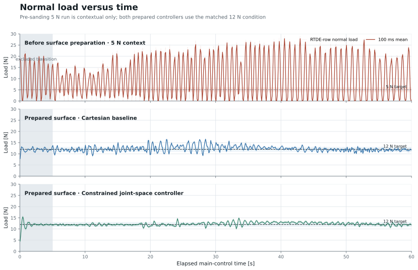
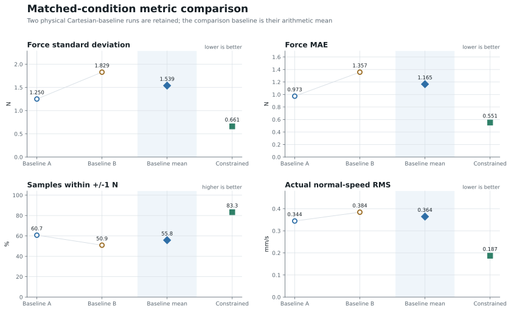
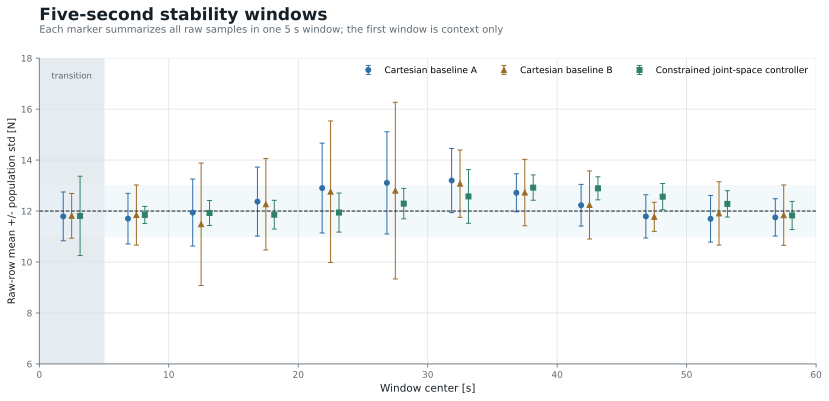
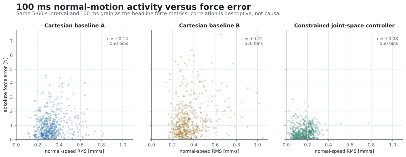

<section id="summary" class="hero" markdown="1">

UR10e contact-control progress · Group meeting · 16 July 2026

# UR10e Rolling-Contact Force-Control Progress

## Executive summary

<strong>At the same 12 N target and outer-loop gains, the constrained joint-space controller is markedly steadier without shifting the mean load.</strong>

Force std<strong>0.661 N</strong><small>57.1% below baseline mean</small>

Force MAE<strong>0.551 N</strong><small>52.7% below baseline mean</small>

Within ±1 N<strong>83.3%</strong><small>+27.5 percentage points</small>

Normal-speed RMS<strong>0.187 mm/s</strong><small>48.6% below baseline mean</small>

**Evidence boundary.** Independent physical runs support the stability comparison; they do not isolate one inner component as the sole cause.

Report contents

1. [Executive summary](#summary)
2. [Experimental setup and contact mechanics](#setup)
3. [Surface preparation](#surface-preparation)
4. [Why 12 N instead of 5 N](#why-12n)
5. [Controller realization](#controller-realization)
6. [Fair comparison protocol](#comparison-protocol)
7. [Force stability results](#force-stability)
8. [Why the constrained controller appears more stable](#stability-mechanism)
9. [Current completion boundary](#completion-boundary)
10. [Automatic tuning objective](#tuning-objective)
11. [Parameter grid and Bayesian Optimization](#parameter-search)
12. [Physical experiment loop](#physical-loop)
13. [Video evidence and next experiment](#video-next)

</section>

<section id="setup" markdown="1">

Experiment basis

## Experimental setup and contact mechanics

The robot follows a tangential cycloid while regulating compressive load through a rolling-ball contact.

  
<b>Measure</b>Cartesian force

  
<b>Project</b>control normal

  
<b>Regulate</b>12 N contact

  
<b>Move</b>tangential cycloid

Observed force also reflects surface geometry, ball mechanics, kinematics, command smoothing, and robot-side control.

### Shared experiment timeline

  
<strong>Before 29 June</strong>Controlled surface preparation completed

  
<strong>2 July</strong>Cartesian-baseline data collected

  
<strong>15 July</strong>Constrained-controller data collected

</section>

<section id="surface-preparation" markdown="1">

Controlled experimental condition

## Surface preparation

<strong>240# → 320# → 400# → 600#</strong> progressive preparation reduced local high spots along the rolling path.

<figure class="span-5 figure portrait-figure">
  

    
  

  <figcaption>Used abrasive papers. No profilometer or roughness measurement is claimed.</figcaption>
</figure>

<figure class="span-7 figure">
<svg class="schematic" viewBox="0 0 820 390" role="img" aria-labelledby="surface-title surface-desc">
  <title id="surface-title">Before and after surface-preparation schematic</title>
  <desc id="surface-desc">A rolling ball encounters a local high spot before preparation and a smoother path after preparation.</desc>
  <defs>
    <marker id="arrow-blue" markerWidth="9" markerHeight="9" refX="7" refY="3" orient="auto"><path d="M0,0 L0,6 L8,3 z" fill="#2e6ea6"/></marker>
    <marker id="arrow-gray" markerWidth="9" markerHeight="9" refX="7" refY="3" orient="auto"><path d="M0,0 L0,6 L8,3 z" fill="#5c6872"/></marker>
  </defs>
  <text x="30" y="42" class="svg-heading">Before preparation</text>
  <path d="M30 250 C100 244, 145 253, 174 247 Q184 246 184 236 L184 222 Q184 215 192 215 L298 215 Q306 215 306 222 L306 237 Q306 245 318 247 C344 252, 372 240, 395 244" class="surface-line rough"/>
  <circle cx="245" cy="166" r="49" class="ball"/>
  <line x1="245" y1="166" x2="245" y2="205" class="load-arrow" marker-end="url(#arrow-blue)"/>
  <line x1="176" y1="235" x2="154" y2="178" class="normal-arrow" marker-end="url(#arrow-gray)"/>
  <line x1="245" y1="214" x2="245" y2="158" class="normal-arrow" marker-end="url(#arrow-gray)"/>
  <line x1="310" y1="242" x2="330" y2="184" class="normal-arrow" marker-end="url(#arrow-gray)"/>
  <text x="151" y="290" class="svg-label">local high spot</text>
  <text x="81" y="328" class="svg-note">surface normal changes rapidly</text>

  <line x1="410" y1="28" x2="410" y2="350" class="divider"/>

  <text x="445" y="42" class="svg-heading">After progressive preparation</text>
  <path d="M445 250 C520 244, 575 247, 635 242 C700 238, 752 244, 790 241" class="surface-line smooth"/>
  <circle cx="630" cy="188" r="49" class="ball"/>
  <line x1="630" y1="238" x2="630" y2="270" class="load-arrow" marker-end="url(#arrow-blue)"/>
  <line x1="535" y1="243" x2="535" y2="183" class="normal-arrow" marker-end="url(#arrow-gray)"/>
  <line x1="630" y1="240" x2="630" y2="180" class="normal-arrow" marker-end="url(#arrow-gray)"/>
  <line x1="725" y1="240" x2="725" y2="180" class="normal-arrow" marker-end="url(#arrow-gray)"/>
  <text x="492" y="303" class="svg-label">smoother height variation</text>
  <text x="488" y="334" class="svg-note">surface normal changes more continuously</text>
</svg>
<figcaption>Preparation reduces abrupt geometric disturbances along the rolling path.</figcaption>
</figure>

**Comparison boundary.** Both matched controller runs used the prepared surface. A pre-sanding 5 N run is shown later as context, not as a controlled controller comparison.

</section>

<section id="why-12n" markdown="1">

Target-force decision

## Why 12 N instead of 5 N

12 N was selected from preload behavior and completed physical runs—not from the model name.

<figure class="span-4 figure product-figure">
  

    
  

  

    <b>Model</b>KSM-8N
    <b>Main ball</b>φ 8 mm
    <b>Vendor capacity</b>≤196 N
  

  <figcaption>KSM-8N is a model identifier; 8N does not mean 8 newtons. The main ball is φ8 mm.</figcaption>
</figure>

<figure class="span-4 figure">
<svg class="schematic ksm" viewBox="0 0 430 470" role="img" aria-labelledby="ksm-title ksm-desc">
  <title id="ksm-title">Schematic load path through the ball-transfer unit</title>
  <desc id="ksm-desc">A main ball rests on supporting balls within a housing and contacts a surface below.</desc>
  <defs><marker id="arrow-load" markerWidth="9" markerHeight="9" refX="7" refY="3" orient="auto"><path d="M0,0 L0,6 L8,3 z" fill="#2e6ea6"/></marker></defs>
  <path d="M88 110 L88 350 Q88 390 128 390 L302 390 Q342 390 342 350 L342 110" class="housing"/>
  <circle cx="215" cy="185" r="86" class="ball main-ball"/>
  <circle cx="145" cy="285" r="25" class="support-ball"/>
  <circle cx="215" cy="305" r="25" class="support-ball"/>
  <circle cx="285" cy="285" r="25" class="support-ball"/>
  <rect x="58" y="390" width="314" height="18" class="contact-surface"/>
  <path d="M112 222 C138 250, 164 250, 184 236" class="clearance-zone"/>
  <line x1="215" y1="40" x2="215" y2="91" class="load-arrow" marker-end="url(#arrow-load)"/>
  <text x="230" y="57" class="svg-label">normal preload</text>
  <line x1="313" y1="158" x2="372" y2="127" class="leader"/><text x="309" y="112" class="svg-label">main ball</text>
  <line x1="291" y1="285" x2="377" y2="285" class="leader"/><text x="300" y="270" class="svg-label">supporting balls</text>
  <line x1="93" y1="160" x2="28" y2="132" class="leader"/><text x="16" y="116" class="svg-label">housing</text>
  <line x1="110" y1="239" x2="21" y2="239" class="leader"/><text x="10" y="218" class="svg-label">free-play /</text><text x="10" y="237" class="svg-label">reseating region</text>
  <text x="123" y="442" class="svg-label">contact surface</text>
</svg>
<figcaption>Load passes through the main ball, supporting balls, and housing. The free-play region is an engineering interpretation, not a measured deadband.</figcaption>
</figure>

### Physical evidence ladder

**5 N — insufficient margin in one attempt**

Contact was lost before the ramp target exceeded approximately **5.1 N**. One attempt—not a threshold.

**10 N — continuous motion validated**

**60.2 s completed** · mean 10.26 N · max 18.55 N · 0 s above 20 N.

**12 N — selected operating point**

**60 s completed** · mean 12.265 N · max 16.952 N · 0 s below 5 N or above 20 N.

**Decision.** 12 N gives more preload margin than 5 N while remaining inside the observed envelope. It is empirical, conservative, and not claimed optimal.

</section>

<section id="controller-realization" markdown="1">

Controller realization

## Controller realization: Cartesian baseline versus constrained joint space

The outer law is matched; the inner command realization changes.

vn,cmd = 0.001 eF + 10−5 ∫eFdt − 7 vn, &nbsp; Ftarget = 12 N

Cartesian baseline

outer force-motion law

→

Cartesian speed command

→

robot

Constrained joint-space controller

outer force-motion law

→

constrained RNN joint velocity

→

host slew limit

→

robot acceleration limit

→

robot

  
<b>Matched</b>12 N · P 0.001 · I 10⁻⁵ · damping 7 · path

  
<b>Added in the constrained route</b>joint-space RNN · q̇ slew limit · robot acceleration limit

</section>

<section id="comparison-protocol" markdown="1">

Measurement contract

## Fair comparison protocol

Two Cartesian-baseline runs expose run-to-run variation under the same outer-loop settings.

| Comparison item | Locked value |
|---|---:|
| Target force | 12 N |
| P | 0.001 |
| I | 10⁻⁵ |
| Damping | 7 |
| Integral limit | 1 N·s |
| Tangential gain | 1.5 |
| Headline interval | 5–60 s of main contact control |
| Resampling | fixed 100 ms bins |
| Samples per run | exactly 550 bin means |

### Headline window

550

100 ms bin means per run from 5–60 s.

Metric definitions

- Force standard deviation and MAE use the 550 load bins.
- Within ±1 N counts bins in the 11–13 N band.
- Normal-speed RMS uses the matched 5–60 s interval.

**Boundary.** Independent runs compare observed stability; they are not randomized A/B evidence and cannot isolate the RNN alone.

</section>

<section id="force-stability" class="results-section" markdown="1">

Matched 12 N comparison

## Force stability results

### The constrained controller lowers fluctuation without shifting the mean load

| Metric | Cartesian baseline mean | Constrained controller | Change |
|---|---:|---:|---:|
| Force standard deviation | 1.539 N | 0.661 N | 57.1% lower |
| Force MAE | 1.165 N | 0.551 N | 52.7% lower |
| Within ±1 N | 55.8% | 83.3% | +27.5 percentage points |
| Normal-speed RMS | 0.364 mm/s | 0.187 mm/s | 48.6% lower |
| Mean load | 12.278 N | 12.265 N | −0.013 N |

<figure class="figure wide">
  
  <figcaption><b>Normal load versus time.</b> The pre-sanding panel uses its older logged normal-load channel and a 5 N target, so it is context only. The matched comparison remains Cartesian baseline versus constrained joint-space control at 12 N; gray 0–5 s transitions are excluded from headline metrics.</figcaption>
</figure>

<figure class="figure wide">
  
  <figcaption><b>Four matched metrics.</b> Both Cartesian-baseline runs, their mean, and the constrained controller are shown.</figcaption>
</figure>

<figure class="figure wide">
  
  <figcaption><b>Five-second windows.</b> The constrained controller shows smaller within-window spread across the motion.</figcaption>
</figure>

</section>

<section id="stability-mechanism" markdown="1">

Mechanism and limits

## Why the constrained controller appears more stable

Normal-motion RMS falls from <strong>0.364 to 0.187 mm/s</strong>, consistent with lower force excitation.

<figure class="figure wide">
  
  <figcaption><b>Motion–force relationship.</b> The constrained controller occupies the tighter low-motion, low-error region; weak within-run correlations do not establish single-variable causality.</figcaption>
</figure>

  
<b>1</b>Constrained RNN coordinates six joints

  
<b>2</b>Host slew limit suppresses q̇ jumps

  
<b>3</b>Robot acceleration limit smooths realization

**Causal boundary.** The inner realization changed as a bundle; slew and acceleration limits still require separate ablation.

</section>

<section id="completion-boundary" markdown="1">

Current evidence boundary

## Current completion boundary

  
Physical evidence<strong>Completed</strong>
Full contact trajectory and matched comparison data.

  
Scheduler remediation<strong>Offline checked</strong>
60.15 s test · 1.18 ms p99 · 4.01 ms max gap.

  
Remaining confirmation<strong>Timing evidence pending</strong>
Link the remediated route to a synchronized run log before tuning.

The stability result is physical; the scheduler remediation is implemented and offline-verified, not yet physically confirmed.

</section>

<section id="tuning-objective" markdown="1">

Tuning framework

## Automatic tuning objective

Optimize force MAE only across complete, feasible 60 s physical trials.

J(θ) = (1/N) Σi=1N |12 N − Fi|, &nbsp; N = 550

### Optimization variables

PIdamping

Execution-profile settings remain separate.

### Feasibility constraints

safetycontactpathfreshnessreturn homeevidence

**Current state.** The framework is implemented, but no eligible tuning trial is presented here. Platform failures do not count as bad gain candidates.

</section>

<section id="parameter-search" markdown="1">

Structured search

## Parameter grid and Bayesian Optimization

A log-scale lattice constrains Bayesian Optimization to nearby, interpretable candidates.

θ = θ0 · 2k/4, &nbsp; adjacent ratio = 20.25 ≈ 1.189

<b>Baseline:</b> P₀ = 0.001 · I₀ = 10⁻⁵ · damping₀ = 7

| Search condition | P | I | damping |
|---|---:|---:|---:|
| Initial neighborhood | k = −4,…,4 | fixed at baseline | k = −4,…,4 |
| After ≥6 eligible trials and ≤15% repeat error | k = −6,…,6 | off or k = −4,…,4 | k = −6,…,6 |
| After repeated improvement at a boundary | k = −8,…,8 | off or k = −8,…,8 | k = −8,…,8 |

Md = 1/P, &nbsp; kf = I/P, &nbsp; Bd = damping/P.

### Separate gain search from motion aggressiveness

| Controller optimization | Execution-profile choices |
|---|---|
| P, I, damping | normal rate: 0.010, 0.015, 0.020 rad/s |
| objective: force MAE | host q̇ slew: 0.1, 0.2, 0.5 rad/s² |
| candidate must remain feasible | robot acceleration: 0.1, 0.2, 0.5 rad/s² |
|  | q̇ cap fixed at 0.5 rad/s |

### Bayesian Optimization loop

  
<b>1</b>Exact baseline
<i>→</i>
  
<b>2</b>Adjacent lattice trials
<i>→</i>
  
<b>3</b>GP + qLogNEI
<i>→</i>
  
<b>4</b>Repeat and confirm

  
<b>Exploration guard</b>one coordinate · one grid step · incumbent retest every fourth trial

  
<b>Success gate</b>two repeats ≤ 0.30 N MAE · repeat error ≤ 15%

</section>

<section id="physical-loop" markdown="1">

Physical evidence generation

## Physical experiment loop

  
verify home + load candidate
→
  
approach + establish contact
→
  
run 60 s cycloid at 12 N
→
  
retract + return home
→
  
validate evidence + select next candidate

### Report update pipeline

  
raw CSVs
→
  
comparison script
→
  
metrics JSON + SVG/PNG
→
  
Markdown source
→
  
HTML report

Only a complete, safe trial enters optimizer history; the report adds results only after eligible evidence exists.

</section>

<section id="video-next" markdown="1">

Physical evidence

## Video evidence and next experiment

<figure class="span-5 figure video-figure">
  <video controls preload="metadata" poster="assets/latest_constrained_controller_contact_demo_poster.jpg" src="assets/latest_constrained_controller_contact_demo.mp4" aria-label="Latest constrained-controller physical rolling-contact recording"></video>
  <figcaption><b>Latest constrained-controller contact recording.</b> The video shows physical rolling contact on the prepared surface; it does not by itself validate scheduler timing or the force metrics.</figcaption>
</figure>

### Next physical sequence

1. Confirm the scheduler-remediated route in one guarded physical contact run.
2. Link the video, controller configuration, and synchronized run log.
3. Run the exact tuning baseline, then admit only complete 550-bin trials.

**Next questions.** Does the timing fix preserve stability? Which inner limit contributes most? Can MAE reach 0.30 N twice with ≤15% repeat error?

</section>
